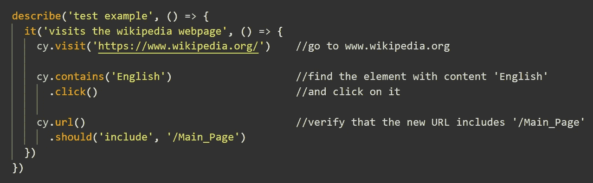
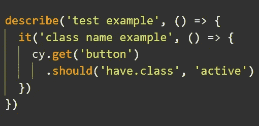

# 使用 Cypress 进行简单的端到端测试的快速入门指南

> 原文：<https://levelup.gitconnected.com/a-quick-beginners-guide-to-easy-end-to-end-testing-with-cypress-aa20c85d7834>

## 只需要基本 JavaScript 技能的自动化测试

这篇文章的目标是展示如何用很少的努力，使用 [Cypress](https://www.cypress.io/) 将有用的端到端(E2E)测试添加到你的项目中，即使你还没有做过任何测试。

在本文的开始，我将讨论为什么对于任何熟悉 JavaScript 基础知识的开发人员来说，**用 Cypress 编写 E2E 测试是容易的。然后，我将介绍一种在官方文档的帮助下快速开始使用 Cypress 的方法，该文档是一个优秀的教程，为初学者提供指导。**

虽然官方文档对于开始使用 Cypress 是完美的，但是它假设您已经知道某些测试工具和技术。对于还没有测试经验的开发人员，我将在这里介绍这些方面，这样您就可以完全理解教程并毫无问题地开始编写测试。

*这篇介绍性文章假设您已经掌握了 JavaScript 基础知识，并且知道如何使用 npm 和命令行。*

# 是什么让 Cypress 如此容易使用

*   柏树[文档](https://docs.cypress.io/guides/overview/why-cypress.html#In-a-nutshell)是**接近完美**。你不必搜索教程，即使你还没有做过任何 E2E 测试，这些文档对你开始使用 Cypress 也很有帮助。
*   读写测试超级**直观。基本上，Cypress 语法读起来就像英语。**
*   使用 Cypress **你可以使用 JavaScript 来编写测试**。如果你用 JavaScript 编程才几个月，你仍然可以使用 Cypress。
*   Cypress 提供了很好的错误信息，清楚地解释了为什么你的测试没有成功。
*   Cypress 不需要任何配置。
*   Cypress 有一个漂亮而简单的 API。

# 如何快速上手 Cypress

你可以在官方 Cypress 文档的入门部分找到开始使用 Cypress 所需的一切。入门部分是一个完美的教程。它清晰明了地展示了如何:

[*装柏*](https://docs.cypress.io/guides/getting-started/installing-cypress.html#Installing)

[*打开柏树使用命令行*](https://docs.cypress.io/guides/getting-started/installing-cypress.html#Opening-Cypress)

[*并添加一个测试文件*](https://docs.cypress.io/guides/getting-started/writing-your-first-test.html#Add-a-test-file)

完成这些步骤后，就可以开始编写测试了。最好的学习方法在文档的 [*编写真实测试*](https://docs.cypress.io/guides/getting-started/writing-your-first-test.html#Write-a-real-test) 部分有描述。

尽管文档的这一部分尽可能的平易近人，但是**它假设您熟悉某些测试工具和概念**。让我们先在这里讨论它们，以便您可以继续编写测试。

首先，你应该知道用于组织和运行测试的**方法**。这些方法来自于[摩卡](https://mochajs.org/)，一个捆绑了柏树的试跑者。

将几个相关的测试组合在一起。它有两个参数:测试块的名称和一个包含使用`it()`方法创建的单个测试的函数。

`it(name, fn)`方法包含个别测试。`it()`将测试的名称作为参数和包含测试的函数。

这是用于编写测试的两种基本方法。赛普拉斯还借鉴了摩卡的一套其他方法，叫做[钩](https://docs.cypress.io/guides/core-concepts/writing-and-organizing-tests.html#Hooks) : `before()`、`after()`、`beforeEach()`和`afterEach()`。钩子的目的是在文件中运行测试之前或之后运行一个函数。

你应该熟悉的另一个概念是**测试断言，以及它们在测试**中是如何使用的。

简单来说，**测试断言用于验证实际结果与预期结果**是否相同。如果实际结果与预期结果匹配，则断言正确通过，如果这两个结果不匹配，则断言失败。

Cypress 捆绑了[柴](http://chaijs.com/)断言库，提供内置断言。Chai 提供了三种不同的[断言风格](https://www.chaijs.com/guide/styles/)，本质上呈现了**三种构造断言的方式**。

*断言样式*通过`assert`接口公开:

`assert.equal(actualResult, expectation);` // *检查实际值是否等于期望值*

*期望样式*通过`expect`接口暴露；

`expect(actualResult).to.include(expectation);` // *验证实际结果是否包含预期值*

以及通过`should`界面暴露出来的*肩部样式*:

`actualResult.should.have.lengthOf(expectation);` // *验证实际结果具有预期长度*

虽然这些风格有一些差异，但使用哪一种基本上是个人喜好的问题。

这三个接口提供了对*链器*(在上面的例子中是`equal`、`include`和`lengthOf`)的访问。**链条用于比较实际值和期望值**。在这里你可以找到可用链节的参考列表，以及它们的用法示例。

尽管这三个 Chai 接口可以用于 Cypress，**创建断言最常见的方式是借助 tge Cypress API 提供的** `**.should()**` **方法**。

的例子。should()用法

在上面的例子中`cy`是一个**全局对象，它提供对 Cypress API 方法**的访问(这些方法在官方文档中被称为**命令**)。命令是可链接的，这提高了测试的可读性。

`.should()`方法将链接器和期望值作为参数。链接器以字符串形式提供，可以是来自 Chai 的任何有效链接器。

看看这些[常见断言](https://docs.cypress.io/guides/references/assertions.html#Common-Assertions)的例子，感受一下它们是如何与 Cypress 一起使用的。

现在，当这些主题在 Cypress 文档中涵盖时，您可以开始[编写真正的测试](https://docs.cypress.io/guides/getting-started/writing-your-first-test.html#Write-a-real-test)。因为通过例子学习总是最好的，你可以在 Cypress docs 提供的优秀的[教程视频](https://docs.cypress.io/examples/examples/tutorials.html#Test-a-React-Todo-App)中寻找有用的代码片段。这些视频涵盖了编写测试的最常见用例，并展示了测试驱动开发的示例。

最后，可选但强烈推荐:看一下[对 Cypress](https://docs.cypress.io/guides/core-concepts/introduction-to-cypress.html#Cypress-Can-Be-Simple-Sometimes) 部分的介绍，深入了解 Cypress 测试背后的机制。

Cypress 易于学习和使用，这使得它成为初学者的一个完美的 E2E 测试工具。更好的是，简单并不意味着 Cypress 的容量受到限制。它提供了更多伟大的特性，在您的测试经验进步之后，您会很高兴地发现这些特性。

如果你开发一个应用，发现自己要做大量的手工测试，也可以考虑使用 Cypress 作为主要的开发浏览器。看看这篇[文章](https://itnext.io/front-end-productivity-boost-cypress-as-your-main-development-browser-f08721123498),了解为什么在开发前端应用程序时，自动化最频繁执行的测试用例是一件好事。