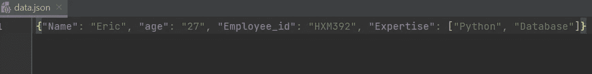
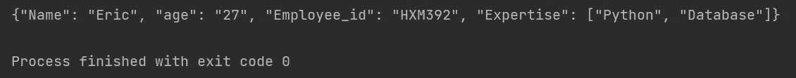
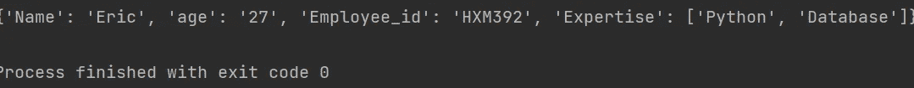
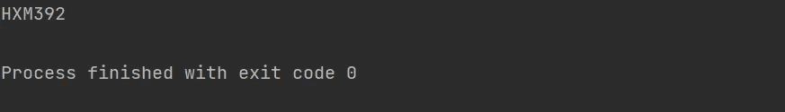

# 使用 Python 编写 JSON 文件的快速指南

> 原文：<https://levelup.gitconnected.com/a-quick-guide-to-json-files-with-python-71878e77fe40>

## 将数据结构写入和读取到文件中


比阿特丽斯·佩雷斯·莫亚在 [Unsplash](https://unsplash.com?utm_source=medium&utm_medium=referral) 上的照片

JSON(JavaScript Object Notation)是一种用于在客户机和服务器之间传输数据的语法。JSON 在很多流行的语言中使用，如 Python、C#、C++、Perl、Java 等。使用 JSON 有助于构建跨平台的应用程序。在这篇文章中，让我们用 Python 写、读 JSON 文件。

***JSON 文件有什么优点:***

*   JSON 文件是在服务器和 web 应用程序之间传输数据的理想格式，也是 XML 文件的绝佳替代品。
*   开发人员使用它将他们正在处理的数据结构转储到一个文件中，并在需要时加载它。
*   它还用于在不同的软件组件之间或通过网络连接传输结构化数据。
*   JSON 被 android 和其他移动操作系统解析和使用。

## JSON 结构:

JSON 对象有一个键值对，这几乎与 Python 字典元素相同。

```
Syntax:{"key": "value"}
```

*   键值对用大括号括起来，并用逗号分隔。
*   密钥必须是字符串。
*   值可以是字符串、数字、列表、空值、数组、另一个 JSON 对象。

# JSON 模块及其方法:

## 使用 Python 导入 JSON 模块:

这个包主要用于使用 Python 处理 JSON 数据。Python 可以使用一个名为 JSON 的内置包来编码或解码 JSON 数据。要导入这个包，使用如下所示的语法。

```
import JSON
```

## Python 到 JSON 的转换类型:

转换为 JSON 类型数据时的 Python 数据:

*   字典被转换成对象。
*   整数，字符串被转换成数字。
*   None 转换为 Null。
*   列表被转换成数组。

# 1.JSON 转储方法:

> **一个把 python simple 写成 JSON 文件的程序。**

将 Python 对象转储或写入 JSON 格式文件。一个将 Python 简单数据结构如字典、列表、数组或其他 Python 类型转换成 JSON 格式文件的程序。注意，所有的键必须是一个字符串，而值是在一个字符串 number 中。

```
import json 
Employee = { "Name":"Eric",
             "age":"27",
             "Employee_id":"HXM392",
             "Expertise":["Python","Database"]
}
with open("data.json","w") as write_file:
    json.dump(Employee,write_file)
```

**输出:**



# ***2。JSON 转储方法:***

> 使用 dumps 方法将 python 对象转换成 JSON 字符串。

将 Python 对象转储或写入 JSON 字符串。在这个程序中，所有的 Python 数据都将使用 dumps 方法转换成一个字符串。请注意，输出与前面的程序相同。

```
import json
Employee = { "Name":"Eric",
             "age":"27",
             "Employee_id":"HXM392",
             "Expertise":["Python","Database"]
}
b = json.dumps(Employee)
print(b)
```

**输出:**



# 3.JSON 加载方法:

> **从 JSON 文件中读取 python 数据的 Python 程序。**

在这个程序中，我们从 JSON 文件中读取或加载 Python 数据。为此，我们使用了一种称为 load 的方法。

```
import json
Employee = { "Name":"Eric",
             "age":"27",
             "Employee_id":"HXM392",
             "Expertise":["Python","Database"]
}
with open("data.json","w") as write_file:
    json.dump(Employee,write_file)

with open("data.json","r") as read_file:
    b= json.load(read_file)

print(b)
```

输出:



# 4.JSON 加载方法

> **读取 JSON 数据或将 JSON 数据加载到 Python 字符串的程序。**

在这个程序中，我们将 JSON 数据加载到一个字符串中。注意，在这个程序中，我们试图访问单个元素。

```
import json
Employee = { "Name":"Eric",
             "age":"27",
             "Employee_id":"HXM392",
             "Expertise":["Python","Database"]
}
b = json.dumps(Employee)
y=json.loads(b)

print(y["Employee_id"])
```

输出:



这里有一个的链接，用于订阅阅读上千篇文章的媒介。请考虑订阅并支持许多作者:

[](https://swathiarun63.medium.com/membership) [## 通过我的推荐链接加入媒体

### 作为一个媒体会员，你的会员费的一部分会给你阅读的作家，你可以完全接触到每一个故事…

swathiarun63.medium.com](https://swathiarun63.medium.com/membership)