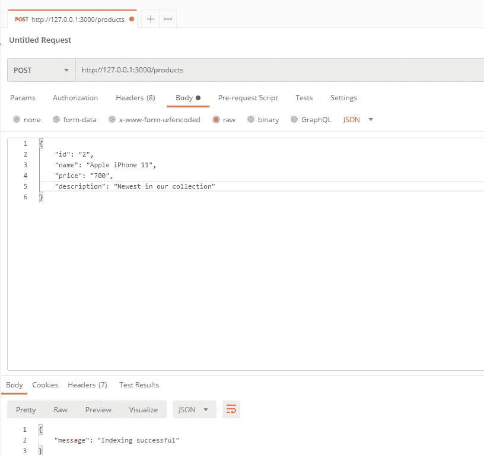
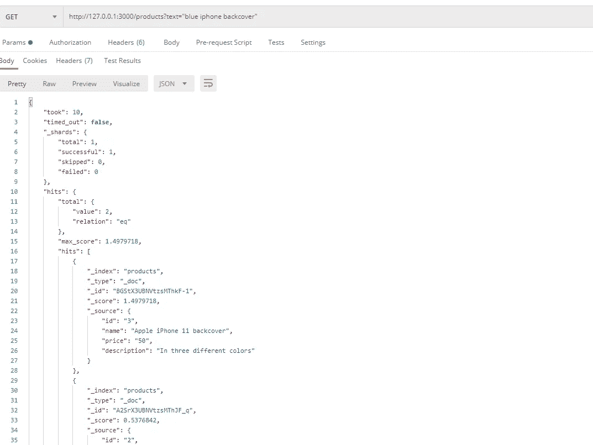

# 面向节点开发者的 Elasticsearch 快速入门

> 原文：<https://levelup.gitconnected.com/a-quick-introduction-to-elasticsearch-for-node-developers-6c9f840f1529>

## NodeJS 系列

## 弹性搜索❤节点，找出原因


在 [Unsplash](https://unsplash.com/s/photos/magnifying-glass?utm_source=unsplash&utm_medium=referral&utm_content=creditCopyText) 上由 [Clément Falize](https://unsplash.com/@centelm?utm_source=unsplash&utm_medium=referral&utm_content=creditCopyText) 拍摄的照片

如果你问十个不同的开发者“什么是弹性搜索？”如果他们每个人都有不同的答案，不要感到惊讶。没有一个是错的；当然，只是 Elasticsearh 就是那么万能。这种多功能性使得 Elasticsearch 作为许多编程问题的解决方案越来越受欢迎。

如果你想尝试这项技术，但仍然没有机会，今天在本教程中，我们将向你介绍弹性搜索的基本概念。然后，我们将使用 Node.js 来构建一个简单的搜索引擎。

# 什么是 Elasticsearch？

这个问题可能有十种不同的答案。如果我必须把它们浓缩成一句话，我可以说，Elasticsearch 是一个可分发的、开源的分析和搜索引擎。

Elasticsearch 是建立在 Apache Lucene 之上的。它将 JSON 格式的数据存储在基于文档的结构中。在这方面，它类似于 NoSQL 的数据库，如 MongoDB。

你可以用 Elasticseach 几乎实时地存储和搜索大量数据。它还提供了一个 REST API 来执行存储和搜索操作。Elasticsearch 是高度可扩展的，它的分布式后端允许任务的分布，包括搜索、索引和跨节点集群的分析。

为了更好地理解它的内部工作方式，让我们看看 Elasticsearch 使用的一些核心组件和概念。

## 串

集群类似于我们在分布式系统中看到的任何其他集群。这是一个节点的集合，这些节点是独立的弹性搜索服务器。

## 结节

Node 是 Elasticsearch 的一个实例，您可以在其中存储、索引和搜索数据。节点可以属于几种类型。

每个集群都有一个主节点，负责集群范围的管理和配置。集群中的数据节点负责处理数据，如执行 CRUD 操作和响应搜索和数据聚合查询。

您可以查询群集中的每个节点，但是有些节点(称为客户端节点)会将收到的请求转发给主节点或数据节点，而不会自行处理这些请求。

## 文件

文档是节点可以索引的基本信息单元。文档中的数据以 JSON 格式存储。例如，如果您正在构建一个电子商务网站，您可以将每个产品的详细信息存储在不同的文档中。数据可以是不同的类型，从数字到文本到日期。

## 索引

Elasticsearch 中索引的概念与 MySQL 等数据库不同。

在 Elasticsearch 中，索引是具有相似特征的文档的集合。例如，在前面的电子商务网站中，您可以创建一个产品索引，其中包含所有的单个产品文档。

每个索引都有一个唯一的名称。在对其文档执行 CRUD 或搜索操作时，可以使用这个名称。它也是你在 Elasticsearch 中可以查询的最高级别的实体。

## 碎片和复制品

您可以将单个索引分成多个部分，这些部分称为碎片。每个碎片表现为一个全功能和独立的“索引”您可以将索引的碎片分布在多个节点上，确保存储在单个节点上的数据不会超出其容量。

您可以通过创建碎片的“副本”来保护系统免受节点故障的影响，节点故障可能会导致单个碎片无法访问。它们是存储在您的节点集群中的碎片的冗余副本。副本还有助于提升集群的查询能力。

## 倒排索引

Elasticsearch 使用倒排索引的概念来提供快速的全文搜索结果。倒排索引是一种类似于哈希映射的数据结构，因为它将单个单词映射到它们的位置。它被大多数搜索引擎用来在查询大型数据集时提供快速结果。

在 Elasticsearch 中，倒排索引识别在索引中文档的文本字段中出现的每个唯一的单词，并将它们与每个单词出现的所有文档的位置进行映射。

现在，当一个全文搜索查询被发送到 Elasticsearch 时，它使用倒排索引在几毫秒内过滤搜索查询中每个单词出现的文档，尽管数据集很大。

例如，让我们考虑包含两个不同文本的两个文档:“编程是给程序员的”和“程序员太棒了”。

如果我们的索引中只有这两个文档，那么由 Elasticsearch 创建的倒排索引将类似于下面这样。

word 文档 1 文档 2 programmingtruefalsistruefalsefortruefalsprogrammerstruetruaerealfalstrueawesomefalstrue

请注意，实际的倒排索引存储的信息比上表中包含的信息更多。

## 绘图

该映射为存储在文档中的每个数据单元定义了一个(或多个)字段类型。就像我之前提到的，Elasticsearch 存储属于[不同字段类型](https://www.elastic.co/guide/en/elasticsearch/reference/current/mapping-types.html)的数据。

但是，您可以选择最初不定义字段类型。Elasticsearch 有一个称为动态映射的特性，它可以自动检测新字段并将其添加到索引中。

对于属于不同字段类型的数据，弹性搜索索引的工作方式有所不同。例如，文本字段存储在倒排索引中，而数值和地理字段存储在 BKD 树中。

您也可以为一个数据单元定义多个字段类型。例如，你可以给一个字符串“文本”和“关键字”字段类型。然后，该字符串将被索引为文本字段和关键字字段。这很重要，因为现在，我们可以在全文搜索中轻松地搜索该字符串，并将其作为关键字用于聚合和排序。

# Elasticsearch 用在哪里？

Elasticsearch 是一种用于许多用例的技术。让我们来看看其中的一些。

*   网站搜索:一些网站需要提供快速搜索功能。例如，在一个电子商务网站中，用户应该能够搜索产品并快速获得结果。我们可以实现这个功能，包括额外的功能，如使用 Elasticsearch 自动完成。
*   日志和日志分析:Elasticsearch 用于实时存储和分析来自 web 应用程序和其他类似应用程序的日志。
*   更多分析用途:我们还可以使用 Elasticsearch 进行更多分析任务，如安全分析和业务分析。Elasticsearch stack 提供了像 Kibana 这样有用的工具，用于数据可视化和管理，可以轻松实现这个任务。
*   系统监控和基础设施指标:同样，Elasticsearch 用于收集、存储和处理来自不同系统的性能指标，并将其实时可视化。

# 用 Elasticsearch 和 Node 构建搜索引擎

读了几分钟后，你的眼睛流血了，现在你到了有趣的部分。我们将实现一个简单的节点 API 来与 Elasticsearch 交互。在本教程中，我们将创建端点来创建新记录和搜索存储的数据。

首先，确保按照本指南的[在你的设备上安装 Elasticsearch。安装后，启动 Elasticsearch，并通过向 Elasticsearch 服务器发送请求来确保它正常工作。](https://www.elastic.co/guide/en/elastic-stack-get-started/current/get-started-elastic-stack.html#get-started-elastic-stack)

```
curl [http://127.0.0.1:9200](http://127.0.0.1:9200)
```

然后，为本教程建立一个新的节点项目。

我们使用节点 Elasticsearch 客户端模块，命名为 **elasticsearch** 。因此，请确保将软件包与 express 和 body-parser 一起安装。

```
npm install elasticsearch express body-parser
```

在我们项目的`app.js`文件中，像平常一样设置节点服务器。

```
const express = require("express")
const bodyParser = require("body-parser")
const elasticsearch = require("elasticsearch")
const app = express()
app.use(bodyParser.json())app.listen(process.env.PORT || 3000, () => {
    console.log("connected")
})
```

现在，初始设置已经完成。我们可以通过创建一个 Elasticsearch 客户端来开始使用 Elasticsearch。

```
const esClient = elasticsearch.Client({
    host: "http://127.0.0.1:9200",
})
```

接下来，我们将创建 POST `/products`端点。它接受 POST 请求，将新产品编入 Elasticsearch 的一个名为`products`的索引中。

为此，我们可以使用弹性搜索模块中的索引方法。

```
app.post("/products", (req, res) => {
    esClient.index({
        index: 'products',
        body: {
            "id": req.body.id,
            "name": req.body.name,
            "price": req.body.price,
            "description": req.body.description,
        }
    })
    .then(response => {
        return res.json({"message": "Indexing successful"})
    })
    .catch(err => {
         return res.status(500).json({"message": "Error"})
    })
})
```

由于索引“products”在我们第一次启动服务器时并不存在，对这个端点的第一个请求将提示 Elasticsearch 创建新的索引。

我们可以通过邮递员发送一个新的请求来测试这个路由。如果您的应用程序工作正常，您将看到响应消息“索引成功”。



试用我们的产品 API

我已经索引了几个带有 iPhone 和 Apple 字样的产品。由于我们想了解 Elasticsearch 如何响应全文查询，我建议您也对一些名称有些相似的产品进行索引。

接下来，让我们创建 GET `/products`端点。它通过文本查询来处理 GET 请求，以获取用户正在搜索的产品。我们使用这个文本查询来搜索 Elasticsearch 中索引的产品的名称字段，以便服务器能够响应与用户正在寻找的产品相似的产品列表。

```
app.get("/products", (req, res) => {
    const searchText = req.query.text
    esClient.search({
        index: "products",
        body: {
            query: {
                match: {"name": searchText.trim()}
            }
        }
    })
    .then(response => {
        return res.json(response)
    })
    .catch(err => {
        return res.status(500).json({"message": "Error"})
    })
})
```

同样，我们可以通过 Postman 发送请求来测试这条路由。因为我保存了一个名称为 Apple 和 iPhone 的产品列表，所以我使用了包含其中一个单词的搜索词。我用的搜索词是“蓝色 iphone 后盖”。



使用 Elasticsearch 搜索

服务器回复两个产品，一个有“苹果 iPhone 11 backcover”，另一个有“苹果 iPhone 11”。

尽管第二个结果不是用户想要的，但 Elasticsearch 认为它是命中的，因为它与搜索查询中的一个词“iphone”匹配。但是它被列在与我们的查询更相关的结果之后。

如果您再次查看返回的结果，您会看到有一个名为 score 的字段随着每次点击返回。它确定结果与搜索查询的相关性。高分表示相关性更高，命中按分数降序排列，因此最佳匹配显示在顶部。

# 结论

正如你可能在本教程后发现的，Elasticsearch 是一个非常有趣的工具。关于 Elasticsearch，还有比我在这里介绍的更多的内容。但是我希望这篇教程足以说服你在下一个项目中尝试一下。所以，享受 Elasticsearch 吧。