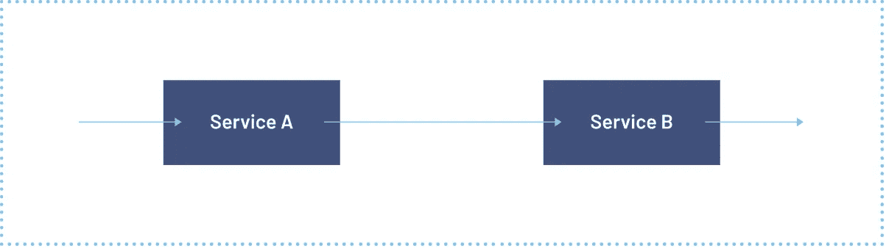
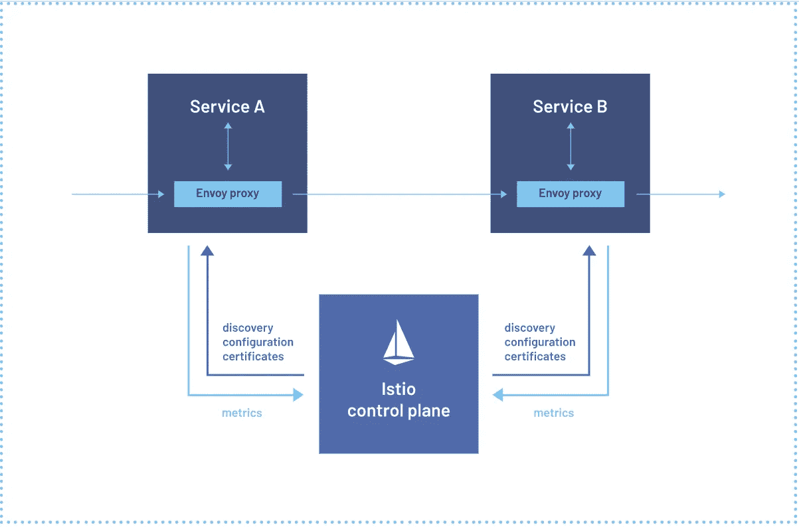
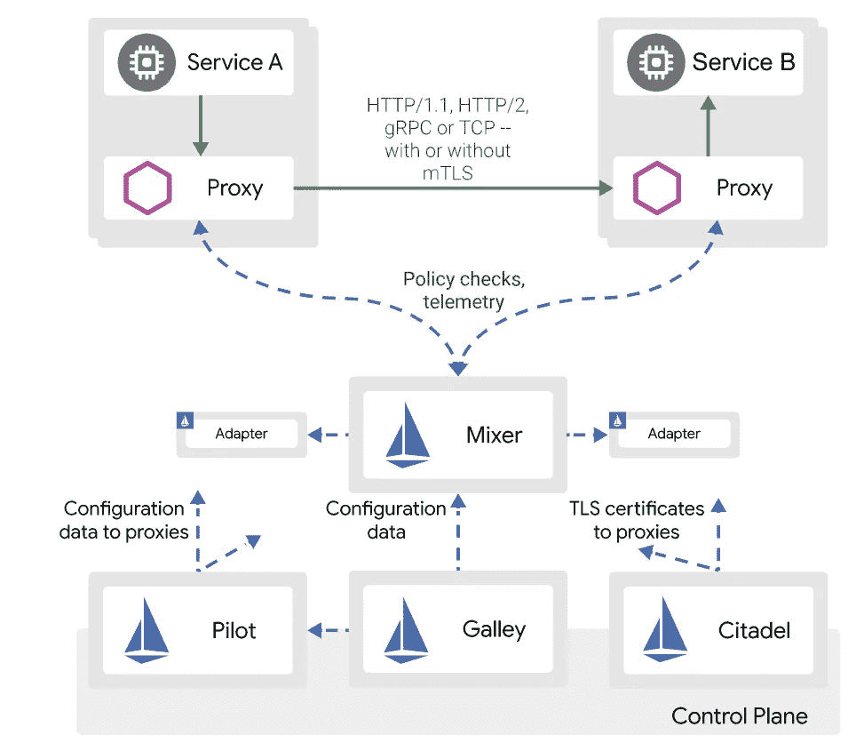

# Istio 快速介绍

> 原文：<https://levelup.gitconnected.com/a-quick-introduction-to-istio-ffb486221f1f>

艾莉娜·格鲁布尼亚克在 [Unsplash](https://unsplash.com/?utm_source=unsplash&utm_medium=referral&utm_content=creditCopyText) 上的照片

微服务这几天特别受欢迎。在微服务架构中，我们将大的整体系统分成许多小的微服务。所有微服务都是松散耦合的，可以相互独立地更新/部署。微服务解决了很多问题，让我们的生活轻松了很多，但也给我们的系统增加了新的复杂性。微服务增加的最大复杂性之一是不同微服务之间通信的增加。许多网络问题都是由于通信量的增加而产生的，下面列出了其中一些问题:

1.  管理超时和重试逻辑。
2.  通过加密数据来保护通信
3.  观察不同服务之间的交互。
4.  交通管理

当然，我们可以在微服务逻辑本身中解决所有这些问题，但这会产生大量冗余代码。这就是一个服务网来拯救我们的地方。

# 什么是服务网格？

简单地说，服务网格是一种控制不同微服务如何相互交互的方法。服务网格并不真正建立不同微服务之间的连接，而是包含管理两个不同微服务如何相互交互的策略和控制。服务网格可以让您观察、保护和控制您的网络，而只需对正在运行的微服务做很少或不做任何代码更改。Istio 是一个开源项目，由 Google、IBM 和 Lyft 共同创建。

# Istio 是如何工作的？

Istio 并没有为应用程序添加任何新功能，但它实际上创建了一些规则，这些规则指定了一个微服务如何与另一个微服务进行交互。Istio 从微服务中提取管理服务到服务通信的逻辑，并将其抽象到基础架构层。Istio 利用代理从微服务中提取通信规则。

Istio 包含两个组件:数据平面和控制平面。

## 数据平面

Istio 的 data place 拦截网络上的所有数据包，并负责身份验证、授权、可观察信号的生成、健康检查、负载平衡和路由。数据平面负责集群内部发生的所有通信以及入站和出站流量。应用程序不知道网络中数据平面的存在，服务代理透明地部署在集群中所有正在运行的服务中。在下图中，您可以看到在采用 Istio 时是如何添加代理的。

图 1:没有使用 Istio(来源:[https://istio.io/latest/about/service-mesh/](https://istio.io/latest/about/service-mesh/)

图 2 使用 Istio 后(来源:【https://istio.io/latest/about/service-mesh/】T2)

Istio 使用一种称为特使代理的特殊代理。Envoy 代理作为 sidecar 容器与所有服务一起部署。应用程序的出口和入口流量被配置为流经边车代理。由于所有流量都通过 envoy proxy 路由，因此它使 it 能够收集指标、控制流量、评估策略和加密数据传输。Istio 增加了 Envoy 的许多内置功能，如负载平衡、TLS 终止、断路器、健康检查、HTTP/2、gRPC 等等。

## 制导机

控制平面是管理和保护数据平面的组件。图 3 显示了 Istio 的架构。

图 3 Istio 建筑(来源:【https://istio.io/v1.4/docs/ops/deployment/architecture/】T4

从架构图中，我们可以看到控制平面有许多组件。让我们逐一讨论所有这些组件。

***Pilot:-*** Pilot 是一个组件，它将控制流量行为的高级路由规则转换为特使特定的配置，然后传播到特使侧柜。pilot 主要负责流量管理，还处理服务发现以及电路中断和重试逻辑等弹性功能。

***Galley:-***Galley 负责验证、摄取、处理和分发 istio 的配置给其他组件。厨房是从平台(如 Kubernetes)读取 istio 的所有配置的组件，有助于将其他组件与从平台获取配置的细节隔离开来。

***Citadel:-***Citadel 提供各种安全相关的功能。它为不同的服务提供认证和身份管理能力。它还可以在 mTLS 的帮助下加密多个服务之间的纯文本通信。

***混合器:-*** 混合器从其余的 istio 组件中抽象出基础设施后端。调音师的主要职责是:

1.  配额管理(如费率限制)
2.  前提条件检查(例如源服务是否在目标服务的允许列表中)
3.  遥测报告(如将测井数据发送到 zipkin，并通过 grafana 显示。).

从 istio 1.6 开始，混合器已被弃用，取而代之的是 [web assembly](https://istio.io/latest/docs/concepts/wasm/) 。

# ***结论***

Istio 为您的应用程序做了大量繁重的工作。Istio 有助于集中安全、流量管理和可观察性。Istio 为运营团队带来工具，代表开发团队管理网络问题，让开发团队更加专注于应用的业务。当您的系统有许多微服务时，像 istio 这样的服务网格可以大大减少微服务级别的冗余配置，并使其集中在系统级别。