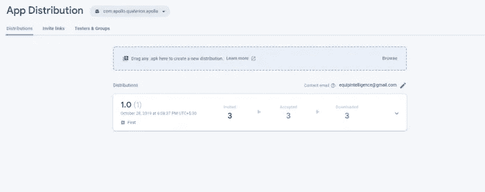
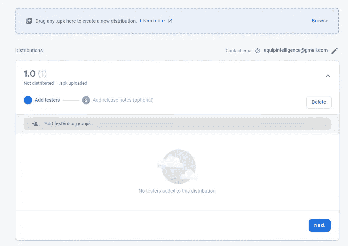
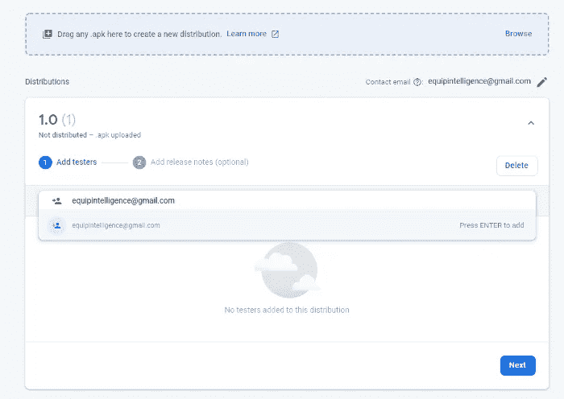
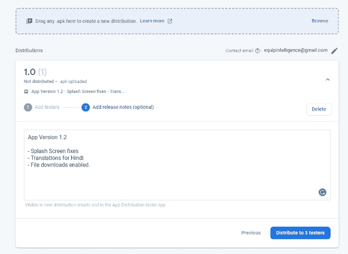
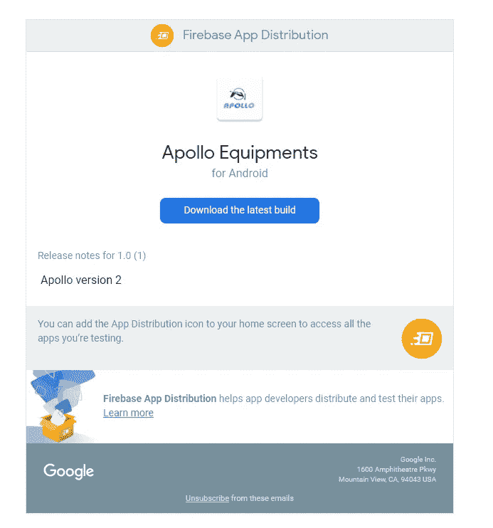
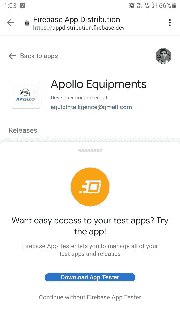
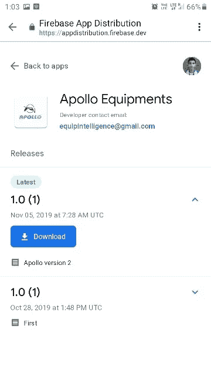

# Android 版 Firebase 应用分发快速浏览

> 原文：<https://levelup.gitconnected.com/a-quick-tour-of-firebase-app-distribution-for-android-2f912df7e809>

## 快速将您的 Android 应用分发给朋友、同事进行测试。

[Marcin Jozwiak](https://unsplash.com/@marcinjozwiak?utm_source=medium&utm_medium=referral) 在 [Unsplash](https://unsplash.com?utm_source=medium&utm_medium=referral) 上拍摄的照片

> Firebase 太棒了😎(至少对于安卓来说！)
> 
> Firebase MLKit，实时数据库，云 Firestore 都很漂亮😍(其他人也一样)
> 
> Firebase 应用分发，等等，那是什么？🧐

在这篇文章中，我们将讨论 [Firebase 应用分发](https://firebase.google.com/docs/app-distribution)的一些新功能，这是 Firebase 的一项新(测试版)服务。

为了简单起见，我们将使用 Firebase 控制台向测试人员分发我们的应用程序。但是，不要难过😌。你可以使用 [Firebase CLI](https://firebase.google.com/docs/app-distribution/android/distribute-cli) 、 [fastlane](https://firebase.google.com/docs/app-distribution/android/distribute-fastlane) 以及 [Gradle](https://firebase.google.com/docs/app-distribution/android/distribute-gradle) 本身来分发你的应用。

# 什么是 Firebase 应用程序分发📖？

顾名思义，它有助于在测试人员中快速部署您的应用程序。你不需要自动化任何东西。一旦你上传一个新版本的应用到控制台进行测试，测试人员就会得到通知。他们可以即时分享反馈，还可以尝试应用程序的多个版本。

正如官方文件所说，

> *“Firebase 应用程序分发使将您的应用程序分发给受信任的测试人员变得轻松。通过将你的应用程序快速下载到测试人员的设备上，你可以更早、更频繁地获得反馈。而且，如果你在你的应用中使用 Crashlytics，你会自动获得所有构建的稳定性指标，这样你就知道你什么时候可以发布了。”*

如果你是一个独立的开发者，这非常有用，因为你可以很容易地将你的应用程序分发给你的开发者朋友🥳.将 [Crashlytics](https://firebase.google.com/products/crashlytics) 与您的应用程序连接，您也可以获得应用程序中发生的任何崩溃的即时报告。

我过去通过电子邮件给我的朋友发送个人 apk 的时代结束了！

# 入门指南

# 1.将 APK 上传到控制台

不浪费时间，让我们开始吧🤓！首先，打开你的应用程序的 Firebase 控制台。在控制台面板中，我们将导航至*应用分发。*

控制台看起来像这样:

这里可以看到我之前分发过一个 app。您可以统计有多少测试人员下载并安装了该应用程序。有了 [Android Studio](https://developer.android.com/studio) ，我们需要[生成一个签名的 APK](https://developer.android.com/studio/publish/app-signing) 。

点击*浏览*，将签名后的 APK 文件上传到控制台。

# 2.添加测试人员和发行说明

一旦我们的应用程序被上传并通过控制台验证，我们将会看到:

现在，我们将添加测试人员来分发应用程序。您也可以按组输入测试人员的电子邮件地址，就像这样:

接下来，是时候发布一些说明了。发行说明有助于测试人员了解新版本中修复了哪些 bug，以及他们实际上需要测试什么。

完成后，点击*分发*按钮部署应用程序。仅此而已！您已经将您的 Android 应用程序分发给测试人员了！测试人员现在可以下载并测试你的应用。这些测试人员可能是也可能不是 Android 开发人员😜，所以我们需要一个简单的，非技术性的前端来下载这些分布式应用。

# 3.在测试者的设备上

测试人员将收到一封电子邮件，邀请他们测试应用程序。看起来像是:

测试人员需要在他们的移动设备上打开这封邮件📱来测试这个应用程序。点击*下载最新版本*，您将被导航到您需要登录的浏览器(在您的移动设备上)。

您会看到这个屏幕:

或者，我们可以下载 Firebase app tester([Firebase Test Lab](https://firebase.google.com/docs/test-lab))应用程序，这样我们就不需要在每次创建新版本时都打开浏览器。

您的测试人员需要点击*下载*，APK 文件将会自动安装到他们的设备上。操作系统要求未知来源的*应用程序安装许可。*

您可能会注意到也有不同的版本可供下载。

# 就这样

这就把我们带到了这个故事的结尾。希望你喜欢 Firebase 应用程序分发。