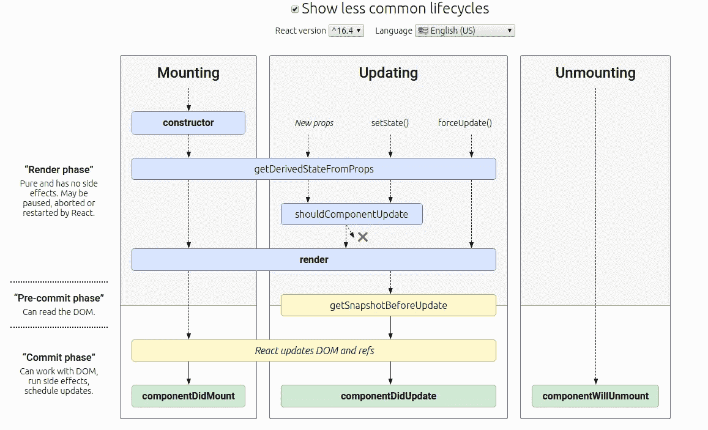

# 快速浏览 React 组件生命周期

> 原文：<https://levelup.gitconnected.com/a-quick-tour-through-a-react-component-lifecycle-ff3610bb97b9>

当在 React 中创建一个组件时，也会创建一个非常复杂的生命周期。但是不用担心！我们将揭开这个神秘的面纱，给这个模糊的主题带来光明，帮助你写出更加健壮和一致的代码。

# 什么是 React 组件生命周期？

组件生命周期。来源:[http://projects . wojtekmaj . pl/react-life cycle-methods-diagram/](http://projects.wojtekmaj.pl/react-lifecycle-methods-diagram/)

React 中的组件在其生命周期中有 3 个主要阶段:安装、更新和卸载。你可以猜到，我们必须从头开始:安装。

在安装阶段，组件刚刚被创建。它的方法按以下顺序调用:

*   构造函数()
*   静态 getDerivedStateFromProps()
*   渲染()
*   componentDidMount()

在 constructor()方法上，组件**还没有挂载**。所以这是初始化状态或者将[和事件处理方法](https://reactjs.org/docs/handling-events.html)绑定到实例的好地方。

静态 getDerivedStateFromProps()方法在 render()之前被调用，无论是在组件第一次加载时还是在更新时。它是为罕见的用户情况而存在的。

Render()本身是类组件中唯一需要的方法。它检查 this.props 和 this.state，返回 React 元素、数组和片段、门户、字符串和数字或布尔值。它不能修改组件的状态。

componentDidMount()在组件插入 DOM 树后立即被调用。所有需要页面上组件的调用都在这里。例如:如果您需要从一个端点获取一些数据，这是一个很好的地方。

当发生以下情况之一时，将触发更新阶段:

*   新道具来了；
*   已调用 setState()；
*   已调用 forceUpdate()。

从那里，再次调用 getDerivedStateFromProps()方法。如果以前调用过 forceUpdate，组件将直接被再次呈现。否则，将调用 shouldComponentUpdate()。

该方法用于让 React 知道自从上次更新属性或状态以来，组件的输出是否发生了变化。它专门用于性能优化。如果返回 false，组件将不会被重新渲染。将来，这个函数将作为一个提示而不是一个严格的指令，这意味着即使方法返回 false，React 也可以重新呈现页面。

在重新渲染之前调用 getSnapshotBeforeUpdate()。它使您的组件能够从 DOM 中捕获一些信息(例如滚动位置)。并不常用，但有时它可能出现在特定的 ui 中，比如需要以特殊方式处理滚动位置的聊天线程。

渲染后，componentDidUpdate()被调用。这个方法用于处理更新后的 DOM。如果您需要在更新后为组件设置一个新的状态，这里是它的位置。

在最后一部分中，我们只有一个方法，componentWillUnmount()在组件被销毁之前被调用。这是清除计时器、网络请求或清除在 componentDidMount()中创建的任何订阅的地方。

此后，该组件将不会再被安装。当然，您仍然可以创建组件的新实例。

我希望这篇文章能够带来一些关于 React 及其组件如何在幕后工作的有用信息！