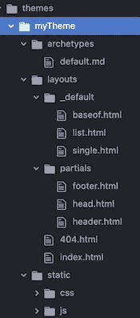

# 关于 Hugo 模板和创建主题的快速教程

> 原文：<https://levelup.gitconnected.com/a-quick-tutorial-on-hugo-templates-creating-your-theme-a4102b42a85f>


这个快速实践教程有助于理解 Hugo 主题和模板背后的逻辑。我们将从头开始创建自己的网站和主题，看看不同的模板布局如何相互作用和内容。

使用`hugo new site`命令为我们的新网站创建结构:


使用“hugo 新站点”命令创建新的 Hugo 站点

如你所见，我们有两个选择:使用现成的主题或创建我们自己的主题。我认为掌握所有不同的布局和内容文件如何交互的最好方法是创建我们自己的主题，并以我们自己的方式工作。我们从`hugo new theme`命令开始:


使用“hugo 新主题”命令创建新主题

该命令创建一个新的空主题，带有文件夹结构和必要的文件。



最近创建的主题的文件夹结构和内容

如果我们用`hugo server`命令启动服务器，我们会得到如下所示的一些警告(我们很快会回到这个问题)。然后，如果我们去 [localhost:1313](http://localhost:1313/) 我们得到一个空白页，所以它的工作，但我们没有内容。让我们看看正在使用哪些布局文件以及如何使用。


hugo 服务器命令

在继续之前，我们必须告诉 Hugo 我们正在使用我们的 myTheme 模板，所以它知道在哪里寻找布局模板文件。我们可以在项目根目录下的 [config.toml](https://gohugo.io/getting-started/configuration/#configuration-file) 文件中这样做。只需添加主题行并更改主题的名称，以防它被称为其他名称:

```
baseURL = “[http://example.org/](http://example.org/)"
languageCode = “en-us”
title = “My New Hugo Site”
theme = “myTheme”
```

## **baseof.html**

Hugo 文档解释说

> baseof.html 是一个 shell，所有的页面都将从这个 shell 中呈现出来，除非您在靠近[查找顺序](https://gohugo.io/templates/lookup-order/)的开头处指定另一个*baseof.html。

这就是 Hugo 用来做我们所有页面的基础。让我们看看 themes/myTheme/layouts/_ default/base of . html 的内容:


base.html 档案的内容

base.html 从 myTheme/layout/partial 文件夹中找到的**head.html、**、footer.html[局部模板](https://gohugo.io/templates/partials/) 中提取内容。它还从**主**块中提取内容。

> **主块**来自一个 html 模板，**使用的模板取决于页面的类型**。

比如空白的登陆页，它的内容从何而来？那个空白页就是我们的[主页](https://gohugo.io/templates/homepage/)，Hugo 认为是一种自己类型的[列表页](https://gohugo.io/templates/lists/)。像其他列表页面一样，它是由一个给出结构的模板 HTML 文件和一个包含内容的 Markdown 文件组成的，我们接下来将对此进行探讨。

## 主页

对于主页，我们需要:

*   布局/索引. html
*   content/_index.md

我们主题的 layouts/index.html 文件位于 themes/myTheme/layouts/index . html 下，它是空的。我们可以使用雨果文档中给出的示例模板并将其添加到我们主题的**index.html**文件中来解决这个问题:

这里发生了什么？Hugo 正在从 _index.md 文件中提取标题(第 4 行)、副标题(第 4–6 行)和内容(第 10 行)，以及主页下所有页面摘要的模板(第 13–15 行)。

现在有了结构，还缺主页[内容](https://gohugo.io/content-management/)。

> **内容文件夹**的结构和组织反映了站点是如何呈现的。它的子文件夹给出了页面路径，决定了内容类型，从而决定了所使用的布局。

主页的内容是从 content/_index.md 文件中提取的[，我们还缺少这个文件，所以我们来添加它。在内容文件夹下创建 **_index.md** 文件，并将此内容添加到其中:](https://gohugo.io/templates/homepage/#add-content-and-front-matter-to-the-homepage)

```
---
title: "Homepage"
subtitle: "Here I am"
date: "2020–012–09"
menu: "main"
draft: "false"
---Hello World! 
```

你在上面虚线之间看到的叫做 [Frontmatter](https://gohugo.io/content-management/front-matter#readout) ，它包含了页面的元数据。它可以用来指定一个特定的类型或布局来覆盖默认的类型或布局。

现在，如果您已经保存了更改并且 Hugo server 仍在运行，您应该能够在 [localhost:1313](http://localhost:1313/) 看到主页的内容。

## 单页(博客帖子或其他)

对于我们的博客帖子，我们需要:

*   content/post/first-post.md
*   layouts/_default/single.html
*   重启服务器

我们继续添加一篇博客文章，但是同样的过程对于您想要创建的任何类型的单个页面都有效。通过在终端`hugo new post/first-post.md`中执行创建一篇新的博客文章。该命令将添加`content/post` 文件夹，并将`first-post.md`文件添加到其中，同时准备好 [Frontmatter](https://gohugo.io/content-management/front-matter#readout) 。在 Frontmatter 中，将`draft: false`改为`draft: true`，否则 Hugo 在使用普通`hugo server`命令时不会显示帖子。要构建和提供草稿，您必须使用`hugo server -D`。

接下来，我们将[单页 html 模板](https://gohugo.io/templates/single-page-templates/)添加到我们在`layouts/_default/single.html` 中的 myTheme。我们可以从 [Hugo 文档](https://gohugo.io/templates/single-page-templates/#example-single-page-templates)中复制模板:

用 Ctrl+c 停止 Hugo 服务器，然后执行`hugo server`重新启动它。现在你应该可以从[http://localhost:1313/post/first-post/](http://localhost:1313/post/first-post/)看到你的博文了。

从文章的 URL 和路径可以看出， [Hugo 从文件夹名中取路径，从文件名](https://gohugo.io/content-management/organization/)中取 slug。

## 列表页面

对于列表页面，我们需要:

*   content/post/_index.md
*   layouts/_default/list.html

例如，如果你想在一个页面上列出你的文章，或者列出任何其他部分的内容，列表页面会很有用。在我们的例子中，我们希望在 http://localhost:1313/post 中有一个页面，列出我们所有的博客文章。

从执行`hugo new post/_index.md` 命令的终端创建`content/post/_index.md`文件，并将 draft 更改为 false。此外，在虚线后添加一些文本:

```
---
title: "Post"
date: 2020-12-13T07:41:10+02:00
draft: false
---
Have a look at my blog posts!
```

接下来，将模板添加到 myTheme 的`layouts/_default/list.html`中，我们可以再次使用 [Hugo 文档](https://gohugo.io/templates/lists/#example-project-directory)来完成:

现在 [localhost:1313/post/](http://localhost:1313/post/) 应该会向您显示列出了您的博客文章的文章页面。

## 结论

这只是使用 Hugo 主题和模板的介绍。还有更多，但是现在你已经理解了逻辑，我想你可以充分利用 [Hugo 文档](https://gohugo.io/documentation/)。继续，添加更多的内容、链接和图片(检查[这个](https://gohugo.io/content-management/image-processing/)和[这个](https://gohugo.io/content-management/shortcodes/#figure))到你的站点！

仍然有一个小警告。你还记得 myTheme 中`layouts/index.html`文件中的这一段吗？

```
{{ range first 10 .Site.RegularPages }}
  {{ .Render "summary"}}
{{ end }}
```

为什么不显示博客文章的摘要？检查一下这个看看你能不能修好它！