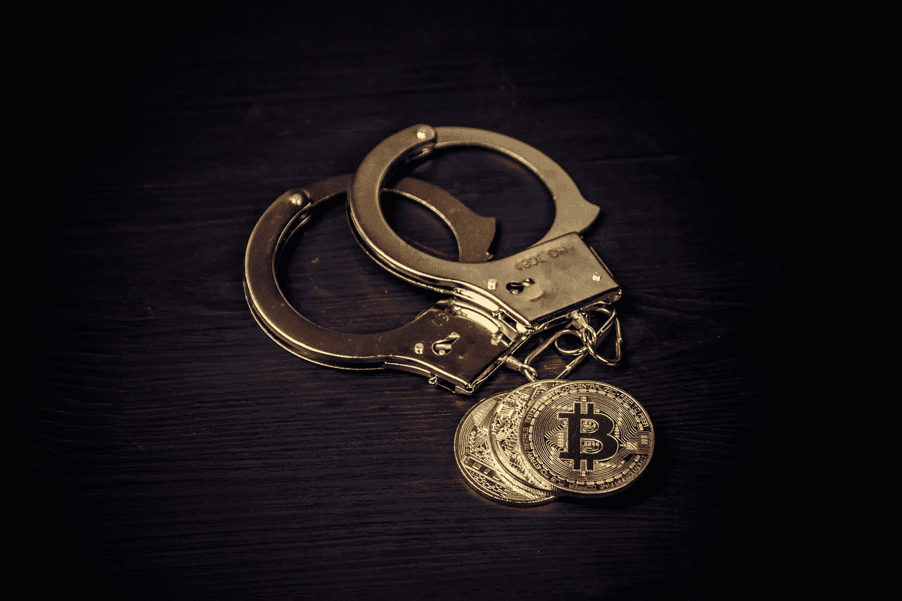

# 为了打开殖民管道，已经支付了 75 比特币的赎金

> 原文：<https://levelup.gitconnected.com/a-ransom-of-75-bitcoin-has-been-paid-to-open-up-the-colonial-pipeline-aca69fc3717f>

## 那么比特币到底是不是犯罪分子的工具呢？

[Bermix 工作室](https://unsplash.com/@bermixstudio?utm_source=unsplash&utm_medium=referral&utm_content=creditCopyText)在 [Unsplash](https://unsplash.com/s/photos/bitcoin-criminal?utm_source=unsplash&utm_medium=referral&utm_content=creditCopyText) 拍摄的照片

5 月 7 日,一个名为 DarkSide 的俄罗斯黑客联盟设法[侵入了 Colonial Pipeline](https://medium.datadriveninvestor.com/the-colonial-pipeline-cyberattack-when-hackers-threaten-public-infrastructure-deed5f7e86e) 的系统，这家公司的石油和天然气基础设施供应了美国东海岸 45%的石油。

5 月 14 日宣布，在[屈服于黑客](https://www.wired.com/story/colonial-pipeline-ransomware-payment/)的要求——支付 75 比特币的赎金(相当于大约 500 万美元)——之后，管道再次开放。黑客已经获取了 100 千兆字节的敏感数据，并在该公司的网络中安装了流氓软件，控制了后台办公室和报告系统。如果黑客控制了管道本身，潜在的危险和环境灾难性的影响促使 Colonial 也关闭了管道作为预防措施。

由于对殖民地的控制，无力恢复系统，他们似乎感到无力，只能付钱。黑暗面已经公开声明他们的意图不是造成如此严重的破坏，他们的动机仅仅是为了经济利益。结果他们似乎得到了他们想要的东西。

服务现在已经恢复，全国各地见证的燃料短缺和价格上涨现在有望停止。在输油管道关闭期间，汽油价格已经涨到了六年半以来的最高点，超过了每加仑 3 美元。

来源:[推特](https://twitter.com/Casey/status/1393378819566759936?s=20)

这一事件引发了对企业和政府部门网络安全风险的质疑。令人不安的是，这种破坏可以由一个犯罪团伙如此迅速和容易地造成，甚至不是一个拥有更多资源的国家支持的团体，而是一群私人黑客。

Colonial hack 最终通过向犯罪分子支付报酬而得以解决，这也发出了一个信息，可以鼓励其他黑客尝试类似的策略是值得的——如果他们成功，报酬可能会很大。

提出的另一个问题是比特币在收取赎金方面扮演的角色。

# 这是否证明比特币使犯罪成为可能？

对比特币等数字加密货币最常引用的反对意见之一是，它们会导致犯罪，并且主要被犯罪分子使用。这是政府高层经常表达的观点，最近一次是财政部长珍妮特·耶伦，她说:

> “我认为我们真的需要研究减少使用它们的方法，并确保……洗钱不会通过这些渠道发生。”

这一立场再次表明了 T2 政府高级官员对比特币、其运作方式和代表意义的无知程度。实际上，近年来与犯罪相关的交易量逐年下降。尽管如此，媒体将会广泛报道比特币被用来帮助向犯罪分子支付赎金，这些犯罪分子购买了美国的部分地区，使其暂时陷入停滞。这种信息往往会在公众意识中根深蒂固。

当然，黑暗面黑客选择用比特币支付赎金是有原因的。他们在接受比特币赎金时保持了一定程度的匿名性，比特币可以在几分钟内匿名发送和接收，一旦交易启动，就可以防止资金被收回。

但是，只要现金存在，这种匿名性就一直存在。以电子方式追踪美元的传输可能更容易，但除非收款人被迅速抓获，否则这笔钱可能会很快很容易地被转移出去，随后被清洗。之后，它就永远消失了。

# 匿名持有人，透明交易

比特币的一个优势是，区块链技术可以对发送的资金进行一定程度的追踪。比特币的持有者能够保持匿名，因为它是从一个安全、加密的钱包传输到下一个钱包的，而且钱包没有向所有者注册。然而，交易本身会在区块链中被清楚而永久地记录下来，这样，当大量比特币在不同钱包之间转移时，这些交易就可以被仔细审查和追踪。事实上，加密合规咨询公司 [Elliptic 已经发现了收到赎金的秘密钱包](https://www.elliptic.co/blog/elliptic-follows-bitcoin-ransoms-paid-by-darkside-ransomware-victims):

来源:[推特](https://twitter.com/elliptic/status/1393275043522781188?s=20)

如果黑暗面继续发送他们的比特币，在集团内部分配资金，在交易中使用比特币，或者将其装载到交易所出售并兑换成美元，执法机构将能够监控和跟踪比特币。这可能最终帮助他们抓获罪犯。

正是这种可追溯性让美国政府最终[逮捕了从丝绸之路](https://arstechnica.com/tech-policy/2016/08/stealing-bitcoins-with-badges-how-silk-roads-dirty-cops-got-caught/)窃取比特币的腐败特工，丝绸之路是一个用于出售毒品和武器的非法在线市场，于 2013 年被联邦调查局关闭。当局最终没收了他们的比特币，由于区块链的数据，他们能够证明代理商最初是从哪里偷的。

# 接下来会发生什么？

可以理解，执法机构对其他个人和犯罪团伙可能在 Colonial 支付赎金后变得胆大妄为感到不安。英国广播公司报道说，在 Colonial 付清欠款的同一天，日本电子公司东芝被同一个黑客组织攻击，尽管东芝的数据丢失没有那么严重。

政府和私营部门网络咨询公司都有一种感觉，即阻止勒索软件攻击的唯一方法是，如果那些成为目标的人不愿意付费。然而，当企业面临长期业务和资金损失的威胁时，或者如果它们长期关闭(如 Colonial Pipeline 的情况)，更广泛的公众影响会很大，那么受害者可能会觉得他们别无选择，只能付钱。2020 年，电子公司 Garmin 成为黑客组织 Evil Corp 的目标，Garmin 也支付了赎金。

除非政府和企业能够更好地抵御黑客攻击，并在攻击发生时更好地抵御攻击，否则我们可能会看到更多支付赎金是恢复系统和恢复业务的唯一选择的情况。

*如果你喜欢阅读这样的故事，并且愿意支持 Medium 上的作家，考虑注册成为 Medium 会员。一个月 5 美元，给你无限的故事。如果你注册使用我的链接，我会赚一小笔佣金。*

 [## 阅读托比·黑兹伍德(以及媒体上成千上万的其他作家)的每一个故事

### 作为一个媒体会员，你的会员费的一部分会给你阅读的作家，你可以完全接触到每一个故事…

tobyhazlewood.medium.com](https://tobyhazlewood.medium.com/membership) 

注:*本文仅供参考。不应将其视为财务或法律建议。在做任何重大财务决定之前，先咨询财务专家。*

## 如果你喜欢这篇文章，我希望你加入我的电子邮件列表。