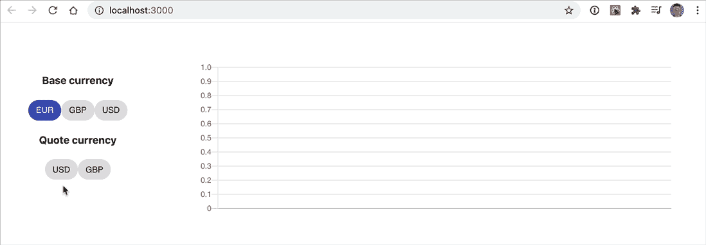

# React 应用程序，用于为资产控制绘制外汇汇率

> 原文：<https://levelup.gitconnected.com/a-react-app-for-plotting-fx-rates-for-asset-control-afb203623824>

在本文中，我们将展示如何在 React 应用程序中使用[之前实现的 GraphQL 资产控制服务](https://medium.com/@mhm_79907/a-graphql-service-for-asset-control-69475f4e66a9)来动态生成外汇汇率图表。

这一次，我们将从最后开始，先展示应用程序，然后再看实现。

无论如何，你可以在这里找到源代码:[https://github.com/mhmtio/react-fxrates](https://github.com/mhmtio/react-fxrates)

# React 应用程序正在运行

该应用程序允许您选择欧元、英镑或美元中的一种作为基础货币，并选择其他一种或两种作为报价货币。

然后，它使用 GraphQL 服务从 Asset Control 获取汇率数据，并将其显示在图表中。整洁，不是吗？我们来看一下实现。

# 履行

除了现成的 React，我们还需要一些库:

*   `@material-ui/core`为了漂亮的薯片
*   `graphql`和`@apollo/client`来使用 GraphQL 服务
*   `chart.js`和`react-chartjs-2`生成图表
*   `node-sass`来点造型

# GraphQL 客户端和查询

我们将首先为我们的 GraphQL 服务实现一个客户端函数，该函数允许我们在给定基础货币的情况下检索外汇汇率数据:

为了使我们的例子简单，你可以看到我们从一组固定的基础货币开始。然而，匹配外汇汇率与其报价货币和时间序列的检索是动态的。

您将在[上一篇文章](https://medium.com/@mhm_79907/a-graphql-service-for-asset-control-69475f4e66a9)中从我们的模式中识别出`fxRatesByBaseCurrency`查询:

# FxRates 反应组件

接下来，我们将在`src/components/fxrates.component.jsx`的 FxRates 组件下捆绑基础和报价货币选择以及图表。让我们一步步来看这个组件有趣的部分。你可以在这里随时查阅完整的源代码:[https://github.com/mhmtio/react-fxrates](https://github.com/mhmtio/react-fxrates)

查看状态，您可以看到我们需要跟踪一组可用的基础货币、当前选定的基础货币(具有默认值)、相应的可用报价货币和当前选定的报价货币(如果有)。

在`fxRates`中，我们将保存从 GraphQL 服务收到的给定基础货币的完整外汇数据集。在`tsData`中，我们保存已经为 Chartjs 组件准备好的用于绘图的时间序列数据。

我们定义两个常数。一个用于图表中使用的颜色。另一个是独立于动态外汇数据的 Chartjs 组件所需的一些选项:

# 原始数据

为了在组件挂载后设置一些有意义的状态，我们使用当前选择的基础货币调用 GraphQL 客户端函数 getFxData，并相应地设置`quoteCurrencies`和`fxRates`。

请记住，还没有显示任何图表，因为只显示了基础货币，而没有选择报价货币。

# 选择报价货币

现在，当我们选择报价货币时，我们实际上可以绘制一个图表，但首先我们需要准备时间序列数据:

在`getDataSets`(复数，因为您可以选择多种报价货币，因此可以提取多种汇率)中，我们将时间序列中的日期分配给属性`labels`，并生成一个数组`datasets`，该数组保存(针对每种选定的报价货币):

*   上面的常数`dataSetOpts`
*   a `label`表示我们正在绘制的货币
*   a `borderColor`和`pointBorderColor`(此处两者相同)和
*   `data`从时间序列中分配速率数据

还请注意，通过使用筹码(即切换按钮)，我们允许选择和取消选择报价货币。取消选择过程在这里也是通过从我们的地图中删除报价货币来处理的。

# 基础货币的选择

当用户选择不同的基础货币时，我们重置`selectedQuoteCurrencies`和`tsData`，因此不会绘制任何图形。给定新的基础货币，我们还触发对汇率数据的检索，以开始选择报价货币和重新绘制图表的过程。

# 把所有的放在一起

最后，我们可以实现 FxRates 组件的`render`函数:

您可以看到我们如何映射基础货币和报价货币，以显示货币选择的筹码，并通过逻辑显示它们的状态。最后，给定我们的`tsData`属性，我们可以从 Chartjs 库中绘制折线图。

我希望你觉得有趣和有用。我们试图保持这篇文章的平衡，在给出核心原则的同时给出一个简短的例子，这样你就可以将它们应用到你的具体用例中。如有疑问，欢迎联系或留言。感谢您的阅读。