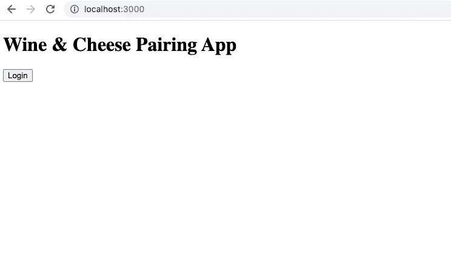
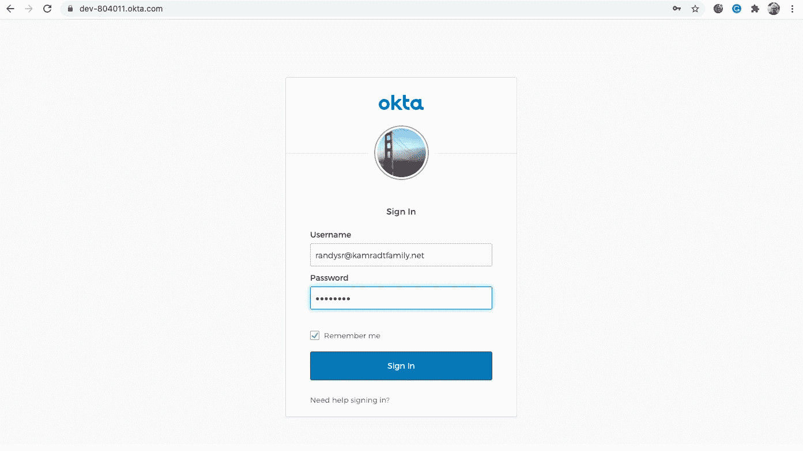
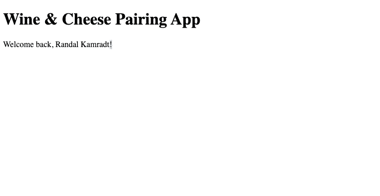
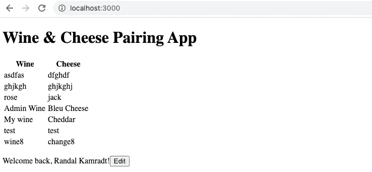
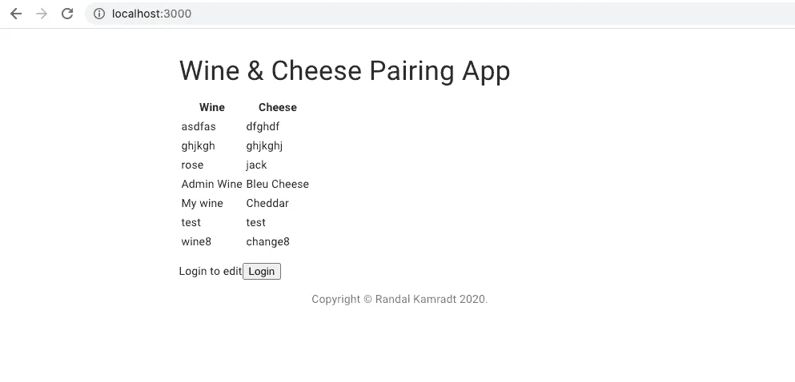
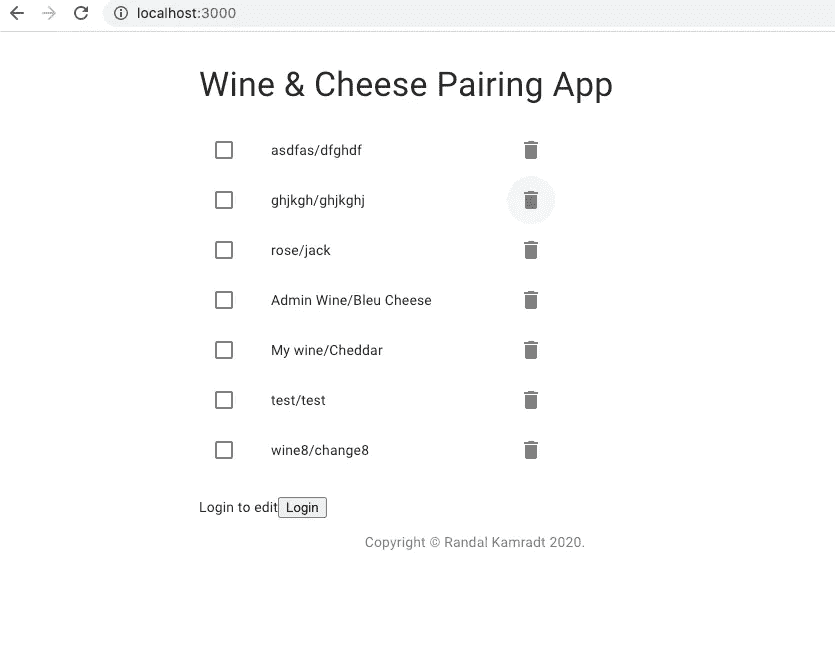
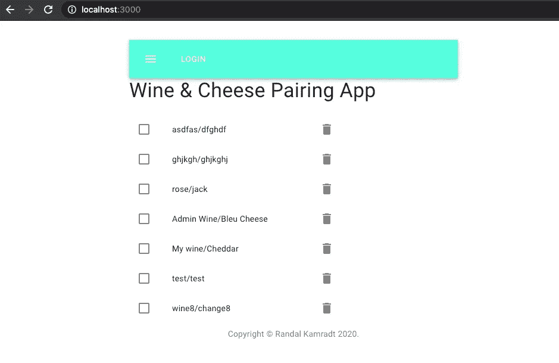
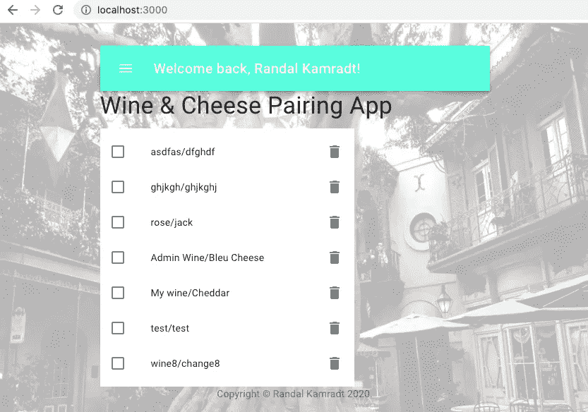

# 使用 Material-UI 的 React 前端(第 1 部分)

> 原文：<https://levelup.gitconnected.com/a-react-front-end-with-material-ui-part-1-add14caef2bf>

## 一次替换一个完整的应用程序。


图片由[安德鲁·马丁](https://pixabay.com/users/aitoff-388338/?utm_source=link-attribution&utm_medium=referral&utm_campaign=image&utm_content=3672088)来自 [Pixabay](https://pixabay.com/?utm_source=link-attribution&utm_medium=referral&utm_campaign=image&utm_content=3672088)

我经常听到全栈这个词，通常，它们指的是一种 web 编程风格，其中服务器生成填充有数据的 HTML 页面。虽然在一个应用程序中包含所有内容很方便，但这会导致许多问题。表示和数据逻辑不可避免地交织在一起。如果不做额外的工作，其他来源就无法获得数据。并且缩放是有问题的。

解决办法？让你的 API 和你的前端代码完全分离。就像在单独的存储库中，可能是单独的表达式语言，甚至是单独的编码员。但是在本文中，单独的存储库就足够了；我将做一个“葡萄酒和奶酪配对”数据后端的前端，我在[如何用 Flask 和 connection](/how-to-create-a-python-api-using-flask-connexion-4f3fc77e7f6e)创建一个 Python API。所以你可以说我是一个全栈编码器；我只是用一种更灵活的方式编码。

这个项目最初是一个传统的全栈 PHP 应用程序，我一点一点地对它进行了转换。最初的项目是用[现代 PHP](/modern-php-df3d3bf343f8) 编写的。然后我想能够在不暴露数据库的情况下读取数据，于是我用 PHP 和 Lumen 在[微服务中写了一个简单的读取服务。最后，我在](/microservices-with-php-and-lumen-d9af0b915a71)[如何使用 Flask 和 Connexion](/how-to-create-a-python-api-using-flask-connexion-4f3fc77e7f6e) 创建 Python API 中写了一整个 API。这应该是我的最后一篇文章，用 React UI 替换原来 PHP 应用程序的 UI 方面。

我的 Python API 需要 JWT 令牌来更新端点，所以我将从这开始。我使用 [Okta](https://www.okta.com/) 作为第三方认证服务，因为没有人应该编写自己的认证服务。如果您有自己喜欢的认证服务，您可能也可以使用它，但是您必须弄清楚如何将它转换到我给出的代码中。

我将从最简单的应用程序开始，以确保身份验证正常工作。这与您运行 React 'create app '命令得到的结果类似，但更简单。我发现，不用堆积太多东西，启动一个项目就已经够难了。再加上我们会有认证，总是很麻烦。

你需要安装一些东西来制作一个 React 应用程序。当然，你需要在全球范围内安装 Node.js、NPM 和 Yarn。我的版本分别是 14.4.0、6.14.8 和 1.22.4。如果您已经创建了一个 React 应用程序，那么您可能已经有了这些。因为我们的目标平台是云，所以你需要 Docker。我在 Mac 电脑上使用 Docker Desktop。如果你真的想在云中使用它，你需要一个云提供商的账户，可以为你提供一个普通的 Linux 虚拟机(我用过 GCP 和 AWS，它们在免费层都有类似的产品)。你应该有一个由你控制的 DNS 域名，我使用一个免费 HTTPS 的 [Cloudflare](https://www.cloudflare.com/) 账户。

首先，您可以为您的项目创建一个目录并运行`git init`使其成为一个 git 库，添加通常的`README.md`、`.gitignore`等，并提交它。或者，您可以在 GitHub 上完成所有这些工作，方法是在那里创建一个新的存储库，然后在您的计算机上克隆生成的存储库。无论哪种方式，都可以切换到新目录，在那里您可以开始添加文件。

## 证明

但是在你添加文件之前，如果你还没有的话，注册一个免费的帐户。这里有一个设置 [Okta 认证](https://developer.okta.com/blog/2019/03/06/simple-user-authentication-in-react)的指南。我们将在下面讨论我们的应用程序的细节，所以这里将重复一些指南。这一部分在我的文章[black book Project Part 1](https://medium.com/swlh/the-blackbook-project-part-1-d93e1c16d1de)中的“安全”副标题下也有涉及。

一旦你有了 Okta 账户，你就需要建立一个 SPA(单页申请)。它为您提供了最合理的默认值，但是`8080`端口应该改为`3000`，因为 React 开发服务器就是在这个端口上运行的。完成应用程序注册后，您会发现一个客户端 ID。然后，如果您返回 Okta 仪表板，您将找到他们为您创建的组织 URL。

现在，我们可以开始添加最少的文件来创建一个具有新授权的 React 应用程序。这是一个 Node.js 项目，因此您需要一个包含所有依赖项的`package.json`文件。它应该是这样的:

```
{
  "name": "winecheeseui",
  "version": "0.1.0",
  "private": true,
  "dependencies": {
    "[@okta/okta-auth-js](http://twitter.com/okta/okta-auth-js)": "^4.2.0",
    "[@okta/okta-react](http://twitter.com/okta/okta-react)": "^4.0.0",
    "dotenv": "^8.2.0",
    "react": "^16.13.1",
    "react-dom": "^16.13.1",
    "react-router-dom": "^5.2.0",
    "react-scripts": "^4.0.0"
  },
  "scripts": {
    "start": "react-scripts start",
    "build": "react-scripts build"
  },
  "eslintConfig": {
    "extends": "react-app"
  },
  "browserslist": {
    "production": [
      ">0.2%",
      "not dead",
      "not op_mini all"
    ],
    "development": [
      "last 1 chrome version",
      "last 1 firefox version",
      "last 1 safari version"
    ]
  }
}
```

然后是常用的目录，`public`和`src`。目前，`public`目录将只包含您的`index.html`:

```
<!DOCTYPE html>
<html lang="en">
  <head>
    <meta charset="utf-8">
    <meta name="viewport" content="width=device-width, initial-scale=1, shrink-to-fit=no">
    <meta name="theme-color" content="#000000">
    <link rel="manifest" href="%PUBLIC_URL%/manifest.json">
    <link rel="shortcut icon" href="%PUBLIC_URL%/favicon.ico">
    <title>React App</title>
  </head>
  <body>
    <noscript>
      You need to enable JavaScript to run this app.
    </noscript>
    <div id="root"></div>
  </body>
</html>
```

这其中的主要部分就是`<div id=”root”></div>`；这将被您的应用程序替换。注意这里还没有`css`库。这是我的哲学，先盖房子，再粉刷。就目前而言，我不在乎它看起来是否丑陋，我只想让它工作，并且让它工作本身通常就足够困难了。如果编码正确，以后添加样式会很容易。

根 div 的替换由`src/index.js`完成。以下是我所知道的:

```
import React from 'react'
import ReactDOM from 'react-dom'
import App from './App'ReactDOM.render(<App />, document.getElementById('root'))
```

您的应用程序将位于`src/App.jsx`中，如下所示:

```
import React from 'react';
import { BrowserRouter as Router, Route, Switch } from 'react-router-dom';
import { OktaAuth } from '[@okta/okta-auth-js](http://twitter.com/okta/okta-auth-js)';
import { Security, LoginCallback } from '[@okta/okta-react](http://twitter.com/okta/okta-react)'
import Home from './Home';const CLIENT_ID = '<your okta app client id'
const ISSUER = '[https://<your okta url>/oauth2/default'](https://dev-804011.okta.com/oauth2/default')
const REDIRECT_URI = `${window.location.origin}/implicit/callback`const config = {
  oidc: {
    clientId: CLIENT_ID,
    issuer: ISSUER,
    redirectUri: REDIRECT_URI,
    scopes: ['openid', 'profile', 'email'],
    pkce: true,
    disableHttpsCheck: true
  }
}const oktaAuth = new OktaAuth(config.oidc);const App = () => (
  <Router>
    <Security oktaAuth={oktaAuth}>
      <Switch>
        <Route path="/" exact component={Home} />
        <Route path="/implicit/callback" component={LoginCallback} />
      </Switch>
    </Security>
  </Router>
);
export default App
```

这将建立一个安全上下文，并调用`/implicit/callback`来调用 Okta 代码。这个`REDIRECT_URL`不必是公共的，因为浏览器将使用`302`重定向来访问它。如果 URL 有一个空的路径(这应该是常见的情况)，它将只转到`Home`组件。

确保您在设置 Okta 应用程序时设置了自己的`CLIENT_ID`和`ISSUER`。也不是秘密，事实上，前端没有什么应该是秘密的，因为当你第一次打开应用程序时，它会在浏览器中被发现。身份验证的关键是为您提供令牌的身份验证服务器和验证令牌是否来自身份验证服务器的 API 服务器。前端只是一个中间人。

拼图的最后一块是`src/Home.jsx`，它有一个登录按钮和一条简单的消息。它看起来是这样的:

```
import { useOktaAuth } from '[@okta/okta-react](http://twitter.com/okta/okta-react)'
import React, { useState, useEffect } from 'react'const Home = () => {
  const { authState, oktaAuth } = useOktaAuth()
  const [userInfo, setUserInfo] = useState(null)useEffect(() => {
    if (!authState.isAuthenticated) {
      setUserInfo(null);
    } else {
      oktaAuth.getUser().then((info) => {
        setUserInfo(info);
      });
    }
  }, [authState, oktaAuth]) // Update if authState changesconst login = async () => {
    oktaAuth.signInWithRedirect();
  }if (authState.isPending) {
    return (
      <div>Loading...</div>
    )
  }return (
    <div>
      <div>
        <h1 as="h1">Wine & Cheese Pairing App</h1>{ authState.isAuthenticated && !userInfo
        && <div>Loading user information...</div>}{authState.isAuthenticated && userInfo
        && (
        <div>
          <p>
            Welcome back,
            {userInfo.name}
            !
          </p>
        </div>
        )}{!authState.isAuthenticated
        && (
        <div>
          <button id="login-button" primary onClick={login}>Login</button>
        </div>
        )}</div>
    </div>
  )
}
export default Home
```

我们正在使用 React 钩子`useState`和`useEffect`。这些取代了旧的基于类的 React 组件中复杂的状态争论。我们将维护两个状态，一个是我们是否通过身份验证的标志，另一个是我们是否通过身份验证的用户信息。我们将把它们返回给我们的应用程序使用。

现在我们有足够的信息来启动我们的应用程序。首先，用`yarn install`加载所有的依赖项。要开始运行`yarn start`，它应该启动一个服务器并启动一个浏览器:



按下登录按钮，您将进入 Okta 登录屏幕。您可以更改它来处理从您自己的站点登录，但我不打算这么做。我想知道一个可信的第三方来源正在处理认证。



最后，是荣耀的主屏幕。



它可以用欢迎消息代替登录按钮，并从作为登录过程的一部分传回的用户信息中收集我的名字。让服务器保持运行，随着代码的每次更改，它都会自动更新页面。

## 将它连接到后端

我们将使用的后端在我之前的文章[如何创建 Python API](/how-to-create-a-python-api-using-flask-connexion-4f3fc77e7f6e) 中已经完成了。它目前正在 https://phprest.kamradtfamily.net/api/pairing[的云上。只有`GET`方法不受保护；其余的将需要认证令牌。因此，我们可以在您登录之前显示列表，只有当您想要添加/修改/删除项目时才需要登录。](https://phprest.kamradtfamily.net/api/pairing)

当然，您必须通过遵循我的文章中的步骤或者创建自己的 API 来获得自己的 API。它只是一个标准的 RESTful API，不一定是 Python，它可以是你最熟悉的任何后端语言。但是它应该在您刚刚创建的 Okta SPA 应用程序配置的授权头中接受 JWT 令牌。

这是 SPA 类型 web 应用程序的最大好处之一。数据是通过 API 保护的，所以我们的前端代码中没有任何错误可以改变这一点。前端所能做的最糟糕的事情就是显示一条令人讨厌的错误消息，如果你没有登录，我们应该能够通过禁用调用受保护端点的链接和按钮来防止这种情况。前端代码已经足够复杂，不用担心引入安全漏洞。而且，如果做得正确，前端和后端之间的划分应该消除从跨站点脚本到代码注入的一整类潜在的安全隐患。

由于葡萄酒/奶酪列表无需登录即可获得，我们可以先这样做。我将创建一个`src/WineList.jsx`文件，并用以下内容填充它:

```
import React, { useState, useEffect } from 'react'const WineList = () => {
  const [wineList, setWineList] = useState(null)
  const [wineListError, setWineListError] = useState(false)// fetch messages
  useEffect(() => {
      fetch('[https://phprest.kamradtfamily.net/api/pairing'](https://phprest.kamradtfamily.net/api/pairing'))
        .then((response) => {
          if (!response.ok) {
            return Promise.reject()
          }
          return response.json()
        })
        .then((data) => {
          const pairings = data.map((pairing) => {
            return {
              wine: pairing.wine,
              cheese: pairing.cheese,
              id: `wine-pairing-${pairing.id}`,
            }
          })
          setWineList(pairings)
          setWineListError(false)
        })
        .catch((err) => {
          setWineListError(true)
          console.error(err)
        })
  }, [])return (
    <div>
      {wineListError && <p>Error getting list</p>}
      {!wineList && !wineListError && <p>Accessing Server</p>}
      {wineList
      && (
      <div>
        <table>
          <thead>
            <tr>
              <th>Wine</th>
              <th>Cheese</th>
            </tr>
          </thead>
          <tbody>
            {wineList.map((pairing) => (
              <tr id={pairing.id}>
                <td>{pairing.wine}</td>
                <td>{pairing.cheese}</td>
              </tr>
            ))}
          </tbody>
        </table>
      </div>
      )}
    </div>
  );
};export default WineList
```

很简单；阅读列表并使用普通的 HTML 来显示它。注意 React 钩子的使用是为了维护葡萄酒列表数据。关于 React hooks 是否可以取代 Redux 还有一些争论，对于这个非常简单的例子，是的，它可以。但是对于一个更复杂的站点，我们仍然希望使用 Redux 来维护一个关于状态和用户界面变化的真实的单一来源。

我们将“登录”按钮移到列表下方。当用户登录时，我们可以用一个令牌“编辑”按钮来替换它。我有一些更详细的想法，但是添加编辑按钮有点像我们登录时不同选项的占位符。将登录按钮和欢迎消息移出`src/Home.jsx`简化了它:

```
import WineList from './WineList'
import EditButtons from './EditButtons'const Home = () => {
  return (
    <div>
      <h1>Wine & Cheese Pairing App</h1>
      <WineList />
      <EditButtons />
    </div>
  )
}
export default Home
```

现在创建`src/EditButtons.jsx`:

```
import { useOktaAuth } from '[@okta/okta-react](http://twitter.com/okta/okta-react)'
import React, { useState, useEffect } from 'react'const EditButtons = () => {
  const { authState, oktaAuth } = useOktaAuth()
  const [userInfo, setUserInfo] = useState(null)useEffect(() => {
    if (!authState.isAuthenticated) {
      setUserInfo(null);
    } else {
      oktaAuth.getUser().then((info) => {
        setUserInfo(info)
      })
    }
  }, [authState, oktaAuth]) // Update if authState changesconst login = async () => {
    oktaAuth.signInWithRedirect()
  }if (authState.isPending) {
    return (
      <div>Loading...</div>
    )
  }return (
    <div>
      { authState.isAuthenticated && !userInfo
        && <div>Loading user information...</div>}{authState.isAuthenticated && userInfo
        && (
        <div>
          <p>
            Welcome back, {userInfo.name}!
            <button id='edit button'>Edit</button>
          </p>
        </div>
      )}{!authState.isAuthenticated
        && (
        <div>
          <p>Login to edit
          <button id="login-button" primary onClick={login}>Login</button>
          </p>
        </div>
      )}</div>
  )
}export default EditButtons
```

现在我们的屏幕看起来会像这样:



哇！太丑了！我不知道你怎么想，但我认为我们已经走得够远了，没有风格。此外，当我们进入编辑部分时，样式库将影响它应该如何工作。

## 添加样式

我将使用 [Material-UI](https://material-ui.com/) 来设计组件和布局。Material-UI 用最少的实际 CSS 给你全功能的组件，这是我讨厌的。浏览器可能是人类给世界带来的最糟糕的 UI 平台。不幸的是，它无处不在，所以无法逃避。首先，让我们在 public/index.html 文件中添加几行代码:

```
<link rel="stylesheet" href="[https://fonts.googleapis.com/css?family=Roboto:300,400,500,700&display=swap](https://fonts.googleapis.com/css?family=Roboto:300,400,500,700&display=swap)" />
<link rel="stylesheet" href="[https://fonts.googleapis.com/icon?family=Material+Icons](https://fonts.googleapis.com/icon?family=Material+Icons)" />
```

然后我们可以安装一些组件:

```
yarn add @material-ui/core
yarn add @material-ui/icons
```

现在我们准备添加到我们现有的代码。首先，打个`src/themes.js`:

```
import { createMuiTheme } from '[@material](http://twitter.com/material)-ui/core/styles';// A custom theme for this app
const theme = createMuiTheme({
  palette: {
    primary: {
      main: '#206cff',
    },
    secondary: {
      main: '#305022',
    },
    error: {
      main: '#111111',
    },
    background: {
      default: '#fff',
    },
  },
});export default theme;
```

然后我们可以修改我们的`src/index.js`来设置 Material-UI 以供使用:

```
import React from 'react'
import ReactDOM from 'react-dom'
import CssBaseline from '[@material](http://twitter.com/material)-ui/core/CssBaseline'
import { ThemeProvider } from '[@material](http://twitter.com/material)-ui/core/styles'
import App from './App'
import theme from './theme'ReactDOM.render(
  <ThemeProvider theme={theme}>
    <CssBaseline />
    <App />
  </ThemeProvider>,
  document.getElementById('root')
)
```

在这里，我们基于刚刚创建的`src/theme.js`文件设置主题，并且设置 CSS 基线。现在我们准备开始造型了。

我们将调整`src/Home.jsx`，用一些材质 UI 创建的标签替换裸露的< div >标签:

```
import WineList from './WineList'
import EditButtons from './EditButtons'
import Container from '[@material](http://twitter.com/material)-ui/core/Container';
import Typography from '[@material](http://twitter.com/material)-ui/core/Typography';
import Box from '[@material](http://twitter.com/material)-ui/core/Box';
import Link from '[@material](http://twitter.com/material)-ui/core/Link';function Copyright() {
  return (
    <Typography variant="body2" color="textSecondary" align="center">
      {'Copyright © '}
      <Link color="inherit" href="[https://material-ui.com/](https://material-ui.com/)">
        Randal Kamradt
      </Link>{' '}
      {new Date().getFullYear()}
      {'.'}
    </Typography>
  );
}const Home = () => {
  return (
    <Container maxWidth="sm">
      <Box my={4}>
        <Typography variant="h4" component="h1" gutterBottom>
          Wine & Cheese Pairing App
        </Typography>
        <WineList />
        <EditButtons />
        <Copyright />
      </Box>
    </Container>
  )
}
export default Home
```

现在，我们的布局更加集中和灵活:



仍然不是很漂亮，但我们正在努力。

现在让我们制作一个漂亮的列表，给每个条目添加一个复选框和垃圾桶图标。所有这些都将发生在`src/WineList.jsx`:

```
import React, { useState, useEffect } from 'react'
import { makeStyles } from '[@material](http://twitter.com/material)-ui/core/styles';
import List from '[@material](http://twitter.com/material)-ui/core/List';
import ListItem from '[@material](http://twitter.com/material)-ui/core/ListItem';
import ListItemIcon from '[@material](http://twitter.com/material)-ui/core/ListItemIcon';
import ListItemSecondaryAction from '[@material](http://twitter.com/material)-ui/core/ListItemSecondaryAction';
import ListItemText from '[@material](http://twitter.com/material)-ui/core/ListItemText';
import Checkbox from '[@material](http://twitter.com/material)-ui/core/Checkbox';
import IconButton from '[@material](http://twitter.com/material)-ui/core/IconButton';
import DeleteIcon from '[@material](http://twitter.com/material)-ui/icons/Delete';
import Box from '[@material](http://twitter.com/material)-ui/core/Box';const useStyles = makeStyles((theme) => ({
  root: {
    width: '100%',
    maxWidth: 360,
    backgroundColor: theme.palette.background.paper,
  },
}));const WineList = () => {
  const [wineList, setWineList] = useState(null)
  const [wineListError, setWineListError] = useState(false)
  const [checked, setChecked] = React.useState([0])
  const classes = useStyles()const handleToggle = (value) => () => {
    const currentIndex = checked.indexOf(value)
    const newChecked = [...checked]if (currentIndex === -1) {
      newChecked.push(value)
    } else {
      newChecked.splice(currentIndex, 1)
    }setChecked(newChecked)
  }// fetch messages
  useEffect(() => {
      fetch('[https://phprest.kamradtfamily.net/api/pairing'](https://phprest.kamradtfamily.net/api/pairing'))
        .then((response) => {
          if (!response.ok) {
            return Promise.reject()
          }
          return response.json()
        })
        .then((data) => {
          const pairings = data.map((pairing) => {
            return {
              wine: pairing.wine,
              cheese: pairing.cheese,
              id: `wine-pairing-${pairing.id}`,
            }
          })
          setWineList(pairings)
          setWineListError(false)
        })
        .catch((err) => {
          setWineListError(true)
          console.error(err)
        })
  }, [wineList, wineListError])return (
    <Box>
      {wineListError && <p>Error getting list</p>}
      {!wineList && !wineListError && <p>Accessing Server</p>}
      {wineList
      && (
        <List className={classes.root}>
            {wineList.map((pairing) => (
              <ListItem key={pairing.id}
                  role={undefined}
                  dense
                  button onClick={handleToggle(pairing.id)}>
                <ListItemIcon>
                  <Checkbox
                    edge="start"
                    tabIndex={-1}
                    disableRipple
                    inputProps={{ 'aria-labelledby': pairing.id }}
                  />
                </ListItemIcon>
                <ListItemText id={pairing.id}
                  primary={`${pairing.wine}/${pairing.cheese}`} />
                <ListItemSecondaryAction>
                  <IconButton edge="end" aria-label="delete">
                    <DeleteIcon />
                  </IconButton>
                </ListItemSecondaryAction>
              </ListItem>
            ))}
        </List>
      )}
    </Box>
  )
}export default WineList
```

现在我们开始有所进展了:



让我们对变成欢迎消息的登录消息做些什么。这些都在`src/EditButtons.jsx`中处理:

```
import { useOktaAuth } from '[@okta/okta-react](http://twitter.com/okta/okta-react)'
import React, { useState, useEffect } from 'react'
import { makeStyles } from '[@material](http://twitter.com/material)-ui/core/styles';
import AppBar from '[@material](http://twitter.com/material)-ui/core/AppBar';
import Toolbar from '[@material](http://twitter.com/material)-ui/core/Toolbar';
import Typography from '[@material](http://twitter.com/material)-ui/core/Typography';
import Button from '[@material](http://twitter.com/material)-ui/core/Button';
import IconButton from '[@material](http://twitter.com/material)-ui/core/IconButton';
import MenuIcon from '[@material](http://twitter.com/material)-ui/icons/Menu';const useStyles = makeStyles((theme) => ({
  root: {
    flexGrow: 1,
  },
  menuButton: {
    marginRight: theme.spacing(2),
  },
  title: {
    flexGrow: 1,
  },
}));const EditButtons = () => {
  const { authState, oktaAuth } = useOktaAuth()
  const [userInfo, setUserInfo] = useState(null)
  const classes = useStyles();useEffect(() => {
    if (!authState.isAuthenticated) {
      setUserInfo(null);
    } else {
      oktaAuth.getUser().then((info) => {
        setUserInfo(info)
      })
    }
  }, [authState, oktaAuth]) // Update if authState changesconst login = async () => {
    oktaAuth.signInWithRedirect()
  }if (authState.isPending) {
    return (
      <div>Loading...</div>
    )
  }return (
    <AppBar position="static" style={{ background: '#55FFDD' }}>
      <Toolbar>
        <IconButton edge="start" className={classes.menuButton}
            color="inherit"
            aria-label="menu">
          <MenuIcon />
        </IconButton>{ authState.isAuthenticated && !userInfo
          && <Typography variant="h6"
               className={classes.title}>
               Loading user information...
             </Typography>}
        { authState.isAuthenticated && userInfo
          && <Typography variant="h6"
              className={classes.title}>
              Welcome back, {userInfo.name}!
            </Typography>}
        { !authState.isAuthenticated &&
          <Button color="inherit"
              onClick={login}>
            Login
          </Button>}
      </Toolbar>
    </AppBar>
  )
}export default EditButtons
```

我否决了 AppBar 风格的背景颜色，因为我对任何类似脸书蓝的东西过敏(我肯定你们中的一些人对我选择的绿色感到不满)。我们将在`src/Home.jsx`中将它移到顶部。这是我们现在所拥有的:



它太白了，让我们给它一个有趣的背景。在我最初的应用程序中，我使用了一张褪色的照片。我会重新利用它。我将采用传统方式，只是在`public/index.html`上添加一个``标签，并增加一些样式:

```
<!DOCTYPE html>
<html lang="en">
  <head>
    <meta charset="utf-8">
    <meta name="viewport" content="width=device-width, initial-scale=1, shrink-to-fit=no">
    <meta name="theme-color" content="#000000">
    <title>Wine/Cheese Pairing</title>
    <link rel="manifest" href="%PUBLIC_URL%/manifest.json">
    <link rel="shortcut icon" href="%PUBLIC_URL%/favicon.png">
    <link rel="stylesheet" href="[https://fonts.googleapis.com/css?family=Roboto:300,400,500,700&display=swap](https://fonts.googleapis.com/css?family=Roboto:300,400,500,700&display=swap)" />
    <link rel="stylesheet" href="[https://fonts.googleapis.com/icon?family=Material+Icons](https://fonts.googleapis.com/icon?family=Material+Icons)" />
    <style type="text/css">
       #backgroundimage
       {
          height: auto;
          left: 0;
          margin: 0;
          min-height: 100%;
          min-width: 674px;
          padding: 0;
          position: fixed;
          top: 0;
          width: 100%;
          z-index: -1;
       }
     </style>
  </head>
  <body>
    
    <noscript>
      You need to enable JavaScript to run this app.
    </noscript>
    <div id="root"></div>
  </body>
</html>
```

我没有添加替代文本，因为这只是为了美观，只会给需要替代文本的人增加页面的噪音。评论并告诉我，如果你认为我错了，我很乐意接受建议。

这是最后的结果:



我们还没有完成，我们仍然需要连接添加/更新/删除功能，并将其发布到 web 上。但是现在，这已经足够了。我们将在本系列的第 2 部分中讨论其余的内容。

下面是本文附带的代码:

[](https://github.com/rkamradt/winecheeseui/tree/v0.2) [## rkamradt/wineceseui

### 葡萄酒和奶酪配对应用的 react UI dissolve GitHub 是超过 5000 万开发人员的家园，他们共同努力…

github.com](https://github.com/rkamradt/winecheeseui/tree/v0.2) 

参考的其他文章:

[](/how-to-create-a-python-api-using-flask-connexion-4f3fc77e7f6e) [## 如何使用 Flask/connection 创建 Python API

### 让经过认证的后端在云中运行

levelup.gitconnected.com](/how-to-create-a-python-api-using-flask-connexion-4f3fc77e7f6e) [](/microservices-with-php-and-lumen-d9af0b915a71) [## 使用 PHP 和 Lumen 的微服务

### 与 PHP 的过去决裂，而不破坏现有的应用程序

levelup.gitconnected.com](/microservices-with-php-and-lumen-d9af0b915a71) [](/modern-php-df3d3bf343f8) [## 现代 PHP

### 使用 Upstart 上最需要的项目语言之一开始你的自由职业生涯。

levelup.gitconnected.com](/modern-php-df3d3bf343f8)