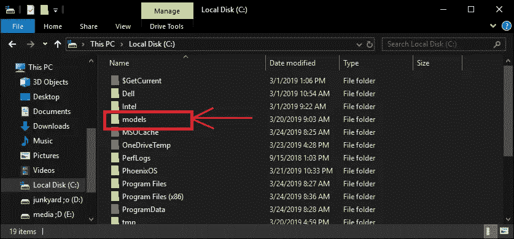
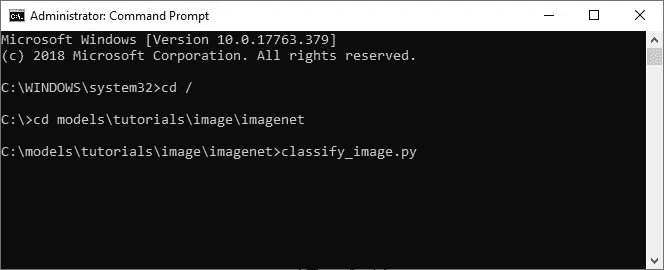
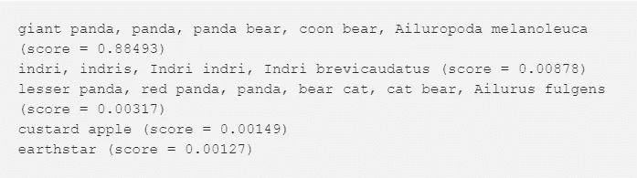
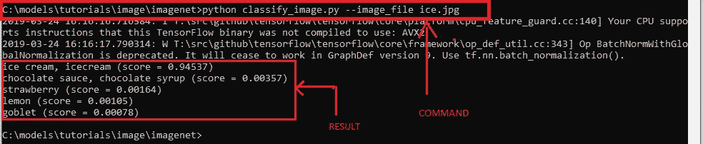

# 一个具有迁移学习的现成图像分类器

> 原文：<https://levelup.gitconnected.com/a-ready-to-go-image-classifier-with-transfer-learning-66cca2285342>

这是一个使用迁移学习对图像进行分类的介绍性教程。在本教程中，我们将使用谷歌大脑的模块盗梦空间。

Inception 是 Google Brain 团队为“ImageNet”开发的 API。(这是一个很大的视觉识别挑战。)

Inception 训练了超过 1000 个类别，如洗碗机和洗衣机，狗的品种等等。

让我们对图像进行分类。

## 先决条件:-

1.  **Python**(Python 3 的任何版本)

2. **Tensorflow 包**。(本文我使用的是 1.7 版本)

`**pip install tensorflow**`

而且可以升级到 1.7v

`**pip install --upgrade"tensorflow==1.7.*"**`

3. [**诗人的张量流** s](https://github.com/tensorflow/models)

得到这个[回购](https://github.com/tensorflow/models)，因为它带有所有需要的脚本。

## 第一步:-

假设您已经具备了所有的先决条件，那么第一步就是将您的 repo 解压缩到根文件夹中。由于我在 windows 操作系统上工作，我将在 **(C: drive/models)** 中提取这个回购

## 第二步:-

现在启动您的命令提示符/终端。(作为管理员)

并导航至***车型>教程>图片> imagenet"***

*正如我们要运行的脚本****【classify _ image . py】***

如果该脚本成功运行，您将得到类似如下的输出。

## 第三步:-

让我们对一些图像进行分类。

从浏览器下载图像或从本地存储器导入。

粘贴到与***“classify _ image . py”***相同的文件夹中

您可以使用存储在系统上任何地方的任何映像，只要确保在下面指定的命令中给出该映像的正确路径。

`**python classify_image.py-image_file images.jpg**`

#使用您的图像名称和扩展名(jpg、png、jfif)代替“images”。上面命令中的"扩展"分别为。

对于下图，我得到了以下结果:

注意:-ice.jpg 是我使用的文件名，它存储在同一个文件夹中，这就是为什么我没有给出任何其他相对路径，除了图像的名称。

根据结果，它非常确定这是一个冰淇淋，因为它有 94%的信心。

希望你们会喜欢这篇文章，如果你尝试时遇到错误，请告诉我，在下一篇文章中，我们将训练这个 API，以识别我们自定义的图像类别。

参考资料:-

[https://ai.googleblog.com](https://ai.googleblog.com/)

[https://towardsdatascience.com](https://towardsdatascience.com/)