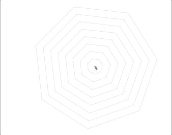

# 带抖动的实时图表

> 原文：<https://levelup.gitconnected.com/a-realtime-chart-with-flutter-75d1840b7789>

## pub.dev 中有几个图表包可用，我选择了 mp_chart，因为它类似于久经考验的 MPAndroidChart。

运行中的实时图表

您将学到的内容:

*   如何从 mp_chart 包示例中剪切出一个图表，并集成到你的 app 中。
*   如何使用 Dart DevTools 保证没有内存泄漏？

从一月份开始，我就在尝试一些私人的 Flutter 应用。特别是我正在研究如何使用 Flutter 来控制蓝牙设备，开发桌面应用程序、Web 应用程序等等。

对于一个蓝牙项目，我需要像在示波器上一样实时显示两个值。我检查了 pub.dev 上的包，选择了 mp_chart 包。该软件包在 README 页面上有一个漂亮的实时动画图表。

Flutter 使得孤立地开发一个应用程序的独立部件，然后将它们粘在一起变得很容易。所有语言都可以做到这一点，但是*‘一切都是小部件’*原则让它变得非常简单，没有任何麻烦。

另一方面，从一个应用程序中剪切出有趣的部分(小部件)并对其进行进一步处理是很容易的。这是我开始使用新包装时的程序。我在 github 上查看它是否有一个示例应用程序，并剪切出我需要的内容。

mp_charts 包展示了所有支持的图表类型。有这么多不同的小工具，我必须找到合适的:

*   条形图基础
*   条形图基础 2
*   条形图水平
*   条形图倍数
*   条形图负片
*   巴恰特辛
*   条形图堆叠
*   条形图堆叠 2
*   更动态
*   甚至每小时
*   **EvenMoreRealtime**
*   LineChartBasic
*   彩色折线图
*   线图立方
*   线图双轴
*   填充线图
*   线图反转轴
*   折线图倍数
*   折线图性能
*   其他图表气泡
*   其他图表烛台
*   其他图表合并
*   其他图表雷达
*   其他图表
*   PieChartBasic
*   馅饼
*   PieChartValueLines
*   ScrollingChartManyBar
*   ScrollingChartMultiple
*   ScrollingChartTallBar
*   scrollingchartviewparager

我在源文件`mp_chart/example/lib/demo/even_more/realtime.dart`中找到了小部件`EvenMoreRealtime`。**但是**:这个小部件对演示应用有几个依赖。为了使它独立于陈列柜框架，我必须做以下改动:

1.  我的版本不再扩展 ActionState，只是扩展了一个标准状态<>。
2.  我移除了 ActionState 类中定义的所有被覆盖的方法。
3.  被覆盖的 getBody()方法中的代码被移到标准的被覆盖的 build()方法中。
4.  不再需要的导入被删除

在做了这些更改并将小部件重命名为 RealTimeChart 之后，我可以在一个名为 PulsarScreen 的屏幕中使用它，这是我的测试应用程序框架的主体。下面的代码在列的顶部构建 RealTimeChart。

图表下方的配置小部件包含一个范围滑块，用于设置生成值的上限和下限，以及一个滑块，用于显示生成的正弦值的频率。这些设置存储在类 RealtimeDataServiceImpl 中。

以下代码片段显示了演示示例的原始代码:

这是我的裁剪部件的相应部分，它可以在没有演示框架的情况下运行:

我又做了一些修改，让这个小部件适应我的需求:

`_initController`方法配置所有的颜色、文本样式、轴的限制等等。总而言之，你可以根据自己的需求调整 x 属性。

演示小部件只是在 _updateEntry()中定期调用 1000 次 _addEntry()。我用一个——也许是无止境的——数据流上的监听代替了它。

This _dataStream 由`RealtimeDataService`的一个实例提供，它是使用`get_it`包的定位器注入的。该服务由两个滑块构成，它向水流提供两个正弦波。

`Stream<DataSet> _dataStream = locator<RealtimeDataService>().dataStream;`

对于这个简单的测试应用程序来说，这有点过了，但是我在一个应用程序中使用了相同的架构，它也将使用这个 RealtimeChart 小部件。

最初的演示示例通过每次调用内存中的`_addMultiple()`来创建有限数量的新条目。对于运行时间更长的“真正的”实时应用程序，这将是一个显著的内存泄漏。在谷歌搜索`mpandroidchart realtime chart remove`我在 stackoverflow 找到了一个解决方案。我搜索了`mpandroidchart`,因为软件包的自述文件指出:

`flutter charts just like MPAndroidChart`

mp_charts 包的一个很大的优点是，任何问题都可以用与`MPAndroidChart.`相同的方式来解决。这有助于了解是否发生了任何问题或需要配置任何特殊情况。

我发现的解决方案是在方法`addWithRemove().`中实现的，只要条目不再可见，它就会删除它们。

可以在 Dart DevTools 的内存视图中检查差异。下面的屏幕截图显示了在 addWithRemove()中注释掉对`removeEntry2`的调用时的内存:

一分钟消耗 3290 个对象和 154 kB 内存

**注意**:要获得可行的结果，您必须点击`gc`图标来执行垃圾收集器。之后，单击快照会显示所有对象的数量。特别感兴趣的是类`Entry`的对象计数。

下面是调用`removeEntry2`时的计数:

无论应用程序运行多长时间，只消耗 120 个对象和 15 kB

## 结论

mp_chart 包对于实时图表和许多其他图表类型非常有用。有许多可配置的属性。只需很少的努力，mp_charts 包中的其他小部件就可以从示例中裁剪出来，并在自己的应用程序中使用。我还使用了小部件 OtherChartRadar，如下图所示。切割过程与上述步骤非常相似。

mp_chart 包的雷达图

我的测试应用的完整源代码在 [Github](https://github.com/schilken/flutter_realtime_chart_example) 上。