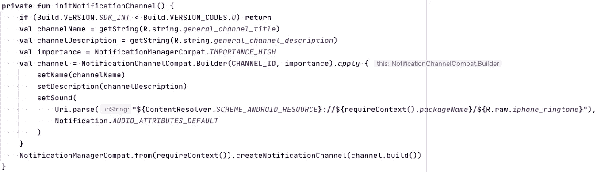
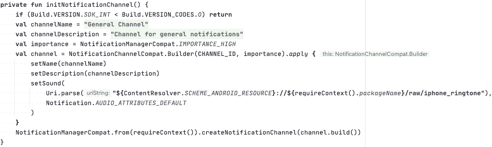

# 自定义通知声音无法在 Android 上运行的原因

> 原文：<https://levelup.gitconnected.com/a-reason-why-custom-notification-sound-might-not-work-on-android-4aea06b8c7c4>


[汉娜剧团](https://unsplash.com/@htroupe?utm_source=unsplash&utm_medium=referral&utm_content=creditCopyText)在 [Unsplash](https://unsplash.com/?utm_source=unsplash&utm_medium=referral&utm_content=creditCopyText) 上的照片

当我们为通知通道使用自定义声音时，我们可能会观察到系统显示没有声音的通知。播放自定义声音可能对您的应用程序至关重要，让我们来看看为什么会这样。

## 开始

我遇到了一个问题，用户听不到某些通知的声音。于是我开始调查原因。我分析了该版本的一个变更日志，没有发现任何明显的问题。之后我才知道，只有安卓 8.0+(API 26+)的用户才面临这个问题。这让我想到这个问题可能与[的通知渠道有关。](https://developer.android.com/training/notify-user/channels)

## Android 通知渠道

根据文件:

> 从 Android 8.0 (API 级别 26)开始，所有通知都必须分配到一个通道。对于每个通道，您可以设置应用于该通道中所有通知的视觉和听觉行为。然后，用户可以更改这些设置，并决定应用程序中的哪些通知通道应该是干扰性的或可见的。

假设我们使用以下代码块来创建和配置通道:

```
**private fun** initNotificationChannel() {
    **if** (Build.VERSION.*SDK_INT* < Build.VERSION_CODES.*O*) **return
    val** channelName = ...
    **val** channelDescription = ...
    **val** importance = NotificationManagerCompat.*IMPORTANCE_HIGH* **val** channel = NotificationChannelCompat.Builder(**CHANNEL_ID**, importance).*apply* **{** setName(channelName)
        setDescription(channelDescription)
        setSound(
Uri.parse(**"${**ContentResolver.*SCHEME_ANDROID_RESOURCE***}://${**requireContext().*packageName***}/${**R.raw.*iphone_ringtone***}"**),
            Notification.*AUDIO_ATTRIBUTES_DEFAULT* )
    **}** NotificationManagerCompat.from(requireContext()).createNotificationChannel(channel.build())
}
```

我们可以在文档中找到创建和配置通道的常用方法。然而，我们正在设置一个存储在 **raw** 文件夹中的自定义声音。
第一眼看上去，一切都很好，这段代码非常棒。但从长远来看，它会造成一个问题。我们将在几分钟内看到它。

## 渠道细节

根据文档，一旦开发人员创建了通知通道，开发人员只能修改一些东西。

> 创建通知通道后，您将无法更改通知行为，因为此时用户拥有完全的控制权。尽管您仍然可以更改频道的名称和描述。

事实上，如果我们创建一个 ID 为“A”的通道，删除它，并创建一个 ID 为“A”的新通道，框架将恢复之前删除的 ID 为“A”的通道。你可以在文档[这里](https://developer.android.com/reference/android/app/NotificationManager#deleteNotificationChannel(java.lang.String))找到更多。

## 发现问题的第二次机会

看看下面的代码，试着理解在更新到下一个版本的应用程序后，什么会导致错过通知声音。



如果你没看到，那就不是问题。无论如何，我马上会给你看。

## 问题是

我用一个自定义的声音 URI 创建了通知通道，它指向了 **R** 文件中的一个特定 ID。但是，R 文件中的 id 在重建后可能会改变。不常发生。我复制了以下步骤:

1.  添加\删除应用程序资源中的文件夹，或者在目标文件夹之前添加同一文件夹中的文件
2.  清除梯度缓存
3.  构建并运行应用程序

它导致 IDs 重新生成，并且通知通道指向旧的 ID。就是这样:)

## 如何修复

首先，我们应该删除通知通道，并使用新的通知通道 id 创建一个新的通知通道。
其次，我们应该修改一个声音 URI，并按其名称使用原始文件。



## 结论

我花了几天时间来确定这个问题，希望它会对某人有用。但是，错过通知声音可能是由于:将通知/频道的优先级/重要性级别设置得较低；用户使通知频道静音；被另一个通知声音打断等。

这种解决方案适用于模糊代码。顺便说一下，要确保你的文件不会因为资源减少而损坏。在这个例子中，我使用声音文件的 ID 为 Android pre 8.0 上的用户创建通知声音。在这种情况下，该文件是从代码中使用的，因此不会被删除。

如果你喜欢这篇文章，请在推特上关注我

项目样本可以在 [GitHub](https://github.com/Y-Datsenko/FixMissingNotificationSound) 上找到。看一下提交，它们将提供关于声音何时被破坏以及何时被修复的附加信息。