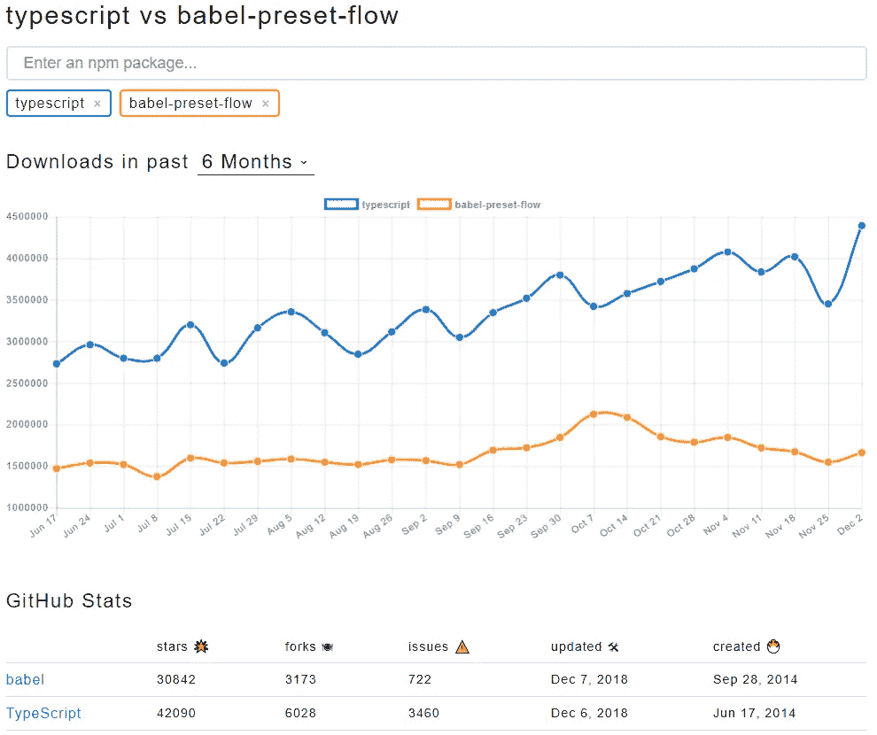

# 2018 年前端开发回顾

> 原文：<https://levelup.gitconnected.com/a-recap-of-frontend-development-in-2018-715724c9441d>

前端开发的世界发展很快。非常快。本文将回顾 2018 年 JavaScript 最重要的前沿新闻、值得关注的事件和趋势。

 [## 组合 API -轻松发展您的编码事业| gitconnected

### 消除在每个单独位置手动更新您的详细信息的痛苦。只需在您的中更改一次数据…

gitconnected.com](https://gitconnected.com/portfolio-api) 

# WebAssembly 发布了核心规范达到 1.0 的主要版本

WebAssembly 通常被认为是 web 的未来。它旨在通过提供一种在 web 上运行的二进制格式，最大限度地提高性能，减小文件大小，并支持多种语言的 web 开发。

2017 年末[所有主流浏览器都宣布](https://blog.mozilla.org/blog/2017/11/13/webassembly-in-browsers/)支持 WebAssembly。然后在 2018 年 2 月，WebAssembly 有了 3 个主要版本:

*   [核心规范发布 1.0](https://www.w3.org/TR/wasm-core-1/)
*   【WebAssembly 的 JavaScript 接口
*   [用于 WebAssembly 的 Web API](https://www.w3.org/TR/wasm-web-api-1/)

> 使用我们的会员链接支持 gitconnected.com:
> 
> [编程书籍推荐](https://amzn.to/2SdZtxI)， [Udemy](https://bit.ly/2FVpiwK) ， [Pluralsight](https://pluralsight.pxf.io/c/1304575/424552/7490) ，教程( [JavaScript](https://JavaScript30.com/friend/GITCONNECTED) ，[节点](https://LearnNode.com/friend/GITCONNECTED)， [React](https://ReactForBeginners.com/friend/GITCONNECTED) )

# 流行前端库的 NPM 下载

React、jQuery、Angular 和 Vue 占据了热门前端模块下载量的前四名。进一步阅读以了解图书馆的最新发展。

# 随着库的发展，React 将继续其统治地位

React 多年来一直主导着 web 开发，在 2018 年期间，它丝毫没有放缓。根据 Stackoverflow 调查，它仍然是最受欢迎的图书馆之一。

React 核心团队非常积极地更新库和添加特性。在整个 2018 年，我们看到了 React v16 版本的许多补充，包括新的[生命周期方法](https://reactjs.org/blog/2018/03/29/react-v-16-3.html#component-lifecycle-changes)、[新的上下文 API](https://reactjs.org/blog/2018/03/29/react-v-16-3.html#official-context-api) 、[指针事件](https://reactjs.org/blog/2018/05/23/react-v-16-4.html)、[懒惰函数](https://reactjs.org/blog/2018/10/23/react-v-16-6.html#reactlazy-code-splitting-with-suspense)和 [React.memo](https://reactjs.org/blog/2018/10/23/react-v-16-6.html#reactmemo) 。然而，最受关注的两个特性是 [React Hooks 和悬念 API](https://reactjs.org/blog/2018/11/13/react-conf-recap.html) 。

React Hooks 得到了一些响亮的反馈，许多开发者喜欢这次更新。钩子是用`useState`函数向功能组件添加状态的一种方式，它还将管理生命周期事件。

在下面的视频中，[视图封装](https://medium.com/u/162352c45b6e#view-encapsulation)”支持 CSS 开箱即用。默认情况下，这是打开的。

 [## React & Redux 教程-构建一个黑客新闻克隆

### 在本教程中，我们将构建一个生产质量的黑客新闻克隆。我们将走过…

gitconnected.com](https://gitconnected.com/courses/learn-react-redux-tutorial-build-a-hacker-news-clone) 

# 开发人员从 CLI 工具的疲劳中找到了解脱

众所周知，跟上最新的库、正确配置您的应用程序以及做出正确的架构决策会令人疲惫不堪。这种痛苦催生了管理工具的 CLI 包，允许开发人员专注于应用程序。这种工具已经成为 2018 年开发者创建应用的主要方式。流行的框架有[next . js](https://nextjs.org/)(SSR for React)[Create-React-App](https://github.com/facebook/create-react-app)(客户端 React)[nuxt . js](https://nuxtjs.org/)(SSR for Vue)[Vue CLI](https://cli.vuejs.org/)(客户端 Vue)[Expo CLI](https://expo.io/tools#cli)React Native，默认带 [Angular](https://angular.io/) 。

# 当我们试图简化前端和寻求性能时，静态站点生成增加了

随着 JavaScript 革命的发生，每个人都喜欢学习最新最棒的库，但现在事情已经尘埃落定，我们已经意识到不是每个网站都需要成为复杂的单页应用程序(SPA)。这导致了静态站点生成器的增长。这些工具允许您在自己喜欢的库(如 React 或 Vue)中编码，但在构建时会生成静态 HTML 文件，从而允许我们立即向用户提供完整构建的页面。

静态站点很棒，因为它们提供了性能和简单性的完美结合。通过在构建时呈现 HTML 文件，我们能够立即向用户发送页面，而不需要对代码进行 SSR 或 CSR，从而允许他们几乎瞬间加载站点。然后将必要的 JavaScript 文件下载到客户机上，实现单页面体验。

静态网站非常适合构建个人网站或博客，但是它们可以很容易地扩展到更大的应用程序。我们已经看到了构建静态网站的流行框架的兴起，如 React 应用程序的[盖茨比](https://www.gatsbyjs.org/)和 [React Static](https://github.com/nozzle/react-static) ，以及 Vue 应用程序的 [VuePress](https://vuepress.vuejs.org/) 。事实上，静态网站已经变得如此受欢迎，以至于 Gatsby 实际上已经成立了一家公司，并在过去的一年里围绕他们的开源库接受了风险投资。

# 无服务器架构和 JAMStack

随着静态网站越来越受欢迎，我们也看到了不断增长的后端来赞美它们。在过去的几年中，无服务器架构一直是 web 开发中的热门词汇，因为它能够分离客户端和服务器代码，同时允许以更低的成本运行。

无服务器理念的一个扩展是 [JAMStack](https://jamstack.org/) (JavaScript、API、标记)。JAMStack 哲学建立在上一节讨论的静态站点概念之上。由于预先构建的标记，它允许极快的加载时间，并通过利用服务器的可重用 API 成为客户机上的动态 SPA。2018 年，我们甚至看到了有史以来第一次 [JAMStack 黑客马拉松](https://medium.freecodecamp.org/winners-from-the-2018-freecodecamp-jamstack-hackathon-at-github-2a39bd1db878)。 [freeCodeCamp](https://medium.com/u/8b318225c16a?source=post_page-----715724c9441d--------------------------------) 、 [Netlify](https://medium.com/u/5250f9d9bd2f?source=post_page-----715724c9441d--------------------------------) 和 [GitHub](https://medium.com/u/8df3bf3c40ae?source=post_page-----715724c9441d--------------------------------) 联手举办了一场面对面的在线黑客马拉松，允许人们在 GitHub 总部编写代码或与世界各地的其他开发者联系。

为了理解 JAMStack 网站在保持性能的情况下可以扩展到多大的规模，[昆西·拉森](https://medium.com/u/17756313f41a?source=post_page-----715724c9441d--------------------------------)解释了 freecodecamp.org 是如何被 JAM 架构所驱动的。

 [## freeCodeCamp 如何使用 JAMstack | freeCodeCamp 为数百万学习者提供服务

### 在这个演讲中，昆西·拉森分享了 freeCodeCamp 的历史，以及 JAMstack 是如何被用于…

www.freecodecamp.org](https://www.freecodecamp.org/news/beaucarnes/freecodecamp-jamstack--i9ZVp23pm) 

# TypeScript 可能是 JavaScript 的未来(但对于 Flow 来说就不一样了)，TS 3.0 已经发布

JavaScript 因为没有静态类型的变量而受到批评。试图纠正这一点的两个主要库是 [TypeScript](https://www.typescriptlang.org/) 和 [Flow](https://flow.org/en/) ，但是 TypeScript 看起来更受欢迎。事实上，在栈溢出调查中，TypeScript 比 JavaScript 本身被评为更高，分别为 67%和 61.9%。根据 JS 的调查，超过 80%的开发人员想要使用 TS，或者已经在使用它并且乐在其中。对于 Flow，只有 34%的开发者在用或者想用。

所有迹象表明，TypeScript 是 JS 中静态类型的首选解决方案，许多人选择它而不是普通的 JavaScript。2018 年，TS 的 npm 下载量大幅增长，而 Flow 保持非常平稳。TypeScript 看起来正在从狂热的追随者走向广泛的采用。此外， [TypeScript 的主要版本是 v3](https://www.typescriptlang.org/docs/handbook/release-notes/typescript-3-0.html) 。

 [## 学习 TypeScript -最佳 TypeScript 教程(2019) | gitconnected

### 前 18 名打字稿教程。课程由开发者提交并投票，使您能够找到最好的…

gitconnected.com](https://gitconnected.com/learn/typescript) 

# 加速移动页面(AMP)快速增长

AMPs 是专为移动设备构建的页面。

# Webpack 4 将于 2018 年初登陆

Webpack 3 发布仅 8 个月后，版本 4 就发布了。Webpack 4 继续推动简单性和更快的构建，声称有高达 98%的改进。它选择合理的默认值，无需插件即可处理更多功能，并且不再需要使用配置文件。Webpack 现在也支持 WebAssembly 并允许你直接`import` WebAssembly 文件。

 [## 🎼webpack 4:今天发布！！✨

### 代号:连奏🎶

medium.com](https://medium.com/webpack/webpack-4-released-today-6cdb994702d4) 

# 巴别塔 7.0 发布

距离版本 6 快 3 年了，巴别塔 7 在 2018 年发布。Babel 是将 ES6+ JavaScript 代码向下转换到 ES5 的库，使我们的 JavaScript 代码跨浏览器兼容。巴别塔发布的文章指出，v7 的改进是“更快，创建了一个升级工具，JS 配置，配置'覆盖'，更多的大小/缩小选项，JSX 片段，打字稿，新的建议，等等！”Babel 也已经开始在`@babel`名称空间下定义其包的范围。

 [## 巴别塔 7 发布巴别塔

### 经过近 2 年的 4k 提交、50 多个预发布版本和大量帮助，我们很高兴地宣布……

babeljs.io](https://babeljs.io/blog/2018/08/27/7.0.0) 

# VS 代码主导了文本编辑器/IDE 的使用

文本编辑器和 ide 是开发人员的战场，可以追溯到 Vim vs emacs。随着[电子](https://electronjs.org/)的诞生，基于插件的开源编辑器随着 [Atom](https://atom.io/) 占据早期市场份额而爆发。然而， [VS Code](https://code.visualstudio.com/) 最近被证明是 2018 年开发者和整体领先编辑器的最爱。

# 2018 年最具影响力文章

2018 年热门文章完整列表:

 [## 2018 年顶级网络开发文章

### 2018 年最佳 JavaScript、React、Vue、Angular 和前端故事列表。所有网页的必读…

levelup.gitconnected.com](/top-web-development-articles-of-2018-bd5c3900110b) 

[Addy Osmani](https://medium.com/u/2508e4c7a8ec?source=post_page-----715724c9441d--------------------------------) 向我们展示了 2018 年 JavaScript 的成本

 [## 2018 年 JavaScript 的成本

### 构建交互式网站可能需要向用户发送 JavaScript。通常，太多了。你一直在…

medium.com](https://medium.com/@addyosmani/the-cost-of-javascript-in-2018-7d8950fbb5d4) 

我们在 11 月的 React Conf 上了解了 React 的未来

 [## React Conf 总结:挂钩、悬念和并发渲染- React 博客

### 今年的 React Conf 于 10 月 25 日和 26 日在内华达州的亨德森举行，600 多名与会者齐聚一堂…

reactjs.org](https://reactjs.org/blog/2018/11/13/react-conf-recap.html) 

Airbnb 分享了他们使用 React Native 的两年经验

 [## 在 Airbnb 本地反应

### 2016 年，我们在 React Native 上下了大赌注。两年后，我们准备好与世界分享我们的经验…

medium.com](https://medium.com/airbnb-engineering/react-native-at-airbnb-f95aa460be1c) 

谷歌让我们一窥谷歌照片网络用户界面的内幕

 [## 构建 Google 相册 Web 用户界面

### 引擎盖下的一瞥

medium.com](https://medium.com/google-design/google-photos-45b714dfbed1) 

微软将 Chromium 用于 Edge 浏览器

 [## 微软 Edge 升级为 Chromium

### 传言是真的:微软 Edge 正在转向开源的 Chromium 平台，同样的平台支持…

techcrunch.com](https://techcrunch.com/2018/12/06/microsoft-edge-goes-chromium-and-macos/) 

GitHub 被微软收购

 [## 微软以 75 亿美元收购 GitHub 故事

### 收购将增强开发者的能力，加速 GitHub 的发展，并为微软服务带来来自…

news.microsoft.com](https://news.microsoft.com/2018/06/04/microsoft-to-acquire-github-for-7-5-billion/) 

Ryan Dhal (Node 创建者)告诉我们他在 Node 上犯的错误，并让我们一瞥 TypeScript 运行时 Deno

# 2019 年预测

*   随着基础的到位和对改进 web 体验的不断推动，WebAssembly 将开始看到更多的生命。
*   React 保持领先，但 Vue 和 Angular 的用户继续增长。
*   CSS-in-JS 可能会成为默认的样式方法，而不是普通的 CSS。
*   开发者会重新审视本地 [Web 组件](https://developer.mozilla.org/en-US/docs/Web/Web_Components)吗？
*   毫不奇怪，性能仍然是一个焦点，PWAs 和代码分割等事情成为每个应用程序的规范。
*   基于 PWA 的采用，网络变得更加本地化，具有离线功能和无缝的桌面/移动体验。
*   我们继续看到 CLI 工具和框架的发展，继续抽象出构建应用程序的繁琐方面，允许开发人员专注于开发功能。
*   更多的公司采用具有统一代码库的移动解决方案，如 [React Native](https://facebook.github.io/react-native/) 或 [Flutter](https://flutter.io/) 。
*   集装箱化的影响(即 Docker，Kubernetes)在前端过程中变得更加普遍。
*   GraphQL 的采用实现了飞跃，被更多的公司采用。
*   TypeScript 开始成为标准 JavaScript 的默认选择。
*   虚拟现实通过使用像 [A-Frame](https://aframe.io/) 、 [React VR](https://facebook.github.io/react-vr/) 和 [Google VR](https://developers.google.com/vr/?hl=en) 这样的库向前迈进了一大步。

 [## 查找最佳编码教程和课程-学习编码| gitconnected

### 使用我们完整的编码资源列表学习任何编程语言或框架。我们分享、汇总和排名…

gitconnected.com](https://gitconnected.com/learn) 