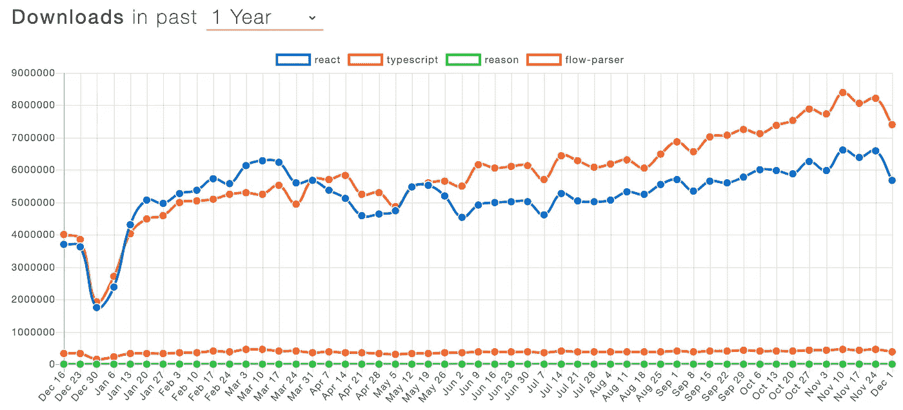

# 2019 年前端开发回顾

> 原文：<https://levelup.gitconnected.com/a-recap-of-frontend-development-in-2019-1e7d07966d6c>

## 回顾前端和 web 开发的重大事件、新闻和趋势

在过去的一年里，前端开发的世界再次快速发展，本文概述了 2019 年以来的所有重要事件、新闻和趋势。

# 2019 年流行前端框架和库的 NPM 下载

React 再次成为顶级库，并且仍在增长，jQuery 令人惊讶地保持在第二名。紧随其后的是 Angular 和 Vue 都有一个由热情的开发者组成的强大用户群。在过去的一年里，Svelte 受到了很多关注，但它仍在努力获得通过。

来自 npmtrends.com—[https://www . NPM trends . com/@ angular/core-vs-react-vs-vue-vs-jquery-vs-svelte-vs-backbone-vs-react-native](https://www.npmtrends.com/@angular/core-vs-react-vs-vue-vs-jquery-vs-svelte-vs-backbone-vs-react-native)

创建和维护一份简历并不有趣。而是让我们为你生成一份牛逼的简历:) [**简历生成器>**](https://gitconnected.com/resume-builder)

 [## 软件工程师简历生成器和示例| gitconnected

### 一份有价值的简历模板，使用您个人资料中的详细信息构建。从你的投资组合网站链接到你的简历或…

gitconnected.com](https://gitconnected.com/resume-builder) 

# WebAssembly 成为继 HTML、CSS 和 JavaScript 之后的第四种网络语言

在相当平静的一年后，WebAssembly 在 12 月初收到了一些重大消息——它被 W3C 联盟正式推荐为 web 语言。万维网联盟(W3C)是万维网的主要国际标准组织。

自 2017 年宣布 WebAssembly 以来，它已经获得了大量关注和快速采用。在前几年，我们看到 1.0 规范在所有主流浏览器中被创建和集成。

2019 年 WebAssembly 的另一个消息是[字节码联盟](https://bytecodealliance.org/articles/announcing-the-bytecode-alliance)的成立，该联盟看起来“通过合作实施标准和提出新标准来打造 WebAssembly 在浏览器之外的未来”。

我们仍在等待 WebAssembly 真正站稳脚跟并获得大规模采用，随着每次更新，我们离目标越来越近。毫无疑问，W3C 声明对于公司来说是一个巨大的进步，我们需要继续降低使用 WebAssembly 的门槛，使产品更容易用它来构建。

# TypeScript 的使用激增——许多开发人员坠入爱河

2019 年是打字稿年。不仅 TypeScript 已经成为向 JS 代码添加数据类型的实际选择，许多开发人员也经常选择在个人项目和工作中使用它而不是普通的 JavaScript。

在 2019 年初发布的 [StackOverflow 调查](https://insights.stackoverflow.com/survey/2019#most-loved-dreaded-and-wanted)中，TypeScript 与 Python 并列第二，是最受欢迎的语言，仅次于 Rust。在 2020 年初发布的新调查中，看到 TypeScript 攀升得更高并不奇怪。

TypeScript 已经占据了 web 开发世界——包括前端和后端。一些开发人员试图将 TS 视为一种时尚，并认为它会像 Coffeescript 一样，但 TypeScript 已被证明解决了 JS 开发人员的一个核心问题，并且似乎只会越来越多地被使用。

TypeScript 通过集成所有主要的文本编辑器为 web 开发人员提供了更好的开发体验。JavaScript 开发人员将 TypeScript 视为一种工具，这种工具可以减少错误，同时也更易于阅读代码，因为类型和对象接口提供了自我文档。

值得注意的是，随着 TypeScript 在 2019 年通过 NPM 下载量的 React，它变得多么受欢迎。它的下载量也远远超过了 Flow 和 Reason 等竞争对手。

> T ypeScript 和 React 解决完全不同的问题，所以这并不意味着直接的比较。这只是 TypeScript 受欢迎程度的一个证明。

[TypeScript v3.0](https://github.com/microsoft/TypeScript/releases) 于 2018 年末发布，到 2019 年已经发布了 3.7 版，其中包括更新的 ECMAScript 功能，如可选的链接和 nullish 运算符，以及对类型检查功能的改进。

 [## 学习 TypeScript -最佳 TypeScript 教程(2019) | gitconnected

### 怎么才能赚到因果报应？TypeScript 是 JavaScript 的超集，它向核心 JS 语法添加了可选的静态类型…

gitconnected.com](https://gitconnected.com/learn/typescript) 

# React 继续领先，而 dev 被钩子消耗

Vue 和 Angular 拥有热情的用户，在 GitHub stars 中 Vue 甚至超过了 React，但在个人和专业项目中，React 继续保持着强大的领先优势。

2018 年末，React 团队推出了 hooks。2019 年，hooks 消费了 React 世界，绝大多数开发人员将它们作为管理状态和组件生命周期的首选方式。在这一年中，有无数关于钩子的文章，模式开始固化，最重要的 React 包构建了自定义钩子来公开它们库的功能。

钩子提供了一种使用简单明了的语法在功能组件中管理组件状态和生命周期的方法。此外，React 提供了构建定制挂钩的能力，这允许我们创建可重用的代码和共享逻辑，而无需创建更高阶的组件或使用渲染道具。

如果我们看看 2019 年 JS 调查的[状态，我们会看到 React 仍然占据榜首:](https://2018.stateofjs.com/front-end-frameworks/overview/)

 [## 学习 React —最佳 React 教程(2019) | gitconnected

### 怎么才能赚到因果报应？React 是一个现代 JavaScript 库，前端 web 开发人员使用它来构建用户界面…

gitconnected.com](https://gitconnected.com/learn/react) 

# React 核心团队转向关注开发人员的体验和工具，以提高我们的工作效率

在 React v16.8 中大量增加钩子之后，在 2019 年发布到 16.14 版本时，后来的大多数变化都相对较小。

在巨大的钩子发布之后，React 团队将他们的注意力转移到通过提供更多的工具来改善开发者的生活。事实上，开发者体验是 React Conf 2019 的主题。React Conf 的主题发言人和 React 团队的经理[状态的文字编辑器使用情况:](https://medium.com/u/b103e28db223#text_editors)

# Webpack 5 进入测试版，即将发布

Webpack 已经成为几乎所有现代 JavaScript 工具链的核心组件，并且是最常用的构建工具。Webpack 一直在不断改进其性能和可用性，使其更适合开发人员。在第 5 版中，Webpack 关注以下几点:

*   通过持久缓存提高构建性能
*   用更好的算法和默认值改进长期缓存
*   清理内部模式，而不创建任何破坏性的更改

# Jest 从流程转移到打字稿

脸书维护着流行的测试库 [Jest](https://jestjs.io/) 和 [Flow](https://flow.org/) ，后者是 TypeScript 的竞争对手。2019 年初，他们发表了一份大胆的声明，选择将 Jest 从 Flow 迁移到 TypeScript。这进一步表明 TypeScript 已经成为类型化 JavaScript 的标准选择，并且在 2020 年及以后的使用中只会有所增长。

# Chrome 将于 2019 年发布稳定版本 72-78

Chrome 继续快速迭代，迅速向网络和开发者工具添加新功能。2019 年，我们看到了 7 个稳定版本的发布，其中 79 个版本处于测试阶段，80 个版本处于开发阶段，81 个版本处于 canary 阶段。查看下面的 Wiki，了解 Chrome 在过去一年中显著增加的内容。

 [## 谷歌 Chrome 版本历史

### Google Chrome 是由 Google LLC 开发的免费网络浏览器。开发过程分为不同的…

en.wikipedia.org](https://en.wikipedia.org/wiki/Google_Chrome_version_history) 

# 微软 Edge 浏览器转向 Chromium，创建了新的徽标

Internet Explorer 和它的新版本 Edge 对 web 开发人员来说是一个笑话，更糟糕的是，使用起来非常痛苦。浏览器在 web 特性的实现上总是落后，而且众所周知很难编写跨浏览器兼容的代码。微软选择使用谷歌的开源 Chromium 引擎，这对开发者来说是一个巨大的胜利。2019 年年中，这一变化达到了测试阶段。

# 脸书发布了 Hermes，一个用于 Android 的 JavaScript 解析器，以改进 React Native

脸书认为 Android JavaScript 引擎不够快，所以他们自己开发了引擎。脸书全力支持 React Native，这一举动表明他们愿意做出必要的调整，使其在所有平台上尽可能有效地工作。

 [## 见见 Hermes，一个为 React Native 优化的新 JavaScript 引擎 React Native

### 上周在 Chain React 上，我们宣布了 Hermes，这是我们在脸书开发的一个开源 JavaScript 引擎。这是…

facebook.github.io](https://facebook.github.io/react-native/blog/2019/07/17/hermes) 

# 对 2020 年的预测

*   随着代码拆分和 PWAs 的进一步利用，性能仍然是 web 最重要的方面。
*   WebAssembly 变得越来越常见，看到了真正的采用，并在产品中使用。
*   GraphQL 在新创公司和新项目方面超过 REST，而老牌公司则进一步向它转移。
*   TypeScript 成为新创业公司和项目的默认选择。
*   我们开始看到真正的应用程序建立在没有服务器的区块链上，使得网络更加开放。
*   CSS-in-JS 可能会成为默认的样式方法，而不是普通的 CSS。
*   “无代码”应用变得更加流行。随着人工智能的改进和应用程序的更多抽象层，构建应用程序变得越来越容易。2020 年，我们可能会看到无需编写代码就能创建应用程序的显著转变。
*   Flutter 可能会取代 React Native，成为构建跨平台移动应用的首选方式。
*   Svelte 将会看到更多使用该技术建造的真实项目。
*   [Deno](https://github.com/denoland/deno)(Node 的创建者搭建的 TypeScript 运行时)看实际使用。
*   AR/VR 使用像 [A-Frame](https://aframe.io/) 、 [React VR](https://facebook.github.io/react-vr/) 和 [Google VR](https://developers.google.com/vr/?hl=en) 这样的库，以及对浏览器中原生 AR/VR 工具的改进，取得了长足的进步。
*   集装箱化的影响(即 Docker，Kubernetes)在前端过程中变得更加普遍。

# 2019 年顶级前端文章和视频

> [**阅读本文**](/top-programming-articles-of-2019-fc23157fe066?source=friends_link&sk=772a85ff167ad4db7bb845933b890f3f) **获得 2019 年>** 顶级编程文章的综合列表

[Addy Osmani](https://medium.com/u/2508e4c7a8ec?source=post_page-----1e7d07966d6c--------------------------------) 向我们展示了 2019 年 JavaScript 的成本

 [## 2019 年 JavaScript 的成本

### 注意:如果你喜欢看演示而不是阅读文章，那么请欣赏下面的视频！如果没有，跳过视频…

v8.dev](https://v8.dev/blog/cost-of-javascript-2019) 

StackOverflow 开发者调查向我们展示了编程的趋势

 [## 2019 年堆栈溢出开发者调查

### 每个月，大约有 5000 万人访问 Stack Overflow 来学习、分享和建立他们的职业生涯。我们估计 21…

insights.stackoverflow.com](https://insights.stackoverflow.com/survey/2019) 

了解 Slack 如何使用现代 JavaScript 逐步重建他们的整个 UI

 [## 当重写不是:在桌面上重建松弛

### 马克·克里斯蒂安和约翰尼·罗杰斯

松弛工程](https://slack.engineering/rebuilding-slack-on-the-desktop-308d6fe94ae4) 

GraphQL 纪录片

[丹·阿布拉莫夫](https://medium.com/u/a3a8af6addc1?source=post_page-----1e7d07966d6c--------------------------------)提供了对`useEffect`的详尽解释

 [## 使用效果完全指南

### 你用钩子写了几个组件。甚至可能是一个小 app。你基本上满意了。你对 API 很满意…

反应过度了](https://overreacted.io/a-complete-guide-to-useeffect/) 

Ryan Dahl 让我们对 Deno 有了更多的了解

Eric Elliott 认为打字稿的好处不值得花力气

 [## 打字税

### 成本与收益分析

medium.com](https://medium.com/javascript-scene/the-typescript-tax-132ff4cb175b) 

他还向我们展示了一名 9 美元/小时的工程师如何让波音公司损失数十亿美元。

 [## 为什么削减成本是昂贵的:9 美元/小时的软件工程师如何花费波音数十亿美元

### 2018 年 10 月 29 日狮航 610 航班，一架 737 MAX 8 从印尼雅加达飞往印尼槟榔屿…

medium.com](https://medium.com/javascript-scene/why-cutting-costs-is-expensive-how-9-hour-software-engineers-cost-boeing-billions-b76dbe571957) 

主线是超负荷工作，报酬过低

了解 V8 JavaScript 引擎的技术细节，以及它如何在 React 中创造了性能悬崖。

 [## React 中 V8 性能悬崖的故事

### 之前，我们讨论了 JavaScript 引擎如何通过使用形状和内联来优化对象和数组访问…

v8.dev](https://v8.dev/blog/react-cliff) 

[Flavio Copes](https://medium.com/u/fe1c14f6cde?source=post_page-----1e7d07966d6c--------------------------------) 详细介绍了自 ES2015 大规模更新以来 JavaScript 的所有变化。

 [## ES5 到 es next——这是自 2015 年以来 JavaScript 增加的所有功能

### 我写这篇文章是为了帮助您从 ES6 之前的 JavaScript 知识起步，并让您快速熟悉…

medium.com](https://medium.com/free-code-camp/es5-to-esnext-heres-every-feature-added-to-javascript-since-2015-d0c255e13c6e) 

Ebay 将一个关键功能转换为 WebAssembly，并实现了巨大收益。

 [## 易贝的网络组装:一个真实的使用案例

### 从宣布之时起，WebAssembly 就在前端世界引起了巨大的轰动。网络社区随时…

tech.ebayinc.com](https://tech.ebayinc.com/engineering/webassembly-at-ebay-a-real-world-use-case/) 

Diana Adrianne 仅使用 CSS 构建令人难以置信的肖像。

 [## 纯 CSS 油画-由戴安娜史密斯又名尚哈洛

### 一个正在进行的系列，其中我只使用 CSS 和 HTML 创建艺术。专为 Chrome 打造。

diana-adrianne.com](https://diana-adrianne.com/purecss-lace/) 

Rodrigo Pombo 向我们展示了如何建立我们自己的 React。

 [## 建立你自己的反应

### 我们将从头开始重写 React。循序渐进。遵循真实 React 代码的架构，但是…

pomb.us](https://pomb.us/build-your-own-react/)  [## 组合 API —轻松发展您的编码事业| gitconnected

### 消除在每个单独位置手动更新您的详细信息的痛苦。只需在您的中更改一次数据…

gitconnected.com](https://gitconnected.com/portfolio-api) 