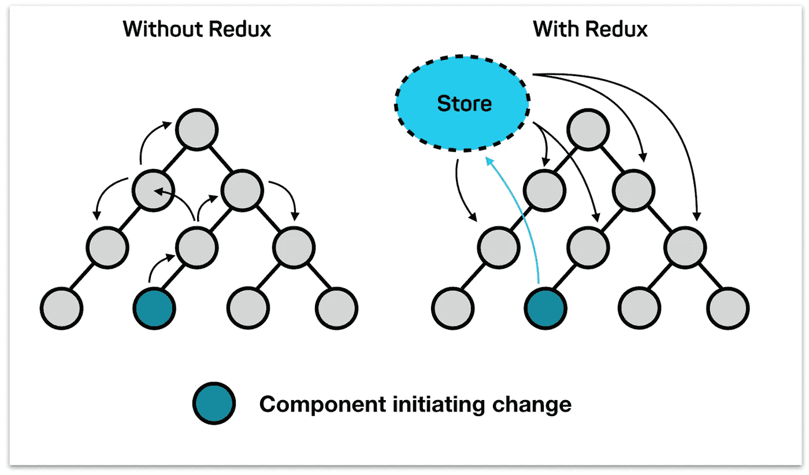
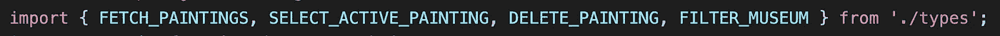
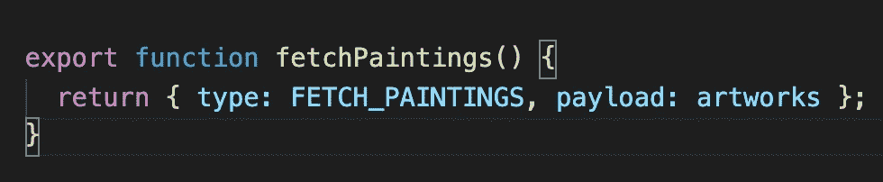
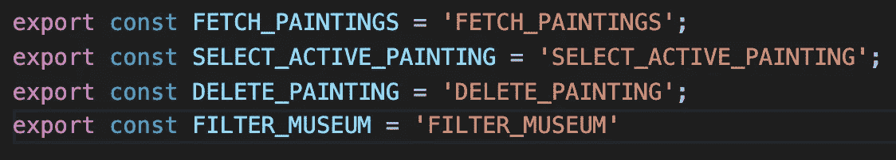
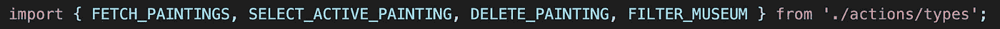
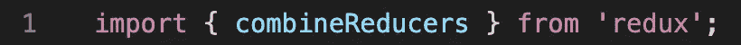
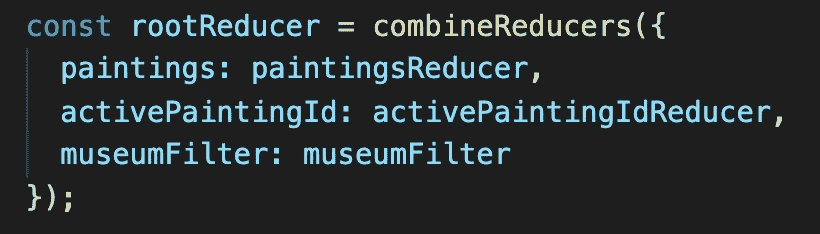
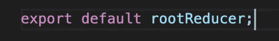
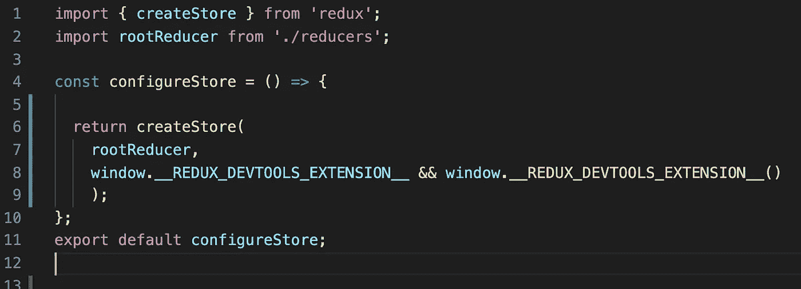

# Redux 的简化解释。(减少器、动作和存储)

> 原文：<https://levelup.gitconnected.com/a-reduced-explanation-of-redux-reducers-actions-and-store-9b7819c5d064>

## 介绍

当我在钻研 Redux 的时候，我认为写这篇博客有两个目的是个好主意，边写边学，也许还能帮助其他程序员理解这个概念。起初这很奇怪(就像我学到的所有编程知识一样)，但实际上非常简单。因此，没有进一步应有的让我们深入了解 Redux 的力量。

## Redux 的威力到底有多大？

所以如果你以前用过 React，你就会知道有一种东西叫做状态。这个“状态”是一个非常有用的工具，用于管理我们希望在组件中显示或使用的某些东西，要在子组件中使用这个状态，我们必须以道具的形式传递它。这可能会变得有点乏味，你必须多次向下传递它，计算机必须多次向上移动到它的父组件才能改变状态。

所以 Redux 在这里可以在一个地方管理状态！使用 normal React，应用程序中的状态可以通过许多组件传递，这使得简单的状态更改有时成为一项有点繁重的任务。也许你有一个状态，它必须移动 10 次到子组件来改变状态，那么这个过程将会一直移动 10 次回到这个状态，然后改变它。有了 Redux，状态可以存在于一个叫做“store”的地方。商店将托管所有的状态，这样无论何时调用状态的更改过程都只是一个单步过程，并且您可以从应用程序的任何组件访问状态，这使得应用程序更加动态和快速。我们将在几个段落中了解更多关于商店的内容。

 [## 星球大战中西斯力量的复仇

### 发现并与你认识的每个人分享这张星球大战 GIF。GIPHY 是你搜索、分享、发现和创建 gif 的方式。

media0.giphy.com](https://media0.giphy.com/media/3o84sq21TxDH6PyYms/giphy.gif) 

## 行动

动作是负责定义状态变化的对象，它们是 JS 对象，带有一个`type`键和一个`payload`键，前者包含要执行的动作的名称，后者包含用于操作状态的内容。

例如:

`./src/actions/functionActions`

所以这里我们用我们的“type:”键和“payload:”键来定义我们的动作函数。哇哦！`FETCH_PAINTINGS`到底是从哪里来的？所以`FETCH_PAINTINGS`实际上就是一个字符串，它被导出并保存在另一个文件夹的常量中。最佳实践是将保存在不同文件夹中的类型键值分开，一个文件夹定义了 action 函数，另一个文件夹用于将类型键值保存为常量。

就像这样:

`./src/actions/constants`

但是我们为什么要这么做呢？将类型键值设置为函数动作中的字符串不是更容易吗？嗯……的确是！但是有一个问题，当我们在下一部分学习减速器时，我们可以更好地理解这个问题。

## 还原剂

缩减器是一个将状态和动作作为参数的函数，负责根据具体的`action.type`改变当前状态。Reducers 是纯函数，这意味着如果给定相同的输入，它们将总是返回相同的输出。在 reducer 函数中，检查动作类型，根据动作类型，会发生不同的状态突变。

像这样:

`./src/reducers`

这里我们可以看到，我们正在声明一个名为`paintingsReducer`的新函数，那么它在做什么呢？它把两个东西作为论点:一个状态，和一个动作。注意，我们在顶部导入了动作类型值常量。这里是我们之前定义的动作将被使用的地方。在函数内部，我们可以看到一个`switch`语句评估不同的动作类型并返回不同的状态值，所以这就是为什么将我们的类型保存为保存的常量而不是字符串很重要。如果你给它一个未声明的变量，React 会给你一个错误，但如果你的字符串有一个错别字，它不会给你一个错误，所以你可能不会得到你所期望的，不知道为什么，也许你需要一段时间来找到错别字，与变量的错误可以直接指向你的错误。

减速器是纯函数；纯函数是给定相同输入将总是返回相同输出的函数。Reducers 负责查看动作类型并适当地改变状态。那么状态实际上是如何改变的呢？

首先我们需要一个`rootReducer`常量来存储状态。这个根 reducers 调用了一个从 redux 库中导入的方法，那么这看起来像什么呢？像这样:

`./src/reducers`

所以我们正在导入我们的`combineReducers`方法，并且在我们的常量`rootReducer`中使用它。这个方法允许我们将状态设置为 reducer 函数的返回值，所以请注意，有一个名为`paintings`的键被设置为我们之前定义的`paintingsReducer`方法。从现在开始，每次我们调用我们的`paintingsReducer`缩减器时，无论我们得到什么返回值，它都将被存储在一个名为`paintings`的状态中。

## 商店

存储基本上是保存状态的空间。商店是用从 Redux 库中导入的名为`createStore`的函数创建的。这个函数返回一个新的商店。按照惯例，在这种情况下，最好将新的`createStore`函数放在一个名为`configureStore`的单独文件中。

`./src/configureStore`

这个`createStore`方法接受一个我们之前定义的`rootReducer`参数，这个参数是从我们的 reducers 文件导入的。那么我们实际上如何改变状态呢？我们甚至如何启动这些“动作”和“缩减器”来设置新的状态。

我们将不得不导入我们希望在文件中使用的动作，我们希望使状态改变，然后我们添加我们选择的事件，并将有效负载作为参数传递。但这还不是全部，我们还需要在文件的底部有一个 connect 函数，它将负责从事件中分派动作调用，并将其发送到 reducers 文件，在那里它将采取行动将类型与 reducer 方法进行比较，并返回新的有效载荷。然后，当这个 reducer 方法被触发时，`rootReducer`函数将再次触发，保存新的状态值。

## 结论

Redux 是一个帮助我们在一个单独的位置管理状态的工具，允许我们从任何组件改变它，而不必将它作为道具传递给子组件。编码快乐！