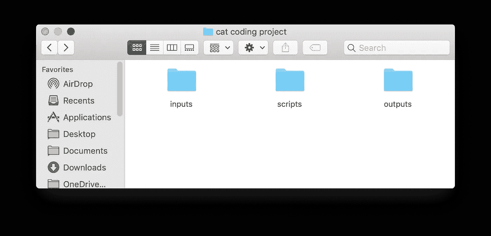

# 一个普通工程师对 Git 的介绍

> 原文：<https://levelup.gitconnected.com/a-regular-engineers-introduction-to-git-48eac71a8668>

我想介绍一下在我的小团队共享数据、文档和代码的项目中使用 Git 的想法。我提出这个选项，而不是通过电子邮件发送电子表格，或者将脚本和文档文件放入共享驱动器。我希望到最后*你能明白为什么*你应该使用 Git，但这里不会解释*如何*使用 Git。参见我的[Git 快速启动和运行指南](https://medium.com/@amandadsmith/quick-guide-to-getting-up-and-running-with-git-3e5c9ffab04d)或谷歌“Git 教程”,获得近 5 亿个选项。

谁是“正式”工程师？我只是指任何不是软件工程师的人。(为什么暗示软件工程师不正规？因为和我一起工作过的人都是脸皮厚的讨人喜欢的人，所以很自然地，我不得不挑他们的毛病。)这个介绍也适用于普通科学家，即任何不是数据科学家的人。

Git 是什么？Git 是一个版本控制系统，这意味着它允许您在一个项目上工作，文件将随着项目的发展而改变、增长和收缩，同时能够根据需要访问不同的版本。一些文件将被添加，一些将被删除。在 Git 中管理的任何文件都可以被任何人在他们自己的机器上编辑，只要他们能够访问同一个 Git 存储库。

现在我们来看关键的部分。Git-scm.com 网站(一个很好的资源)是这样解释的:

> Git 的特性真正使它从几乎所有的 SCM 中脱颖而出的是它的分支模型。
> 
> Git 允许并鼓励您拥有多个完全相互独立的本地分支。

这可能用一个例子更有意义。

# 例如:阿曼达的猫在一个项目中工作

显然这是虚构的。偶尔在沙发上共处是他们现实生活中合作的程度。

左:罗素(同名:伯特兰·罗素)；右:莱拉(同名:莱拉贝拉奎亚/银舌)

他们首先在自己的计算机上克隆一个存储库。这只是意味着他们得到了完全相同的文件夹和相同的一包东西。他们正在使用这个目录，该目录有几个子目录保存输入文件、代码文件和输出文件:

卡特彼勒编码项目库

每个人都将从这个公共代码库派生出他们的工作，我们称之为主分支。

**罗素的分支**

Russell 将在他的个人计算机上处理这个项目，所以他从主分支开始，但是使用它来创建一个包含他的工作的新分支，他将其命名为 russell-fixes-it-all。

他进入脚本目录，打开一个名为 choose_best_cat.py 的文件。他想，嘿，这是一个简单的脚本，他填写代码:

Russell 在 russell-fixes-it-all 中编辑后选择 _best_cat.py

然后，他进入输入目录，添加一个他们的项目需要的输入文件:cat_descriptions.txt

Russell 在 inputs 子目录中创建了新的文本文件

**莱拉的分支**

莱拉也在自己的电脑上创建了自己的版本。她称自己的分店为“莱拉最擅长修理”。

莱拉*也*进入脚本目录并打开 choose_best_cat.py。不出所料，她的变化看起来有些不同:

在 Lyra 在 lyra-fixes-it-the-best 中编辑它之后，选择 _best_cat.py

然后，她进入输入目录，从她的桌面上拖动一个文件，她希望将这个文件添加到他们的项目中:cat _ characteristics.csv

Lyra 向 inputs 子目录添加了新的 csv 文件

**走到一起**

拉塞尔和莱拉可以在自己的分支机构里继续愉快地在自己的机器上工作，没有问题。但是当他们需要走到一起的时候会发生什么呢？他们可能希望他们的变更成为主分支的一部分。Russell 可以通过创建来请求使*他的*分支成为*新的*主分支，如果你使用 Github，你可以称之为“拉请求”,如果你使用 Gitlab，你可以称之为“合并请求”。同样的想法。他实际上是在说，这是我的东西，让我们都从这些东西开始前进。

那么如果他的代码被合并，成为新的主分支，会发生什么呢？

1.  任何一个使用 master branch 的人都会发现“罗素是最好的猫！”(而天琴座分支里的 choose_best_cat.py 代码还是会说“天琴座是最好的猫！”)
2.  使用新主分支的任何人也可以访问 cat_descriptions.txt。

然后当莱拉想把她的分支并入师父时会发生什么？如果她的分行在 Russell 的分行合并后被合并:

1.  Git 会识别 choose_best_cat.py 是不同的，它可以显示不同的确切行。如果她的合并请求得到批准，她的代码被合并，这意味着她的版本成为主版本，任何从 *new new* master 分支运行 choose_best_cat.py 的人都会发现“Lyra 是最好的猫！”
2.  Git 会意识到她已经向输入目录添加了另一个文件，任何打开输入文件夹的人都会看到 cat_descriptions.txt 和 cat _ characteristics.csv。

russell-fixes-it-all 和 lyra-fixes-it-the-best 分支合并到 master 之后的输入子目录

所以他们能够同时处理相同的文件，做出不同的改变。最酷的是 Git 软件通过其分支模型支持他们这样做。当分支需要走到一起时，他们有一个有组织的过程来查看不同之处，以及一个有组织的过程来请求将更改合并到主分支中，然后在主分支中实际实现这些更改。如果他们需要回到以前的版本，他们还可以选择点击倒带。

# Git 开始

所有的工程师都会说双关语，很抱歉。

你被卖了吗？准备好开始了吗？想要确保您的项目工作不会再涉及到搜索您的垃圾箱文件夹中的 output file _ v4 _ 04042020 _ BS _ apr 16 _ my edits-revised . extension？

太好了。这是我最新更新的使用 Git 的快速指南。一路平安！