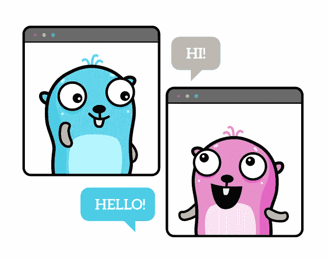
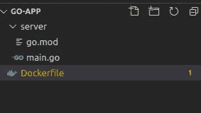
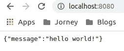

# 一只生活在码头的宁静的地鼠

> 原文：<https://levelup.gitconnected.com/a-restful-go-living-in-docker-14f06fdedd28>

## 权威指南

## 一个简单的权威指南，供初学者构建一个 REST API 并在 docker 容器中运行



[https://github.com/MariaLetta/free-gophers-pack/](https://github.com/MariaLetta/free-gophers-pack/)

Go 编译器可以生成一个二进制文件，该文件可以在任何机器上运行。然而，有时候将你的应用程序容器化会更方便，本教程将帮助你构建一个基本的 RESTFul API 内置 go 并将其容器化。

# 在 Go 中构建 Web 服务器

我们将编写一个简单的 Go 应用程序，在给 URI 打电话时公开一个简单的问候。为了首先构建它，我们将创建一个文件夹，假设我们称它为`go-app`，它是我们将要编写的所有后端代码的目录。最终的文件夹结构将如下所示



接下来，我们将创建一个 [Go 模块](https://blog.golang.org/using-go-modules)，它是存储在文件树中的 [Go 包](https://golang.org/ref/spec#Packages)的集合，文件树的根是`go.mod`文件，但是在服务器文件夹中运行命令

```
cd go-app
go mod init go-app
```

现在，我们将创建一个非常简单的服务器来处理 HTTP 请求。为此，我们将创建一个名为`main.go`的新文件，并将下面的代码片段包含到该文件中

```
package main
​
import (
    "fmt"
    "log"
    "net/http"
)
​
func main() {
    http.HandleFunc("/", hello)
    fmt.Println("Server started")
    log.Fatal(http.ListenAndServe(":8080", nil))
}
​
func hello(w http.ResponseWriter, r *http.Request) {
    w.WriteHeader(http.StatusOK)
    w.Header().Set("Content-Type", "application/json")
    w.Write([]byte(`{"message":"hello world!"}`))
}
```

如果我们通读这个文件

# main()函数

`main()`功能作为可执行程序的入口点。它不接受任何参数，也不返回任何内容，当您执行程序时，Go 会自动调用该函数

在 main()函数中，`HandleFunc`调用告诉 HTTP 包用我们的`hello`函数处理所有对 webroot(“/”)的请求。当程序控制到达`http.ListenAndServe`时，指定我们的代码应该监听端口`8080`

如果我们现在运行命令`go run main.go`并在 web 浏览器上导航到`localhost:8080`，我们应该会看到类似这样的内容。



现在，我们有了一个基本的 Go 应用程序，用于响应 URL `http://localhost:8080`现在，下一个任务是构建一个 docker 映像，并在一个容器中运行我们的应用程序。为此，在项目根目录下创建一个名为 Dockerfile 的文件，并粘贴以下内容

```
FROM golang:1.17.5 AS GO_BUILD
ENV CGO_ENABLED 0
COPY . /go-app
WORKDIR /go-app
RUN go build -o serverFROM alpine:3.15
WORKDIR /go-app
COPY --from=GO_BUILD /go-app/server /go-app/server
EXPOSE 8080
CMD ["./server"]
```

docker 文件中每一行背后的推理

这个文档中有两件重要的事情:

1.  这个文件使用了 Docker 中的 Docker [多阶段构建](https://docs.docker.com/develop/develop-images/multistage-build/)，这只是一种说法，我们可以构建同一个文件中定义的多个 Docker 映像。在这个场景中，我们使用一个图像来构建我们的 Go 应用程序，使用另一个图像来运行它。
2.  下一个是关于缓存的。为了加快构建过程， [Docker 缓存 Docker 文件](https://docs.docker.com/develop/develop-images/dockerfile_best-practices/#leverage-build-cache)中每一行的结果。行的顺序在 Order 文件中很重要，通常你应该在 Order 文件中执行那些不经常改变的动作，而不是那些经常改变的动作。

`FROM golang:1.17.5 AS GO_BUILD`确保 Docker 将[官方 Go 图像](https://hub.docker.com/_/golang/)作为基础图像。在这种情况下，我们使用标签`1.17.5`。我们将生成的图像标记为`GO_BUILD`

`WORKDIR /go-app`设置工作目录。

`COPY . /go-app`复制内容结束

`RUN go build -o server`将你的应用编译成二进制文件

`FROM alpine:3.15`使用 alpine 作为我们的跑步者图像，我们的 GO 应用程序将在其中运行

`COPY --from=GO_BUILD /go-app/server /go-app/server`将之前构建的二进制文件复制到映像中

`EXPOSE 8080`通过端口 8080 公开应用程序

`CMD ["./server"]`设置容器运行时运行的默认命令

要构建 docker 映像，请在项目根目录下执行以下命令

```
docker build -t api .
```

这将构建一个名为`api`的 docker 映像，要运行这个映像，请执行下面的命令

```
docker run -it -p 8080:8080 api
```

# 结论

现在，您已经知道如何创建 Restful Go API，并将您的应用程序封装到生产就绪映像中。