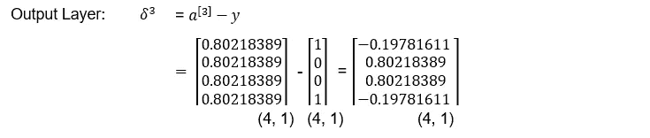

# 用于训练神经网络的数学综述

> 原文：<https://levelup.gitconnected.com/a-review-of-the-math-used-in-training-a-neural-network-9b9d5838f272>

人工神经网络(ANN)是一种机器学习建模技术，它使用人脑的概念来构建可以学习解决问题的计算机程序。本文解释了训练神经网络所涉及的计算。

# 结节

人工神经网络由组织成层的互连节点组成。节点就像人脑中的神经元一样，是神经网络的基本构建模块。图 1 显示了一个节点。节点从输入层的数据或其他节点的输出接收输入，称为激活。节点的每个输入都与权重(w)相关联。权重表示输入对节点的影响的大小。该节点计算输入的加权和，然后应用激活函数(下面解释)来确定该节点的输出。

**图一。神经网络节点**

# 激活功能

在神经网络中，激活函数是输入值的非线性变换，这是实现复杂任务建模所必需的。如图 1 所示，输入的加权和

是线性变换。这个线性值 z 然后通过非线性的激活函数 f(z)。在机器学习领域，通常使用几种激活函数，如 Sigmoid、TanH、ReLU 和 Softmax。图 2 显示了一个 sigmoid 函数，它将线性值转换为 0 到 1 之间的值。

**图二。乙状结肠功能**

# 损失函数

神经网络中的损失函数测量估计值与实际值的偏差。通过最小化总损失值来获得最佳模型参数(权重)。使用的损失函数取决于模型的目标。如果目标是预测，常用的损失函数是均方误差(MSE)。

其中 y 是真实值，ŷ是预测值。

如果目标是分类，则二进制交叉熵损失函数用于二进制类别，交叉熵损失函数用于多类别分类。

其中 k 是类的数量

# 神经网络

我们将建立一个简单的神经网络，根据两个预测变量(身体质量指数(体重指数)和年龄)对一个人是否患有糖尿病进行分类。因为这里的目的是显示计算，我们将使用一些虚拟数据，如表 1 所示。

**表 1。输入数据**

简单的神经网络由三层组成:输入层、隐藏层和输出层。图 3 示出了一个简单的神经网络，其将用于基于表 1 中的输入数据对一个人是否患有糖尿病进行分类。由于这是一个分类问题，我们将使用 sigmoid 激活函数和二元交叉熵损失函数。

**图三。简单神经网络**

目的:对一个人是否患有糖尿病进行分类

问题类型:分类

特征数量(d): 2

观察数量(n): 4

隐藏层数:1

层数:3

激活功能:乙状结肠

训练神经网络包括以下步骤:

1.初始化权重

2.正向传播

3.反向传播

1.  **初始化权重**:我们先用 0 到 1 之间的小随机数初始化权重。

2.**正向传播**:这个过程包括计算隐藏层和输出层中所有节点的输出，从输入层遍历到输出层。每个节点的计算分为两步:

I .求 z = aw。这是激活和权重的线性函数。

二。对 z 应用 sigmoid 激活函数。

详细情况如下所示:

(矩阵下方括号中的数字表示尺寸。)

**Delta(误差)**

这为我们提供了一组新的权重，然后用于计算预测 ŷ和相应的损失值。正向传播、反向传播和权重更新的整个过程是一个迭代过程，一直持续到损失收敛到最小值。当达到最小损失时，相应的权重是最优的。

在建立神经网络模型的过程中涉及到许多决策。本文的目标是展示训练网络所涉及的计算，以便学习神经网络的人可以更好地理解所涉及的计算。我强烈推荐吴恩达教授的关于机器学习的课程。你也可以看到我的 [github](https://github.com/dagarwal98/machinelearning) 资源库，里面有关于机器学习的几个主题的完整代码。

**参考文献**

安德鲁。“机器学习。” *Coursera* ，[www.coursera.org/learn/machine-learning/home/welcome.](http://www.coursera.org/learn/machine-learning/home/welcome.)

安德鲁。"深层 L 层神经网络——深层神经网络." *Coursera* ，[www . Coursera . org/learn/neural-networks-deep-learning/lecture/7 dp6e/deep-l-layer-neural-network。](http://www.coursera.org/learn/neural-networks-deep-learning/lecture/7dP6E/deep-l-layer-neural-network.)