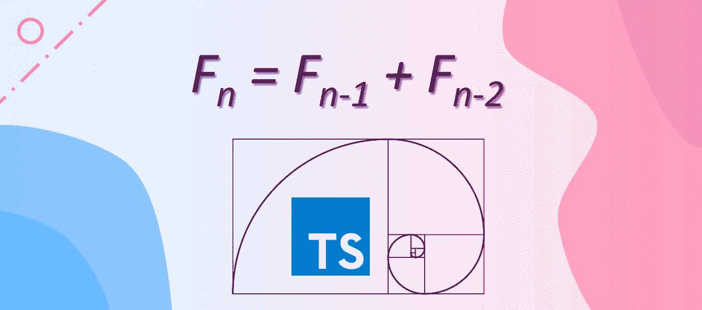
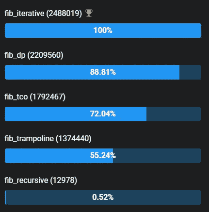
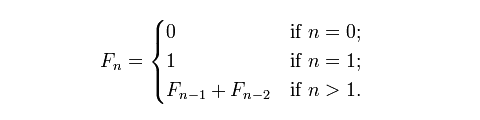
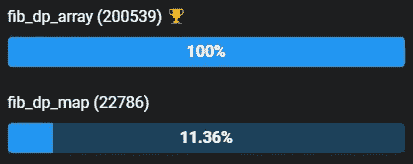

# 关于递归的再思考

> 原文：<https://levelup.gitconnected.com/a-second-thought-on-recursion-6575efeb2934>

## 递归:一个常见的面试问题



在本文中，我们将探索在 JavaScript/TypeScript 中计算斐波那契数的各种方法。编程技术包括*递归函数*、*尾调用优化(TCO)* 、*蹦床*、*迭代函数*、*动态编程*、*记忆化*。

本文的目标是让您相信在 JavaScript/TypeScript 中通常应该避免递归函数。相反，我们可以使用等价的迭代函数来获得更好的性能。此外，我们应该考虑使用内存化来提高重复请求的运行时性能。

如果您不想通读本文的其余部分，那么您应该看看下面的截图，它显示了一组计算斐波纳契数 *F₂₀* 的函数的基准测试结果。



计算斐波那契数 F(20)的一组函数的基准等级。基准测试[链接](https://jsben.ch/XVrhn)。

从基准测试结果中，我们可以看出递归函数的性能最低。即使像 TCO 和 Trampoline 这样的技巧可以加速递归，它们仍然比迭代函数和使用自底向上循环的动态编程要慢。

好吧。让我们深入研究计算斐波纳契数的不同实现。

# 递归函数

一个*递归函数*是一个调用自己直到不调用为止的函数，这种编程范式被称为*递归*。在一些计算机科学入门课上，教授们经常使用递归函数来教授排序算法、动态编程等等。

递归的一个著名例子是斐波那契数的计算。



斐波那契数

直观地说，我们可以使用下面的函数计算斐波那契数。

这个递归函数模仿了数学公式，非常简洁易懂。你可能经历过许多要求你使用递归的编码面试或编程实践，因为递归是一个重要的编程概念，递归地解决问题显示了你将大问题分成小步骤的能力。因此，如果你需要为面试做准备，那么理解递归是如何工作的是很重要的，并确保你大量练习，以便能够编写优雅的递归函数。

然而，除了面试和实践的场景之外，递归函数很少出现在产品代码中，这可能是由于几个问题。递归函数的一个问题是指数时间复杂度。如果我们使用上面的函数来计算 *F₆₀* ，那么代码可能会冻结，因为它是如此的低效。

另一个常见的问题是臭名昭著的“*过多递归*”异常([链接](https://developer.mozilla.org/en-US/docs/Web/JavaScript/Reference/Errors/Too_much_recursion))。当这个异常发生时，不同的浏览器显示不同的错误信息，见下文。

```
Error: Out of stack space (Edge)
InternalError: too much recursion (Firefox)
RangeError: Maximum call stack size exceeded (Chrome)
```

当有太多的函数调用，或者函数缺少基本用例时，就会发生这种异常。在递归过程中，每个函数调用都会向[调用堆栈](https://developer.mozilla.org/en-US/docs/Glossary/Call_stack)添加一个新的堆栈帧。如果递归超过最大调用堆栈大小，那么将引发“堆栈溢出”错误。

所以递归函数不仅速度慢，而且在计算比较密集的情况下也不实用。有时，人们倾向于使用一些技巧，如尾调用和蹦床，来规避“堆栈溢出”错误。

# 尾部调用优化

[尾调用](https://en.wikipedia.org/wiki/Tail_call)是作为程序的最终动作执行的子程序调用。在递归中，尾部调用将导致同一子例程在调用链中稍后被再次调用；这种类型的递归通常被称为*尾递归*或*尾递归*。尾递归的特征是:(1)它有一个可以退出调用栈的基例；(2)它只有一个子例程，该子例程从以前的调用中结转一些数据。下面是一个计算斐波那契数列的尾部调用函数的例子。

记住，常规递归很难计算 F₆₀.相反，上面的尾部递归函数能够轻松确定 *F₁₄₇₆* ，它是 JavaScript 中正数`Infinity`之前的最后一个斐波那契数。性能提高是因为与常规递归函数相比，尾部调用不需要那么多堆栈帧。

在**常规递归**中，函数首先执行递归调用，直到基本情况，然后根据所有递归调用的返回值计算结果。在这个范例中，需要每个调用帧来获得最终结果。另一方面，在**尾递归**中，函数在进行递归调用的同时执行计算，直到到达基例并返回最终结果。每个尾调用都将结果传递给下一个递归步骤，因此它的堆栈帧可以从调用堆栈中释放。

综上所述，尾递归相对安全，比常规递归快得多。如果你真的想写递归函数，那么你必须实现 TCO 来避免麻烦。

# 蹦床

一个[蹦床函数](https://en.wikipedia.org/wiki/Trampoline_(computing))是一种*高阶函数*，它返回一个包装函数，而不是直接执行函数。trampoline 函数的目的是以迭代的方式控制执行，以便在任何给定时间只有一个堆栈帧被添加到调用堆栈中。

我们可以将尾部调用函数稍微修改成一个`_fib`函数，返回一个带有结转参数的函数。然后我们利用一个`trampoline`函数来计算斐波那契数。下面的代码片段显示了一个示例实现。

`trampoline`函数将递归函数`fn`包装在一个循环中，并返回一个新函数。我们将递归函数`_fib`作为`trampoline`函数中的`fn`传入，其中`_fib`函数作为新函数被递归调用和解析，直到`_fib`返回值。

尽管 trampoline 函数可以解决“堆栈溢出”问题，但由于包装和调用函数以及绑定函数参数等过程，它的时间开销非常大。此外，在读者掌握蹦床之前，可读性比尾部递归差。所以在采用这个花哨的蹦床函数解决递归问题之前，我们需要三思。最有可能的是，我们会发现迭代方法是救命稻草。

# 迭代函数

迭代函数是使用循环多次重复相同过程的函数。一般来说，递归函数更易读、更简洁，但是迭代函数也更易读，因为循环是最简单的编程概念，即使对于初学者来说也是如此。

我们可以编写下面的函数来计算斐波那契数。

这个函数在计算斐波纳契数方面与 tail call 函数具有相同的能力。如开始部分的基准测试结果所示，这个迭代函数是所有函数中最快的，具有线性时间复杂度和恒定的空间复杂度。

注意还有很多优化技术可以让迭代更快( [link](https://www.nayuki.io/page/fast-fibonacci-algorithms) )，这里就不展开了。

# 动态规划

动态规划通常用于解决可以通过其子问题解决的问题。动态规划算法通常具有良好的可读性和简洁。动态编程函数通常在内存中使用一个对象来存储中间值。

我们可以使用下面的动态编程函数`fib_dp`以自下而上的方式计算斐波那契数。

函数`fib_dp`使用一个数组来跟踪它计算的所有斐波纳契数。动态编程函数比递归函数快，但由于数组存储的开销，比纯迭代函数慢。

我们可以将数组从函数`fib_dp`中取出，并将数组用作全局缓存。这种技术叫做 [*记忆化*](https://en.wikipedia.org/wiki/Memoization) ，在函数接收重复请求时，可以大大提高性能。因此，动态规划通常与记忆一起使用。

# 记忆化:数组与映射

在实际应用中，记忆被广泛采用。JavaScript/ TypeScript 有两种常见的记忆化方法:`[Array](https://developer.mozilla.org/en-US/docs/Web/JavaScript/Reference/Global_Objects/Array)`和`[Map](https://developer.mozilla.org/en-US/docs/Web/JavaScript/Reference/Global_Objects/Map)`。我们可以将动态编程函数重写为以下两个代码片段。

使用数组对象计算带记忆的斐波那契数

使用地图对象计算带记忆的斐波那契数

其中一个函数使用一个`Array`对象作为全局缓存，另一个使用一个`Map`对象。为了展示记忆化的好处，上面的代码片段通过计算从 0 到 999 的斐波那契数来测试性能，然后从 1000 到 1 反向计算它们。

正如你所料，它们非常快。基准测试结果如下所示。



使用数组和映射的记忆来计算 2000 个斐波那契数的基准等级。基准测试[链接](https://jsben.ch/RerI6)

在这种情况下，由于线性和连续的数组索引，使用`Array`对象作为全局缓存要优于`Map`对象。

经过长途跋涉，我们到达了本文的结尾。总而言之，我们的工具箱中有很多编程范例，对递归函数的重新思考可能会帮助您决定您想要采用哪种方法。

希望有帮助。感谢阅读。