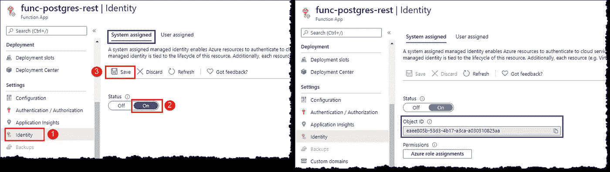
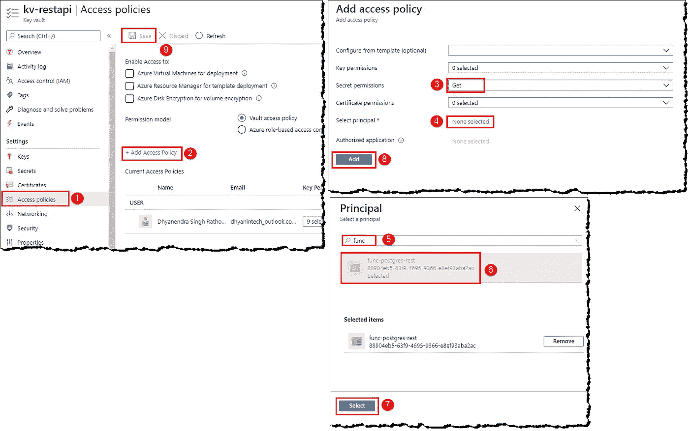
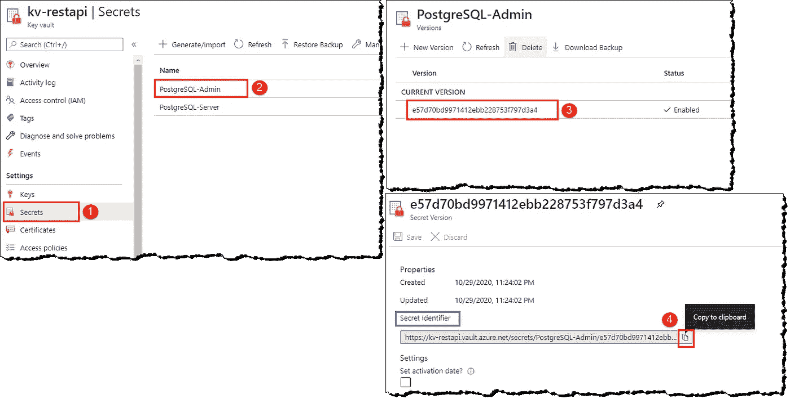
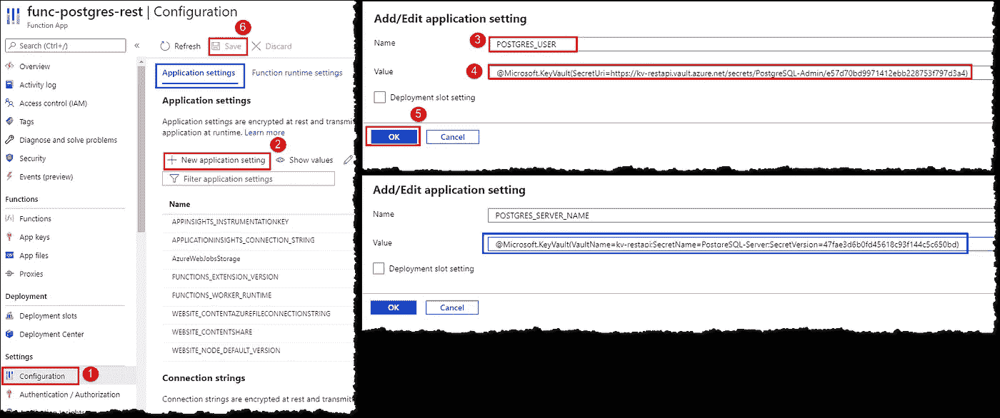
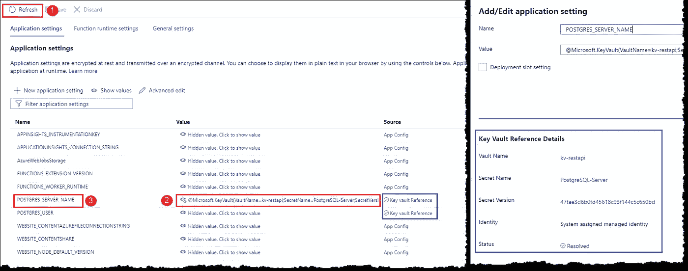
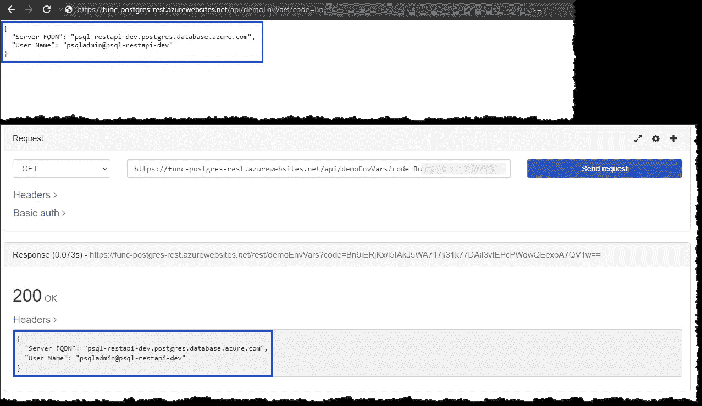

# 在 Azure 函数中使用凭证和机密的安全方式

> 原文：<https://levelup.gitconnected.com/a-secure-way-to-use-credentials-and-secrets-in-azure-functions-7ec91813c807>

## 在 Azure 函数中引用和访问 Azure Key Vault 机密作为 Node.js 中的环境变量


安妮·斯普拉特在 [Unsplash](https://unsplash.com/?utm_source=unsplash&utm_medium=referral&utm_content=creditCopyText) 上的照片

Azure 函数提供了一种很好的方式来存储和引用凭证、密钥和其他秘密，如**应用程序设置 *s*** 。应用程序设置在执行过程中被暴露为 ***环境变量*** 。应用程序设置在静态时加密，并通过加密通道传输。但是，您仍然面临着无意中将这些秘密暴露给未授权用户的风险。

缓解这个问题的一个更好的方法是将凭证或密钥作为秘密存储在 Azure Key Vault 中，并在我们的 Azure functions 应用程序中作为环境变量引用这些秘密。

本文将设置一个 Azure functions 应用程序来访问 Azure Key Vault 中存储的秘密。我们还将演示如何在 Node.js 函数中访问环境变量。

**注意:** *Microsoft Azure 是一项付费服务，遵循本文可能会导致您或您的组织承担财务责任。*

*在继续阅读本文之前，请阅读我们的使用条款:*[*https://dhyanintech . medium . com/disclaimer-disclosure-disclosure-terms-of-use-fb3 BF BD 1e 0e 5*](https://dhyanintech.medium.com/disclaimer-disclosure-terms-of-use-fb3bfbd1e0e5)

# 先决条件

1.  有效的 Microsoft Azure 订阅
2.  藏着秘密的天蓝色钥匙金库
3.  Azure Functions 应用程序(Node.js)

# 为您的应用程序创建托管身份

Azure 为资源和实体提供了两种身份；系统分配的受管身份和用户分配的受管身份。默认情况下，Azure functions 应用没有身份，必须创建身份才能将 functions 应用连接到 Azure Key Vault 并对其进行身份验证。登录 [Azure 门户](https://portal.azure.com/)，启动你的功能 app。点击**身份，**将**系统分配的**标签下的上的状态设置为**，并**保存**。等待任务完成；新的身份将出现在屏幕上。**



Azure Functions 应用程序:创建托管身份(图片由作者提供)

> *在撰写本文时，Azure Key Vault reference 仅支持系统分配的托管身份。*

*关于托管身份的进一步阅读:*

[](https://docs.microsoft.com/en-us/azure/app-service/overview-managed-identity?tabs=javascript) [## 托管身份- Azure 应用服务

### 本主题向您展示如何为 App Service 和 Azure Functions 应用程序创建托管身份，以及如何使用…

docs.microsoft.com](https://docs.microsoft.com/en-us/azure/app-service/overview-managed-identity?tabs=javascript) 

# 授予函数应用程序从 Azure Key Vault 读取机密的权限

我们需要为刚刚创建的应用程序身份授予权限，以便从密钥库中读取机密。从门户打开您的密钥库，点击**访问策略**，选择 **+添加访问策略**。在添加访问策略屏幕上，为**秘密权限**选择**获取**。转到**选择负责人**并在**负责人**刀片上搜索您的功能 app，从匹配的内容中选择您的功能 app，并按图示进行操作。



Azure 密钥库:添加访问策略(图片由作者提供)

*关于分配 Azure Key Vault 访问策略的附加阅读:*

[](https://docs.microsoft.com/en-us/azure/key-vault/general/assign-access-policy-portal) [## 分配 Azure 密钥保管库访问策略(门户)

### 密钥存储库访问策略决定了给定的服务主体(即应用程序或用户组)是否可以…

docs.microsoft.com](https://docs.microsoft.com/en-us/azure/key-vault/general/assign-access-policy-portal) 

# Azure 密钥保管库引用字符串

Azure Key Vault 引用的形式是`@Microsoft.KeyVault({referenceString})`，其中`{referenceString}`是秘密标识符，可以是 URL 形式，也可以是键值形式。我们很快就会看到他们两个。在你的密钥库中点击**秘密**，在你的功能应用中点击你想要引用的秘密，点击你的秘密的最新版本，并将**秘密标识符**复制到记事本。



Azure 密钥库:获取秘密标识符(图片由作者提供)

让我们看看 Azure Key Vault 引用字符串的两种形式。我们将很快演示这两种方法。

## # URL 表单

钥匙库里的秘密的完整 URI，包括一个版本

```
@Microsoft.KeyVault(SecretUri=https://kv-restapi.vault.azure.net/secrets/PostgreSQL-Admin/e57d70bd9971412ebb2287f797d3a4)
```

## #键值形式

```
@Microsoft.KeyVault(VaultName=kv-restapi;SecretName=PostgreSQL-Admin;SecretVersion=e57d70bd9971412ebb2287f797d3a4)
```

*关于关键保险库参考的进一步阅读:*

[](https://docs.microsoft.com/en-us/azure/app-service/app-service-key-vault-references) [## 使用密钥保管库引用- Azure 应用服务

### 本主题向您展示如何在您的应用服务或 Azure Functions 应用程序中使用来自 Azure Key Vault 的机密…

docs.microsoft.com](https://docs.microsoft.com/en-us/azure/app-service/app-service-key-vault-references) 

# 从密钥保管库到应用程序设置的源机密

既然我们已经准备好了参考字符串并设置了访问权限，那么是时候将应用程序的秘密添加为应用程序设置了。打开你的功能 app，进入**配置**，点击应用设置选项卡下的 **+新应用设置**。在**添加/编辑应用设置**刀片上，输入一个**名称**来标识您的秘密；该名称将在运行时作为函数中的环境变量。输入 Azure Key Vault 引用字符串作为**值**并点击 **OK** 。如果你有多个秘密要参考，重复这个过程。



Azure Functions App:添加应用程序设置(图片由作者提供)

*关于应用程序设置的附加阅读:*

[](https://docs.microsoft.com/en-us/azure/azure-functions/functions-app-settings) [## Azure 函数的应用设置参考

### 功能应用中的应用设置包含影响该功能应用的所有功能的全局配置选项…

docs.microsoft.com](https://docs.microsoft.com/en-us/azure/azure-functions/functions-app-settings) 

您是否很想知道引用密钥库的秘密如何防止我们的凭据被暴露？让我们开始测试它。点击**刷新**；请注意，我们引用的机密的来源显示为**密钥库引用**。默认情况下，所有应用程序设置值都是隐藏的，单击其中一个密钥库引用的**值**，看看会发生什么。我们看到的不是秘密值，而是我们之前输入的引用字符串——我们的应用程序指向存储在密钥库中的秘密，而不是获取和存储它。点击一个关键保险库引用的**名称**调出**添加/编辑应用设置**刀片，注意刀片上可用的新细节部分，状态**为**。这有助于将来解决一些问题。



Azure Functions 应用程序:测试密钥库引用(图片由作者提供)

# 在函数中访问环境变量

正如我们之前所讨论的，应用程序设置在执行期间被公开为 ***环境变量*** 。我们可以使用`process.env["APPLICATION_SETTING_NAME"]`来访问 Node.js 代码中的环境变量

> *应用程序设置有一个应用程序范围，可用于应用程序中的所有功能。*

让我们看一个示例代码，演示如何在 Node.js 函数中访问环境变量。这个函数在执行过程中访问环境变量，并将值作为 JSON 响应返回给调用者。从浏览器和 REST 插件触发该函数的结果如下所示。



Azure 函数:测试环境变量(图片由作者提供)

赞美！你已成功将 Azure Key Vault 中的机密引用到你的 Azure Functions 应用，而没有以纯文本形式存储它们。

# 结论

我们学习了如何为 Azure Functions 应用程序创建系统分配的托管身份，以及如何在 Azure Key Vault 中创建访问策略。我们引用了 Azure Key Vault secrets 作为应用程序设置，并学习了如何在 Node.js 函数中访问环境变量。我们可以得出结论，引用 Azure Key Vault secrets 是在 Azure Functions 应用程序中使用凭据和密钥的一种安全可靠的方式。

# 后续步骤

我们有一篇很棒的文章，是关于解决关键保险库引用问题的。去解决你遇到的错误。

[](https://dhyanintech.medium.com/troubleshooting-azure-key-vault-references-in-azure-function-apps-b228c1216f63) [## Azure Function 应用中 Azure 密钥库引用的故障排除

### 一个方便的傻瓜指南，用于解决函数应用程序中的 Azure Key Vault 引用错误

dhyanintech.medium.com](https://dhyanintech.medium.com/troubleshooting-azure-key-vault-references-in-azure-function-apps-b228c1216f63) 

## 喜欢这个帖子？与 Dhyan 联系

让我们做朋友吧！你可以在 [LinkedIn](https://www.linkedin.com/in/dhyans/) 上找到我或者在 [Medium](https://dhyanintech.medium.com/membership) 上**加入**我。