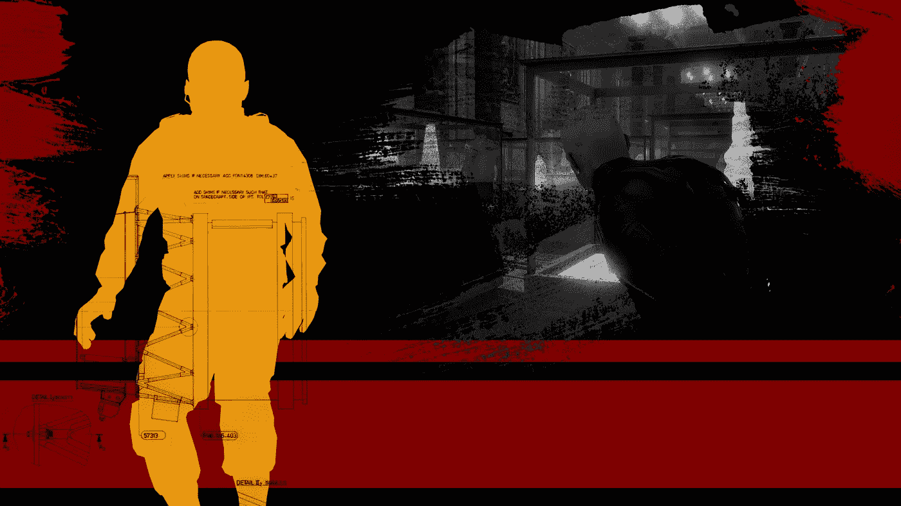

# 关于使用自定义 Wwise 脚本在 Unity 中创建身临其境的音频的系列

> 原文：<https://levelup.gitconnected.com/a-series-on-creating-immersive-audio-in-unity-with-custom-wwise-scripts-3e48324fa1dc>

在完成 GameDevHQ 的游戏和电影摄影课程后(查看我以前的文章)，我决定用沉浸式音频来装饰这个演示会很棒。

作为一个自上而下的点击游戏，没有太多的空间来容纳不同的声音，但我决定为音乐、氛围和音效创建核心的模块化系统。

作为一个有抱负的音频程序员，而不是音频设计师，所有使用的声音都是本课程项目现有资源文件夹的一部分。我只是想以一种更加身临其境的方式来实现它们。

我不想强行整合 Unity 和 Wwise，我希望所有的东西都可以重用，这样演示就可以很容易地扩展成一个成熟的游戏。

下面是不同文章的列表，进一步深入解释了每个系统是如何工作的。

1.  [构建模块化音乐切换系统](https://calumslee.medium.com/building-a-modular-music-switching-system-bd7192760529)
2.  [Voiceover 事件在 Unity 中调用](https://calumslee.medium.com/voiceover-event-calls-in-unity-e937ce7eb5e7)
3.  [创建动态环境系统](https://calumslee.medium.com/custom-dynamic-ambient-systems-27b7953356d3)
4.  [构建模块化闪避系统](https://calumslee.medium.com/building-a-modular-ducking-system-2722cb315f40)
5.  [从动画中调用足迹事件](https://calumslee.medium.com/calling-footstep-events-from-animations-7aa7adc23786)
6.  [在 Unity 中定义不同的脚步声](https://calumslee.medium.com/defining-different-footstep-sounds-bfbad9903f07)

此外，您可以在这里免费下载和体验这款游戏。视频演示/Wwise 展示即将到来。