# 一种用于单回购微前端的无服务器 CI/CD 方法

> 原文：<https://levelup.gitconnected.com/a-server-less-ci-cd-approach-for-mono-rep-micro-frontends-e91261bbdf69>

本文为 AWS 中基于 GitHub mono-repo 的微前端架构提供了一种 CI/CD 管道方法，利用了一系列 AWS 无服务器服务，如 AWS [CodePipeline](https://aws.amazon.com/codepipeline) 、 [CodeBuild](https://aws.amazon.com/codebuild) 和 [CodeDeploy](https://aws.amazon.com/codedeploy/) 。

微前端增加了管理基础设施的复杂性，这使得组织必须认真投入时间来支持持续集成(CI)、持续部署(CD)管道和随组织扩展的自动化工具。

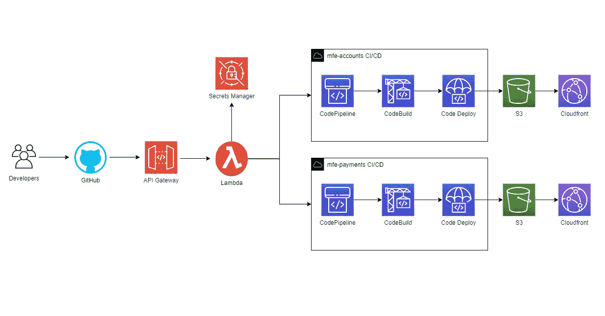

用于构建 mono repo 微前端的 CI/CD

建议的方法为组织提供了一个可扩展的选择，以扩展他们的技术微前端生态系统，保持团队自治，并让他们专注于业务和快速发布周期的早期反馈。

对于完整的单一回购客户端微前端架构，也可以查看本文:

 [## 用于模块联合微前端的完整 AWS 架构

### 我的下一个系列文章将介绍一个完整的无服务器架构，旨在部署和托管客户端单一报告…

levelup.gitconnected.com](/a-complete-aws-architecture-for-module-federated-micro-frontends-a0306ba466e3) 

# **一些背景:单一和多种回购**

在深入研究这个架构之前，让我们先提一下构建微前端模块的主要方法。

*   所有的团队都在一个仓库中工作
*   **Poly (multi)-repos:** 每个领域特定的微前端都位于自己的存储库中，由单个团队拥有。

该 PoC 将重点关注基于单一回购的实际操作、详细且实用的 CI/CD 设置，其中主要分支作为管道变更的来源。为了更好的概述和详细的比较，我推荐 Luca Mezzalira 即将出版的[书](https://www.buildingmicrofrontends.com/)。

# 体系结构

该架构基于一个场景，其中一家公司正在 mono GitHub 存储库上实现微前端，并希望在 AWS 中实现无服务器的 CI/CD 管道。

对于这个 PoC，mono-repo 包含两个微不足道的角度微前端， *mfe-accounts* 和 *mfe-payments* ，尽管这个模型允许您使用任何选择的框架独立编写每个模块:

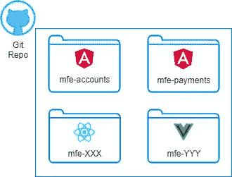

单一回购结构

该场景包括一些步骤:

*   开发者将他们的代码推送到 GitHub 中的主分支，这将通过 [GitHub webhooks](https://docs.github.com/en/developers/webhooks-and-events/webhooks/about-webhooks) 触发一个推事件到负责处理事件的 [AWS API 网关](https://aws.amazon.com/api-gateway/)。
*   API 网关触发一个 [AWS Lambda](https://aws.amazon.com/lambda/) 函数，该函数验证请求，分析事件，并根据受影响的文件，触发文件所属的微前端的管道。
*   一个或多个管道通过 [AWS CodePipeline](https://aws.amazon.com/codepipeline/) 、 [CodeBuild](https://aws.amazon.com/codebuild/) 和 [CodeDeploy](https://aws.amazon.com/codedeploy/) 开始构建、测试和部署动作。
*   变化可在 S3 桶和暴露在[云锋](https://aws.amazon.com/cloudfront/)分布。

让我们深入了解一下设置。

# API 网关设置

GitHub 允许通过 [webhooks](https://docs.github.com/en/developers/webhooks-and-events/webhooks/about-webhooks) 设置针对其事件的集成，例如存储库推送，webhooks 向端点发布 GitHub 事件数据有效载荷。让我们通过 API Gateway 在 AWS 中公开一个 RESTful API，其中包含一个 POST 端点，如下所示:

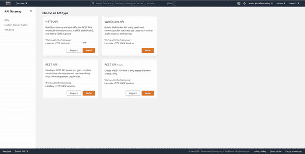

创建 API 网关

在上面的屏幕中，我们使用了一个 [Lambda 集成代理](https://docs.aws.amazon.com/apigateway/latest/developerguide/set-up-lambda-proxy-integrations.html),因为我们关联的“Hello World”Lambda 需要访问 API 网关请求头，以便认证 GitHub 即将到来的请求。有了 API，让我们创建 webhook。

# GitHub Webhook 设置

一旦在一个阶段中部署了 API 网关，就该创建 GitHub webhook 了，(参考这个[直观指南](https://docs.github.com/en/github/setting-up-and-managing-your-enterprise/managing-organizations-in-your-enterprise-account/configuring-webhooks-for-organization-events-in-your-enterprise-account))。 ***重要的*** :提供一个秘密来确保我们的 Lambda 只能接受来自 webhook 的请求(稍后会详细介绍)。

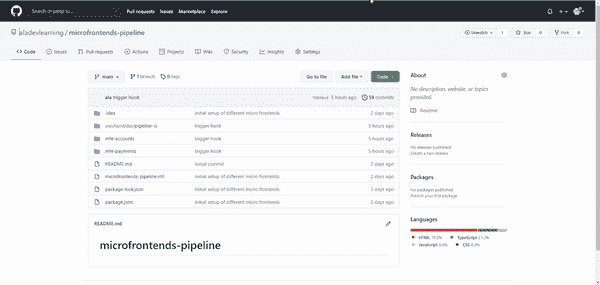

创建 GitHub webhook

集成准备好了！将文件推送到存储库将导致 Lambda 触发“Hello world”消息，这可以在 [Cloudwatch](https://aws.amazon.com/cloudwatch/) 中的流日志下看到。现在让我们更新 Lambda 代码，以确保我们支持您的 repo 中任何微前端的 CI/CD。

# Lambda 设置的微前端策略

Lambda 函数的最终目标是给定一个包含 repo commits 的 GitHub push 事件，然后它为任何受影响的微前端触发一个或多个管道。让我们详细看看以下要点:

*   首先，Lambda 使用 crypto 模块，通过 HMAC256 安全检查来验证 SHA256 请求头，从而只验证来自 GitHub webhook 的请求。这个检查是基于早先在 GitHub webhook 中定义的秘密，也存储在 AWS Secret Manager 中(按照[这个教程](https://docs.aws.amazon.com/secretsmanager/latest/userguide/tutorials_basic.html))。Lambda 将通过 IAM 动作*secrets manager:GetSecretValue*以安全的方式访问这个秘密
*   一旦被验证，通过从提交列表中添加/修改和移除的文件中提取微前端的名称，有效载荷被用于推断哪些微前端已经被影响。
*   如果任何微前端发生了变化，我们在 [AWS 代码管道](https://aws.amazon.com/codepipeline/)中触发一个新的构建，它将构建和部署微前端。为简单起见，管道的名称与将要构建的微前端相同。AWS SDK 客户端库需要 IAM 角色，以允许*code pipeline:StartPipelineExecution*操作访问资源

整体 Lambda 代码可以在这里看到[。现在是时候创建管道本身了，这是下一节的一部分。](https://github.com/aladevlearning/microfrontends-pipeline/blob/main/aws/lambdas/pipeline-ci/index.js)

# 代码管道设置

在 AWS 中创建代码管道涉及许多步骤和概念，所以我会尽量保持简单。代码管道有助于自动化发布管道，实现快速可靠的应用和基础设施更新。每个步骤，这里称为*阶段*，在所涉及的构建工件上执行动作。我将研究如何:

*   通过选择一些设置来创建管道
*   添加一个源阶段，回答问题“要构建的代码来自哪里？”
*   添加一个构建阶段:“我如何构建你刚才提供的源代码？”
*   添加一个部署阶段:“我如何以及在哪里部署您刚才提供的构建工件？”

主要的想法是隔离每个代码管道和代码构建项目，给每个团队灵活性和所有权来管理团队内的过程。类似项目的管道重用和 CloudFormation 模板等优化超出了范围。

## 通过选择设置创建管道

首先，通过提供与建筑物微前端和默认设置相匹配的名称来创建管道，如下所示。

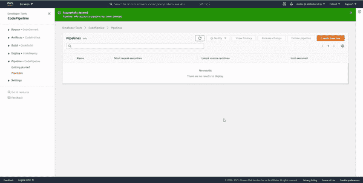

创建管道的第一步。

## 源阶段

该阶段将待处理的源代码与代码管道相链接。我们将通过单击 connect 按钮并启动一个向导来连接 CodePipeline 和 GitHub repo。

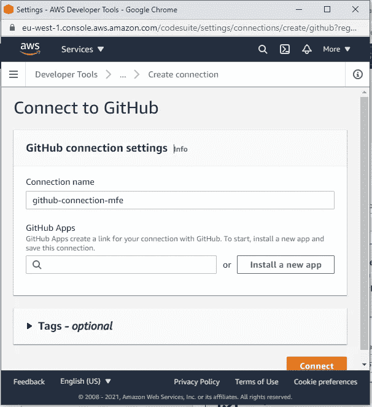

用 GitHub 连接管道

在向导结束时，如下所示，您将能够:

*   来访问您的 GitHub repo(在我的例子中是*aladevlearning/microfrontends-pipeline*)
*   选择*主*分支
*   取消选择源代码变更时的*启动管道*，因为我们想让 Lambda 函数来处理它
*   然后单击“下一步”进入下一阶段。

以上步骤可以在下面的 gif 中看到。

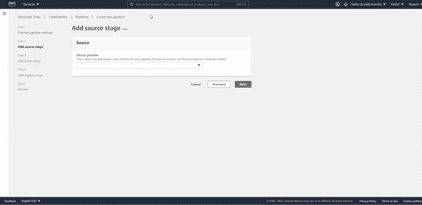

在代码管道中添加源阶段

## 构建阶段

此阶段负责构建前一阶段收到的源。它将创建或重用现有的 *CodeBuild* 项目，该项目指示管道:

*   如何通过一个 *builspec.yml* 文件运行构建。
*   CodeBuild 将实际上构建

关于 *buildspec.yml* ，我们可以决定是为所有微前端提供一个公共文件，还是为每个微前端提供一个公共文件。这在很大程度上取决于是否所有微前端都遵循相同的选择框架和相同的构建/测试步骤。通过将它们分开，您可以让每个团队独立于如何构建它，代价是构建过程和治理的概述稍微复杂一些。对于我们的微前端，文件如下所示:

一个 *buildspec.yaml* 由安装/准备环境、构建代码和指导如何构建工件的直观阶段组成。从管道发起者获得微前端名称后，该文件安装依赖项并压缩最终的工件，该工件将被部署到部署部分中指定的 S3 存储桶。详见本指南。

最后，构建过程需要一个运行环境(又名:机器)。

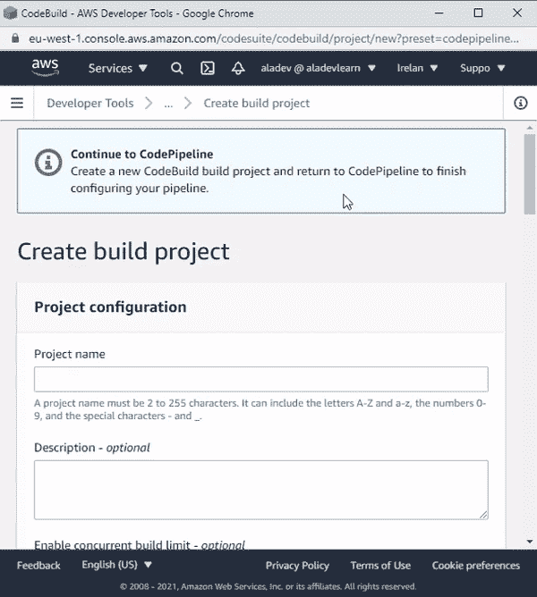

创建代码生成项目

上面的 gif 展示了 CodeBuild 配置是如何基于一个*构建环境*的，它代表了操作系统、编程语言运行时和用于运行构建的工具的组合。我们还选择了一个特定的 *buildspec.yml* 文件位置，因为每个微前端在构建过程和管道方面可能有所不同(例如，一个可能是 Angular 项目，另一个可能是 React 项目，或者两者仍然使用相同的框架，但使用不同的步骤构建)。

一旦建立了代码构建项目，我们将构建提供者设置为代码构建，我们选择新创建的代码构建项目( *mfe-accounts-build* )并继续到最后阶段。

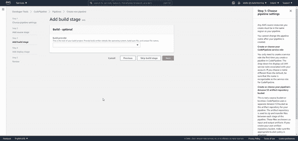

创建构建阶段

构建项目创建完毕，让我们进入代码管道的最后阶段。

## 部署阶段

最后，我们想在 S3 上部署我们的工件。为了做到这一点，我们需要[创建 S3 存储桶](https://docs.aws.amazon.com/AmazonS3/latest/userguide/create-bucket-overview.html)，工件将在其中独立部署。由于 CodeBuild 将压缩构建的工件，我们在部署设置之前检查*提取文件，并将*固定 ACL* 设置为 public-read，因为我们希望能够看到在 S3 部署的工件。*

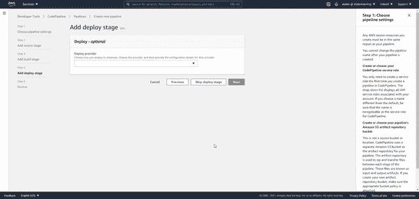

创建部署阶段

太好了！您的代码现在部署在 S3，这允许将它与一个 CloudFront 发行版相关联，以便更好地部署。对于任何微前端，都应该重复上述代码管道步骤。这种级别的冗余将允许每个团队独立自主，调整他们的 CI/CD 以

# 结果

在推送至影响包含变更的微前端的储存库时，将启动一个或多个代码管道。

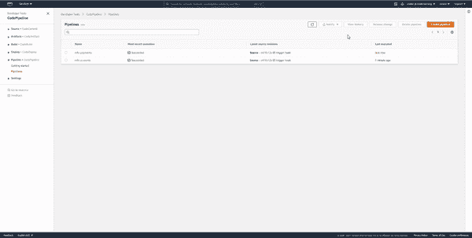

管道开始活跃起来

成功的管道应该是这样的:

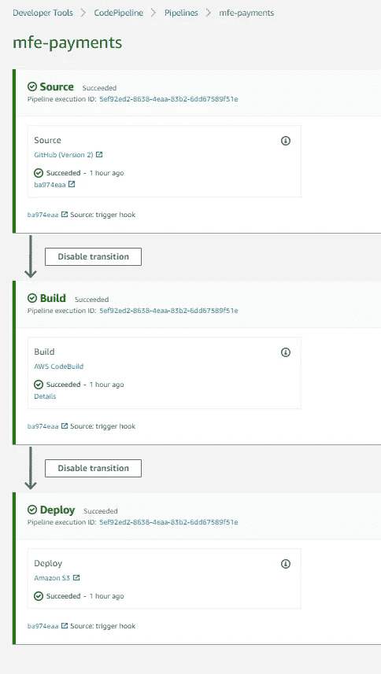

成功的管道

部署的工件位于指定的 S3 存储桶下:

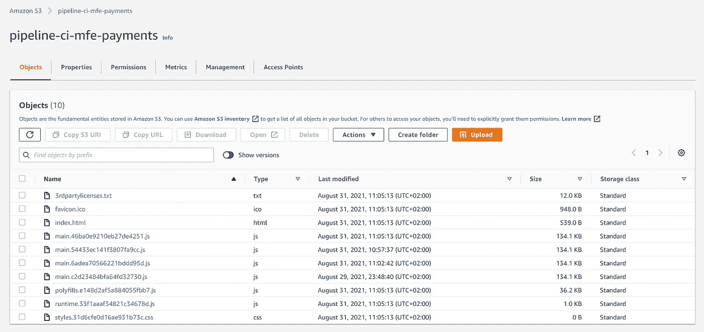

用于部署微前端的 S3 桶

与 Cloudfront 发行版相关联，我们部署的微前端将如下所示:

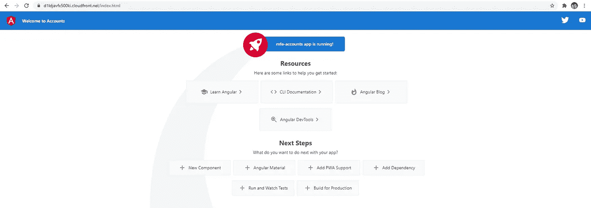

完整的代码可以在[这里](https://github.com/aladevlearning/microfrontends-pipeline)找到。

# 总结和想法

本文深入介绍了为基于 mono-repo 的前端架构创建无缝 CI/CD 管道的 10 分钟设置。这应该被看作是一个可行的，虽然是初步的方法，可以用很多方式探索，再次证明了在 AWS 中构建东西是多么伟大和有创造性。一些想法可能是:

*   拥有不同的管道来满足不同的需求，例如不同的框架、测试套件、集成和功能测试、多阶段环境等
*   在不同的 AWS 帐户中发布工件，一个用于测试，一个用于生产，以保持隔离和安全性。
*   扩展特性分支 CI/CD 的方法，您可以在不阻塞主分支的情况下，为早期原型和反馈创建分支部署。
*   将上述内容作为 CloudFormation 模板。这是提升这种方法的必要条件，并在任何微前端中不断重复。
*   CloudFront 失效步骤。如果对在管道中添加 CloudFront 感兴趣，通过 Lambda 函数的缓存失效步骤可能是必要的，以确保所有最新的更改都正确地传播给消费者(或者 AWS 可能会将其作为反馈并将其公开，因为这似乎是一种非常常用的模式)。

# 参考

 [## 通过 AWS CodeCommit、AWS CodeBuild、AWS CodeDeploy 和 AWS CodePipeline 完成 CI/CD | Amazon Web…

### 许多组织已经转移到 DevOps 实践，这是文化哲学，实践，…

aws.amazon.com](https://aws.amazon.com/blogs/devops/complete-ci-cd-with-aws-codecommit-aws-codebuild-aws-codedeploy-and-aws-codepipeline/)  [## 构建微前端:这本书

### 微前端是当今日益复杂的 web 应用程序的答案。受微服务模型的启发，…

www.buildingmicrofrontends.com](https://www.buildingmicrofrontends.com)