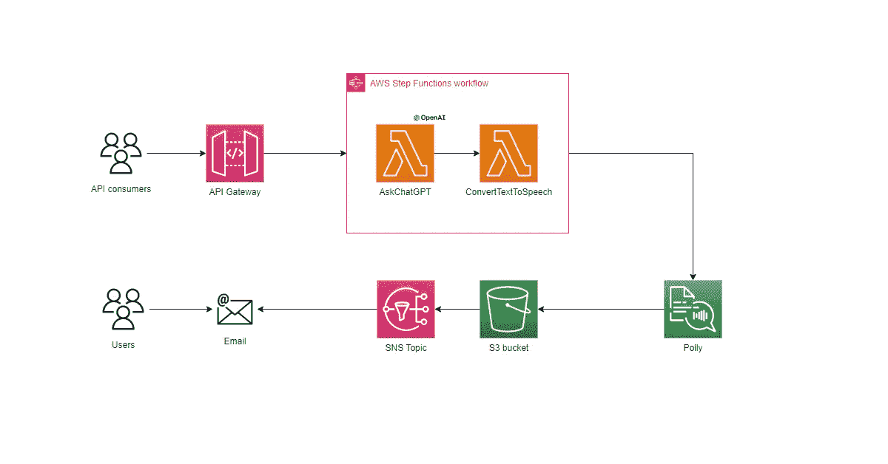
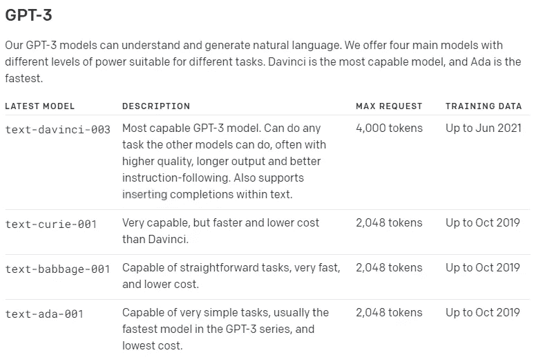
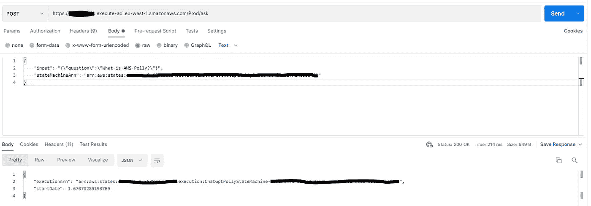
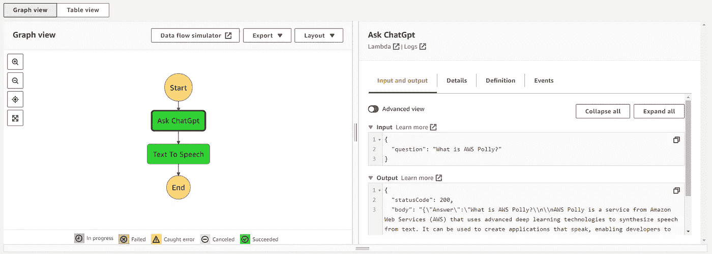
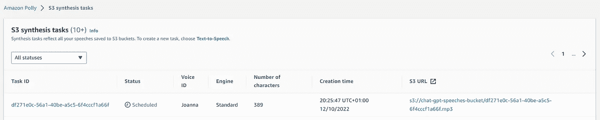
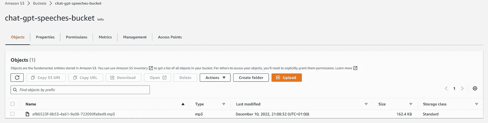
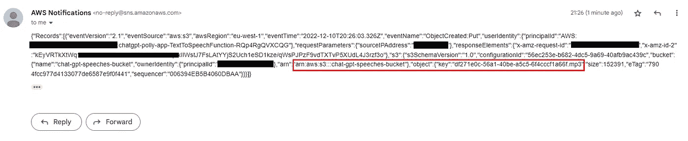

# 用于 ChatGPT 文本到语音应答的无服务器 API

> 原文：<https://levelup.gitconnected.com/a-serverless-api-for-chatgpt-text-to-speech-answers-d7fc21fef3b8>

最近，有很多关于 ChatGPT 的噪音，这是有原因的。我想更进一步，将 ChatGPT 与某些 AWS 无服务器产品结合起来，而不仅仅是从 [OpenAI](https://openai.com/) 托管的网络界面上尝试它的服务。

 [## ChatGPT:优化对话的语言模型

### 我们已经训练了一个名为 ChatGPT 的模型，它以对话的方式进行交互。对话形式使…成为可能

openai.com](https://openai.com/blog/chatgpt/) 

本文展示了一个无服务器 API，用户可以向 ChatGPT 提出问题。它的答案将文本到语音转换为 MP3 音频文件，并通过电子邮件通知用户。

所有资源将通过 AWS 无服务器应用程序模型(SAM)提供。让我们深入研究一下。

 [## AWS 无服务器应用模型——Amazon Web Services

### 用简单明了的语法构建无服务器应用程序 AWS 无服务器应用程序模型(SAM)是一个开源的…

aws.amazon.com](https://aws.amazon.com/serverless/sam/) 

# 体系结构

该体系结构由不同的无服务器组件组成，这些组件将通过 SAM CLI 进行配置。

OpenAI 文本到语音转换应答的无服务 API

*   一个 **API 网关**充当我们的单一 RESTful 端点的门面和入口点。“ask”*POST*端点接受一个包含一个英语问题的 *JSON* 有效负载。
*   网关将有效载荷转发给异步**步骤函数**。状态机由两个 lambda 函数组成，负责使用 OpenAI API 获取答案，使用 AWS Polly 将文本到语音转换为 MP3 音频文件存储到 **S3 桶中。**
*   最后，S3 事件通知会触发一个 **SNS 主题**，它会发送一封包含新上传文件信息的电子邮件。

# 供应资源

为了通过基础设施代码(IaC)提供资源，我将使用 SAM，完整模板如下所示。让我们简要分析一下文件部分:

*   *Globals，*包含要跨支持共享的通用配置 [SAM 资源](https://docs.aws.amazon.com/serverless-application-model/latest/developerguide/sam-specification-resources-and-properties.html)
*   *参数*定义可作为 [*sam 部署-引导*](https://docs.aws.amazon.com/serverless-application-model/latest/developerguide/serverless-getting-started-hello-world.html) 命令的一部分提供的动态数据
*   *资源*包括上述架构中提供和提及的所有 AWS 资源。一些细节将随后公布。

SAM template.yaml

# 一个管理它们的国家机器

[AWS 步骤功能](https://aws.amazon.com/step-functions/)是一个无服务器的编排服务，将各种 AWS 服务集成为状态机的任务部分。Amazon States 语言的核心是提供一种基于 JSON 的语言，将状态机定义为一组状态。

阶跃函数 ASL

让我们通过它们的 Lambda 函数实现来详细了解这两种状态:

1.  *Ask ChatGPT* 状态将使用 OpenAI SDK 提出问题并接收答案。
2.  *文本到语音*状态将使用 Polly 将接收到的答案转换成音频文件。

## AskChatGPT 函数

第一个 Lambda 函数使用 API 网关收到的问题。OpenAI SDK 包将这些信息与一个具有魔力的人工智能模型一起使用。可用型号列表如下所示。

ChatGPT 模型

使用 SDK 非常简单，只需要一个可以在 ChatGPT 帐户中生成的 API 密钥。下面是 Lambda 代码:

问 ChatGPT Lambda

有关请求参数的详细信息，请参考以下链接。

 [## OpenAI API

### 用于访问 OpenAI 开发的新人工智能模型的 API

beta.openai.com](https://beta.openai.com/docs/api-reference/completions/create) 

## 文本语音λ

第二个函数接收来自前一个 Lambda 函数的答案，并利用 [AWS Polly](https://aws.amazon.com/polly/) 通过 S *peech 合成任务*执行文本字符串到音频文件的异步转换。

 [## 开始语音合成任务

### 允许通过启动新的 SpeechSynthesisTask 来创建异步合成任务。此操作需要…

docs.aws.amazon.com](https://docs.aws.amazon.com/polly/latest/dg/API_StartSpeechSynthesisTask.html) 

简而言之，这会创建一个由 Polly 管理的 S3 合成计划任务，然后将结果保存到 S3 桶中。下面的代码片段将把“Joanna”的声音与文本关联起来，并将音频 MP3 文件保存到 S3 中。

文本到语音转换λ

# 演示

通过点击 Postman 的 POST /ask 端点，结果是一个即时的 200 代码，因为调用是异步的，具有一发不可收拾的风格。

1.发布请求

阶跃函数相应地开始和完成。

2.步进功能执行

S3 合成波莉的任务已经安排好了。

波利任务

一旦任务完成，一个 MP3 文件被保存到 S3。

储存在 S3 的音频

最后，我们会发送一封包含 S3 创建的活动信息的电子邮件:

收到电子邮件

# 结论

基于 OpenAI 的应用在许多领域都有颠覆性的潜力。本文只是展示了如何将 ChatGPT 与云原生方法相结合的表面，以及在社交网络应用中自动化智能文本到语音转换应用的机会。

完整代码可以在 Github 上找到:[https://Github . com/aladevlearning/chat GPT-Polly/tree/main/chat GTP-Polly-API](https://github.com/aladevlearning/chatgpt-polly/tree/main/chatgtp-polly-api)

# 分级编码

感谢您成为我们社区的一员！在你离开之前:

*   👏为故事鼓掌，跟着作者走👉
*   📰查看[级编码出版物](https://levelup.gitconnected.com/?utm_source=pub&utm_medium=post)中的更多内容
*   🔔关注我们:[推特](https://twitter.com/gitconnected) | [LinkedIn](https://www.linkedin.com/company/gitconnected) | [时事通讯](https://newsletter.levelup.dev)

🚀👉 [**加入升级人才集体，找到一份惊艳的工作**](https://jobs.levelup.dev/talent/welcome?referral=true)