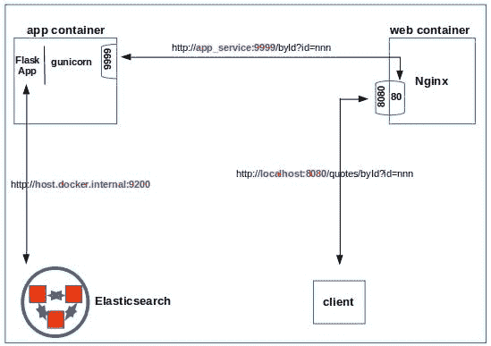

# 码头上的服务瓶

> 原文：<https://levelup.gitconnected.com/a-serving-flask-on-docker-4a1fb917614c>

docker 改进了打包应用程序以获得跨环境的可再现结果。Docker 允许我们将应用程序与其所有依赖项捆绑在一起，这样生成的图像可以在任何地方使用兼容的 docker 运行时运行。我们感兴趣的应用需要资源，例如:

1.  一个网络应用框架(例如 [Flask](https://flask.palletsprojects.com/en/1.1.x/)
2.  一个 WSGI 服务器(例如 [gunicorn](https://gunicorn.org/)
3.  网络服务器(例如 [Nginx](https://www.nginx.com/)
4.  数据存储(例如 [Elasticsearch](https://www.elastic.co/guide/en/elasticsearch/reference/current/index.html)
5.  编排引擎(例如 [Kubernetes](https://kubernetes.io/)

由于篇幅原因，这篇文章的重点是 1 到 3，并对它们进行排序。我们将把这里的工作作为 Kubernetes 实现的一个跳板，在随后的一篇文章中涵盖整个领域。这篇文章讲述了以下内容:

*   构建一个 app 容器，在 gunicorn 后面运行 Flask 应用程序。
*   构建一个 web 容器来提供静态内容，同时将动态数据请求代理回应用程序容器。
*   使 Flask 应用程序能够与主机上的 Elasticsearch 实例对话。您可以用您选择的任何其他数据存储来替换它。

这篇文章的驱动者是早先的文章[一个装满威士忌的瓶子(WSGI)](http://xplordat.com/2020/02/16/a-flask-full-of-whiskey-wsgi/)——它是在我的笔记本电脑上实现的。将代码、系统配置和命令整合在一起并与 post 共享是一件苦差事。此外，如果最终用户使用不同的操作系统，或者拥有不同配置的系统，那么其中的一些内容需要由最终用户进行调整。捆绑了活动部件的 docker 映像更容易共享，也更容易重用！那就让我们开始吧。

这篇文章中有一些代码片段用于说明。完整的代码可以从 [github](https://github.com/ashokc/Serving-Flask-on-Docker) 获得。

# 1.这个计划

下面的图 1 简单地展示了我们计划实现的内容。



图一。大局。web 和 app 容器由 docker-compose 提供。主机上的 Elasticsearch 开放供 docker 网络访问。通过 web 容器访问应用服务，该 web 容器将请求代理给应用容器

我们选择让 Elasticsearch 在主机上运行，因为它也服务于其他应用程序。此外，我们还想模拟容器应用程序需要访问主机上的应用程序的情况。应用程序很简单。根据 API 中的 *id* 值，它在 elasticsearch 索引中查询具有该 *id* 的报价，并使用模板构建一个 Html 片段。

```
from elasticsearch import Elasticsearch
from flask import Flask, request, render_template
app = Flask(__name__)
# 'host.docker.internal' will be resolved by the container to point to the host
client = Elasticsearch([{'host':'host.docker.internal','port':9200}])
index = 'quotes'
[@app](http://twitter.com/app).route('/byId', methods=['GET'])
def getById():
    docId = request.args.get('id')
    quote = client.get(index=index, id=docId)
    return render_template('quote.html',quote=quote)
```

所以在点击一个像[这样的网址 http://localhost:8080/quotes/byId？id=797944](http://localhost:8080/quotes/byId?id=797944) 您将得到:


# 2.Docker 撰写

从图 1 中我们知道我们需要设置两个服务，其中一个应该可以从主机访问。这是目录/文件布局，以及每个文件用途的一些细节。

```
.
├── app 
│   ├── Dockerfile # instructions to build the app_container image
│   ├── quoteserver
│   │   ├── config.py    # some config options for gunicorn
│   │   ├── quotes.py    # the 'app'
│   │   ├── requirements.txt 
│   │   └── templates
│   │       └── quote.html
│   └── start.sh         # script to be run by the container
├── docker-compose.yml
└── web 
    ├── Dockerfile
    ├── index.html
    ├── nginx.conf
    └── static
        ├── css
        │   └── quote.css
        ├── favicon.ico
        └── images
            └── abraham lincoln.jpg
```

组合文件很简单——两个服务，每个服务都有自己的 Dockerfile，位于各自的目录中，如上所示。Nginx 容器被设置为主机可以在端口 8080 访问。这里是完整的 *docker-compose.yml* 。

```
version: '3.7'
services: 
  app_service:
    build: 
      context: ./app
      dockerfile: Dockerfile
  web_service:
    build: 
      context: ./web
      dockerfile: Dockerfile
    ports: 
      - 8080:80
```

# 3.Web 容器

我们导入官方的 Nginx 映像，并在 web 容器下面的 *Dockerfile* 中添加我们的配置和静态文件

```
FROM nginxCOPY ./nginx.conf /etc/nginx/
COPY index.html /var/www/html/
COPY ./static/ /var/www/html/
```

我们需要将请求发送到在 gunicorn 下运行的 Flask 应用程序，该应用程序监听应用程序容器的端口 9999。该服务在 docker-compose 中被命名为“app_service”。下面是来自 *nginx.conf* 的相关片段。

```
#'/quotes/byId?id=nnn' => '[http://app_service:9999/byId?id=nnn'](http://app_service:9999/byId?id=nnn')
location /quotes/ {
   proxy_pass [http://app_service:9999/](http://app_service:9999/);
}
```

# 4.应用程序容器

应用程序容器的映像从精益 python-alpine 映像开始，并从 requirements.txt 安装所需的模块。

```
# Pull a lean base image
FROM python:3.8-alpine
# We need the "ip" command used in 'start.sh'
RUN apk add --update iproute2
COPY start.sh /
RUN chmod +x /start.sh
COPY ./quoteserver /quoteserver
# requirements.txt lists the modules &amp; their versions to be installed
RUN pip install --upgrade pip
RUN pip install -r ./quoteserver/requirements.txt
# Update /etc/hosts and start gunicorn
CMD ["/start.sh"]
```

flask 应用程序需要能够访问主机上运行的 Elasticsearch。但是我们不想硬编码主机的潜在可变 IP 地址。在 Mac 和 Windows 上，docker 自动将' *host.docker.internal* '解析为主机 IP 地址——但不幸的是在 Linux 上没有。找到这个帖子[https://dev . to/buffer ings/access-host-from-a-docker-container-4099](https://dev.to/bufferings/access-host-from-a-docker-container-4099)来解决这个问题。这个修复与启动 *gunicorn* 的命令结合在一起——这就是我们下面的 *start.sh* 。

```
#!/bin/sh
# Resolve 'host.docker.internal' so we can access the host
HOST_DOMAIN="host.docker.internal"
HOST_IP=$(ip route | awk 'NR==1 {print $3}')
echo -e "$HOST_IP\t$HOST_DOMAIN" >> /etc/hosts
# Start gunicorn
/usr/local/bin/gunicorn -c /quoteserver/config.py -b 0.0.0.0:9999 --chdir /quoteserver quotes:app
```

# 5.Docker 网络和防火墙规则

我在笔记本电脑上要做的最后一件事是允许从 docker 网络访问 Elasticsearch。docker 中的默认地址范围相当大，例如在 172 集合中，从 172.17.0.0/16 到 172.31.0.0/16。每次运行“ *docker-compose up* ”时，你都可以从该范围内的任何地方获得具有地址的容器，因此我们必须开放整个范围进行访问。对于我的爱好来说，这个范围太大了，以至于我无法在家里的网络中访问 Elasticsearch。我们通过在下面提供一个定制的更小范围的*/etc/docker/daemon . JSON*文件来改变这一点。

```
{
  "default-address-pools":
  [
    {"base":"172.24.0.0/16","size":24}
  ]
}
```

我们重启 docker 服务，单独开放 172.24.0.0/16 访问 Elasticsearch。

```
sudo systemctl restart docker.service
sudo ufw allow from 172.24.0.0/16 proto tcp to any port 9200
```

# 6.测试和验证

我们用 docker-compose 打开容器。

```
[quoteserver] ls
app/  docker-compose.yml  web/
[quoteserver] docker-compose build
[quoteserver] docker-compose up --d
[quoteserver] docker network ls
NETWORK ID          NAME                  DRIVER              SCOPE
f60dfeab8f95        bridge                bridge              local
...
90cf5e594e9d        quoteserver_default   bridge              local
```

检查 *quoteserver_default* 网络确认我们的 *daemon.json* 是有效的。

```
[quoteserver] docker inspect 90cf5e594e9d
...
"IPAM": {
            "Driver": "default",
            "Options": null,
            "Config": [
                {
                    "Subnet": "172.24.11.0/24",
                    "Gateway": "172.24.11.1"
                }
            ]
        },
...
```

列出正在运行的容器表明，我们让 web 容器在 8080 为主机公开其端口 80。

```
[quoteserver] docker ps -a --format="table {{.Names}}\t{{.Image}}\t{{.Ports}}\t{{.Command}}"NAMES           IMAGE                     PORTS                COMMAND
app_container  quoteserver_app_service                     "/start.sh"
web_container  quoteserver_web_service   0.0.0.0:8080->80/tcp   "nginx -g 'daemon of…"
```

检查 app 容器显示/etc/hosts 已经附加了用于解析的网关地址。

```
[quoteserver] docker exec -it 56fe0df26e36 /bin/sh -c "tail -3 /etc/hosts"
ff02::2 ip6-allrouters
172.24.11.3 app_host
172.24.11.1 host.docker.internal
```

现在剩下要做的就是测试功能。

```
curl [http://localhost:8080/quotes/byId?id=86789](http://localhost:8080/quotes/byId?id=86789)
```


就这样，我们结束了这篇相当短的帖子。我们将在随后的文章中讨论 Kubernetes 的成熟的容器编排。

【http://xplordat.com】原载于 2020 年 3 月 3 日[](http://xplordat.com/2020/03/03/a-serving-flask-on-docker/)**。**