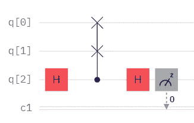
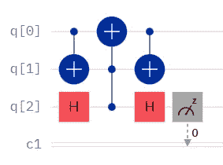
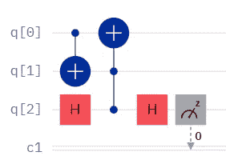

# “肤浅”的互换测试

> 原文：<https://levelup.gitconnected.com/a-shallow-swap-test-d1c828f9029>

规范互换测试

# 因为电路深度很重要

最近提交的一份名为“[基于量子内核的机器学习方法在 IonQ 和 IBM 量子计算机上的错误缓解](https://arxiv.org/abs/2206.01573)”的预印本提供了一个写我最喜欢的量子子程序 SWAP Test 的好机会。交换测试也被称为“距离测量”、“核方法”和“内积”，它比较两个量子态。这些量子态可以是单个或多个量子位，重要的是两个系统中量子位的数量是相等的。

分解交换测试

## 分解交换测试

Fredkin 门，也就是交换测试中的受控交换门，可以分解为两个 CNOTs 和一个 Toffoli 门，如上图所示。Toffoli 可以进一步分解成相当多的单量子位和多量子位运算，但这对本文来说不是必需的。对于这个解释，你只需要知道 Toffolis 和 Fredkins 的延伸，隐藏了相当多的电路深度。这些门使得构建量子电路变得更快更容易，但是除了[之外](/a-native-toffoli-gate-970093e4770c)，它们在量子处理器上执行之前被[转化为大量被称为“基本门”的基本操作。](/what-is-transpilation-4d12d51e2aa4)

浅层互换试验

## 浅层互换试验

尽管我刚刚写了 Toffolis 增加了多少电路深度，但我们有时可以从我们的 Fredkin 中移除拖尾 CNOT。测量结果保持不变，这可能是最重要的考虑因素。包括和不包括 CNOT 的一个区别是，它改变了被比较的量子比特的合成状态，但是规范交换测试不会进一步使用这些状态。交换测试还有其他用途，但这些超出了本文的范围。

重要的是，你在上面看到的少了一个 CNOT，电路深度没有变化的情况并不总是这样。即使只考虑两个单量子比特的量子态，那两个量子比特有联系吗？如果没有，就需要增加爱错互换来执行 CNOT。如果我们谈论的是多量子位量子态和差的量子位连通性，我们可能会谈论许多 CNOTs 的大量交换。

现在想象一下，我们甚至不打算用这些量子态做任何进一步的事情，就像在规范交换测试中一样。执行所有这些交换所花费的时间增加了电路其余部分去耦合并在别处引入误差的时间。有了这个简单的电路，我们可以尝试在早期测量安西拉量子位，但我们实际的电路不会这么简单，即使它们相对简单，所有这些额外的交换都变得毫无意义。

另一方面，如果我们想再次使用原来的量子态呢？交换测试是可逆的，在这种情况下，我们可能不得不重新执行这些交换，从而引入大量错误。在 NISQ 时代我们已经有足够多的错误，我们真的不需要添加不必要的额外错误。

## 结论

既然我们在谈论减少基于量子内核的机器学习方法的错误——好吧，反正论文的作者是——我们不妨尽可能移除每一个容易出错的 CNOT 门。Transpiler 优化可能有助于最小化额外的深度，但是我们可以首先手动保证不必要的操作不存在。我个人选择后者。

你想了解更多关于我最喜欢的量子子程序吗？随着时间的推移，这些早期的文章已经相当成熟了:

*   [比较量子态](https://link.medium.com/ej6kgn2x57)
*   [基差互换测试](https://link.medium.com/A2UPK7Rp37)
*   [简化量子机器学习(QML)分类](https://link.medium.com/DuR1ELHUa8)
*   [比较纠缠态](https://bsiegelwax.medium.com/comparing-entangled-states-f39681864ea5)

你想用这个“浅”交换测试来测试规范交换测试吗？试试[这个电路](https://algassert.com/quirk#circuit={%22cols%22:[[1,1,%22H%22],[%22Swap%22,%22Swap%22,%22%E2%80%A2%22],[1,1,%22H%22,1,1,%22H%22],[1,1,1,%22%E2%80%A2%22,%22X%22],[1,1,1,%22X%22,%22%E2%80%A2%22,%22%E2%80%A2%22],[1,1,1,1,1,%22H%22],[1,1,%22Chance%22,1,1,%22Chance%22]]})有怪癖。只要确保你在比较相同的量子态，你就会看到安西拉量子位的测量结果是相同的。