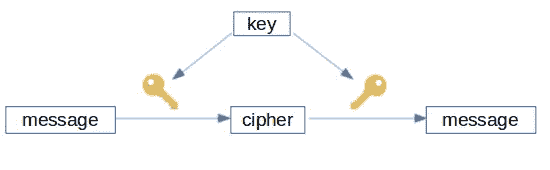
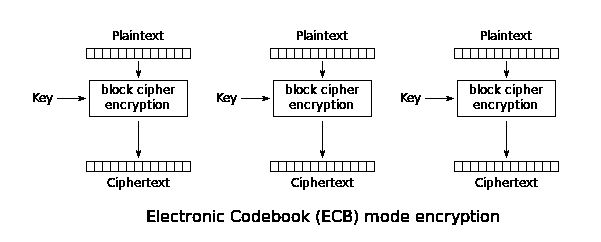
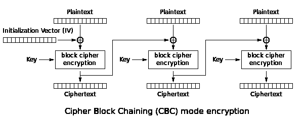

# 如何使用 Go 加密文件

> 原文：<https://levelup.gitconnected.com/a-short-guide-to-encryption-using-go-da97c928259f>

## 以及如何保护您的数据。

马库斯·温克勒在 [Unsplash](https://unsplash.com/s/photos/key-lock?utm_source=unsplash&utm_medium=referral&utm_content=creditCopyText) 上的照片

在当今世界，密码学是强制性的。在这个大数据和数据科学的时代，确保您的数据免受恶意攻击非常重要。

有许多算法和技术可以确保你的系统是安全的，没有未经授权的访问你的数据。

对称加密就是这些技术中的一种，在本教程中，我将向你展示如何在 [Go](https://golang.org/) 中实现。

*注意:本教程使用的 Go 版本是 1.14.7。*

# 介绍

对称密钥加密是一种用于加密只有一个密钥的消息的技术。该密钥用于该过程的两个部分，即加密和解密消息。

图片作者。

使用任何一种对称密钥算法，消息都被转换成无法理解的形式。除非有人有秘钥。在这种情况下，发送方和接收方拥有相同的密钥(以某种安全的方式交换)，因此他们可以发送消息并相互理解。

所使用的算法决定了密钥的大小以及加密或解密过程的模式。通常，密钥越长，破解就越难，加密就越安全。例如，一个 128 位的密钥可能需要几十亿年才能被普通计算机破解。

有两种类型的算法:

*   **块**:使用固定大小的块对消息进行加密。例子: [DES](https://en.wikipedia.org/wiki/Data_Encryption_Standard) 、 [AES](https://en.wikipedia.org/wiki/Advanced_Encryption_Standard) 等。
*   **流**:消息采用单个字符加密。例如: [RC4](https://en.wikipedia.org/wiki/RC4) 、[萨尔萨 20](https://en.wikipedia.org/wiki/Salsa20) 等。

## 模式

由于块密码只对固定长度的位组进行运算，因此您必须描述如何重复单次运算来转换比块大的数据。

大多数模式需要一个独特的初始序列，通常称为*初始化向量(IV)。*静脉注射必须不重复，有时也是随机的。

如果数据长度不是块大小的倍数，则将最后一个块填充为一个完整的块。但是，有些模式不需要它，因为它们将它用作流密码。一些常见模式:

*   **ECB** :最简单的。分别加密每个块。这种模式一点也不安全，不应该使用。

WhiteTimberwolf (SVG 版本)/公共领域

*   **CBC** :在这种模式下，原始消息的每一个块在被加密之前都与前一个加密块进行异或运算。

WhiteTimberwolf (SVG 版本)/公共领域

*   **CFB / OFB / CTR** :这些模式通过仅在加密部分之后使用消息块，将分组密码变成流密码。
*   **XTS** :用于编码随机存取数据(如硬盘或 RAM)。

## 消息认证

为了提高消息的安全性，会添加一小段信息来验证它。换句话说，它确认消息确实来自发件人，并且没有被修改。

这条信息被称为*消息认证码(MAC)* ，保护消息的数据完整性和真实性。实现它的算法有很多，比如 [HMAC](https://en.wikipedia.org/wiki/HMAC) 、 [GCM](https://en.wikipedia.org/wiki/Galois/Counter_mode) 等。

# 加密

使用 Go 加密文件的过程很简单。使用包`[crypto](https://golang.org/pkg/crypto/)`我们可以做所有必要的步骤来加密一个文件。

第一步是打开文件并阅读其内容。

下一步是为我们的算法创建块。这个对象实现了实际的代码，所以我们不必担心它。在本教程中，我们将使用 AES。

密钥必须是 16 字节(AES-128)、24 字节(AES-192)或 32 字节(AES-256)，我们从文件中读取。

**注意** : [永远不要在你的代码上保存你的密钥](https://www.freecodecamp.org/news/how-to-securely-store-api-keys-4ff3ea19ebda/)。

如上所述，有一些模式你可以加密你的信息。为了方便起见，包`crypto/cipher`已经为我们实现了其中的一些。

我们将使用 [GCM](https://en.wikipedia.org/wiki/Galois/Counter_Mode) 模式，这是一种带认证的流模式。因此，我们不必担心填充或进行身份验证，因为它已经由包完成了。

此模式需要一个 nonce 数组。它像静脉注射一样工作。确保这永远不会是同一个值，也就是说，每次加密时都要更改它，即使它是同一个文件。您可以使用包`crypto/rand`用一个随机值来做到这一点。

为了加密数据，我们使用函数`[Seal](https://golang.org/pkg/crypto/cipher/#AEAD)`。它将使用 GCM 模式加密文件，将`nonce`和`tag` (MAC 值)附加到最终数据，因此我们可以在以后使用它来解密。

在这之后，我们只需要将密文保存到我们的目标文件中。

就是这样！你已经加密了一个文件。完整的代码:

# [通信]解密

要解密文件，过程基本相同。我们现在必须读取加密文件。

创建密钥和模式块与加密过程相同。由于这是一种对称密钥算法，请确保使用与加密时相同的密钥。

为了解密我们的文件，我们使用了`[Open](https://golang.org/pkg/crypto/cipher/#AEAD)`函数。需要注明我们在加密过程中使用的`nonce`值。在我们的加密过程中，这个值保存在文件的开头。

最后，我们只需将解密内容保存到一个文件中。

# 加密大文件

虽然这是一种简单的加密文件的方法，但对于大文件来说却不是一个好的选择。所有内容在加密前都被读入内存。为了避免任何问题，我们必须按块读取和加密。

为此，我们首先使用`os.Open`函数打开我们感兴趣的加密文件。

密钥和块的创建与前面的例子相同，所以我不打算在这里重复。

我们可以使用 [CTR](https://en.wikipedia.org/wiki/Block_cipher_mode_of_operation#Counter_(CTR)) 模式，因为它是一种流模式，非常接近 GCM。此模式还需要一个 IV，其大小与块相同(对于 AES，16 字节)。

在进入实际的读取循环之前，我们必须打开目标文件，以便能够写入其中。

之后，我们逐块读取文件。在本教程中，我们选择 1024 字节的缓冲区，但是您可以选择任何您喜欢的大小。

对于从输入文件中读取的每个块，我们使用函数`XORKeyStream`执行加密过程。

之后，我们将使用的 IV 保存到目标文件中，这样我们就可以用它来解密。完整代码:

# 解密大文件

要解密它，我们只需要改变一件事:从文件中读取 IV，而不是随机值。这个值保存在文件的最后，所以很容易阅读。

在 CTR 模式下，加密和解密过程是一样的，所以我们实际上不需要做任何改变。

解密部分的完整代码:

值得注意的是，我们没有使用任何形式的认证。这可以使用`crypto/hmac`包轻松完成。计算出 MAC 值后，可以将其附加到目标文件中。对于解密过程，你必须读取它，并与你执行的新计算进行比较。

# 结论

通过使用`crypto`包，使用 Go 语言加密文件并不困难。

如果您也对如何使用 Go 创建散列感兴趣，请查看另一篇文章:

 [## 围棋散列法简明指南

### 如何散列一个字符串或文件

medium.com](https://medium.com/better-programming/a-short-guide-to-hashing-in-go-e8bb0173e97e) 

如果你想收到更多关于编程的文章，请在 [Twitter](https://twitter.com/ustropo) 上关注我。