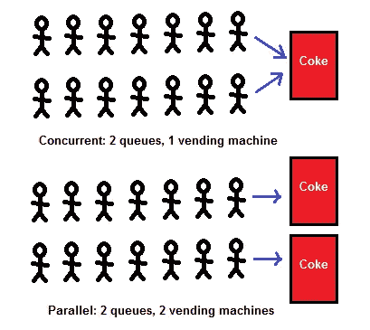
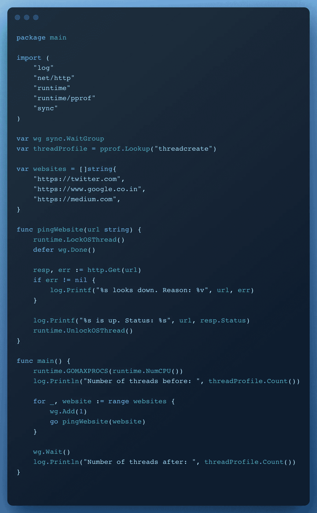

# 并发和并行的简短介绍

> 原文：<https://levelup.gitconnected.com/a-short-intro-on-concurrency-and-parallelism-1417bd04e881>

## 两个明显分开的最好的朋友

我想感谢你停下来阅读这篇博客，而不是滚动 Instagram 并向右滑动。我写这篇博客的真正原因是重温我的并发和并行知识。

我最近通过阅读关于理查德·费曼的文章发现了一种学习方法。该方法规定，

> 尽可能简单地写下你的想法，并考虑如何向那些对这个想法知之甚少或一无所知的人解释。

所以我在这里全力以赴。在我们进入定义之前，考虑一些实际的例子。

**并发**就是只有一只手，用它做某件事，停下来，开始另一件事，停下来，回到第一件事。你把一只手分开在几个活动中。

**平行**就是用双手一只手刷牙，另一只手做发型。

**并发**是两行顾客从一个收银台点餐(各行轮流点餐)；**并行**是两列顾客从两个收银员处点餐(每列都有自己的收银员)。

## 定义:

著名程序员和作家罗布·派克

> **并发**是**同时处理**多件事情，而**并行**是**同时做**多件事情。

书中的 ***务实的程序员***

> 并发是指两段或多段代码的执行就像它们同时运行一样。并行度是指它们同时运行。

从表面上看，两者似乎很相似，我也见过一些开发人员互换使用这两个词，但两者有明显的区别。

让我们通过一些图表更深入地研究一下

## **并发:**

单个 CPU 中的并发性

在现代术语中，CPU 和处理器或多或少是一个意思。因此，请考虑单个 CPU /处理器中的上述场景。执行的**线程**是可以独立管理的最小程序指令序列。

只有一个 CPU 的计算机不能同时执行多个任务。当被赋予多个任务时，比如向 Google、Twitter 和 Medium 网站发出请求，它只是在它们之间切换。这种切换是如此的快速和无缝，以至于对用户来说就像是在进行多任务处理。

## 并行执行:

多个 CPU 的并行性

我们在并发中查看了单个 CPU /处理器，但现在大多数计算机都有多个处理器，并且大多数处理器都有多个内核。当一台计算机拥有多个 CPU 或 CPU 内核，并且同时处理多个任务时，就会发生并行执行。

## 让我们用 go 中的一些代码样本更进一步:

Go 的设计初衷是利用多个内核，它知道如何有效地利用这些内核。为了支持并发性，Golang 提供了 goroutines。

> goroutine 是由 Go 运行时管理的轻量级线程。

一个 goroutine 只需要 2kB 的堆栈空间来初始化。另一方面，一个标准线程可以占用 1MB 的内存，因此创建一千个 goroutines 比创建一千个线程需要的资源少得多。

**并发**

Go 中的并发性

从上面的例子可以看出，通过简单地在方法调用前面加上“go”关键字，可以使 Go 中的方法并发运行。从`main`方法中并发调用`pingWebsite`方法，并将网站状态打印到控制台。在您的 PC 上运行并调试一次，以便更好地理解它。

**并行度**

Go 中的并行执行

上面的例子与前面的例子几乎相似，但是一个主要的变化是我们引入了一个锁机制来模拟并行执行。

这条线

`runtime.GOMAXPROCS(runtime.NumCPU())`

设置可以使用的 CPU 数量，如果未设置，则使用所有可用的 CPU

> GOMAXPROCS 设置可以同时执行的最大 CPU 数量，并返回以前的设置。它默认为 runtime.NumCPU 的值。

这条线

`runtime.LockOSThread()`

通过在下面一行中锁定线程并在任务完成后解锁线程，防止 goroutines 重用现有线程。

`runtime.LockOSThread()`。

从`main`方法并行调用`pingWebsite`方法，将网站状态和执行前后的线程数打印到控制台。代码执行后的线程数量大于执行前的数量。并且记住 Go 可以自动动态创建所需数量的线程。

为了更好地理解它，请在您的计算机上运行并调试这两个示例。

这就是我们如何在 Go 中实现并行执行。默认情况下，Go 调度程序重用没有被阻塞的线程。

你可以在这里找到代码示例。

## **最终想法**

在计算机和工程领域，并发性和并行性有着截然不同的含义，我希望您非常清楚每一个的确切含义。所以如果你问哪个更好，没有单一的答案，你必须弄清楚哪个更适合你的用例。你怎么想呢?并发比并行好吗？还是并行比并发好？苹果比橘子好吃吗？

非常感谢你能走到这一步。你现在可以在网上随意浏览猫的视频了。如果你喜欢这个博客，请为它鼓掌，留下评论，关注更多。

## 参考资料:

1.  [https://jen kov . com/tutorials/Java-concurrency/concurrency-vs-parallelism . html](https://jenkov.com/tutorials/java-concurrency/concurrency-vs-parallelism.html)
2.  https://pkg.go.dev/runtime#GOMAXPROCS
3.  [https://level up . git connected . com/how-to-implementation-concurrency-and-parallelism-in-go-83c 9 c 453 D2](/how-to-implement-concurrency-and-parallelism-in-go-83c9c453dd2)
4.  [https://www.youtube.com/watch?v=oV9rvDllKEg](https://youtu.be/oV9rvDllKEg)
5.  [https://stack overflow . com/questions/1050222/并发性和并行性的区别是什么](https://stackoverflow.com/questions/1050222/what-is-the-difference-between-concurrency-and-parallelism)