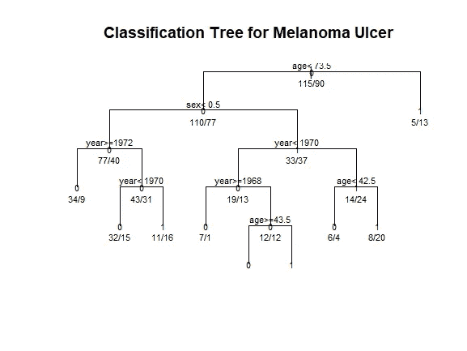
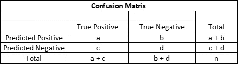
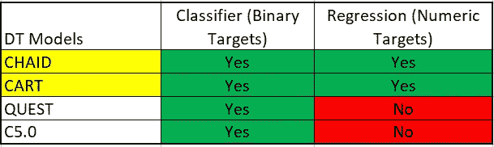

# 决策树简介

> 原文：<https://levelup.gitconnected.com/a-short-introduction-to-decision-trees-9481c36d2c52>

照片由 [niko photos](https://unsplash.com/@niko_photos?utm_source=unsplash&utm_medium=referral&utm_content=creditCopyText) 在 [Unsplash](https://unsplash.com/s/photos/tree?utm_source=unsplash&utm_medium=referral&utm_content=creditCopyText) 上拍摄

这是一棵树。这是一个图表。都是。这是一个决策树！

什么是决策树，如何应用决策树？在这篇文章中，我将分解应用程序，对获得的结果的解释，以及常用的决策树算法类型。

## 定义

决策树(DT)是一种机器学习方法，它将复杂的决策过程分解为一系列更简单的决策，使它们在分析大型数据集时更有效。决策规则也以可视形式生成，允许用户在浏览 DT 时系统地做出决策。

与真正的树非常相似，DT 由根节点(DT 中的第一个节点)、决策节点(分割点)和叶节点(没有进一步分割的端点)组成。

用 R 绘制的分类决策树示例

DT 是通过将数据集递归分割成*异构子集来构建的。*这意味着数据集中的所有对象最初都被视为一个集合。

然后，基于输入值 *X* 和值 *Z 将集合分成两部分，其中* *Z* 表示 *X* 的最大值和最小值的中间值。

然后，数据集被分成两个子集，其中第一个子集包含大于 *Z* 的值，第二个子集包含小于 *Z* 的值。然后重复该过程，直到满足预先指定的标准。

## 常见的决策树类型

*   CHAID *(卡方自动交互检测器)*
*   推车*(分类&回归树)*
*   QUEST *(快速、无偏、高效的统计树)*
*   c 5.0*(ID3 的继承者，迭代二分法 3)*

## CHAID

CHAID 决策树既可以作为估计器，也可以作为分类器，并且允许多种分裂方式。这意味着允许超过 2 个决策节点，并且对二进制和数字目标都有效。

CHAID 算法通过以下过程工作:

1.  识别每个输入的最重要分裂点
2.  比较输入，选择最重要的输入
3.  数据根据所选的输入进行分区
4.  每个分割点都被重新分析，以便进一步分割

## CHAID 的局限性

*   CHAID 树将无限增长，直到达到树的最大深度
*   在引导节点处不会发生进一步的分裂

因此，为了使用 CHAID 算法避免这些问题，建议通过设置最大树深度来设置停止标准，以防止决策树无限增长。

## 手推车

CART 或分类回归树不需要假设数据分布。与 CHAID 相似，它允许输入是分类变量和连续变量的混合。这对于大型数据集来说很方便，因为它提供了一些关键变量的有价值的结果。

CART 算法通过以下过程工作:

1.  获得每个输入的最佳分割点
2.  基于步骤 1 中每个输入的最佳分裂点，识别新的“最佳”分裂点
3.  根据“最佳”分割点分割所选输入
4.  继续拆分，直到满足停止规则或没有进一步的拆分可用

算法通过使用*杂质测量值*来量化节点的纯度。当目标值或类别是同质的，并且不希望进一步分裂时，节点被认为是“纯”的。

CART 用来确定节点杂质的杂质度量包括*基尼杂质指数*和*分裂准则*。

尽管这两种算法都允许它们处理二进制目标和数字输出，但是 CHAID 和 CART 之间还是有一些重要的区别，如下表所示。根据您问题的背景，您可以选择最佳的 DT 来申请。

## 探索

快速、公正、有效的统计树的首字母缩写。它主要用于克服 CART 中的两个问题。

众所周知，CART 的计算开销很大，因为该算法使用大量的计算能力来搜索拆分输入。它还有昂贵的节点杂质评估，并且倾向于选择非度量输入，即使它们是独立的。因此，这使得 CART 成为一个有偏见的输入选择算法。

另一方面，QUEST 通过对输入选择应用统计测试，通过以下过程来消除偏差:

1.  在每一个节点识别出要分割的统计上最重要的输入
2.  对于每个选择的输入，基于统计显著性选择最佳分裂点
3.  然后应用修剪来防止 DT 过度生长

# C5.0

*迭代二分器 3 (ID3)的后继者*，其中是一种算法，该算法使用熵&信息增益作为其分裂准则，仅对标称输入起作用，并且继续分裂，直到所有节点都是“纯”的。

存在一些限制，例如:

*   仅允许名义输入
*   支持具有多个分区的输入
*   缺乏防止 DT 过度生长的修剪能力

C5.0 是一个相对黑箱的模型，作为 ID3 的后继者，它能够:

*   构建更小的树
*   更快的计算时间
*   处理大型数据集
*   采用增强来提高预测准确性
*   处理不同类型的输入和缺失值
*   通过*子树替换*来修剪 DT 的能力(如果总体错误率没有降低，用叶节点替换子树的能力)和子树*提升*(通过子树最常用的子树将子树提升到更高的节点)

C5.0 通过使用*增益比*来选择具有多个值的输入。

最后，DT 模型提供了一种基于数据划分的评估和分类方法。

虽然它们很容易解释，但重要的是要记住，虽然上面提到的四种 DT 模型都可以作为分类器工作，但只有 CHAID 和卡特可以同时作为二进制和数字目标工作。

此外，不同 DT 模型的结果可用于相互比较。确定 DT 型号的[性能的最常见方法是使用混淆矩阵。](https://medium.com/@lzpdatascience/performance-measures-of-predictive-models-5e387941ea26)

根据使用的[性能指标](https://medium.com/@lzpdatascience/performance-measures-of-predictive-models-5e387941ea26)，它允许用户在多个型号中选择最佳型号。

好奇的学习者？释放你在媒体上学习的全部潜力，用不到一杯咖啡的钱支持像我这样的作家。

 [## 通过我的推荐链接加入媒体——杰森·LZP

### 作为一个媒体会员，你的会员费的一部分会给你阅读的作家，你可以完全接触到每一个故事…

lzpdatascience.medium.com](https://lzpdatascience.medium.com/membership)