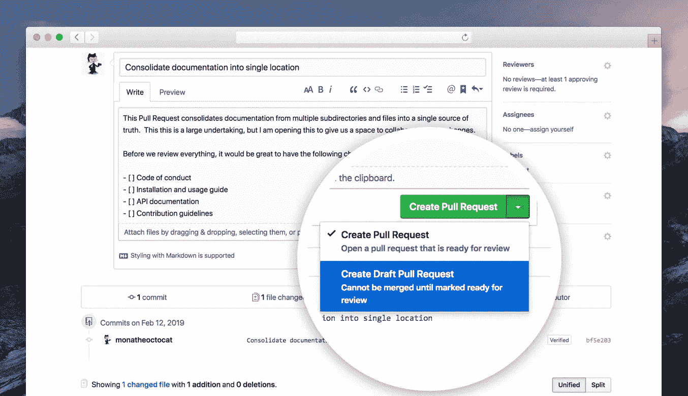
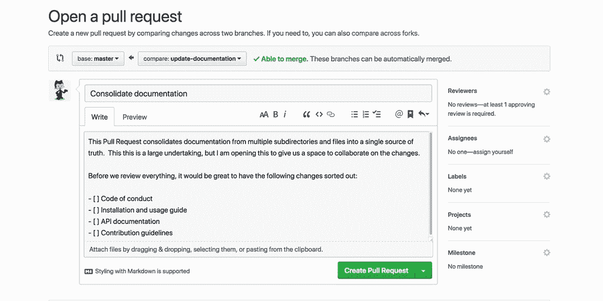

# 拟定拉式请求的简短介绍

> 原文：<https://levelup.gitconnected.com/a-short-introduction-to-draft-pull-requests-81d46fea4d7f>

以及他们如何让我成为更好的工程师的故事

今天我想花点时间和你分享我一直以来最喜欢的 Github 特性之一——草稿拉取请求。大约 12 个月以来，我一直在我的开发流程中积极地使用它们。

最近，我意识到处理拉取请求草案极大地改善了我构建和组织日常工程工作的方式，以及我解决问题和为利益相关者交付价值的效率。

# 先决条件

我假设你熟悉基本的 Github [开发流程](https://guides.github.com/introduction/flow/)来处理这个话题。如果不是这样，我建议你花时间熟悉它。相信我，你不会后悔的。

# 介绍

以下是适用于正常拉取请求的特征列表:

*   它们使您能够开始讨论您在属于特定 Github 存储库的分支中提交的代码
*   其他开发人员可以检查您的代码，并给出改进和优化的建议
*   一旦讨论阶段结束，每个人都对您的提议感到满意，您就可以将您的拉请求合并到主分支中，并正式将您的更改添加到代码库中

现在，让我们来看一下汇票提取请求的独特特征:

*   他们明确地将您的代码变更标记为“工作进行中”
*   它们不能直接合并到主分支中

# 减贫战略草案的含义

当您打开一个拉动式请求并将其状态设置为“草稿”时，您实际上是在向您的团队成员做出以下陈述:

> 嘿，各位同事，
> 正如你们所知，我目前正在研究问题 x 的解决方案。是的，我知道我的实施远未完成，所以我还不准备打开 PR 进行审核。但是，我希望得到您对我计划采取的方法的反馈和见解。

毕竟，你越早开始对话，就越容易就编码解决方案的最佳方式达成共识。

# 如何起草 PRs 使我成为一名更好的工程师

在我开始处理 draft pull 请求之前，我有点羞于与同事分享未完成的工作。我一直认为，如果我的实现看起来不尽如人意，他们会看不起我。我知道这听起来很荒谬，但在当时——这是我的真理。

参与 PRs 草案帮助我改变了思维模式。你看，现在我有办法把我的工作放在那里，并把它标记为进行中。这自动地减轻了我之前加在自己身上的压力。我不再需要在让我的同事看之前“生产”出“完美的”代码。

随着时间的推移，我意识到一个事实，它一直在盯着我——如果我推出一个不完美的实现，没有人会评判我或责备我。事实上，人们会不厌其烦地帮助我，分享他们对我的工作的想法，并给我一些如何使我的代码更好的想法。

所以我开始对与他人分享我的工作感到兴奋。我不再关心我的实现是否是“有史以来最好的实现”。我只是想通过从我的队友那里获得尽可能多的反馈和输入来作为一名工程师学习和成长。你看，在起草减贫战略的过程中，我学到了一个非常重要的经验——靠我自己，我只能做到这一步。如果我真的想加速我作为开发人员的成长，我需要允许自己从周围人的经验中学习。

# 结论

你可能知道，我是使用 PRs 草案的忠实支持者。我亲身经历了他们对我和我的队友的积极影响。这就是为什么我建议检查他们。它们可能对你有好处，也可能没有。但是正如我的导师经常告诉我的那样——*你从不尝试，你永远不知道*；)