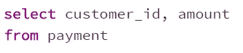
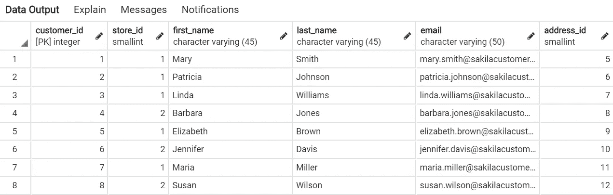

# SQL 简介

> 原文：<https://levelup.gitconnected.com/a-short-introduction-to-sql-bb46ff07cd10>

泰勒·维克在 [Unsplash](https://unsplash.com/s/photos/network?utm_source=unsplash&utm_medium=referral&utm_content=creditCopyText) 上的照片

SQL 代表结构化查询语言，用于存储、操作和检索数据库中的数据。有各种类型的数据库管理系统，有些可能包括:SQL Server、MySql、Postgres、Oracle 等。

然而，不管数据库系统如何，查询语言的基础很可能保持不变，尽管它们之间有一些语法差异。

SQL 允许您从关系数据库的表中查询数据。这允许系统检查一个表中的值是否与另一个表匹配。由于能够提取分析所需的相关数据，SQL 是一种有用的数据库编程语言。

在这篇文章中，我想与大家分享 SQL 查询中常用的命令，并将在下面的例子中使用 PostgreSQL。

## 1)选择&从

对于所有 SQL 查询，必须使用 SELECT 函数提取列名列表。此外，我们计划使用 FROM 函数提取列的数据集或表。

例如:

SELECT 函数将使我们能够从 customer_id 和 amount 列中提取数据。

如果我们希望从数据集中的所有列收集数据，我们可以用星号*替换列名

查询的示例数据输出

## 2)不同的&排序依据

从上面的输出示例可以看出，同一个客户(customer_id)有各种重复的交易。要删除重复的值并只保留每个记录中的一个，也就是*唯一值*，我们可以在 SELECT 函数后使用 DISTINCT。

查询的示例数据输出

此外，我们还可以使用 ORDER BY 函数以升序 *(asc)* 或降序 *(dsc)* 格式对数据进行排序。

按升序排序的查询的示例数据输出

## 3)聚合(计数、总和、AVG、最小值、最大值)和分组依据

在处理连续或数字变量时，通常可以使用计数、求和、平均、最小值和最大值等基本聚合函数为用户提供基本统计数据。

在选择函数之后，可以获得支付数据集中的最小、最大和平均金额等聚合函数，如下所示:

查询的示例数据输出

假设我们希望按照每个 customer_id 对这些值进行分组，我们可以在 FROM 函数之后应用 GROUP BY 函数。

以及 DISTINCT 函数，只显示升序排列的 customer_id 中的唯一值。

查询的示例数据输出

## 4)哪里

WHERE 函数允许我们返回一组关于特定子句的信息。例如，属于特定日期或客户 id 等的记录。

需要注意的一点是，WHERE 函数不允许在子句中进行聚合。

查询的示例数据输出

WHERE 函数还可以与 AND 和 OR 等条件子句耦合。

查询的示例数据输出

## 5)拥有

如果希望通过聚合来过滤数据，可以在 GROUP BY 语句后应用 HAVING 函数。

查询的示例数据输出

## 6)案例

CASE 函数允许用户查询 CASE 中的一组命令。需要 END 函数来结束 CASE 函数。并且在 CASE 函数中至少需要一个 WHEN 或 THEN 命令。

CASE 函数通常嵌套在 SELECT 函数中。

WHEN 函数也必须是二进制数据类型，其中条件只能有两种状态。真或假，1 或 0。

此外，不在 case 函数中的值将作为[null]返回

查询的示例数据输出

为了在 CASE 函数中有多个参数，我们还可以使用 OR 函数添加另一个条件。

查询的示例数据输出

## 7)内部连接

有时，您可能会处理多个数据表，通过内部连接函数，可以使用一个公共列合并两个表。

假设我计划连接两个表，*付款*和*客户*表，并显示以下列:客户标识、付款日期和租赁标识。

此外，我将基于一个类似的列即 customer_id 来合并两个表。

查询的示例数据输出

## 8)完全加入

如果您想合并两个表中的所有结果，可以使用完全连接函数。相比之下，外部连接函数只允许在一个公共列上合并两个表中的不同列。

假设我想基于每个表的公共 customer_id 连接属于两个不同表 payment 和 customer 的一些列。

付款表中的列

客户表中的列

查询的示例数据输出

虽然在现实中，查询可能没有这么简单，而且还有更多函数，比如子查询，但是上面提到的函数应该足以生成基本的查询。我希望你喜欢这个关于 SQL 的小指南！

好奇的学习者？释放你在媒体上学习的全部潜力，用不到一杯咖啡的钱支持像我这样的作家。

 [## 通过我的推荐链接加入媒体——杰森·LZP

### 作为一个媒体会员，你的会员费的一部分会给你阅读的作家，你可以完全接触到每一个故事…

lzpdatascience.medium.com](https://lzpdatascience.medium.com/membership)