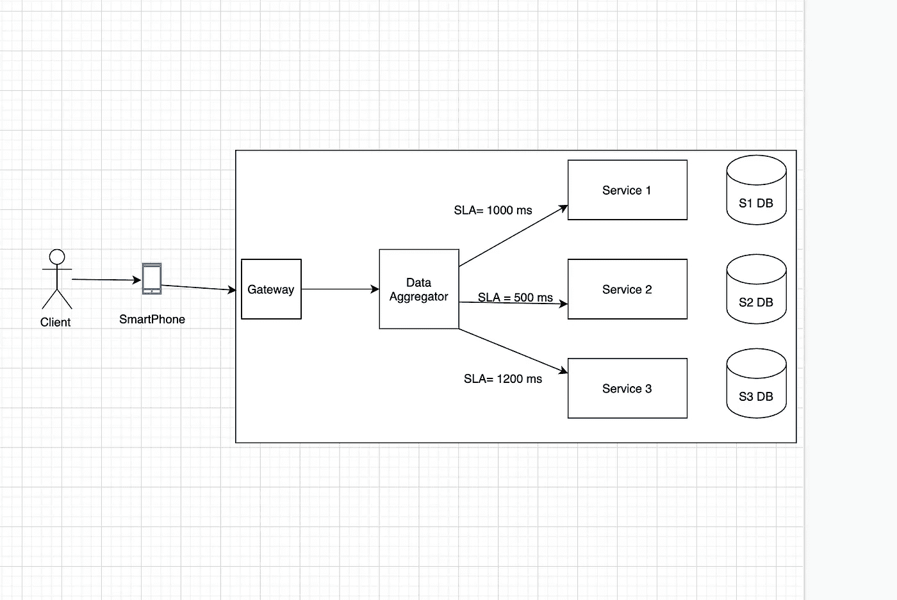

# 关于微服务架构中级联故障的简短说明

> 原文：<https://levelup.gitconnected.com/a-short-note-on-cascading-failures-in-microservices-architecture-8d80cfb8eb5d>

如果说在过去十年左右的时间里，应用程序开发风格和部署模式发生了重大转变，那就是从单一应用程序开发向微服务的迁移。

后者通过将较大的应用程序分割成各种较小的块，每个块被称为一个微服务，为我们提供了各种优势。

*   每个块可以用不同的编程语言编写，并有自己的数据库，以适应块的规模。
*   每个块都可以根据其处理量独立扩展。
*   构建时间和应用程序启动时间将大幅减少，这使我们能够在任何微服务因资源中断或任何未处理的异常而崩溃的情况下减少停机时间。
*   **更重要的是，如果一项服务出现问题，不会影响整体漏斗**。

较新的微服务架构给我们带来了许多这样的优势，但有一件事也是最重要的一件事，这种方法未能给我们带来**信任。**

我所说的信任是指一个服务对所有依赖服务的信任，以及依赖服务对各自依赖服务的信任。不能信任其他服务的原因是

*   通信通过可能不可靠的网络进行。
*   其他服务的核心功能是以这样一种方式抽象出来的，即调用者不确定为了服务于调用者所需的响应，其他服务的处理量有多大。
*   打电话的人被限制在一个范围内，如果在他的范围之外出了问题，他/她将无法解决。

就通信而言，呼叫者和接收者之间存在许多这样的信任问题，但最终，当客户请求我们的应用时，根据微服务架构提供的承诺，任何叶服务中的一个故障都不会影响整体漏斗。一个服务故障影响整个漏斗的过程被称为**级联故障。**

所以不用吹嘘太多的理论细节，让我们得到一些实用的知识。在这篇文章中，我将详细介绍我们几周前经历的一次级联故障，那次故障导致整个[goibibo.com/hotels](https://goibibo.com/hotels)陷入混乱。

对于任何一种面向客户的产品，系统响应用户请求的时间是衡量用户满意度的关键。记住这一点，在根据生产级资源对其服务进行基准测试后，每个服务确定其自己的 SLA(服务水平协议)。

SLA 协议中有很多关键的东西，响应时间就是其中之一。响应时间进一步分为 3 个部分。

*   95%响应时间(50 毫秒)
*   97%响应时间(200 毫秒)
*   99%响应时间(500 毫秒)

这表示在我的服务收到的 100 个请求中，95 个在 50 毫秒内得到服务，97 个在 200 毫秒内得到服务，99 个在 500 毫秒内得到服务。在大多数情况下，99%的响应时间被认为是服务的响应时间 SLA。

但是这里有一个问题。

为了确保 100 个请求中有 99 个得到适当的服务，我们在客户端设置了更长的等待时间。客户端假设 95 个请求在 50 毫秒内得到服务，由于各种原因，如请求排队、上下文切换等，只有 4 个请求花费了更多时间，并基于此向其他上游服务提供其 SLA。

假设接收方服务进行了一些数据库更改或者进行了一次有缺陷的发布，并且接收方服务的 95%响应时间现在超过了 500 毫秒。

为了简单起见，假设我在 **1 核 CPU** 上运行这些微服务的 1 个实例。现在，我收到一个请求，并对这 3 个叶服务中的每一个进行并行调用，一旦它们都返回响应，我将处理来自所有 3 个叶服务的数据，并将聚合响应返回给移动前端以呈现数据。

聚合器从所有相关服务获得响应所花费的总时间是**最大响应时间(S1、S2、S3) +上下文切换次数*每次上下文切换所花费的时间。**

一旦聚合器收到来自网关的调用，服务请求的工作就交给单个 CPU 核心。现在，一旦聚合器到达调用这 3 个服务并等待响应的点，CPU 就会切换上下文来服务下一个等待的请求，所有即将到来的请求都会发生同样的情况。

如果请求在很短的时间内完成，等待队列将会很少，CPU 上的负载也是如此，但是一旦任何相关服务的响应时间增加，等待完成的半熟请求的数量将开始排队，随着排队的增加，它不仅会影响我们已经获得的请求，还会影响新的请求，因为这些请求将被放在队列的末尾，等待 CPU 为它们服务。

这意味着服务 1 SLA 的缺点正在影响所有直接或间接依赖的上游服务。但是，如果我们看看我在本文开始时指出的优势(**更重要的是，如果一个服务出现问题，它不会影响整体漏斗)，**这个条件被打破了。那么，我们如何处理这种级联故障呢？

这就是断路器发挥作用的地方。请继续关注我的下一篇关于断路器的文章，我将简要介绍这些断路器的功能以及如何设置断路器。