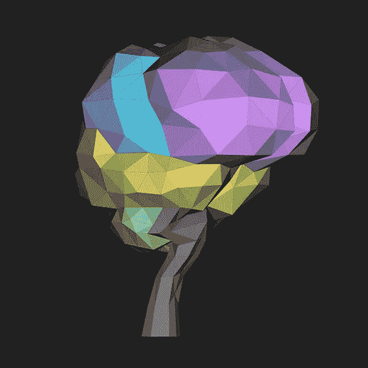

# 颤振中的简单三维发动机

> 原文：<https://levelup.gitconnected.com/a-simple-3d-engine-in-flutter-cc4a7edc943e>

由于无法访问 GPU，我们将不得不用这种老办法。

一个简单的大脑 3D 模型，在颤动中渲染

80 年代末 90 年代初，我第一次在雅达利 st 上学习编程。当时，我们没有像 OpenGL 或 Metal 这样的框架；没有*“接近直接访问图形处理单元。”*所以，就像我们的前辈一样，我们用数学从零开始，艰难地制造了 3D 引擎。

虽然 Flutter 使用 OpenGL 来呈现其小部件，但它并没有为我们提供访问底层硬件的 API。如果我们不能使用 GPU，我们将不得不在 CPU 上进行计算。

一个 CPU 渲染器不会很快，但它简单易懂，易于构建，仍然可以用于一些有趣的效果。

让我们开始吧。

## 首先，我们需要一个 3D 模型

虽然 3D 数据有*多*种文件格式，但最简单的可能是[波前对象格式](https://en.wikipedia.org/wiki/Wavefront_.obj_file)。它包含；一个点列表，一个面列表，以及一些对颜色和纹理的引用，所有这些都是人类可读的文本。

首先，我们将包含一个对象(。obj)和材料(。mtl)文件，然后我们使用 [Flutter 的全局根包](https://flutter.dev/docs/development/ui/assets-and-images#loading-text-assets)将它们作为字符串加载。

使用 Flutter 的全局根包加载资源

一旦我们有了字符串，我们将把它们解析成对象。结果是 3D 空间中的点列表和引用这些点的三角形列表。

解析波前。OBJ 文件

## 现在我们需要一些数学知识

我们已经有了模型。现在我们需要旋转、缩放和变换它。互联网上有很多关于 3D 图形的教程，我不会在这里面面俱到，但基本内容是这样的:

对于我们模型中的每一个点，我们围绕它的原点旋转、平移和缩放它。然后，我们根据人脸离相机的距离对它们进行分类，并从距离最远的开始绘制。

我们在有状态小部件的`paint()`方法中完成所有这些工作，该小部件扩展了`CustomPainter()`类。

每一帧我们都重新绘制画布

这里批判的称呼是`_calcVertex()`；它是做大量数学运算的人。

旋转、平移和缩放顶点

我们使用一个 4x4 的矩阵来旋转、平移和缩放我们的顶点。除了一些光照计算，这个项目中所有的矢量数学都使用 Dart [矢量数学库](https://pub.dev/packages/vector_math)。

## 我们准备好画我们的模型了

我们终于准备好了。对于每个面，我们计算光照，根据其亮度导出颜色值，并使用 Dart 的`Path()`命令绘制面。

在画布上渲染一个面

## 添加用户控件

我们最后的任务是允许用户旋转模型。Flutter 通过其`dragUpdateHandler`让这一切变得简单。

使用 Flutter 的 dragUpdateHandler 拖动以旋转模型

## 最后的想法

这篇文章不是一个 3D 引擎的严肃尝试，更像是一个学习更多关于 Flutter 和 Dart 的练习。我在这里分享它，以回应一些论坛帖子的类似要求。

你可以在这里找到完整的代码:

 [## RichardCubed/flutter_demo_3d

### 有什么比快速 3D 引擎更好的学习框架的方法呢？这个项目是作为技术高峰的一部分而创建的…

github.com](https://github.com/RichardCubed/flutter_demo_3d)