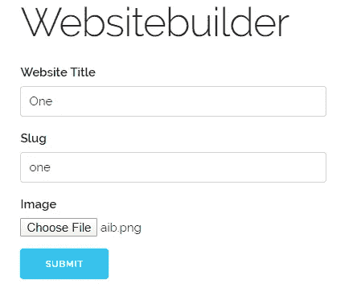
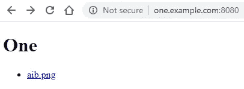
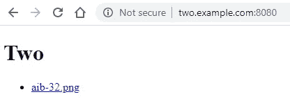

# 一个简单的 DIY 网站建设者

> 原文：<https://levelup.gitconnected.com/a-simple-diy-website-builder-2c38855b2d90>

## 通过 11ty 和 NGINX 构建动态生成和服务网站的管道


由 [Domenico Loia](https://unsplash.com/@domenicoloia?utm_source=medium&utm_medium=referral) 在 [Unsplash](https://unsplash.com?utm_source=medium&utm_medium=referral) 上拍摄的照片

让我们开门见山吧。要求如下:假设我是`example.com`的所有者，我想让用户通过一种形式生成自己的网站，基于预先指定的主题，通过上传自己的数据和图像。然后，我希望他们的网站通过`<slug-selected-by-the-user>.example.com`提供服务。

为了保持简单和最小化，本例中的用户将只上传网站的标题(数据)和一张图片。

# **规格**

*   我将使用 [NestJS](https://nestjs.com/) (一个用于构建高效、可靠和可伸缩的服务器端应用程序的渐进式 Node.js 框架)来创建应用程序，只是为了看一看它。我们可以使用 ExpressJS 或其他服务器端框架。
*   网络服务器将是 NGINX，通过 docker 为静态网站提供服务。您也可以通过 NGINX 作为反向代理运行该应用程序，但我没有在本例中实现它。
*   用户将提交由该应用程序呈现的表格，带有网站标题、一段文字和一张图片。
*   web 应用程序将使用 [11ty.dev](https://www.11ty.dev/) (当然，其他静态站点生成器也会这样做)使用提供的数据和图像生成静态网站。我使用了这个[教程](https://www.zachleat.com/web/eleventy-tutorial-level-1/)中的简单模板来生成网站。
*   然后，应用程序会将 docker 中生成的文件复制到 NGINX 配置指定的路径中。它还会将该特定站点的配置文件(服务器块)再次复制到 NGINX 容器中的另一个路径。
*   最后它会重启 NGINX。
*   NGINX 通过它的*虚拟主机*功能(服务器块)将从它们自己的子域为网站提供服务。

完整的代码以及在本地安装、运行和测试的说明可以在以下位置找到:

[](https://github.com/kyrcha/websitebuilder) [## ky rcha/网站构建器

### 克隆 repo: git 克隆 https://github.com/kyrcha/websitebuilder.git 安装应用依赖:构建 nginx…

github.com](https://github.com/kyrcha/websitebuilder) 

# 建设管道

首先，我们用默认配置运行一个 NGINX 容器:

```
docker run --name webserver -d -p 8080:80 nginx
```

服务器应该在`[http://localhost:808](http://localhost:8080)0`处于活动状态。我们还有 NestJS 应用程序，我们从它开始:

```
npm run start
```

安装完它的依赖项后。它运行在`[http://localhost:3000](http://localhost:3000)`上。

处理该过程的 NestJS 控制器可以在下面的要点中找到(它不想在代码质量方面获得任何奖牌)。

这些步骤是:

1.  接收带有数据(标题、辅助信息)和图像的 post 请求。
2.  创建一个临时目录来存储所有东西:`./tmp/<slug>`
3.  在里面，创建一个目录来存储上传的图像:`./tmp/<slug>/img`
4.  将图像保存到目录中。
5.  将数据保存到保存在`./tmp/<slug>/_data`内的一个名为`site.json`的文件中
6.  复制`./tmp/<slug>`里面的模板。你当然可以有多个模板，并询问用户想要使用哪一个。
7.  创建输出目录`./tmp/<slug>/_site`
8.  通过`shelljs`运行 11ty 命令，建立指定输入目录、输出目录和观看格式的网站。
9.  将 NGINX 运行容器中`./tmp/<slug>/_site`的内容复制到目录`/usr/share/nginx/html/<slug-selected-by-the-user>.example.com/`中。
10.  在目录`/etc/nginx/conf.d`中运行的 NGINX 容器内创建、存储和复制一个服务器块配置文件，如[这个](https://github.com/kyrcha/websitebuilder/blob/master/nginx/sites-conf/example.conf)。
11.  用`docker container exec webserver nginx -s reload`重启容器内的 NGINX 服务。
12.  App 向 AJAX 请求返回 201 状态码，如果失败则返回 500。

# 测试整个管道

由于我们使用虚拟域名值，为了在本地测试管道，我们需要更改 hosts 文件，以便域名与我们的本地 IP 地址匹配，并由我们的本地 web 服务器处理。

对于 Windows [,这里的](https://www.thewindowsclub.com/hosts-file-in-windows)是更改主机文件的一个很好的指南。对于 Linux，请查看本[指南](https://www.digitalocean.com/community/tutorials/how-to-set-up-nginx-server-blocks-virtual-hosts-on-ubuntu-16-04)。由于我在本例中使用的是 Windows 10，因此该文件位于:

```
C:\Windows\System32\drivers\etc
```

对于我计划通过表单在我的机器上创建的两个域，我在文件末尾附加了这两行:

```
192.168.0.59 one.example.com [www.one.example.com](http://www.one.example.com)
192.168.0.59 two.example.com [www.two.example.com](http://www.two.example.com)
```

您在 Windows 中的本地 IP 可以通过`ipconfig`命令找到。

现在，从浏览器导航到运行 NestJS 应用程序的 [http://localhost:3000](http://localhost:3000) ，填写表单(一个，一个，上传一张图片)并点击提交:



当页面提示您成功时，导航至`http:\\one.example.com:8080`。您应该会看到这个页面:



如果您在表单中填写一些其他数据(例如两个，两个和另一个图像)并导航到`http:\\two.example.com:8080`，你得到如下页面:



使用这样的管道，我们能够动态地生成由同一个 web 服务器提供服务的多个网站，但是每个网站都有自己的子域。然后，用户可以在他们的 DNS 提供商中使用 CNAMEs 来将这些域映射到其他拥有的域。我们可以做的其他事情包括:

*   为包含数据和图像的 zip 文件创建一个 dropzone。
*   有多个主题可供选择。
*   安装一个[用户库](https://github.com/encrypted-dev/userbase)的实例，让你的静态网站安全而私密。
*   添加某种[前端编辑器](https://grapesjs.com/)来根据你的需求改变主题和结构。

# 参考

*   [如何在 Ubuntu 16.04 上设置 Nginx 服务器块(虚拟主机)](https://www.digitalocean.com/community/tutorials/how-to-set-up-nginx-server-blocks-virtual-hosts-on-ubuntu-16-04)
*   [如何在 Windows 10 中锁定、管理、编辑主机文件](https://www.thewindowsclub.com/hosts-file-in-windows)