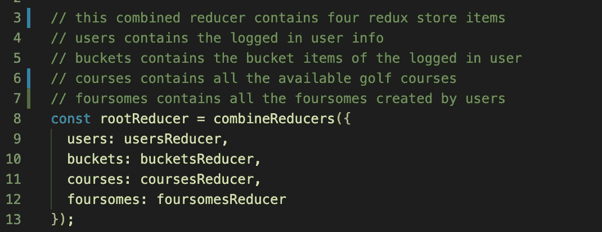
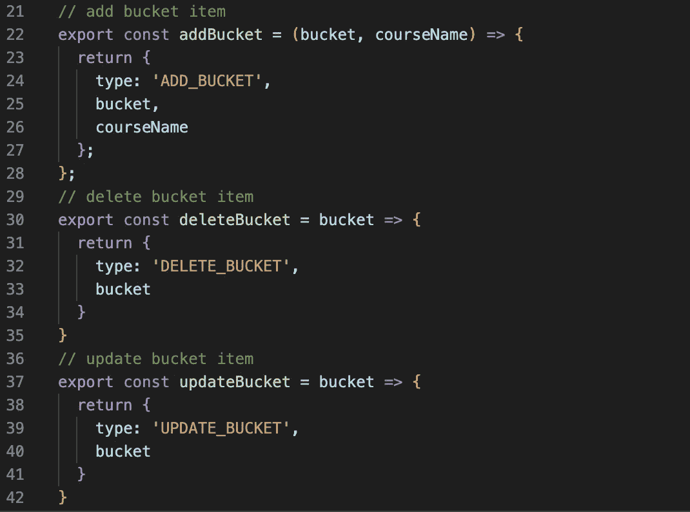
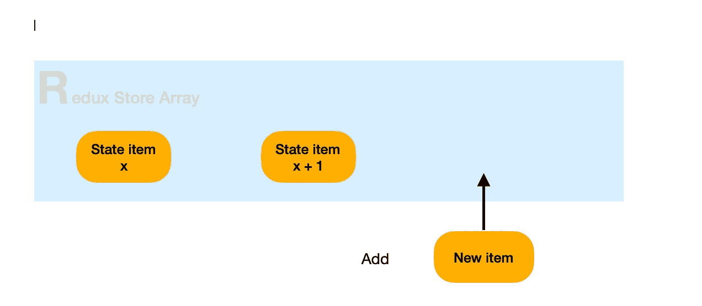
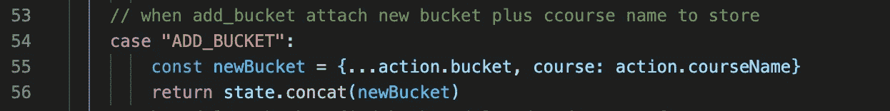
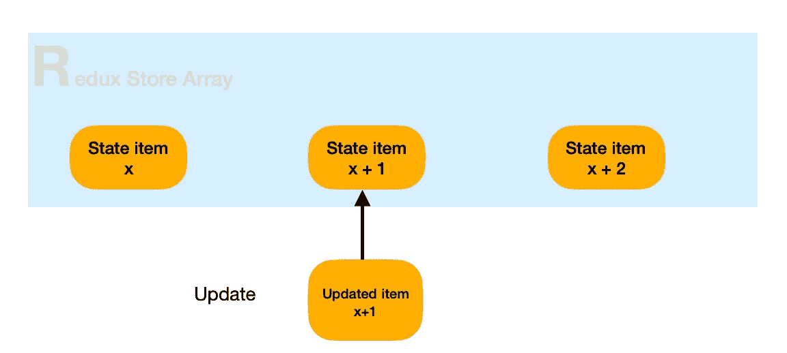
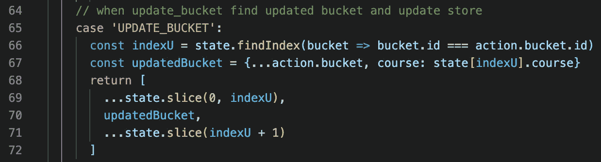
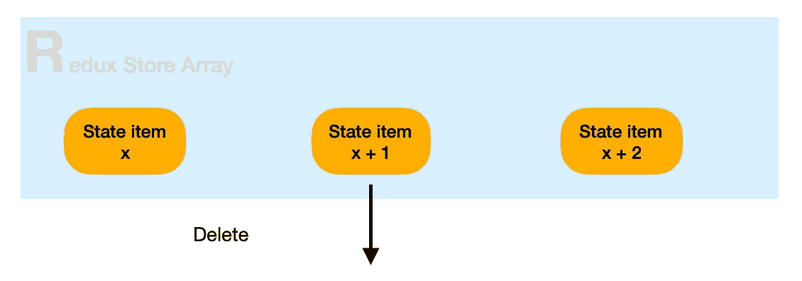
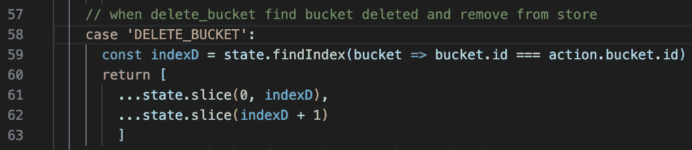

# 关于更新 Redux 存储的简单说明

> 原文：<https://levelup.gitconnected.com/a-simple-explanation-on-updating-redux-store-8e9bc6c8e279>

Redux 为我们提供了一个中心位置来存储我们的应用程序的各种状态，而无需在 React 中遍历组件树来执行更新。此外，通过使用 combineReducers，我们可以将我们的状态分成不同的段，并隔离特定于某种类型的数据和代码。

在这个例子中，我有四种类型的数据需要在我的应用程序中处理。combineReducers 让我可以通过我设置的键访问所有这些内容——用户、桶、课程和四人组。让我们看看 bucketsReducers，看看我们如何更新 Redux 存储的这一部分。

在大多数应用程序中，当后端的数据更新时，需要更新 Redux 存储，我们需要更新存储以反映相同的变化，以便在不从后端重新加载更新数据的情况下向前端呈现。在大多数情况下，它涉及添加、更新和删除。我们向表中添加一行，更新表中某一行的一些信息，或者删除表中的某一行。Redux 中的匹配动作将是向状态数组添加一个项目，更新状态数组中的一个项目，或者从状态数组中删除一个项目。让我们一次看一个。

在 Redux 中，我们通过导出的动作来访问 reducers。这些是我用来添加、更新和删除的。重要的是动作类型和每个动作的有效负载。对于每个动作类型，该函数接收要被操作的项目，然后动作类型和有效负载(通常是您接收到的)被传递给 reducer。

# 增加

假设您已经执行了一个 fetch 调用来更新后端数据库，现在是时候更新 Redux store 了，这样您的新项目就可以显示了。使用 Redux，我们需要将有效载荷项插入到状态数组中。以下是需要做的事情的简单描述。

在 bucketReducer 中，我们需要做的就是将条目添加到数组中。动作的有效负载部分被创建到一个新对象中，然后这个新对象通过一个 concat 方法被添加到数组的末尾。

# 更新

通过 update，我们用新信息更新现有的 Redux 存储项。

在 bucketReducer 中，我们需要找到更新的项目，并用更新的项目替换它。首先，我们使用 findIndex 找到状态数组中项的索引。在上图中，x+1 是需要更新的项目的索引。一旦创建了更新的对象，最快的更新方法是使用切片方法和展开运算符(…)。我们实际上是把状态数组分成三部分。第一个块是一个数组，包含从数组头到 x 的项。第二个块是我们需要更新的项(x+1)。最后一个块是从 x+1 (x+2)之后到数组末尾的数组。

我们现在可以通过[…chunk1，updated item，…chunk3]用更新的项替换 chunk2 来组装更新的数组。

# 删除

删除类似于 Redux store update 中的更新，因为我们删除的是一个项目，而不是替换它。

在 bucketReducer 中，我们需要找到要删除的项目，并将其从状态数组中删除。就像在更新中一样，我们将数组分割成三部分。然而，我们并没有用更新的条目替换 chunk2，而是把它扔掉了。

通过使用 spread，我们现在只使用 chunk1 和 chunk3 重组数组，就像这样— […chunk1，…chunk3]。删除的项目(chunk2)现在从我们的 Redux 商店中消失了。

热毒星快乐！