# 在托尔托伊塞吉特摘樱桃的简单指南🍒

> 原文：<https://levelup.gitconnected.com/a-simple-guide-for-git-cherry-picking-in-tortoisegit-61c3440e5ad6>

## 和解决 VS 代码中的冲突

几周前，我写了一篇关于 Git 子模块的文章。这是该主题的后续，因为我将使用 TortoiseGit 描述 **Git cherry picking。我还将向您展示**如何解决提交中的冲突**，其中可能还包含**子模块**。我使用 Visual Studio 代码，所以我也有一个关于同时使用这两个程序的技巧。**

# 什么是 Git cherry pick？

Git cherry pick 是一个命令，它使我们能够从一个分支中选择我们想要的提交，并将其应用到另一个分支。我认为这是最常见的情况。例如，假设我们有两个分支。其中一个是开发分支，我们提交所有的变更，另一个是特性分支。在某些时候，我们需要从开发分支中选择(挑选)某些提交，并将它们应用到特性分支。

在下图中，我们从开发分支的历史中挑选了 3 个提交，并将它们应用到特性分支。因此，每个选定的提交都代表一颗樱桃。

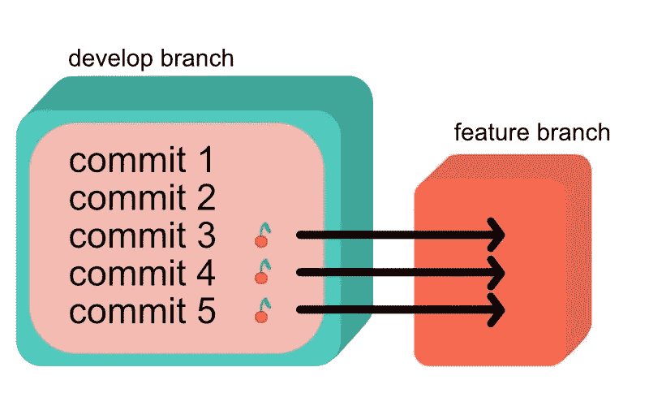

摘樱桃

让我们看看如何用 TortoiseGit 接口来实现它。

# 托尔托伊塞吉特的樱桃采摘

首先确保您已经检查了**正确的分支**。在上面的例子中，您必须在特征分支中。右键单击存储库所在的文件夹，您会看到一个包含几个选项的上下文菜单。如下选择 Git 同步选项。

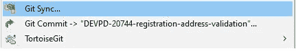

您将看到以下窗口。在左下角点击**显示日志**。(您也可以从上下文菜单中访问日志:TortoiseGit - >显示日志)

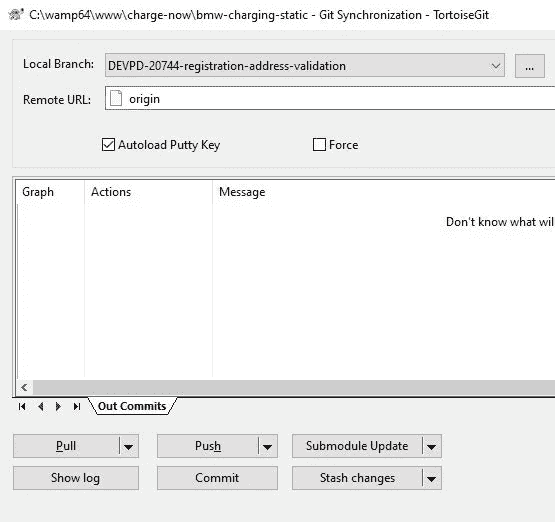

单击显示日志

现在我们将看到一个窗口，显示我们所在分支的提交日志。在左上角单击分支机构的名称(下面截图中的 DEVPD-20744-…),将会打开另一个窗口。

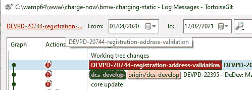

切换到您想要从中挑选提交的另一个分支

新窗口将包含所有分支的列表。选择一个要从中挑选提交的提交，然后搜索特定的提交。下图显示了已经过滤的提交列表，因为我在搜索栏中输入了 20744。这些是我想要挑选的提交，所以我选择了它们，右键单击并选择'**挑选选中的提交…** '选项。

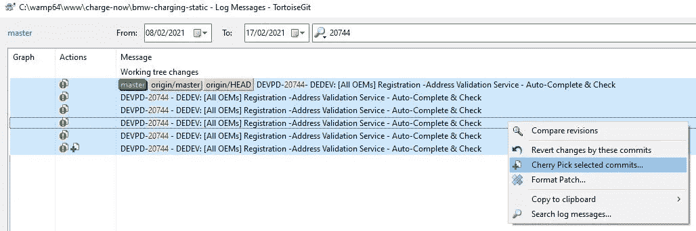

精选选定的提交

如果一切顺利，你会看到这样的东西。一个绿色进度条和一个“完成”按钮，单击该按钮可以关闭窗口。

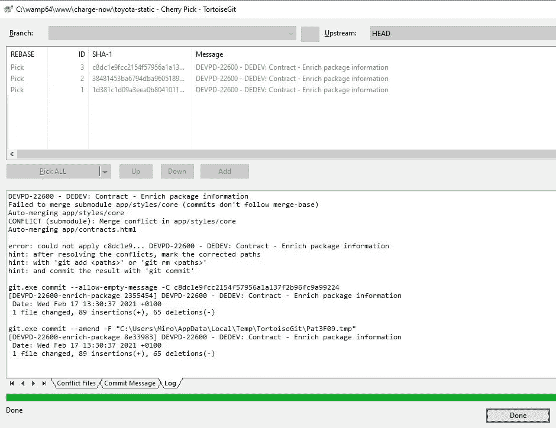

太好了！所有的提交现在都已经应用到另一个分支，您应该也可以在日志中看到它们。

比阿特丽斯·福马尔斯在 [Unsplash](https://unsplash.com?utm_source=medium&utm_medium=referral) 拍摄的照片

# 编辑冲突

在采摘樱桃期间，你可能会遇到一些冲突。在继续之前，您应该先解决它们。有几个选项可供选择:

*   编辑冲突
*   断然的
*   使用“Cherry_pick_head”解决冲突
*   用“头”解决冲突

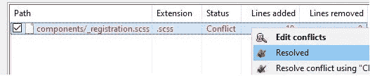

有时你可能需要先回顾一下。如果你点击编辑冲突，你会看到这样一个窗口。我不太喜欢这个，因为我觉得颜色和三视图有点混乱。

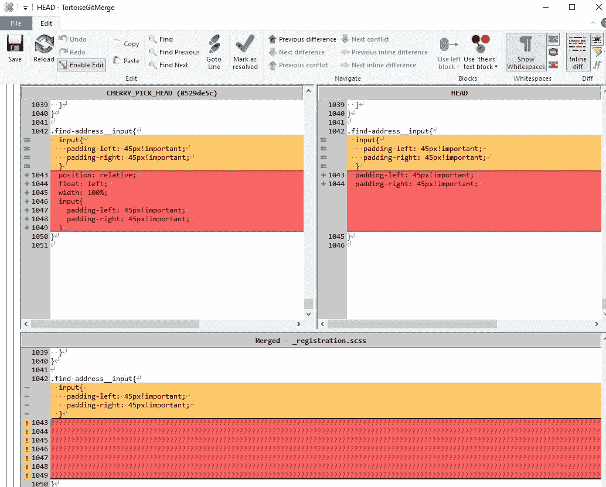

当我需要检查和比较更改时，我更喜欢打开 Visual Studio 代码并在那里完成。绿色表示**当前变化(HEAD)** ，用蓝色突出显示的线条表示**即将到来的变化(CHERRY_PICK_HEAD)。**

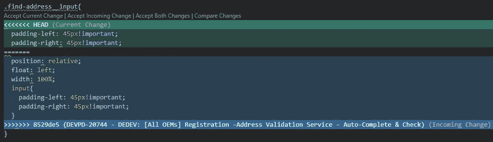

然后，我可以接受我认为正确的内容，保存文件，并在 TortoiseGit 中单击 **Resolved** 继续。

## 解决子模块中的冲突

如果你也使用子模块呢？这是一个[特殊冲突案例](https://tortoisegit.org/docs/tortoisegit/tgit-dug-conflicts.html#tgit-dug-conflicts-special-submodule)。**如果您在其他分支中使用子模块，确保您首先** [**更新**](https://miroslav-slapka.medium.com/handle-git-submodules-with-ease-55621afdb7bb) **并在樱桃采摘前同步它们。**

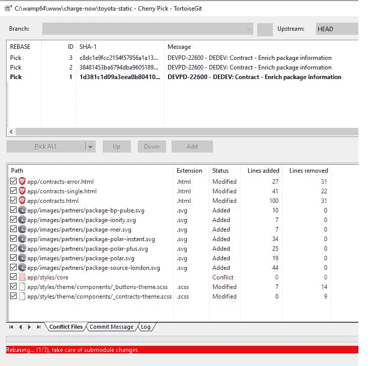

如果您首先处理子模块，那么您可以简单地单击 Resolved，您之前提取的适当更改将会被使用。

> 请注意，Resolve 命令并不能真正解决冲突。它使用“git add”将文件状态标记为已解决，以允许您提交您的更改

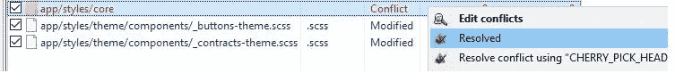

解决 git 子模块冲突的方法是在挑选樱桃之前同步其中的更改

# 摘要

樱桃采摘是 Git 中一个强大的工具。如果您处理许多分支，那么您可能需要从一个分支中挑选一些提交，并将其应用到另一个分支。请注意，由于有了 TortoiseGit 和 VS 代码，我们不必在终端中编写任何命令。刚开始的时候，你可能会发现在许多窗口中点击会很混乱，但是一旦你弄明白了，这是一个非常简单的工作流程。

说到解决冲突，我更喜欢 VS 代码而不是 TortoiseGit 窗口，但除此之外，它很简单，只需几次点击。不过，对子模块要格外小心。

樱桃采摘快乐！🍒