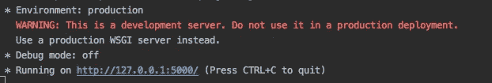
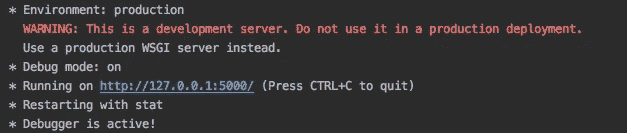

# 构建第一个 Python Flask API 的简单指南

> 原文：<https://levelup.gitconnected.com/a-simple-guide-to-building-your-first-python-flask-api-15443afdbd85>


莎伦·麦卡琴在 [Unsplash](https://unsplash.com?utm_source=medium&utm_medium=referral) 上的照片

Python 的 Flask 是一个轻量级 web 框架，它提供了一种快速构建应用程序后端的方法，同时让开发人员能够控制实现。它是在 Django 流行几年后创建的，所以它[在许多方面都比 Django](http://web.archive.org/web/20160305145017/http://jokull.calepin.co/my-flask-to-django-experience.html)有所改进，同时允许更大的灵活性。

与 Django 不同，Flask 不提供内置的数据访问层或迁移、管理接口、序列化、缓存或表单验证方法。它确实提供了模板引擎、开发服务器和调试器、单元测试，以及对处理 HTTP 请求和响应的内置支持。

如果您不喜欢样板代码，希望实现更加灵活，并希望快速入门，Flask 是一个很好的选择。

在本指南中，我描述了如何在几分钟内建立一个简单的 Python Flask API。在以后的教程中，我将深入研究 Flask 框架的不同元素。

# 设置您的 Python 虚拟环境

Python 虚拟环境充当容器，允许您独立运行 Flask 应用程序。如果你还没有建立一个 Python 虚拟环境，你可以通过[这篇指南](https://medium.com/swlh/how-to-setup-your-python-projects-1eb5108086b1)来了解如何建立。这一步不是必须的，但是如果你管理多个项目，它会让你的生活变得容易很多。

# 安装烧瓶

接下来，使用 pip 安装 Flask 框架包。确保您的虚拟环境已激活，然后运行以下命令。这些命令安装 flask，然后将需求保存到 requirements.txt 文件中。

```
pip install flask
pip freeze > requirements.txt
```

# 创建一个基本的烧瓶应用程序

创建 Flask 应用程序就像用两行代码添加一个文件一样简单。首先，创建一个目录来存储您的新应用程序。然后创建 app.py 文件。我正在构建的是一个管理食谱的工具，所以我把我的目录命名为 recipes-api。

```
mkdir recipes-api
touch app.py
```

打开 app.py 文件并添加以下代码。

```
from flask import Flask
app = Flask(__name__)
```

你现在有了一个 Flask API。不过，它没有路线，所以我们来处理一下。

# 创建您的路线

Flask 路由对应于可以通过 HTTP GET、POST、PUT 和 DELETE 命令调用的 API 端点。您的路线是消费者对您的 API 能做什么的看法，因此它们应该对调用它们的程序员有意义，并遵循 [REST 原则](https://devhints.io/rest-api)。

让我们增加两条路线；一个是作为我的 API 在浏览器中的主页，另一个是获取所有食谱。现在，我返回虚拟数据。在后面的教程中，我将介绍如何使用 SQLAlchemy 从数据库中获取数据。

@app.route 装饰器用于告诉 Flask 哪个路由应该调用这个特定的函数。在函数内部，返回数据。为了简单起见，我们现在只返回原始数据，忽略 HTTP 状态代码。

```
@app.route('/')
def index():
  return '<h1>Recipes API</h1>'@app.route('/recipes')
def recipes():
  return {
    'title': 'Smoked Salmon Chowder', 
    'ingredients': 'salmon, milk, bacon'
  }
```

# 运行应用程序

Flask 框架提供了一个简单的开发 web 服务器。这个方便的特性是单线程服务器，不适合生产环境。如果您现在需要在生产中运行您的应用程序，请参见这些[部署选项](https://flask.palletsprojects.com/en/1.1.x/deploying/)。

现在，我们使用以下命令在本地运行我们的应用程序。

```
flask run
```

Flask 自动检测 app.py 文件(您也可以将其命名为 wsgi.py ),并在其中找到 flask 应用程序。请注意，该文件必须位于运行 flask 命令的目录中，所以我通常将它放在项目的根目录中。此外，如果您将文件命名为 app.py 或 wsgi.py 之外的名称，您需要通过设置 FLASK_APP 环境变量来告诉 Flask 您的应用程序所在的位置。

```
export FLASK_APP=my_app.py
```

当您运行 flask 应用程序时，您应该会看到这一点。



在你的浏览器中导航到 [http://127.0.0.1:5000/](http://127.0.0.1:5000/) 或者 [http://localhost:5000/](http://localhost:5000/) ，你应该会看到你的主页。

尝试导航到[http://localhost:5000/recipes](http://localhost:5000/recipes)，您应该会看到返回的数据。

恭喜你。您刚刚构建了一个 Flask API。

# (奖励)使用调试模式

要在调试模式下运行您的应用程序并利用 FLASK 内置的重新加载特性，请设置 FLASK_DEBUG=1 环境变量，然后重新运行 Flask 命令。

```
export FLASK_DEBUG=1
flask run
```

现在您应该在终端中看到类似这样的内容，调试模式设置为 on。



如果您打开了一个浏览器，并且更改了 app.py 文件中的某些内容，例如，由您的路线返回的文本，您应该会看到服务器重新构建您的应用程序。

Flask 不会自动重新加载你的浏览器。如果你想要传统的热重装，你会看到一个前端应用程序，试着安装一个像 [python-livereload](https://github.com/lepture/python-livereload) 这样的包。

# (附加)设置一个. env 文件

Flask 会自动识别根目录中的. env 文件。为了避免每次启动虚拟环境时都必须设置上述环境变量，请创建一个. env 文件。

```
FLASK_APP=path/to/your/app
FLASK_DEBUG=1
```

要让 Flask 认识到这一点，首先需要安装 [python-dotenv](https://github.com/theskumar/python-dotenv#readme) 包。

```
pip install python-dotenv
pip freeze > requirements.txt
```

现在停用并重新激活您的虚拟环境。通常，您必须重置 Flask 环境变量。这一次，Flask 会自动拾取它们。

```
flask run
```

这就是你开始工作所需要的一切。现在，您可以开始构建更多的路线，并添加您的业务逻辑。我将在以后的文章中详细介绍。编码快乐！

# 资源

*   [姜戈对弗拉斯克](https://www.educba.com/django-vs-flask/)
*   [烧瓶命令行界面](https://flask.palletsprojects.com/en/1.1.x/cli/)
*   [砂箱网开发](https://www.amazon.com/Flask-Web-Development-Developing-Applications/dp/1491991739/ref=sr_1_1?keywords=flask+development&qid=1578943981&sr=8-1)，作者*米格尔·格林伯格*
*   [全栈 Python](https://www.fullstackpython.com/flask.html)
*   [我的烧瓶去姜戈体验](http://web.archive.org/web/20160305145017/http://jokull.calepin.co/my-flask-to-django-experience.html)