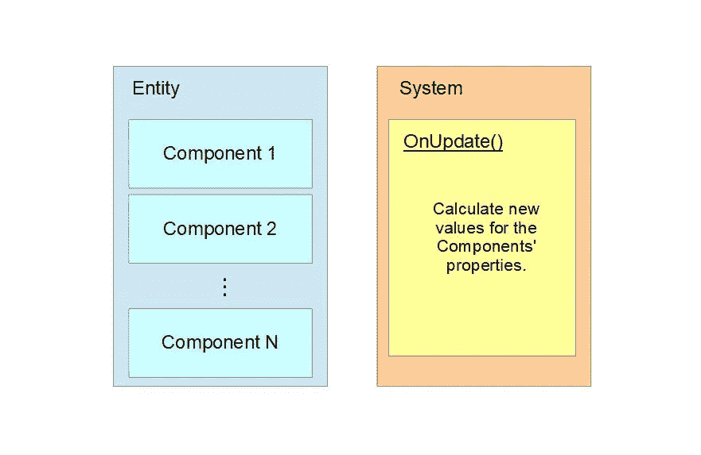
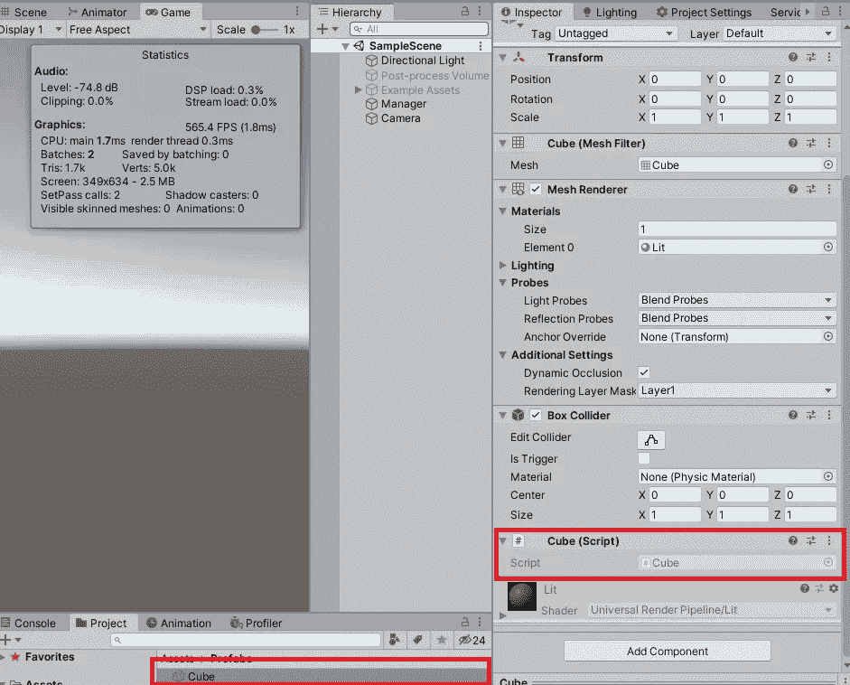

# Unity ECS 的简单入门指南

> 原文：<https://levelup.gitconnected.com/a-simple-guide-to-get-started-with-unity-ecs-b0e6a036e707>

如何在您的 Unity DOTS 项目中轻松实现实体组件系统模式？

里卡多·戈麦斯·安吉尔在 [Unsplash](https://unsplash.com/photos/qw-EfNUjIeA) 上的照片

# 介绍

在我们开始使用 Unity DOTS 创建我们的第一个游戏之前，以一种更容易学习和利用的方式呈现一些简单的 ECS 编码实践是一个好主意。正如我们已经讨论过的，ECS 模式包含了一种在 Unity 中编写代码的新方法，关注于数据和它们在实体之间的流动，而不是用属性和方法例行地扩展标准的 GameObject 类。这带来了很多好处，比如更干净的代码和更高效的开发周期。为此，在接下来的段落中，我们将遍历在[的上一篇文章](/high-performance-vr-on-a-low-end-android-phone-9186177d0e20)中演示的“立方体演示”示例应用程序的修改后的实现代码(参见参考文献【4】)。

# ECS 模式

新的方法涉及实体、组件和系统，而不是使用标准的单行为。因此，这两个工件现在变得完全分离，而不是创建包含数据(字段)和对它们执行的操作(方法)的 MonoBehaviour 的子类。结果，实体变成了映射到单个识别键的游戏对象的表示。

组件通常使用 C#结构来实现。几个组件可以附加到一个特定的实体上，并代表它在游戏中的各种特征；例如“速度”、“重量”、“受到的损害”等。最后，系统由实现组成，这些实现将特定的行为强加给每个符合其预设标准的实体。通常，这些标准涉及匹配特定实体中特定组件的存在(或不存在)的过滤器。

图 ECS 概念的图示。

综上所述，我们得出结论，当编写 ECS 游戏代码时，不再需要根据特定的角色来考虑我们的游戏对象。“玩家”、“健康包”、“敌人”、“武器”等概念。成为我们的游戏实体的抽象的语言表示，所以我们现在可以只关注游戏的数据(即组件)和我们希望应用于它们的操作或交互(即系统)。这种方法对我们代码的可重用性和可维护性以及开发速度都有积极的影响。但它最重要的优势是，它允许通过使用 Unity 的[作业系统](https://docs.unity3d.com/Manual/JobSystem.html)(见参考文献[5])和[突发编译器](https://docs.unity3d.com/Packages/com.unity.burst@0.2/manual/index.html)(见参考文献[6])来大幅提高执行性能。在下面的段落中，我们将讨论这个概念的编码细节。

# Unity ECS 实施

记住以下简单的指导方针，很容易熟悉 Unity 中 ECS 模式的实现:

1.  通过简单地实现 ***Unity 来编写组件。Entites.IComponentData*** 接口。这就是创建定制数据结构所需的全部内容。
2.  实现**与*的统一。IConvertGameObjectToEntity***定义你的实体，然后使用 ***Unity 将你的预设转化为实体。实体. GameObjectConversionUtility***。使用**与*合一。EntityManager*** 在您新创建的实体上，以便将您的组件附加到它们上。
3.  通过扩展 ***统一来实现你的系统。entities . JobComponentSystem***类(Unity 的一个子类。Entities.ComponentSystem)。这允许您利用 Unity 的作业系统，该系统管理应用程序中多线程的并行执行。

在下一节中，我们可以看到这些建议是如何在我们的[修订样本“立方体演示”项目](https://github.com/mkoutroumpas/URPTestTwo/tree/43d3510fe358305aae22344312248f0068a7293e)(参考文献[3]中的源代码)中实现的。

首先，为了表示每个多维数据集实例的速度，我们实现了一个 MoveSpeedComponentData 组件类，它实现了 IComponentData，并将在我们的定制系统中使用。此外，我们还创建了一个名为 CubeComponent 的附加组件类，它将在我们的系统实现中用作实体的过滤标准。

代码片段 1:实现两个定制组件

我们还通过扩展 MonoBehaviour 和实现 IConvertGameObjectToEntity 接口来定义 Cube 类。这个类会自动将我们的立方体预设的每个实例转换成一个实体。

代码片段 2:定义多维数据集类

然后我们实例化我们的立方体。

代码片段 3:从预置实例化立方体实体

我们现在可以将代码片段 2 中显示的立方体脚本添加到我们的立方体预设中，以便将我们的自定义组件(如代码片段 1 所示)自动添加到将在场景中创建和生成的每个新立方体中。

图 2:将立方体脚本添加到立方体预设中

最后，我们创建一个系统类(ZTranslationSystem)，它包含一个内部作业结构(TranslateJob)并实现 JobCompomentSystem 抽象类的 OnUpdate()方法。在 OnUpdate()实现中，我们只需调度 TranslateJob 实例的执行。在 TranslateJob 结构的 Execute()方法中，我们实现了实际的立方体移动算法；在这个例子中，一个简单的线性运动方式。我们还添加了一个虚拟的“繁重任务”方法，以模拟一个更复杂和要求更高的寻路算法，这肯定会出现在一个实际的、功能齐全的商业游戏中。

代码片段 4:扩展 JobComponentSystem 类以创建自定义系统

Execute()方法接受两种不同的组件类型作为参数(Translation 和 MoveSpeedComponentData ), translate job 类由两个属性修饰:第一个属性是 require componenttag(CubeComponent ),负责过滤包含 cube component 类型组件的所有实体。第二个属性 BurstCompile 指示 Unity 使用突发编译器来编译这个类。

请注意，系统通常(即所有从 Unity 继承的类。Entities.ComponentSystem)将总是自动运行，而不需要从项目的不同部分进行实例化或调用。这意味着 OnUpdate()方法在每一帧都被调用，就像经典的[monobehavior 一样。Update()](https://docs.unity3d.com/ScriptReference/MonoBehaviour.Update.html) 【参见参考文献 1】方法。

运行时结果显示在下面的视频中。超过 200 fps 的帧速率在普通 PC 上很容易实现，为 1000 个立方体实例提供平滑的运动，尽管每个实例都有繁重的计算任务。

视频 1:最终结果

# 结论

在 Unity 中实现 ECS 模式在开始时可能看起来有些复杂，但是一旦开发人员熟悉了上面介绍的三个简单的指导方针，并积极地应用它们来自己创建一些应用程序，它很快就成为编写高质量代码和创建高性能应用程序的强大工具。

# 参考

1.  [单行为。Update()方法文档(Unity3D)](https://docs.unity3d.com/ScriptReference/MonoBehaviour.Update.html)
2.  [Unite Copenhagen 2019——将你的游戏转化为点数](https://www.slideshare.net/unity3d/converting-your-game-to-dots-unite-copenhagen-2019)
3.  [“立方体演示”源代码](https://github.com/mkoutroumpas/URPTestTwo/tree/43d3510fe358305aae22344312248f0068a7293e)
4.  [低端安卓手机上的高性能虚拟现实](/high-performance-vr-on-a-low-end-android-phone-9186177d0e20)
5.  [Unity 作业系统文档](https://docs.unity3d.com/Manual/JobSystem.html)
6.  [Unity Burst 编译器文档](https://docs.unity3d.com/Packages/com.unity.burst@0.2/manual/index.html)