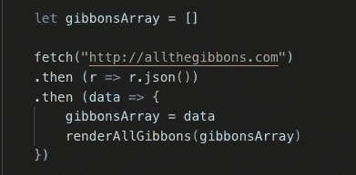
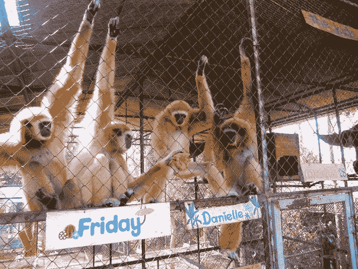
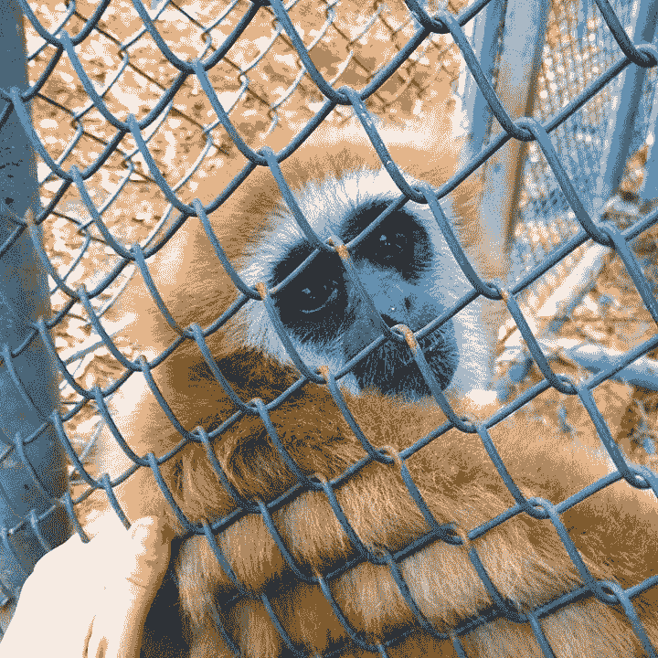
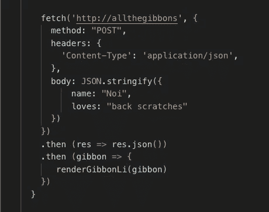
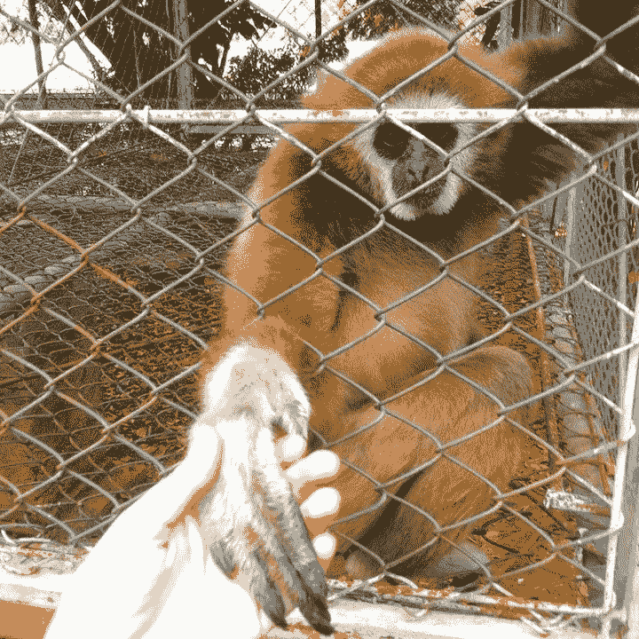
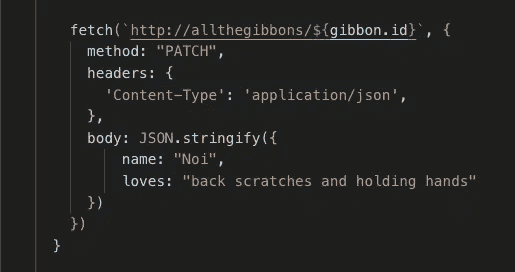
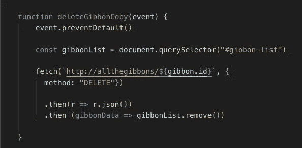

# 发出获取 API 请求的简单指南

> 原文：<https://levelup.gitconnected.com/a-simple-guide-to-making-fetch-api-requests-710b831cbd98>

## 学习使用基本获取操作 DOM

如果您发现自己正在构建一个典型的网站或应用程序，那么您很可能想要为您的用户实现一些基本的 CRUD(*Create Read Update Delete*)功能，包括对所有必要数据的多个 HTTP 请求。在 JavaScript(和大多数浏览器)中工作时，这些请求可以通过使用一个叫做`fetch`的小东西来完成。[获取 API 请求](https://developer.mozilla.org/en-US/docs/Web/API/Fetch_API/Using_Fetch)有点像你和你的小狗玩的同名游戏:

*   某物(*一个球，一根棍子，对数据的请求等。*)被抛向选定的方向，
*   然后从空间中取回某物(*公园，URL…* )，
*   稍加修饰(*满身口水？*)，
*   然后返回给你(摆着尾巴*)让你下一步行动。*

这些获取请求是异步的，这意味着您的代码将为数据返回一个 [*承诺*](https://developer.mozilla.org/en-US/docs/Web/JavaScript/Reference/Global_Objects/Promise) 并继续运行其他任务，同时等待实际数据返回并完成请求。(想象一下，你把那根棍子扔给你的小狗，它/她跑去捡回来，在等待的时候，你拿出手机录下一段视频，你的小狗带着一个大大的、快乐的、流口水的笑容跑回来。)

今天，我将带您浏览一个简单的基本获取请求指南，使用…*drum roll*T21【请 …GIBBONS！！(你可能认为这是再一次谈论狗的绝佳机会，但是哈！骗了你。)

长臂猿是可爱、滑稽、濒临灭绝的灵长类动物，被称为“小猿”，以其令人难以置信的和谐歌唱天赋和杰出的臂力而闻名……但我跑题了。

出于教学目的，让我们假设我们有一个位于“http://allthegibbons.com”(不是一个真正的网站)的 API，其中包含了某个特定保护区中所有长臂猿的嵌套信息。我们可以访问所有长臂猿的数组(`gibbonsArray`)，我们将为每只长臂猿创建一个 HTML 列表元素(`gibbonLi`)。

# 提出“获取”请求

假设您想要显示一个主页，上面有目前居住在我们保护区的所有长臂猿。为了获取所有长臂猿的详细信息，您需要发出一个 HTTP 'GET '请求。(你得到了信息，但没有改变它。)在这种情况下，您会:

1.  `fetch`来自 URL 的信息。
2.  抓住那个回应(`r`)。
3.  将这种反应转化为我们可以利用的东西(`r.json()`)。在这种情况下，我们将把这个响应重新格式化为 JSON，或者 JavaScript 对象符号。
4.  将返回的`data`传递给你的下一个动作。在这种情况下，我们将把数据传递到我们的空`gibbonsArray`中，并把它传递到一个单独的回调函数中，以呈现页面上的所有长臂猿(`renderAllGibbons(gibbonsArray)`)。

示例“GET”请求

吉本斯都在这里！🎉

# 发出“发布”请求

假设我们的避难所刚刚接收了一只新的长臂猿！他的名字叫诺伊，他喜欢挠背。

看那张可爱的脸👼

为了将 Noi 添加到我们的长臂猿保护区网站，我们需要提交一个 HTTP 'POST '请求。(您正在创建一个新对象，并将该新信息“发送”到数据库。)对于这个请求，我们需要指定更多的信息，以确保所有的数据都得到正确处理。以下是我们的步骤:

1.  您要将长臂猿添加到的 URL。
2.  声明您正在实现哪种类型的`method`。(在这种情况下，我们使用“POST”方法。)上次我们不需要声明“GET”方法，因为这个方法在没有声明的时候是假定的。
3.  声明您将在`headers`内发送和接收什么类型的数据(如果需要)。在这个例子中，我们需要使用`‘application/json’`。
4.  声明您将在这个新 gibbon 数据的`body`中以键/值对的形式包含哪些信息。
5.  用`JSON.stringify`将主体数据转换成 JSON 字符串，因为服务器只能读取字符串格式的数据。
6.  为了将这个新的长臂猿保存到 DOM，获取响应，将其转换为 JSON，并将转换后的数据(`gibbon`)传递到一个新的回调函数中，就像我们上次使用“GET”方法所做的那样。这个回调函数必须将最新的长臂猿 Noi 添加到所有长臂猿的列表中，这样数据才能持久。

示例“发布”请求

# 发出“上传”/“修补”请求

假设您想要更新其中一只长臂猿的信息。也许在避难所过得舒适之后，你会发现诺伊不仅仅喜欢背部抓痕。他也爱牵手！多可爱啊。

哦，我的心❤️

为了更新 Noi 的数据，我们需要向服务器发出一个 HTTP‘PUT’或‘PATCH’请求。“上传”请求将删除 Noi 的所有信息并用新的副本替换，但“修补”请求将只更新必要的部分，保留 Noi 的完整存在。为了我们的演示(以及 Noi 的安全)，我们将发出一个“补丁”请求。这看起来与“POST”请求非常相似，但有以下区别:

1.  我们从中获取的 URL 必须包含我们希望更新的长臂猿的 id。为了使这个动态请求可以被未来的长臂猿重用，我们可以使用模板文字插入长臂猿的 id。确保您的 URL 用反斜线而不是引号括起来，并在末尾插入这个占位符:`${gibbon.id}`。
2.  将您的方法设置为“修补”。
3.  没有必要把这只长臂猿添加到你的长臂猿列表中——它已经存在了！

示例“补丁”请求

# 发出“删除”请求

假设您意外地创建了同一个长臂猿两次，因此您需要删除多余的长臂猿(复制！)从你的圣所。(显然，否则我们*永远不会*删除一只长臂猿。)您将采取的完成此任务的步骤与我们之前为“修补”所做的非常相似。

1.  一旦您将获取 URL 设置为目标 gibbon id，就将您的`method`设置为‘DELETE’。
2.  不需要头或体，因为我们不创建或更新这个 gibbon 实例。
3.  在响应被返回并转换成 JSON 之后，从数据库中删除它。

示例“删除”请求

现在你知道了！现在，您已经有了一些基本的 JavaScript 工具，可以在您的网站或应用程序中完成一些简单的 CRUD 功能。

编码快乐！

又及:拯救长臂猿！[这里](https://www.ippl.org/gibbon/)和[这里](https://www.gibbonathighlandfarm.org/en/):)