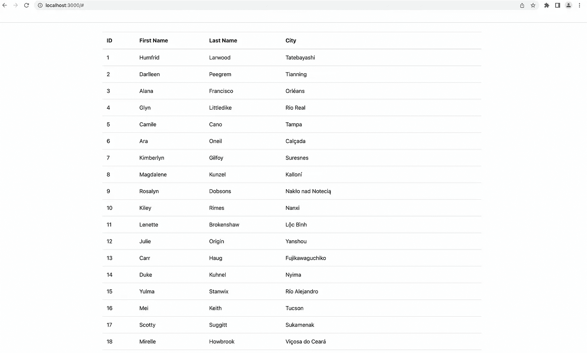
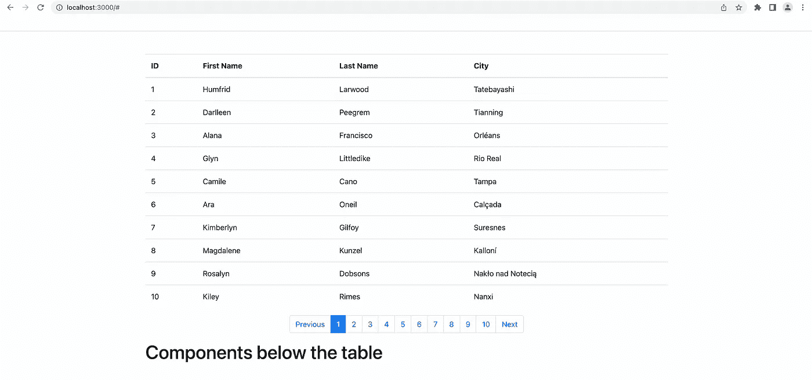
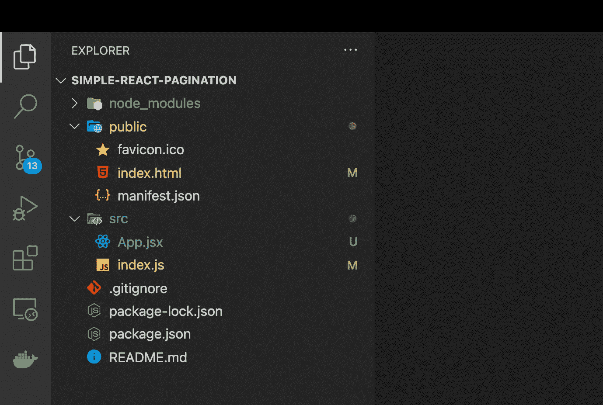
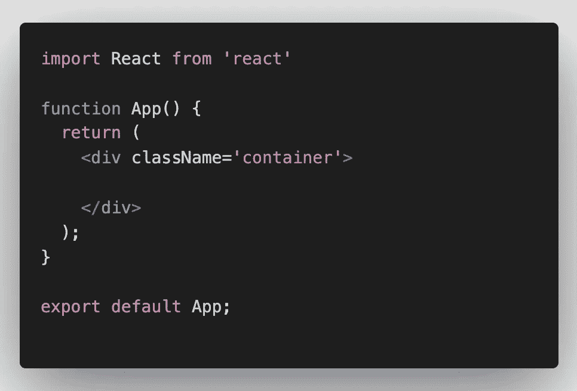
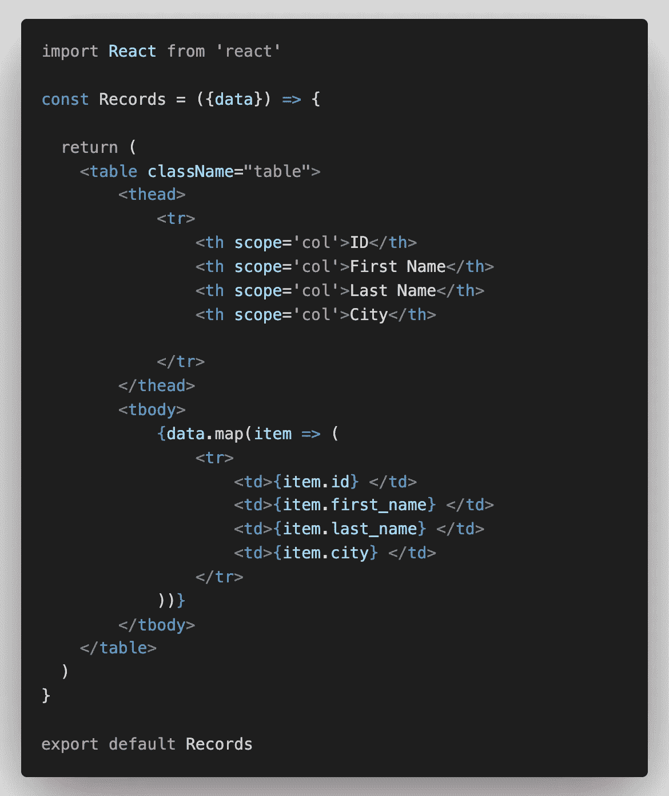
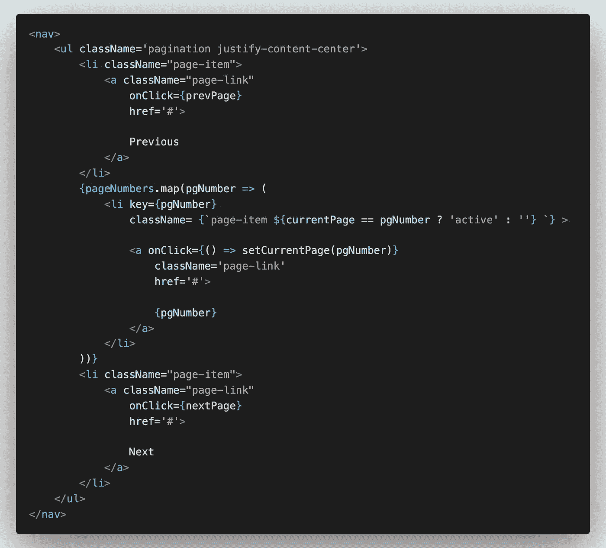

# React 中分页的简单指南

> 原文：<https://levelup.gitconnected.com/a-simple-guide-to-pagination-in-react-facd6f785bd0>


[莉莉·波普](https://unsplash.com/@lili_popper?utm_source=medium&utm_medium=referral)在 [Unsplash](https://unsplash.com?utm_source=medium&utm_medium=referral) 上的照片

假设您想以表格的形式显示一些记录。正常情况下，这不是问题。但是如果记录的数量很大，比如 100 条记录，该怎么办呢？你能在一页上显示所有的内容吗？当然可以。然而，这不会是一个非常好的用户体验。

相反，您可以将表分成几页，并在一页上显示记录的子集。这意味着不是显示所有 100 条记录，而是可以有 10 页，每页显示 10 条记录。

这是一个有分页和没有分页的表格的样子。



无分页的表格



带分页的表格

在第一种情况下，用户必须向下滚动多次才能访问表后的任何组件，这不是一个好的用户体验。请注意第二个实例中分页的区别，它提供了更好的用户体验。

现在您已经知道了分页的重要性，是时候向您展示如何在 React 中实现它了。你只需要知道 React 的基本知识就能理解这篇文章。

# 安装

在开始项目之前，安装 [ReactJS 代码片段扩展](https://marketplace.visualstudio.com/items?itemName=xabikos.ReactSnippets)，它可以提高你对任何 React 项目的开发速度。

现在，创建 React 应用程序。

```
create-react-app simple-react-pagination
```

创建应用程序并删除冗余文件后，文件夹结构如下所示。



文件夹结构

对于这个项目，我使用了 Bootstrap，所以在*index.html*文件*的<*头* >标签内添加下面一行。*这将允许您在项目中使用引导类。

```
<link href="https://cdn.jsdelivr.net/npm/bootstrap@5.1.3/dist/css/bootstrap.min.css" rel="stylesheet" integrity="sha384-1BmE4kWBq78iYhFldvKuhfTAU6auU8tT94WrHftjDbrCEXSU1oBoqyl2QvZ6jIW3" crossorigin="anonymous"> 
```

或者，您可以从[这里](https://getbootstrap.com/docs/5.1/getting-started/download/)下载引导源文件。

要填充该表，您需要一些数据。我在这个项目中使用了随机生成的数据。访问 [Mockaroo](https://www.mockaroo.com/) 使用您选择的字段生成模拟数据。生成 JSON 格式的数据，保存在项目的 *public* 文件夹中。

# 获取数据

让我们从 *App.jsx* 文件开始。这将包含所有组件以及获取数据和划分数据以进行分页的逻辑。



现在，向 App 组件添加以下两个状态。

```
// To hold the actual data
const [data, setData] = useState([])const [loading, setLoading] = useState(true);
```

*加载*状态告诉你数据是否已经被提取。加载所有数据可能需要一段时间，尤其是从后端数据库获取数据时。在此之前，*加载*状态被设置为真，这允许我们在屏幕上显示加载消息，直到数据被获取。

我已经使用 [Axios](https://axios-http.com/docs/intro) 获取数据。Axios 允许您发出 HTTP 请求并从端点获得响应。运行这个脚本来安装 Axios。

```
npm i --save axios
```

现在，要获取数据，使用 *get* 函数。它将一个 URL 作为参数，并向它发出一个 get 请求。公共文件夹中的文件存储在与应用程序相同的服务器上，即[http://localhost:3000/MOCK _ data . JSON](http://localhost:3000/MOCK_DATA.json.)。

您也可以使用文件名，但前提是您在 [http://localhost:3000/](http://localhost:3000/MOCK_DATA.json.) 路由上，并且不在任何子路由上。

```
useEffect(() => { axios.get('MOCK_DATA.json') .then(res => { setData(res.data); setLoading(false); }) .catch(() => { alert('There was an error while retrieving the data') })}, [])
```

*get* 函数返回一个[承诺](https://developer.mozilla.org/en-US/docs/Web/JavaScript/Reference/Global_Objects/Promise)，因为取数据是一个异步操作。因此，在 *then* 块中编写后续动作，该块仅在获得完整响应后执行。获取完成后，将数据加载到状态并将*加载*设置为假。同样，实现 *catch* 块来处理错误。

组件一加载就需要获取数据，因此获取逻辑被写在一个 *useEffect* 中。

# 显示数据

创建一个文件 *Records.jsx，*键入 *rafce，*并按回车键。它将生成必要的代码来创建*记录*组件(感谢 Snippets 扩展)。

保存所有记录的表将在该组件中创建。



记录组件

如上所示，填充表格所需的数据作为 props 从 App 组件传递下来。引导类*表*提供了必要的样式。

# 页码

到目前为止，该表在一个页面上显示了所有的 100 条记录，如前所述，这导致了糟糕的用户体验。实现分页就是为了改进这一点。

## 决定各州

在分页中，您可以选择在单页上显示多少条记录，这取决于页数。您还需要跟踪用户所在的页码。因此，将这两种状态添加到 App 组件中。

```
// User is currently on this page
const [currentPage, setCurrentPage] = useState(1);// No of Records to be displayed on each page   
const [recordsPerPage] = useState(10);
```

## 每页显示的记录

现在，您需要当前页面上第一条和最后一条记录的索引。

```
const indexOfLastRecord = currentPage * recordsPerPage;const indexOfFirstRecord = indexOfLastRecord - recordsPerPage;
```

举个例子，假设你在第 17 页，每页显示 10 条记录。

因此，indexOfLastRecord = 17 * 10 = 170(第 17 页上最后一条记录的索引是 169，因为数组是零索引的，但您不需要子收缩 1，因为您很快就会知道)和 indexOfFirstRecord = 170–10 = 160。

现在，使用 JavaScript 的 *slice* 函数计算出数据数组的一个子集的索引。

```
// Records to be displayed on the current page
const currentRecords = data.slice(indexOfFirstRecord, 
                                    indexOfLastRecord);
```

在 *slice* 函数中指定的范围不包括最后一个索引，所以以上面的例子为例，slice(160，170)将返回从索引 160 到 169 的记录。这将作为 props 传递给 Records 组件，以便该表只显示当前页面上的记录。

计算页数。

```
const nPages = Math.ceil(data.length / recordsPerPage)
```

如果记录总数不能被 *recordsPerPage 整除，使用 *ceil* 功能将剩余的记录放入新的一页。*

## 分页组件

创建一个名为*分页*的新组件。上述变量作为道具传递给*分页*组件。

```
<Pagination
    nPages = { nPages }
    currentPage = { currentPage } 
    setCurrentPage = { setCurrentPage }
/>
```

在*分页*组件内部，创建一个数组，保存从 1 到 *nPages 的所有页码。* [这里](https://www.techiedelight.com/create-array-from-1-n-javascript/)有几种方法可以在 JavaScript 中创建一个从 1 到 N 的数组，这是其中之一。

```
const pageNumbers = [...Array(nPages + 1).keys()].slice(1)
```

现在，创建一个容器来显示页码和页面控件。为此，我使用了[引导类](https://getbootstrap.com/docs/4.0/components/pagination/)。



它应该是这样的:


页面控制

当您单击任何页码时，它会将当前页面设置为该页码，并且表格会显示该页面上的记录。现在，实现*下一页*(增加页码)和*上一页*(减少页码)功能。

```
const nextPage = () => {
    if(currentPage !== nPages) 
        setCurrentPage(currentPage + 1)
}const prevPage = () => {
    if(currentPage !== 1) 
        setCurrentPage(currentPage - 1)
}
```

如果你已经在最后一页，你就不能进入下一页，同样，如果你在第一页，你也不能进入上一页，所以要加上各自的条件。

这就是在 React 中实现简单分页所需的全部内容。

# 其他实现

实现分页有多种方式，我已经向您展示了其中一种。在某些情况下，从后端获取完整的数据并不是一个好主意。如果数据库中有数千条记录，那么将它们全部取出将花费大量时间，这又会损害用户体验。

因此，您可以在后端实现分页，一次获取一页数据。在这里，您可能也必须实现某种形式的缓存，因为您不希望应用程序在您转到上一页时再次获取数据。

此外，在分页组件中，显示所有页码通常不是一个好主意。因此，您可以一次只显示 1-3 个页码，当您浏览页面时，页码会不断变化。

你可以在 [Github](https://github.com/KunalN25/simple-react-pagination.git) 上找到这个项目。

# 结论

分页有助于显示大量记录并改善用户体验。通过一次只获取数据的一个子集，它还有助于优化应用程序。我已经向您展示了在 React 中实现分页的简单方法。我希望你能够在即将到来的项目中实现同样的目标。

如果您无法理解内容或对解释不满意，请在下面评论您的想法。新想法总是受欢迎的！如果你喜欢这篇文章，请鼓掌。订阅并关注我的每周内容。另外，请务必查看我的其他[帖子](https://medium.com/@kunal.nalawade25)。到那时，再见！！