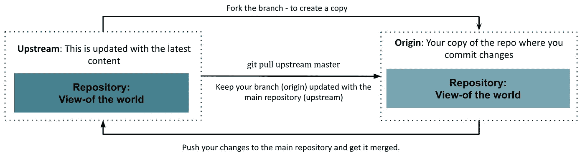
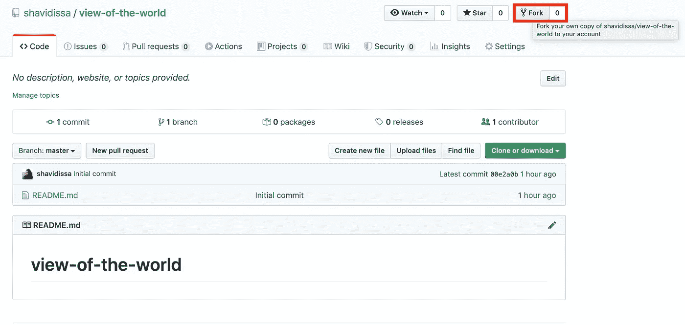
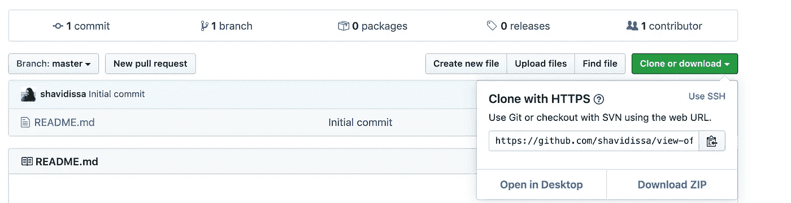
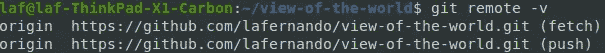
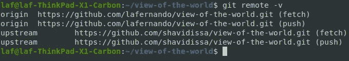

# 使用 Git 命令在 GitHub 上更新文档的简单指南

> 原文：<https://levelup.gitconnected.com/a-simple-guide-to-update-docs-on-github-using-git-commands-3e512ead26ce>

照片由[扬西·敏](https://unsplash.com/@yancymin?utm_source=medium&utm_medium=referral)在 [Unsplash](https://unsplash.com?utm_source=medium&utm_medium=referral) 上拍摄

越来越多的组织正在考虑将他们的技术文档转移到 markdown 文件或在 GitHub 上维护它们。原因可能有很多；从开源文档策略开始，让任何人都可以对文档做出贡献。

但是为什么会突然转变呢？一个主要原因是:当源代码在 GitHub 上时，工程师们会很轻松地为文档做贡献，因为他们已经熟悉了 GitHub 和做出更改的过程。耶！是的，我们现在应该看到更多的工程师为我们的文档做出贡献。:)

但这种改变对每个人来说都不容易。一些作者已经习惯于使用内容管理工具，如 confluence、DITA 等。对他们来说，做出这种转变可能很困难。去年我在一次会议上演讲时，有人问我如何学习使用 Git 命令，以及如何熟悉它。通过尝试，我从经验中了解到，和我一起工作的工程师总是很有帮助，而且 [GitHub 文档](https://help.github.com/en/github)也很棒。但是我知道你很难理解这个概念。

所以，让我们看看我是否能在这篇文章中为你简化一些事情。

> 页（page 的缩写）s:有很多工具可以帮你解决问题！本指南的目的是消除在更新文档时使用终端尝试 git 命令的恐惧。

# 方案

> 声明:当你听到克隆、分叉和分支这些术语时，不要害怕。当您和我一起尝试演练时，您将会熟悉这些术语。

当您为大多数开源项目做贡献时，您不会直接克隆一个存储库，创建一个分支，并直接为其做贡献。这在主存储库中留下了许多不必要的分支(您可以稍后删除它们)。

作为一个最佳实践，您可以派生存储库，创建主存储库的副本，然后进行贡献。

# 设置环境

> 先决条件:如果你没有帐户，[注册，并在 GitHub](https://github.com/join?ref_cta=Sign+up&ref_loc=header+logged+out&ref_page=%2F&source=header-home) 上创建一个帐户。

对于大多数作家来说，这通常是最难的部分。好消息是——对于您想要处理的存储库，您只需要这样做一次。:)

遵循以下给出的步骤:

**第一步:**导航到 https://github.com/shavidissa/view-of-the-world，点击**叉**。
*当您派生存储库时，您创建了您正在派生的存储库(repo)的副本。这将是您的回购视图，您可以在该存储库中进行所有更改。*

**步骤 2:** 导航到您想要克隆刚才分叉的存储库的目录。

示例:
***#导航到目录
cd 文档

#克隆库
git 克隆 https://github.com/<ENTER _ USERNAME>/view-of-the-world . git***

最简单的方法是点击克隆或下载(绿色按钮)并将 URL 复制到那里。
举例:

**第三步:**导航到你刚刚克隆的目录。通常，它会是*世界观*。

**cd *世界观***

**第四步:**运行 ***git remote -v*** 你会看到 https://github.com/<ENTER _ USERNAME>/*view-of-world*。在**来源**下列出的 git。记住你的文案永远是 origin :)
举例:

**第五步:**添加一个远程**上游**。这将帮助您将更新的更改从主存储库拉到您的副本，这是…(填空)？答案:出处:)

***git 远程添加上游***[***https://github.com/shavidissa/view-of-the-world.git***](https://github.com/shavidissa/view-of-the-world.git)

**第六步:**再次运行 ***git remote -v*** 你会同时看到原点和上游。
举例:

现在，按照上面的图表，您已经设置了环境。您有 upstream，它拥有世界视图存储库中所有最新的变更。然后是你的世界观储存库的拷贝。到目前为止一切都好吗？

# 准备将原点与上游同步

你必须总是随着上游的变化更新原点。否则，您稍后会遇到冲突(您可能仍然会遇到冲突，但是，这将帮助您拥有一个更新的存储库。).

1.  打开终端。
2.  导航到目录。
    举例:
    ***cd 文档/世界观***
3.  或者，检查存储库中的分支。我会单独写一篇关于树枝的博客。目前，您可以按照步骤进行操作。:)
    ***吉特科***
4.  移动到本地存储库的主分支。
    ***饭桶结账师傅***
5.  拉任何最新的变化，使你的世界观(原点)总是同步的，并随着主世界观(上游)的变化而更新。*我希望我的回购的怪异命名让你发笑:D*
    ***饭桶拉上游高手***

# 添加内容或进行更改

1.  使用 Atom 或任何其他编辑器打开世界视图目录。
2.  在 README.md 文件中添加新的一行，或者在。
3.  保存更改。

# 将您所做的更改推送到原点

1.  打开终端。
2.  导航到目录。
    举例:
    ***cd 文档/世界观***
3.  或者，在添加更改之前，运行以下命令来查看您所做的更改。
    ***git diff***
    Use***ESC***+*:wq to*转义一长串变化。
4.  或者，运行以下命令获取您更改的文件列表。
    ***git 状态***
5.  将您的所有更改添加到您的本地远程存储库(origin)。
    ***git add。***
6.  将您所做的更改提交到您的本地存储库(origin)。
    ***【git commit-m】更新 README.md 文件***
7.  将本地存储库中的更改推送到 GitHub。
    ***git 推原点主控***

# 创建拉动式请求(PR)

转到你在 GitHub 上创建的世界视图库，点击**新的拉取请求**。

添加标题和描述并点击**创建拉式请求**。

如果您在发出“拉”请求(PR)之后和合并 PR 之前提交更多的更改，提交将显示在您创建的原始 PR 中。不需要再点击**新拉动请求**。

呜哇！干得好！:)大概就是这样！这些是您将使用的一些主要命令。一旦你掌握了它，你会遇到其他高级命令。我希望您对使用命令行进行尝试感到满意。:)

以下参考资料可能也能帮到你:

*   [https://www . atlassian . com/git/tutorials/what-is-version-control](https://www.atlassian.com/git/tutorials/what-is-version-control)
*   [https://guides.github.com/activities/hello-world/](https://guides.github.com/activities/hello-world/)

**万事如意！如果你觉得这有帮助，请告诉我..:)**