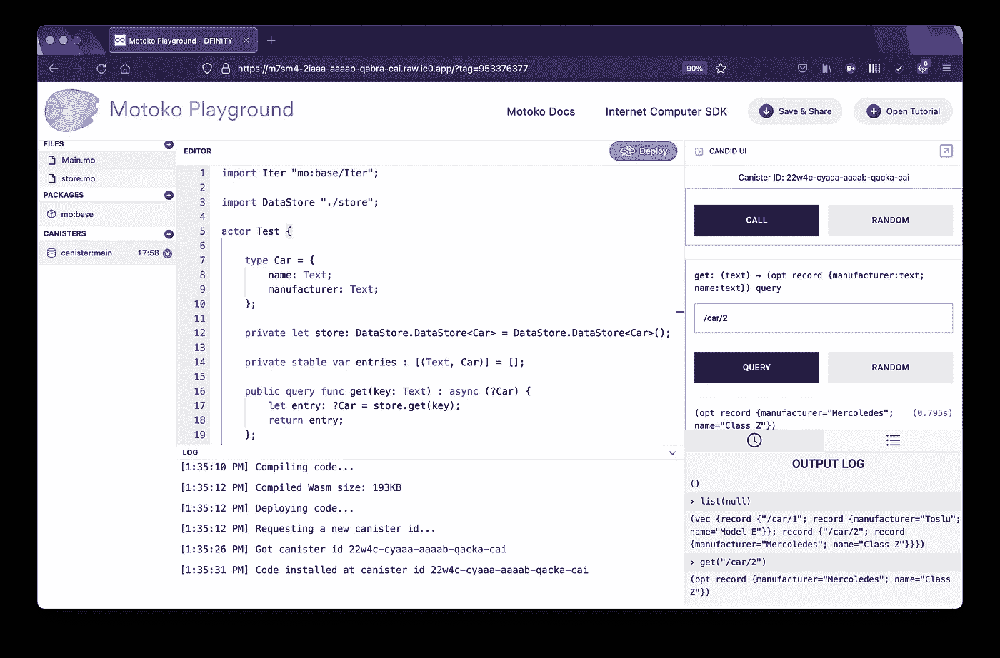
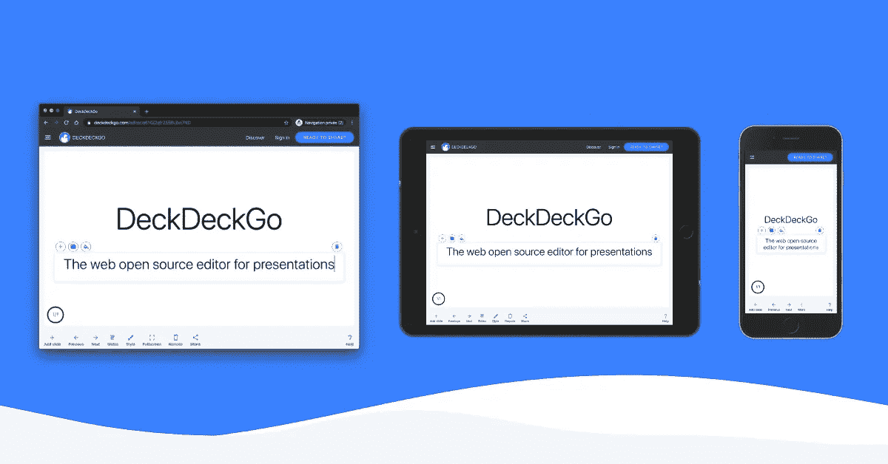

# 在 Motoko 中实现的一个简单的 KeyVal 存储

> 原文：<https://levelup.gitconnected.com/a-simple-keyval-store-implemented-in-motoko-f8ba5af43618>

## 在互联网计算机上为罐式智能合同构建一个通用的 keyval 存储。


[佩德罗·拉斯特拉](https://unsplash.com/@peterlaster?utm_source=unsplash&utm_medium=referral&utm_content=creditCopyText)在 [Unsplash](https://unsplash.com/?utm_source=unsplash&utm_medium=referral&utm_content=creditCopyText) 上拍摄的照片

我喜欢离线 web 应用程序，我的大多数个人开源项目，如 [DeckDeckGo](http://deckdeckgo.com/) 或 [Tie Tracker](https://tietracker.app.link/) ，都遵循这种方法。

在这两个特定的应用程序中，我使用 [idb-keyval](https://github.com/jakearchibald/idb-keyval) 通过类似 keyval 的 API 来简化与 IndexedDB 的交互。

这就是为什么，在我们迁移到 [DFINITY](https://dfinity.org/) 的互联网计算机的最后一次迭代中，我在 [Motoko](https://smartcontracts.org/docs/language-guide/motoko.html) 中为罐智能契约开发了一个通用存储，它也维护带有键和值的数据。

# 商店

我的目标是能够跨罐和项目多次重用同一个存储。如果我的一个角色包含不同类型的数据，例如汽车和蔬菜，我想重用封装数据并公开函数的同一个助手，例如:`put`、`get`、`delete`和`list`。

因此，我开发的 store 不亚于一个通用类，它使用一个[散列表](https://sdk.dfinity.org/docs/base-libraries/hashmap)来持久化文本键(类型[文本](https://smartcontracts.org/docs/base-libraries/Text.html))。

```
import Text "mo:base/Text";
import HashMap "mo:base/HashMap";
import Iter "mo:base/Iter";
import Array "mo:base/Array";

module {
    public class DataStore<T>() {
        private var data: HashMap.HashMap<Text, T> = 
                HashMap.HashMap<Text, T>(10, Text.equal, Text.hash);
    }
}
```

# 上传、获取和删除

修改状态的函数基本上是直接对`HashMap`应用修改，除了删除操作，我用`getter`扩展了删除操作，即使如果键不存在的话`delete`什么也不做。我认为偶尔找回被删除的键的值会很有趣。

```
public func put(key: Text, value: T) {
    data.put(key, value);
};

public func get(key: Text): ?T {
    return data.get(key);
};

public func del(key: Text): ?T {
    let entry: ?T = get(key);

    switch (entry) {
        case (?entry) {
            data.delete(key);
        };
        case (null) {};
    };

    return entry;
};
```

# 目录

如果没有过滤数据的可能性，获得商店所有条目的列表也不会比直接查询`HashMap`多多少。事实上，只搜索以特定前缀开头或包含特定前缀的键可能会很有趣。

我首先为过滤器定义了一个新的类型`DataFilter`,并实现了有效的过滤功能，这些功能承认这些选项的可选性。

```
public type DataFilter = {
    startsWith: ?Text;
    contains: ?Text;
};

private func keyStartsWith(key: Text, startsWith: ?Text): Bool {
    switch (startsWith) {
        case null {
            return true;
        };
        case (?startsWith) {
            return Text.startsWith(key, #text startsWith);
        };
    };
};

private func keyContains(key: Text, contains: ?Text): Bool {
    switch (contains) {
        case null {
            return true;
        };
        case (?contains) {
            return Text.contains(key, #text contains);
        };
    };
};
```

如果没有定义过滤器，上述函数将返回`true`，假设`undefined`表示“忽略选项”。在 Motoko 中可能有一种更好的方法来实现这样的条件，但是，我在这方面还不像在其他语言(如 TypeScript)中那样流畅。如果你想改进解决方案，就去做吧，给我发一个[拉动请求](https://github.com/deckgo/deckdeckgo/blob/main/canisters/src/data/data.filter.mo)！

最后，我实现了`list`函数本身，它要么返回所有条目，要么按照`and`逻辑应用过滤器。

```
public func list(filter: ?DataFilter): [(Text, T)] {
    let entries: Iter.Iter<(Text, T)> = data.entries();

    switch (filter) {
        case null {
            return Iter.toArray(entries);
        };
        case (?filter) {
            let keyValues: [(Text, T)] = Iter.toArray(entries);

            let {startsWith; contains} = filter;

            let values: [(Text, T)] = 
                        Array.mapFilter<(Text, T), (Text, T)>
            (keyValues, func ((key: Text, value: T)) : ?(Text, T) {
                if (keyStartsWith(key, startsWith) and 
                    keyContains(key, contains)) {
                    return ?(key, value);
                };

                return null;
            });

            return values;
        };
    };
};
```

# 升级

为了在升级时保持罐的状态，可以为默认情况下不稳定的变量实现[升级前和升级后](https://smartcontracts.org/docs/language-guide/upgrades.html#_preupgrade_and_postupgrade_system_methods)系统挂钩。为了预见这样的过程，我还为存储添加了两个最终函数。

```
public func preupgrade(): HashMap.HashMap<Text, T> {
    return data;
};

public func postupgrade(stableData: [(Text, T)]) {
    data := HashMap.fromIter<Text, T>(stableData.vals(), 10, Text.equal, Text.hash);
};
```

# 使用

为了展示这种通用存储在 actor 中的用法，我们创建了一个空容器，它定义了要存储的对象类型，比如一个`Car`。

我们`import`助手并声明我们将要使用的两个对象。`store`本身和一个稳定的`entries`在升级时保持状态。

```
import Iter "mo:base/Iter";

import DataStore "./store";

actor Test {

    type Car = {
        name: Text;
        manufacturer: Text;
    };

    private let store: DataStore.DataStore<Car> = 
                       DataStore.DataStore<Car>();

    private stable var entries : [(Text, Car)] = [];

    system func preupgrade() {
        entries := Iter.toArray(store.preupgrade().entries());
    };

    system func postupgrade() {
        store.postupgrade(entries);
        entries := [];
    };
};
```

一旦定义了这些，我们就公开修改状态的函数，并将它们与存储链接起来。

```
public query func get(key: Text) : async (?Car) {
    let entry: ?Car = store.get(key);
    return entry;
};

public func set(key: Text, data: Car) : async () {
    store.put(key, data);
};

public func del(key: Text) : async () {
    let entry: ?Car = store.del(key);
};
```

最后，我们插入最后一点代码，即列出和过滤条目的函数。

```
public query func get(key: Text) : async (?Car) {
    let entry: ?Car = store.get(key);
    return entry;
};
```

瞧，用几行代码，我们实现了一个简单的 keyval 罐智能合同，存储我们的数据🥳.

# 操场

想玩前一个例子并存储吗？检查这个 [Motoko 游乐场](https://m7sm4-2iaaa-aaaab-qabra-cai.raw.ic0.app/?tag=1517752901)并玩得开心🤙。



# 进一步阅读

想了解更多我们的项目吗？以下是自从我们用互联网计算机开始这个项目以来，我发表的博文列表:

*   [偷拍的打字实用程序](https://itnext.io/typescript-utilities-for-candid-bf5bdd92a9a3)
*   [再见亚马逊&谷歌，你好 Web 3.0](https://medium.com/geekculture/bye-bye-amazon-google-hello-web-3-0-b01bfe8f8783)
*   [从 CDN 动态导入 ESM 模块](https://itnext.io/dynamically-import-esm-modules-from-a-cdn-5a6f741e2a1c)
*   [互联网计算机:Web App 分散数据库架构](https://medium.com/geekculture/internet-computer-web-app-decentralized-database-architecture-8647d1a437b8)
*   [单例&工厂模式带打字稿](https://javascript.plainenglish.io/singleton-factory-patterns-with-typescript-59e5a405531e)
*   [在互联网上托管电脑](https://javascript.plainenglish.io/getting-started-with-the-internet-computer-web-hosting-b9b748350fc2)
*   [我们收到了一笔赠款，用于将我们的网络应用移植到互联网计算机上](https://medium.com/geekculture/we-received-a-grant-to-port-our-web-app-to-the-internet-computer-7be64806565a)

# 保持联络

为了跟随我们的冒险，你可以开始观看我们的 [GitHub 回购](https://github.com/deckgo/deckdeckgo) ⭐️和[注册](http://eepurl.com/hKeMLD)加入测试者名单。

# 结论

可能有更好的方法来实现过滤选项，并且不确定这样的架构是否是最先进的(其他 Motoko 开发人员会在他们的罐子旁边创建商店吗？).

然而，它非常适合我的项目，正如我仍在学习的那样，它只能在时间内得到改进，因为我正在将我们的 web 编辑器移植到 [DFINITY](https://dfinity.org/) 的互联网计算机上，并且不打算很快停止。

到无限和更远的地方！

大卫

你可以在推特上或者我的网站上联系到我。

为您的下一张幻灯片尝试一下 [DeckDeckGo](https://deckdeckgo.com/) 。

[](https://deckdeckgo.com)