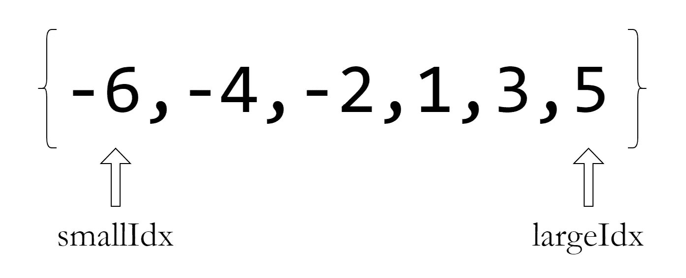
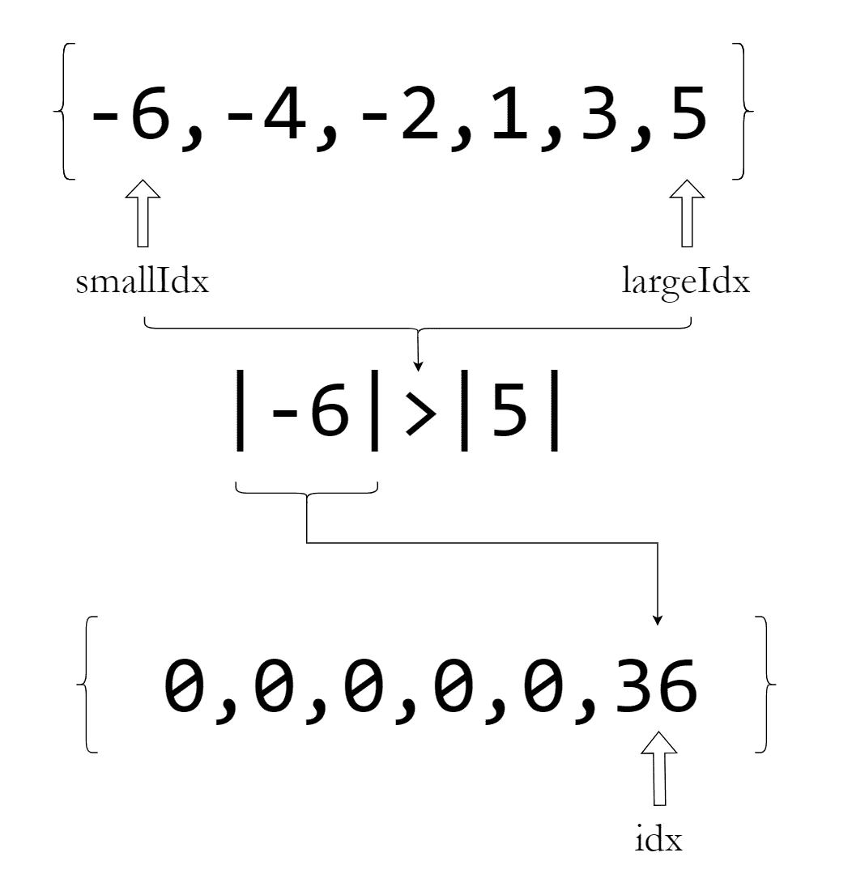
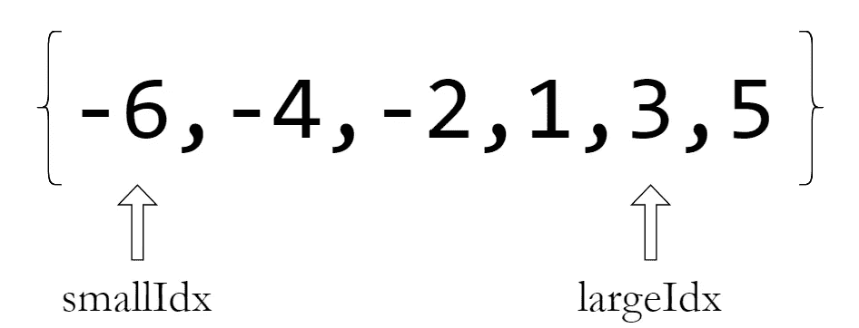

# 一个看起来简单但棘手的 DSA 问题！

> 原文：<https://levelup.gitconnected.com/a-simple-looking-tricky-dsa-problem-217512363a99>

返回一个排序的平方数组并不像看起来那么简单！


照片由[андрейсизов](https://unsplash.com/@alpridephoto?utm_source=medium&utm_medium=referral)在 [Unsplash](https://unsplash.com?utm_source=medium&utm_medium=referral) 上拍摄

# 问题

给定一个按升序排序的数组`[1,2,3,4,5]`，返回一个按升序排序的新数组，其元素是原始数组的平方值，即`[1,4,9,16,25]`

# 新手解决方案

当我看这个问题时，它似乎是惊人的简单！

这是我作为新手解决的方法。

```
array = [1,2,3,4,5]; //Given arraysquared_array = []; //Empty array to be returnedfor(let i=0; i <= array.length; i++){
    squared_array.push(array[i]**2);
}; return squared_array;
```

很简单，不是吗？

这就是我的解决方案被否决前的感受。

# 有什么条件？

上述解决方案将返回上述问题的预期结果，但这并不适用于所有阵列。

如果给定的数组由正数和负数组成，上述解决方案将不会产生预期的结果。

例如，一个数组`[-2,-1,0,1,3]`将产生一个如下的数组:`[4,1,0,1,9]`

# 如果我们对这个数组进行升序排序会怎么样？

让我们实现它吧！

```
array = [1,2,3,4,5]; //Given arraysquared_array = []; //Empty array to be returnedfor(let i=0; i <= array.length; i++){
    squared_array.push(array[i]**2);
};squared_array.sort((a,b) => a - b); //Sorts the array in ascending orderreturn squared_array;
```

这将返回期望的输出。

但是这也不是问题的最佳解决方案。

## 问题的时间和空间复杂性

问题的**时间复杂度**会是***O(n log(n))****因为我们是在返回数组之前对数组进行排序。*

*问题的**空间复杂度**会是***O(n)****因为我们在返回之前在内存中创建了一个新的数组。**

****

**照片由[利亚姆·布里斯](https://unsplash.com/@liam_1?utm_source=medium&utm_medium=referral)在 [Unsplash](https://unsplash.com?utm_source=medium&utm_medium=referral) 上拍摄**

# **我们能找到更优的解决方案吗？**

**如果我们可以避免对返回的数组进行排序呢？**

**就这么办吧！**

**我们得到一个按升序排列的数组:`[-6,-4,-2,1,3,5]`**

1.  **我们将创建一个长度与原始数组相同的零数组。**

```
**const array = [-6,-4,-2,1,3,5];const squared_array = new Array(array.length).fill(0);**
```

**2.我们将创建两个指针，分别指向`array`中的最小和最大值。这些分别是`smallIdx`和`largeIdx`。**

```
**let smallIdx = 0;
let largeIdx = array.length - 1;**
```

****

**指向数组中最小和最大值的指针**

**3.我们将比较这些指针上的整数的绝对值。**

**4.这些绝对值中较大的一个被平方。**

**5.这个平方值被放在零数组中，最后，从右到左从**到**填充它。**

****

**6.指针指向绝对值较大的数字。**

****

**7.重复这个过程，直到我们产生一个可以返回的排序的正方形数组。**

```
**const array = [-6,-4,-2,1,3,5];const squared_array = new Array(array.length).fill(0);for(**let i=array.length-1; i>=0; i--**){
    smallValue = Math.abs(array[smallIdx]);
    largeValue = Math.abs(array[largeIdx]); if (smallValue > largeValue){
        squared_array[i] = smallValue**2;
        smallIdx++;
    } else {
        squared_array[i] = largeValue**2;
        largeIdx--;
    };
};return squared_array;**
```

## **新解决方案的时间和空间复杂性**

**由于我们没有使用排序算法对最终数组进行排序，所以整体解的**时间复杂度**为 ***O(n)*** 因为我们使用的是`for`循环。**

**新解决方案的**空间复杂度**将与之前的解决方案保持相同，即***O(n)****，因为我们在返回之前在内存中创建了一个新的数组。***

> ***这是我们解决这个问题的最佳方式。***
> 
> ***我希望这有助于你下一次的编码面试！***

# ***完整的解决方案***

```
***const array = [-6,-4,-2,1,3,5];const squared_array = new Array(array.length).fill(0);let smallIdx = 0;
let largeIdx = array.length-1;for(**let i=array.length-1; i>=0; i--**){
    smallValue = Math.abs(array[smallIdx]);
    largeValue = Math.abs(array[largeIdx]); if (smallValue > largeValue){
        squared_array[i] = smallValue**2;
        smallIdx++;
    } else {
        squared_array[i] = largeValue**2;
        largeIdx--;
    };
};return squared_array;***
```

******

***照片由 [LinkedIn 销售解决方案](https://unsplash.com/@linkedinsalesnavigator?utm_source=medium&utm_medium=referral)在 [Unsplash](https://unsplash.com?utm_source=medium&utm_medium=referral) 上拍摄***

***感谢您阅读这篇文章！***

****如果你是 Python 或编程的新手，可以看看我的新书《没有公牛**t 学习 Python 指南**’***》:*****

*[](https://bamaniaashish.gumroad.com/l/python-book) [## 学习 Python 的无牛指南

### 你是一个正在考虑学习编程却不知道从哪里开始的人吗？我有适合你的解决方案…

bamaniaashish.gumroad.com](https://bamaniaashish.gumroad.com/l/python-book) [](https://bamania-ashish.medium.com/membership) [## 通过我的推荐链接加入 Medium——Ashish Bama nia 博士

### 阅读 Ashish Bamania 博士(以及 Medium 上成千上万的其他作家)的每一个故事。您的会员费直接…

bamania-ashish.medium.com](https://bamania-ashish.medium.com/membership) 

# 分级编码

感谢您成为我们社区的一员！更多内容见[升级编码出版物](https://levelup.gitconnected.com/)。
跟随:[推特](https://twitter.com/gitconnected)，[领英](https://www.linkedin.com/company/gitconnected)，[通迅](https://newsletter.levelup.dev/)
**升一级正在改造理工大招聘➡️** [**加入我们的人才集体**](https://jobs.levelup.dev/talent/welcome?referral=true)*