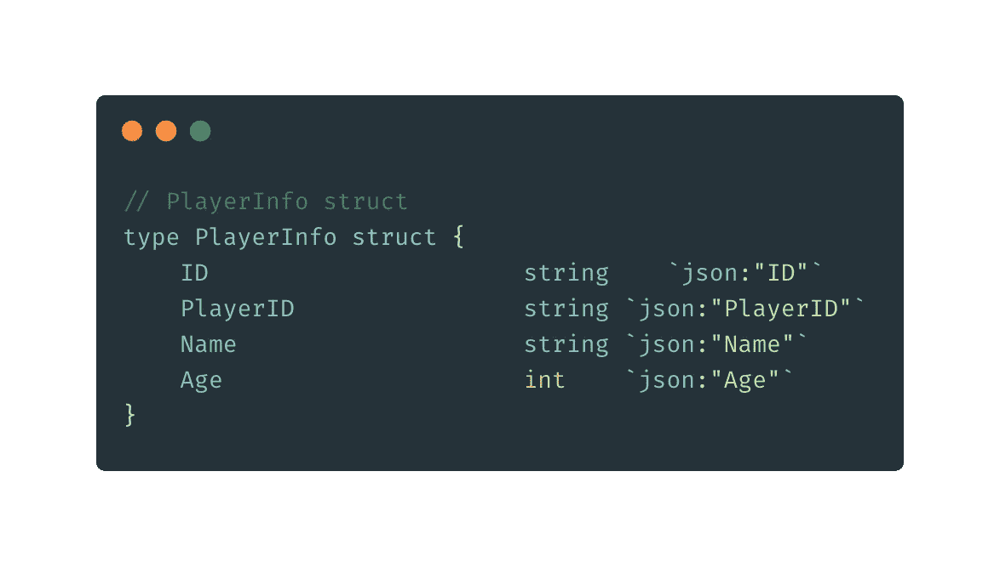
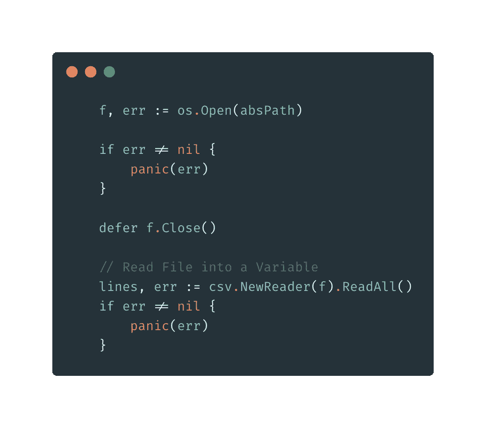
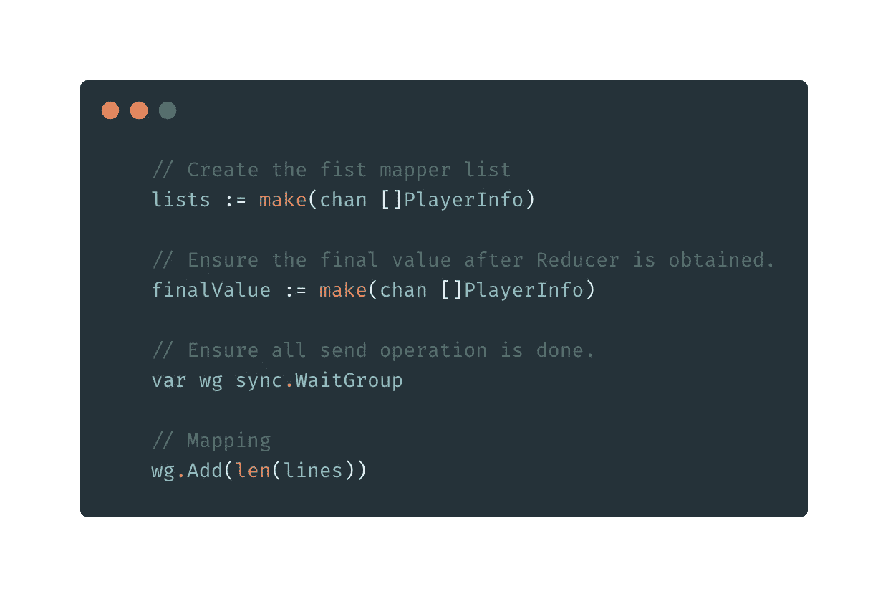
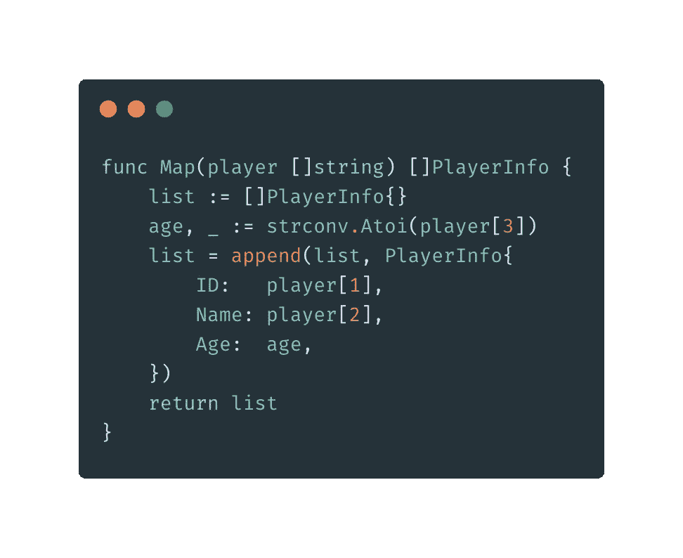
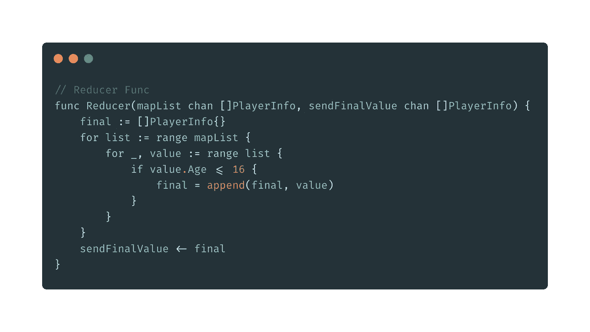
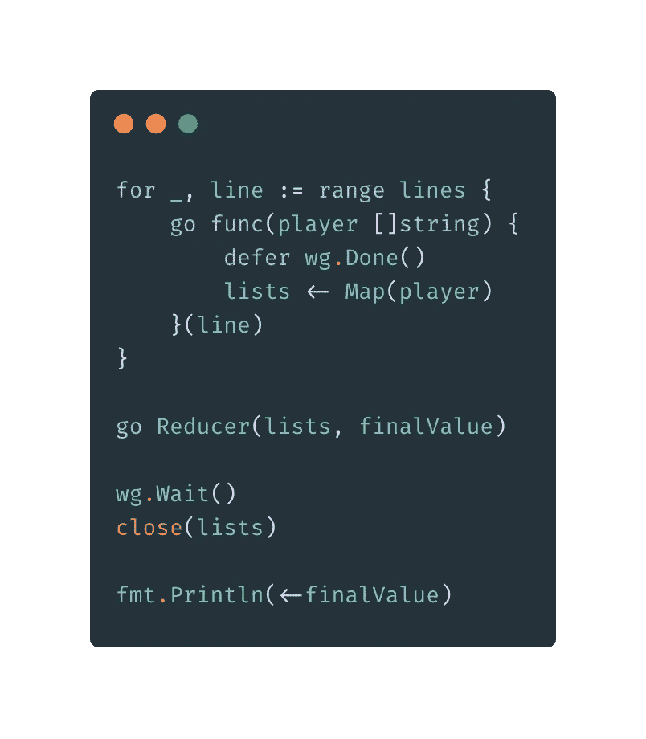
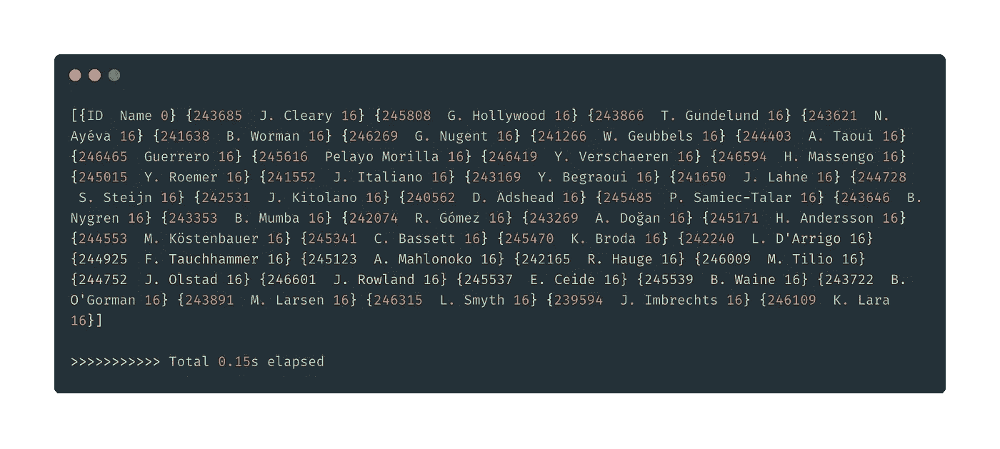

# Go 中一个简单的 MapReduce

> 原文：<https://levelup.gitconnected.com/a-simple-mapreduce-in-go-42c929b000c5>

Hadoop MapReduce 是一个软件框架，用于轻松编写应用程序，以可靠、容错的方式在大型商用硬件集群(数千个节点)上并行处理大量数据(多 TB 数据集)。

MapReduce *作业*通常将输入数据集分割成独立的块，由*地图任务*以完全并行的方式处理。框架对映射的输出进行分类，然后输入到 *reduce 任务*。通常，作业的输入和输出都存储在文件系统中。该框架负责调度任务、监控它们并重新执行失败的任务。

今天，出于测试和学习的原因，我想在 Go 中编写一个简单的 MapReduce 作业。

# 用例

我们有一个包含大约 18000 名足球运动员信息的 csv 文件(我从[https://www.kaggle.com](https://www.kaggle.com/)下载的)。目标是按年龄或我们需要的任何其他属性排序。

## 演示的示例结构

我们只为演示创建了一个简单的结构，例如，我们将根据姓名或年龄进行过滤/减少，即使我们在原始 csv 中有大部分关键字或项目。

示例 PlayerInfo 结构

## 打开文件

使用标准 Golang 实现打开文件。

开文件

## 创建渠道

> 不要通过共享内存来交流；相反，通过交流来分享记忆。

渠道是围棋的一个漂亮优势。

实施渠道

## 映射器实现

这里的映射函数是确保展平列表并返回我们想要处理的 struct

制图人

## 减速器实施

这个实现就是您想要添加的过滤器。在这个例子中，我们将玩家的年龄减少到 16 岁或 16 岁以上。

## 使用 goroutine 调用映射器和缩减器

**结果**

# 摘要

这只是一个简单的例子，演示了如何在 Go 中实现 MapReduce。我没有为任何生产用例优化代码。这意味着我们错过了单元测试、基准测试等等。

有关我的其他围棋文章，请访问:

[https://medium.com/@jayhuang75](https://medium.com/@jayhuang75)