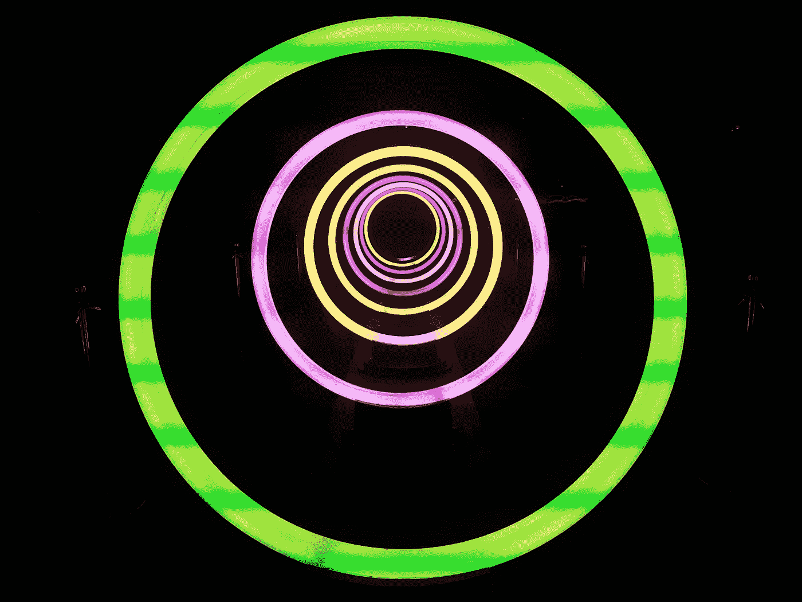
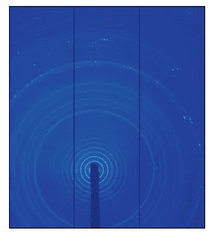
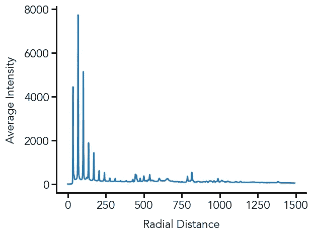

# 一种计算图像圆形灰度平均值的简单方法

> 原文：<https://levelup.gitconnected.com/a-simple-method-to-calculate-circular-intensity-averages-in-images-4186a685af3>

## 使用 Python 确定图像中强度随径向距离的变化



[詹姆斯·托马斯](https://unsplash.com/@thegalaxyshooter?utm_source=unsplash&utm_medium=referral&utm_content=creditCopyText)在 [Unsplash](https://unsplash.com/s/photos/circle?utm_source=unsplash&utm_medium=referral&utm_content=creditCopyText) 上拍照

在实验材料科学中，我们经常得到如下图所示的图像，称为 X 射线衍射图。



在这种情况下，被测样品的对称性导致图像具有恒定强度的环，称为[德拜-谢勒环](https://en.wikipedia.org/wiki/Powder_diffraction)。对我们来说，这是多余的数据，我们需要将此图像简化为径向距离(从所有环的中心)与每个径向距离的强度的简单图表。最简单可行的方法是，取一条从中心开始向外径向延伸的线，记录每个径向点的强度。然而，更可靠的方法是使用整个环的平均强度，以确保可变性得到平均。

原来这个做起来很简单！这里显示的例子将使用 Python 包`numpy`完成，并使用`matplotlib`可视化。此外，为了导入这个例子中的 TIFF 文件，我将使用一个名为`tifffile`的包，它可以在[这里](https://pypi.org/project/tifffile/)找到。

# **加载图像**

首先，我们导入将要使用的包:

```
# Import packages
import matplotlib.pyplot as plt
import matplotlib as mpl
import numpy as np
from tifffile import imread, imshow
```

现在，我们可以通过使用`tifffile.imread`来加载我们的映像。我们的做法如下:

```
# Load our image
img = imread('DiffractionImage.tif')
```

如果我们现在想展示我们的图像来检查它看起来是什么样子，我们可以使用下面几行代码:

```
# Show our image
imshow(img)
plt.show()
```

# **计算径向距离**

通过检查，我们发现所有圆的中心都在像素值(1242，642)——第 1242 行和第 642 列。所以我们要做的第一件事是重新定义像素坐标，使这一点的径向距离为 0。这一转变将包括 2 个步骤:

1.  创建两个网格—一个对应于 x 坐标，一个对应于 y 坐标
2.  使用 x 和 y 值计算每个点的径向距离，并创建一个新格网-新格网中的每个点将具有与(1242，642)的径向距离相对应的值

```
# Image center
cen_x = 642
cen_y = 1242# Get image parameters
a = img.shape[0]
b = img.shape[1]# Find radial distances
[X, Y] = np.meshgrid(np.arange(b) - cen_x, np.arange(a) - cen_y)
R = np.sqrt(np.square(X) + np.square(Y))
```

# **初始化变量**

我们现在将初始化用于平均计算的变量。这里，我们需要设置平均的分辨率。下面的代码行创建了一个名为`rad`的数组，它的径向值从 1 个像素到网格中的最大径向值。第三个参数定义了我们想要的径向点的密度或稀疏度(在本例中，每 1 个像素)。该数组将作为我们最终绘图中的 x 值:

```
rad = np.arange(1, np.max(R), 1)
```

现在我们为我们的 y 值(强度)初始化数组。我们创建了一个长度与`rad`相同的 0 的数组(我们会随着时间的推移而改变)，以及一个名为`index`的索引变量，我们将使用它来跟踪我们在哪里改变强度:

```
intensity = np.zeros(len(rad))
index = 0
```

# **计算径向平均值**

现在，我们可以使用一个循环来计算每个径向距离的平均值。这里，我们设置的另一个重要参数是 bin 大小。这设置了除了我们正在寻找的精确径向距离之外，我们还包括多少像素。在本例中，我们将一个小于或大于我们感兴趣半径 1 个像素的面元:

```
bin_size = 1
```

我们的循环将按以下步骤进行:

1.  我们使用我们的`bin_size`来屏蔽我们的图像——剩下的唯一值将是那些未被屏蔽的值(在我们感兴趣的半径范围内)
2.  计算屏蔽值的平均值——这给出了给定径向距离处的平均强度
3.  将我们的`intensity`数组的索引赋值给在步骤 2 中计算的平均值
4.  重复步骤 1–3，直到我们遍历完整个`rad`数组

```
for i in rad:
  mask = (np.greater(R, i - bin_size) & np.less(R, i + bin_size)
  values = img[mask]
  intensity[index] = np.mean(values)
  index += 1
```

虽然看起来很简单，但我们现在完成了！

剩下要做的最后一件事是查看我们新的循环平均图像。我们可以这样做(我改变了一些情节参数，更详细的解释可以参考[我之前的文章](https://towardsdatascience.com/an-introduction-to-making-scientific-publication-plots-with-python-ea19dfa7f51e)):

```
# Adjust plot parameters
mpl.rcParams['font.family'] = 'Avenir'
mpl.rcParams['font.size'] = 16
mpl.rcParams['axes.linewidth'] = 2
mpl.rcParams['axes.spines.top'] = False
mpl.rcParams['axes.spines.right'] = False
mpl.rcParams['xtick.major.size'] = 7
mpl.rcParams['xtick.major.width'] = 2
mpl.rcParams['ytick.major.size'] = 7
mpl.rcParams['ytick.major.width'] = 2# Create figure and add subplot
fig = plt.figure()
ax = fig.add_subplot(111)# Plot data
ax.plot(rad, intensity, linewidth=2)# Edit axis labels
ax.set_xlabel('Radial Distance', labelpad=10)
ax.set_ylabel('Average Intensity', labelpad=10)
```



# **最后备注**

我被用几行代码进行循环平均是多么优雅和简单所吸引，所以我想整理出一篇循序渐进的文章来展示——希望你喜欢！这个脚本是我为分析 X 射线衍射数据开发的一个更大的工具集的一部分，可以在这个 [Github 库](https://github.com/venkatesannaveen/xray-scattering-tools)中找到。

感谢您的阅读！我感谢任何反馈，你可以在 [Twitter](https://twitter.com/naveenv_92) 上找到我，并在 [LinkedIn](https://www.linkedin.com/in/naveenvenkatesan/) 上与我联系，了解更多更新和文章。