# 多语言网站的简单 Next.js 前端

> 原文：<https://levelup.gitconnected.com/a-simple-next-js-frontend-for-a-multilingual-website-ae31a17387e2>

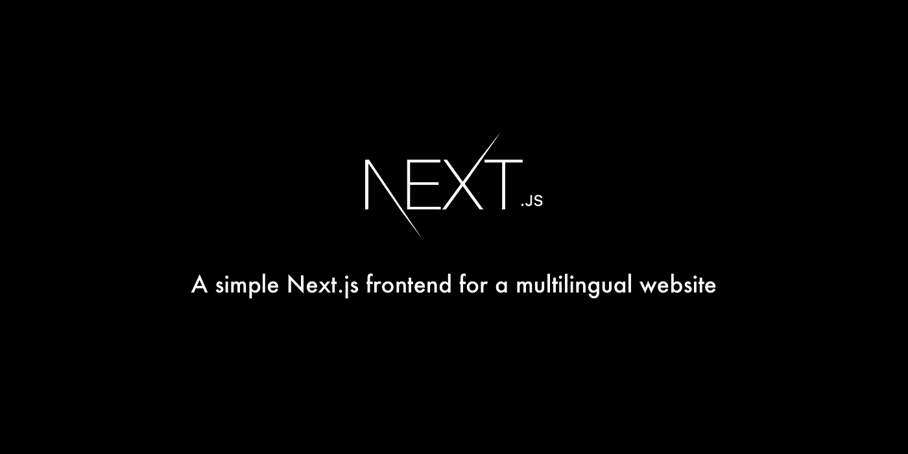

在最近的一个项目中，我被要求建立一个简单的多语言 SPA 解决方案。由于该公司在 React 中已经有了很多开发经验，使用 Next.js 的决定变得很容易。

js 是一个强大的框架，它为 React-projects 提供了一个简单的设置和框架。从服务器端渲染到 CSS-In-JS，Webpack 配置到持续部署，Next.js 正在成为许多 React 工程师的首选武器。

# 入门指南

建立一个新的 Next.js 项目很容易，只需运行以下命令:

```
yarn create next-app
```

这会给你一个空的项目。运行`yarn dev`将提供“欢迎来到 [Next.js！](https://nextjs.org/)"页面大概是这样的:

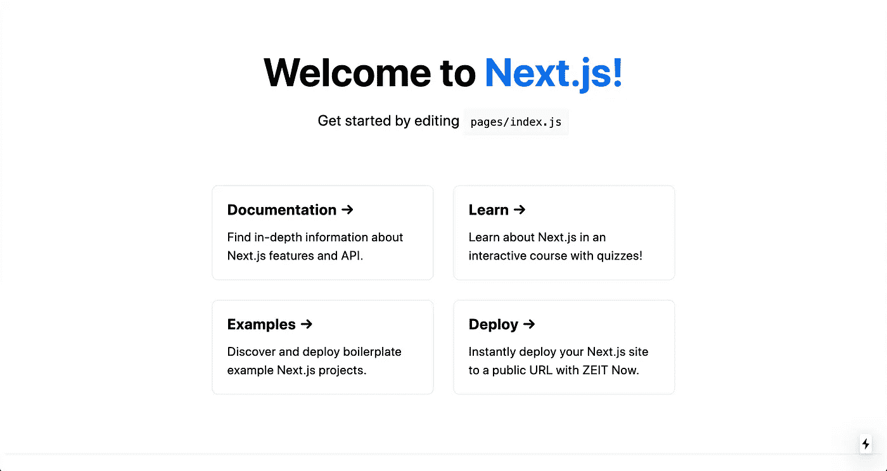

让我们从去除样板样式开始，让样式成为我们自己的样式。我是 CSS-in-JS 的忠实粉丝。有很多不同的解决方案，但是对于这个设置，我使用 [@emotion/styled](https://emotion.sh/docs/styled) 。你也可以使用[风格组件](https://styled-components.com/)或[材质界面](https://material-ui.com/)，选择你喜欢的。注意，这篇文章不是关于样式的，更多细节请查看 [Indrek Lasn](https://medium.com/@indreklasn) 的伟大文章[关于 CSS-in-JS](https://medium.com/better-programming/all-you-need-to-know-about-css-in-js-984a72d48ebc) 你需要知道的一切。

下面你可以看到`pages/index.js`代码的样子。我更喜欢先写默认导出，然后是我的样式化组件。这样，您可以立即看到正在呈现的内容，当您在一个页面或组件中有多个不同样式的组件时，这尤其有用。

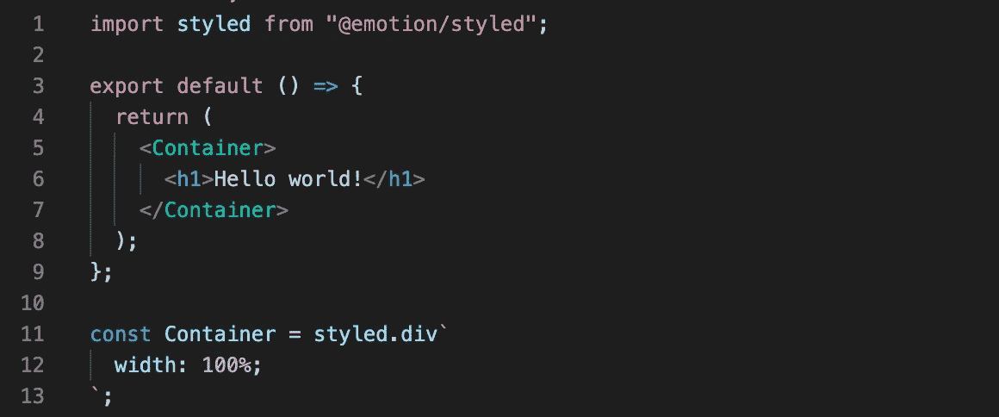

page/index . js

# 按指定路线发送

Next.js 带有一个零配置路由。您可以简单地在 pages 文件夹中创建一个新文件。当一个文件被添加到 pages 文件夹中时，它将自动作为一个路径。例如:当您创建一个`about.js`文件时，它将在`[http://localhost:3000/about](http://localhost:3000/about.)` [被提供。](http://localhost:3000/about.)

## 动态路由

因为我们正在设置一个多语言应用程序，所以我们希望在 URL 中包含区域设置。因此，对于英语，我们需要`[http://localhost:3000/en](http://localhost:3000/en)`，对于荷兰语，我们需要`[http://localhost:3000/nl](http://localhost:3000/nl)`。这就是动态路由显示其威力的地方。在 pages 文件夹中创建一个名为`[lang]`的文件夹，并添加一个`index.js`文件。这里我们将使用`useRouter`钩子，它将公开我们需要的数据和方法，以便从我们的 URL 获得 lang 参数:

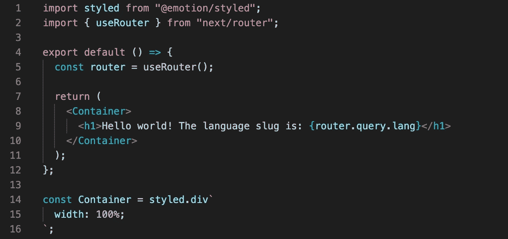

page/[lang]/index . js

如果一切正常，您现在应该会在浏览器中看到语言参数:

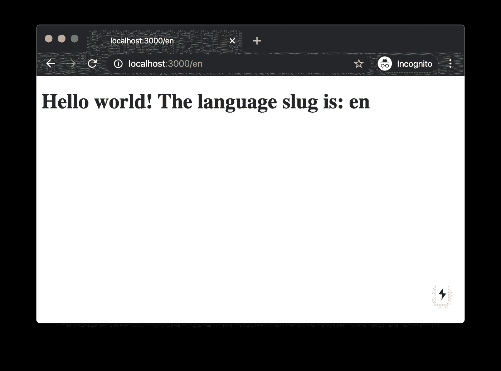

我们可以从 URL 中获取语言参数。但是只有一个问题，我们没有验证它。这意味着我们可以传递任何值，它将被接受。试着浏览到`http://localhost:3000/im-not-a-language`，你就会明白我的意思。现在不要担心那个，我们以后会处理它。

## 自定义下一个应用程序

我们创建了一个需要成为应用程序根目录的语言路径，但当我们访问根目录时，我们仍然会看到索引页面。我们想要做的是将路由重定向到语言页面。

我们可以直接在索引页面上这样做，但是最好在呈现索引页面之前这样做。默认情况下，Next.js 使用内置的`App`组件来初始化页面。您可以覆盖它并控制页面初始化。让我们在 pages 文件夹中创建我们自己的`_app.js`:

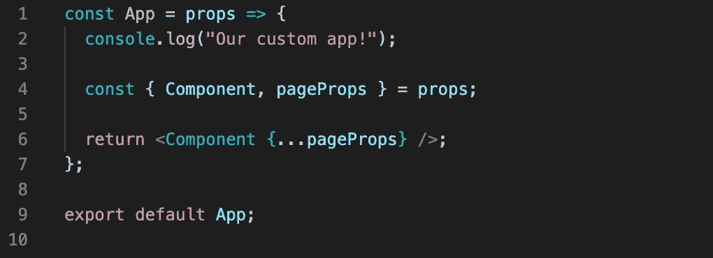

pages/_app.js

这是自定义应用程序的最基本形式。它只不过是根据我们所处的路线为一个组件提供服务。我们添加了一个 console.log，因此在您的浏览器控制台中，您现在应该会看到“我们的定制应用！“消息。

*由于改变了 app 的结构，需要重启 dev 服务器。在你的终端中杀死你的 dev 服务器(ctrl+c)并重新启动它(yarn dev)。*

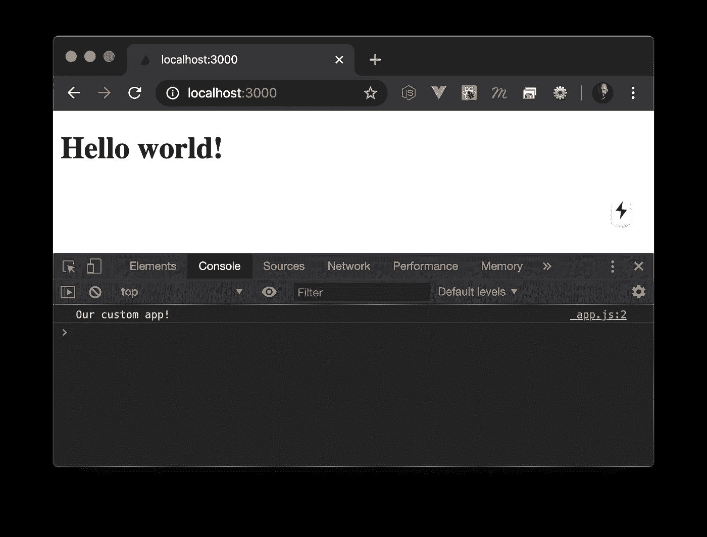

Custom _app.js 在运行中

## 服务器端呈现(SSR)

Next.js 提供的最酷的特性之一是服务器端渲染。SSR 对于 SEO 和社交标签非常有用。我们的应用在两种环境下运行:

*   客户端(在浏览器中)。
*   服务器端(在节点服务器上)。如果您想深入了解 SSR，请确保查看正确完成的[服务器端渲染](https://medium.com/better-programming/next-js-react-server-side-rendering-done-right-f9700078a3b6)。

如您所见，在我们的节点环境中也触发了 console.log:

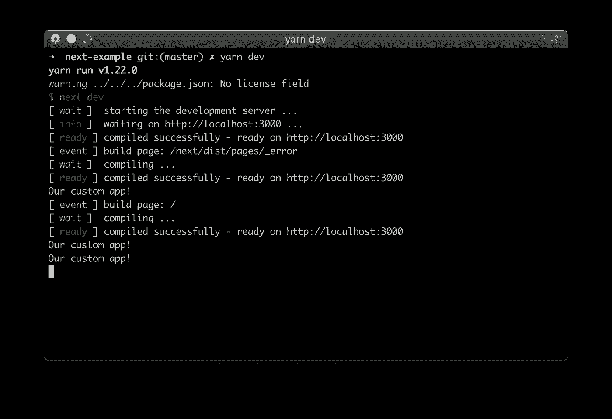

# 获取用户的语言

我们已经有了自己的语言路线，并创建了一个定制的应用程序。现在该做一些语言逻辑了。在我们项目的根目录下创建一个`utils`文件夹，并添加一个导出`configureLanguage`函数的`language.js`:

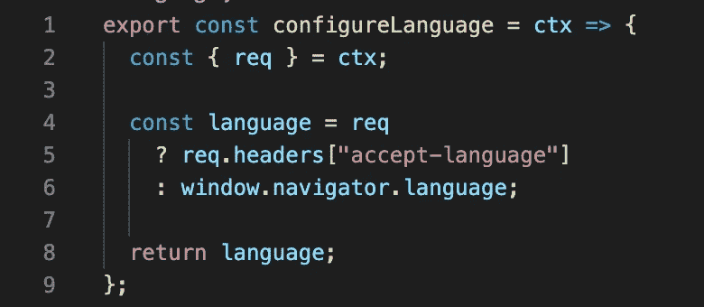

实用工具/语言. js

`configureLanguage`接受一个上下文(ctx)对象，我们将从我们的`_app.js`传递这个对象。context 对象包含一个请求对象，请求对象包含头，`accept-language`是其中之一。然而，由于上下文对象只在服务器端可用，我们还需要返回到`window.navigator`对象来确定客户端语言。

*   在初始页面加载时，服务器确定用户的语言。
*   当我们开始浏览我们的应用程序时，我们将使用`window.navigator`对象并从客户端获取用户的语言。

在`_app.js`中，我们将导入这个函数，如下例所示。注意到异步`getInitialProps`功能了吗？该函数支持服务器端呈现，并允许我们进行初始数据填充。 [Griko Nibras](https://medium.com/@griko?source=post_page-----1265a6abc652----------------------) 在 [getInitialProps](https://medium.com/@griko/exploring-undocumented-getinitialprops-properties-on-next-js-1265a6abc652) 上做了一个很棒的帖子，你一定要看看。

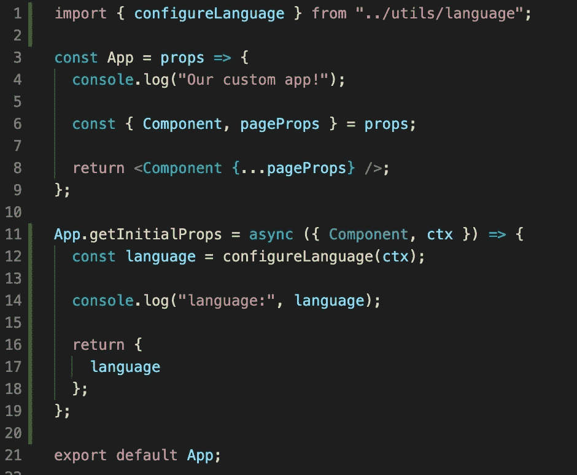

pages/_app.js

当我们加载我们的应用程序时，服务器将启动`getInitialProps`,并在我们的终端中记录该语言。客户端我们看不到日志，因为这是我们的初始页面加载，只发生在服务器端:

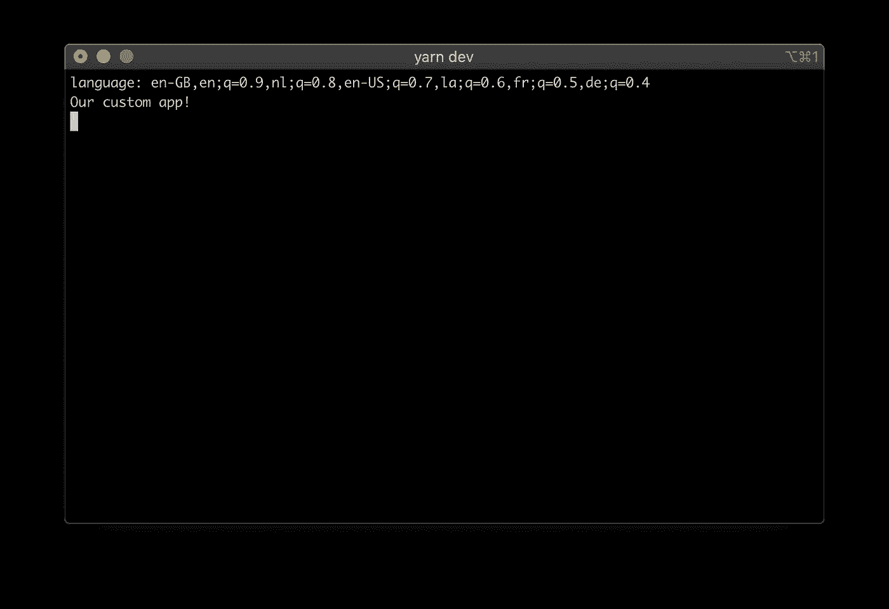

## 接受语言

Accept-Language 是用户代理希望内容使用的首选语言列表。最首选的语言是字符串中的第一种语言。

在这种情况下，`en-GB`是最首选的语言。我们只想返回`en`来匹配我之前提到的路线。为了获得字符串的这一部分，我们需要创建一个提取 Accept-Language 的函数。这由下面代码片段中的`getLanguage`处理。

此外，我们希望检查用户最喜欢的语言是否在我们的应用程序中可用，如果没有，我们将退回到我们的`fallbackLanguage`，这由`validateLanguage`处理。

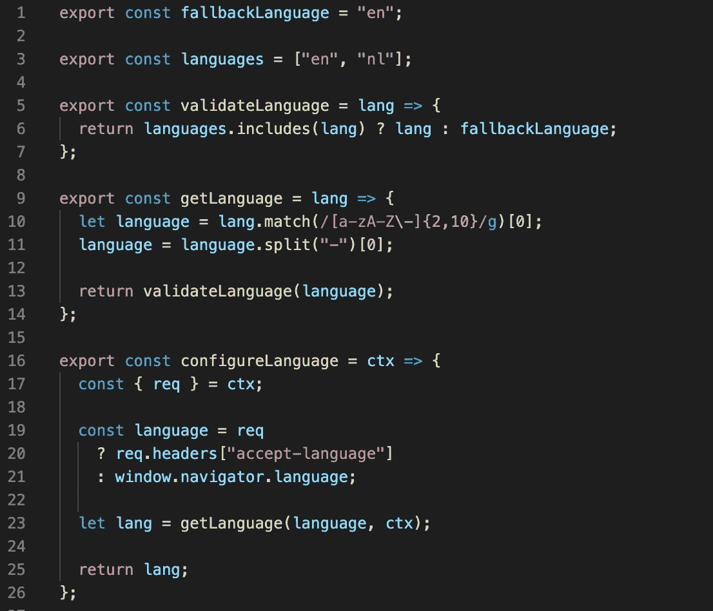

实用工具/语言. js

现在我们知道了首选语言，我们可以将应用程序的根目录重定向到首选语言。如果`res`对象可用，这意味着应用程序正在服务器端运行。当使用`res.writeHead()`时，我们告诉应用程序的服务器端发送新的头信息。

第一个参数是状态代码，将是 302。这个状态代码可以是最适合您的用例的任何 HTTP 状态代码。

> 找到的 HTTP 响应状态代码 302 是执行 URL 重定向的常见方式。HTTP/1.0 规范最初定义了这个代码，并给出了描述短语“临时移动”而不是“找到”。带有此状态代码的 HTTP 响应还会在头字段位置提供一个 URL。

第二个参数是包含*位置*值的对象。这是我们将要放置我们想要重定向到的 URL 的地方。`res.end()`让应用程序知道执行重定向。

最后，当代码在客户端执行时，我们执行一个`Router.push`来重定向用户。

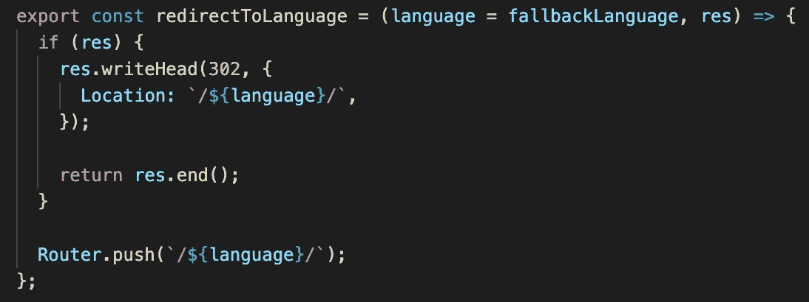

实用工具/语言. js

然后在`asPath`是我们 app 的根的时候调用`configureLanguage`里的函数:

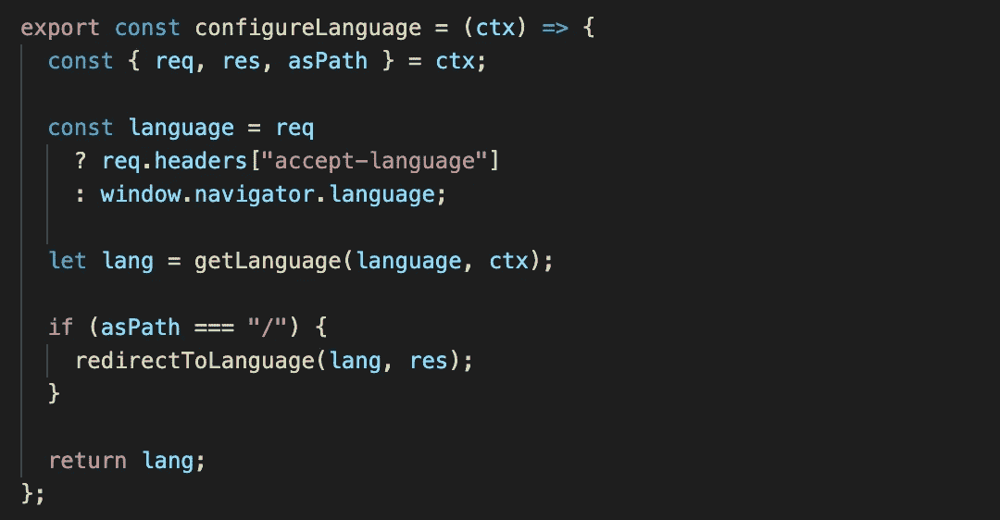

实用工具/语言. js

# 改变语言

可能会发生这样的情况，用户希望应用程序以不同于首选语言的语言提供服务，因此让我们创建一个语言选择器。在我们项目的根目录下创建一个名为`components`的新文件夹，并在其中添加一个`LanguageSelector.js`。

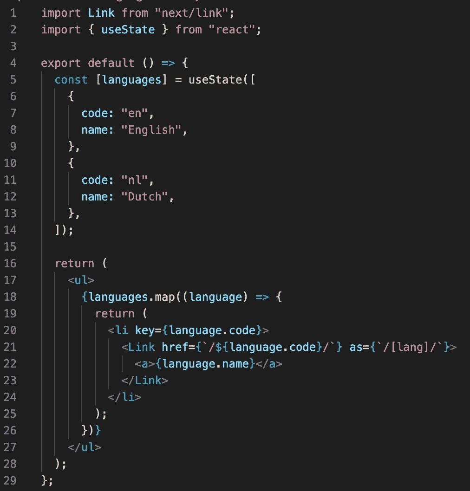

组件/LanguageSelector.js

目前，可用的语言是硬编码的，但是它们也可以从`utils/language.js`或`_app.js`中提供。

由于用户改变了他的首选语言，我们不能再依赖 Accept-Language 了，这就是为什么我们将选择的语言存储在 cookie 中。

*   当登陆到根目录(`/`)时，我们检查是否设置了语言 cookie。
*   当设置了语言 cookie 时，我们知道那是我们用户的首选语言，并且我们使用它。
*   如果没有设置 cookie，我们就返回到 Accept-Language 来获取用户最喜欢的语言。
*   当用户直接访问一个语言页面时(`/en`)，我们会更新 cookie 并将该语言设置为首选语言。

有一个很棒的设置和获取 cookies 的插件叫做 [Nookies](https://github.com/maticzav/nookies) 。让我们安装它。

```
yarn add nookies
```

> Nookies 是 Next.js 的 cookie 助手集合，它超级轻便，非常适合身份验证。设置和销毁 cookies 也适用于服务器端。

向我们的语言实用程序添加两个函数，一个用于设置语言 cookie，一个用于获取语言 cookie。一定要从 nookies 中导入`setCookie`和`parseCookies`函数。

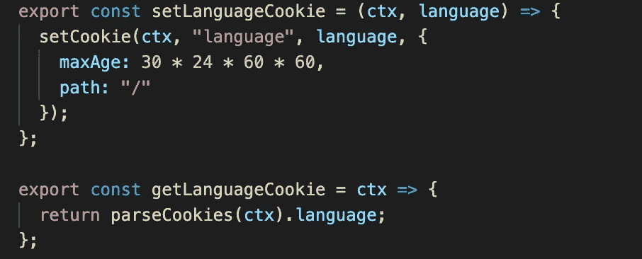

实用工具/语言. js

在我们的`configureLanguage`函数中，当`asPath`不是我们应用程序的根时，我们将设置 cookie。

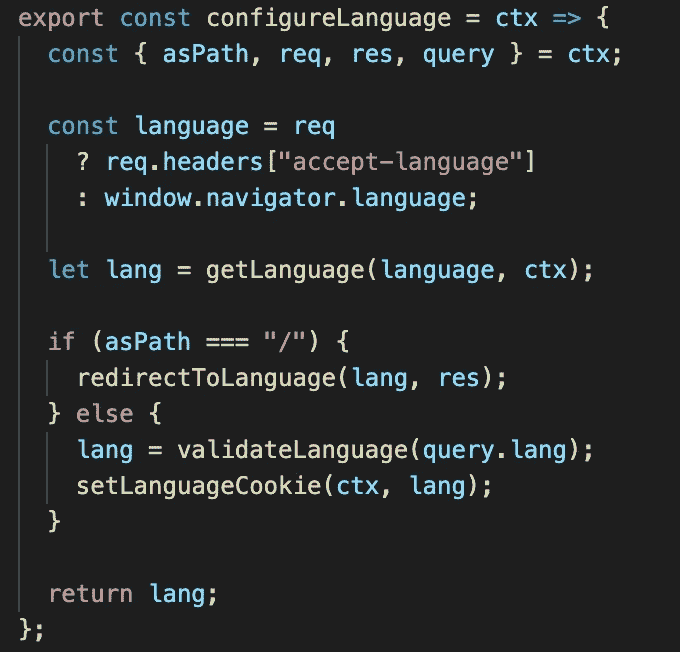

我们需要做的最后一件事是更新`getLanguage`函数。我们检查是否设置了语言 cookie，如果是，我们将返回 cookie 中提供的语言。

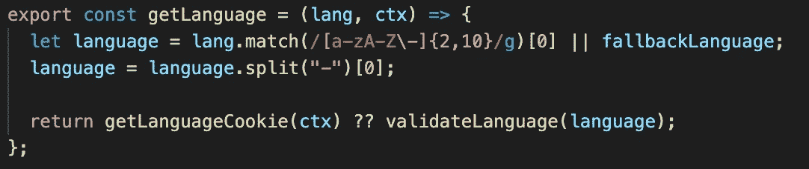

这就是现在，一个简单的多语言设置。我已经将代码推送到 [GitHub](https://github.com/timrijkse/nextjs-multilanguage) 中，这样你就可以玩它了。我很想听听你的想法。我将在未来撰写关于多语言 Next.js 项目的后续文章，所以请务必关注我，我也在 [Twitter](https://twitter.com/tim_rijkse) 上。

编码快乐！