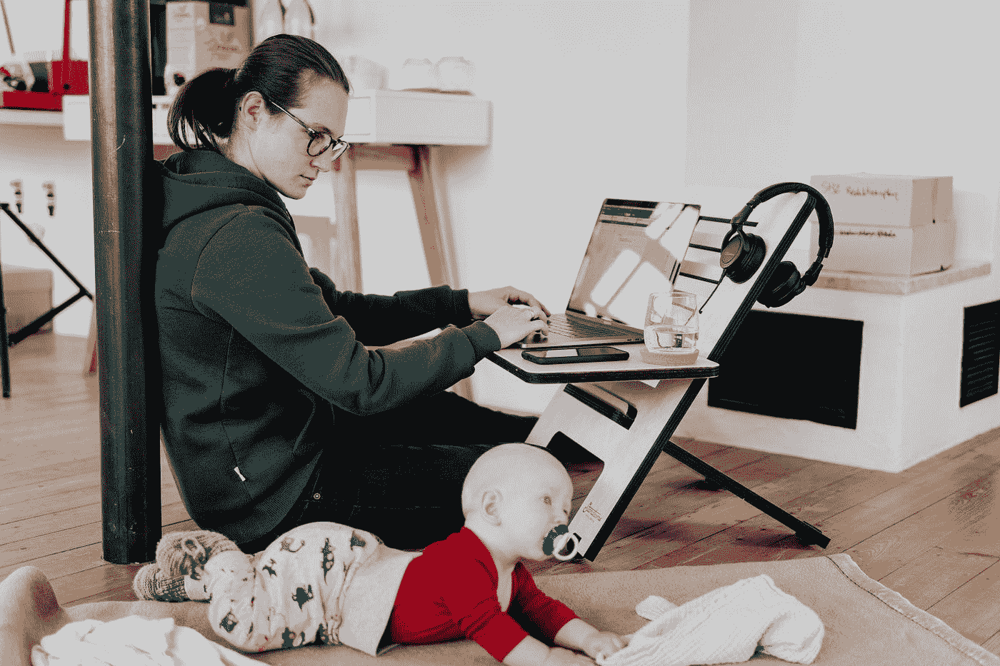

# 开发软件时提高生产力的简单过程

> 原文：<https://levelup.gitconnected.com/a-simple-process-to-boost-productivity-while-developing-software-9ad79653348e>

在 [Unsplash](https://unsplash.com?utm_source=medium&utm_medium=referral) 上[站着的工作生活方式](https://unsplash.com/@standsome?utm_source=medium&utm_medium=referral)的照片

# 我们无法一心多用

我们人类非常不擅长多任务处理。有些人认为他们擅长这个，有些人认为如果他们努力的话，他们可以做到，但事实是我们**没有能力做到。**

那么什么是多任务处理呢？据[维基百科](https://en.wikipedia.org/wiki/Human_multitasking):

> *多任务处理是指同时执行多项任务或活动的能力。*

对我们的大脑来说，一心多用是不可能的。我们的大脑一次只能处理一项任务。因此，当我们认为我们正在进行多任务处理时，我们实际上是在相对较短的时间内在任务之间切换，这被称为[上下文切换](https://en.wikipedia.org/wiki/Context_switch)。并且上下文切换是非常低效的过程。有很多关于这个主题的研究，它们都非常有结论性:[上下文切换对你的生产力不利](https://medium.com/autodesk-tlv/context-switch-the-only-operation-that-kills-productivity-4a3185e9da0e)。

你的大脑从一项任务完全转换到另一项任务所花费的时间是浪费的时间。这就是为什么如果你专注于一项任务，并且只专注于一项任务，尽可能长时间避免切换到不同的任务，你会更有效率。

对你的大脑来说，同时处理多项任务就像试图同时打扫公寓两边的两个房间。

[粘土堤](https://unsplash.com/@claybanks?utm_source=medium&utm_medium=referral)在 [Unsplash](https://unsplash.com?utm_source=medium&utm_medium=referral) 上拍照

在这种情况下，你要做的是在第一个房间打扫一点——然后走到另一个房间，在那里打扫一点——然后再走回第一个房间，以此类推。

这是一种非常低效的打扫两个房间的方式，因为你花在穿过公寓去另一个房间的时间，可以用来打扫你此刻所在的房间。所以打扫两个房间最有效的方法是先打扫一个房间，然后再去下一个房间。

当你试图同时处理多项任务时，对你的大脑来说就是这样。如果你能直接运送到另一个房间，那就太好了，这样你就可以马上继续打扫第二个房间，而不用浪费时间在走路上，但它就是不这样工作。你的大脑也不会从一个任务到另一个任务进行“T0”运输，而是必须“T2”走完公寓的长度才能到达另一个任务。你想尽可能避免这样做。

所以下一次当你在解决某个问题时，你看到一封新的电子邮件通知，把那封邮件想象成在公寓另一边的一个房间里。此刻你只是没有时间来回走动。一旦你完成了手头的工作，你就会看到这封邮件。

# 我们如何避免软件开发中的上下文切换

作为软件开发人员，我们给企业带来的最大价值是我们的效率:**在最短的时间内写出有价值的软件**。到底什么是有价值的软件？这个问题有很多答案，其中一个是:软件做需要做的事情，它是干净的，并且以一种将来可以很容易测试、扩展和阅读的方式编写。

一旦你掌握了编写有价值软件的方法，下一步就是速度。怎样才能更快到达**？**

**当企业有一个新的任务给开发人员时，开发人员的工作可以分成三个不同的部分:**

**第一部分:理解软件需要做什么。最好的方法是把你要写的软件当成一个黑盒:对于每一个可能的输入，定义预期的输出应该是什么。让我们称这部分为“需求”。**

****第二部分**:编写代码，处理第一部分中定义的所有可能的输入，并给出正确的输出。这就是“功能性”。**

****第三部分**:重构代码，让它尽可能有价值。比如说“重构”。**

**一次只关注其中一个问题，完全忽略其他两个问题是使用你全部认知能力的最佳方式，而不是陷入在它们之间切换的陷阱，降低你的效率。**

**让我们更详细地了解这三个部分。**

# **第一部分:要求**

**顾名思义，在这一部分你只需要考虑需求。当你了解了需求是什么——代码需要处理的所有情况(输入),并且你确定你已经考虑了所有的边缘情况——下一步就是把它们写下来。**

****

**凯瑟琳·拉威利在 [Unsplash](https://unsplash.com?utm_source=medium&utm_medium=referral) 上拍摄的照片**

**你可以把它们写在一张纸上，但是对于一段代码的需求来说，没有比测试更好的文档了。您可以涵盖您的代码将需要在您将要编写的测试中处理的所有情况。**

**在这一部分中，你不必编写完整的最终测试来全面测试你的代码。首先，您可以定义测试的框架，并在编写实际代码时将它作为路线图来指导您。然后当你写代码的时候，你可以回来完成测试。**

**如果您正确地编写了您的测试，它们也将作为文档供其他开发人员(包括您在内)在将来试图弄清楚代码应该做什么时使用。他们不需要查看实际的代码，而是可以查看测试，并快速找出功能是什么。**

# **第二部分:功能**

**在第二部分中，您开始编写代码，这些代码将完成需求指定的任务。但是在这部分你只关心功能性。**

****

**由[菲德尔·费尔南多](https://unsplash.com/@fifernando?utm_source=medium&utm_medium=referral)在 [Unsplash](https://unsplash.com/?utm_source=medium&utm_medium=referral) 拍摄的照片**

**您唯一关心的是代码会做它应该做的事情，而不是别的。你不关心干净的代码，你不关心正确地命名变量和方法。你像一个“*初级开发人员*”一样编写代码，仍然在学习他们的编码方式。您只需要确保您的代码覆盖了前一部分中定义的所有情况:**对于每一个可能的输入，它都会提供正确的输出**。**

**你不必将你的注意力转移到任务的需求上来确保你没有忘记一个用例，或者你没有覆盖每一个可能的边缘用例。此外，您也不会考虑对变量或方法使用什么样的最佳名称——如果代码的一部分应该放在不同的方法或不同的对象中。在这一部分中，您唯一关注的是**功能**。**

**在那之后，您完成您的测试(或者如果您在上一部分中没有开始编写它们，您开始编写它们)，并且您让它们通过。然后，您确信您的代码工作正常，您可以继续下一部分。**

**你可以在第一部分或第二部分写你的测试，或者你可以在两部分都写一点。但是在你继续之前，你需要你的测试。否则重构部分对你来说会非常痛苦和缓慢。**

# **第三部分:重构**

**测试通过后，您确信您编写的代码将处理所有需求。对于每一个可能的输入，它都会提供正确的输出。**

****

**[亚历克斯·布洛克](https://unsplash.com/@alexblock?utm_source=medium&utm_medium=referral)在 [Unsplash](https://unsplash.com/?utm_source=medium&utm_medium=referral) 上的照片**

**但是正如我们之前所说的，有价值的软件不仅仅做它应该做的事情。有价值的软件还必须具有其他特征。在这最后一部分，你只关心这个。在这里，你可以使用所有的重构技术来确保代码尽可能的有价值。**

**你不考虑需求(测试让你在那里覆盖)，你不考虑功能(测试也让你在那里覆盖)，你只考虑通过重构把**值**添加到代码中。这是你在这一部分的重点。**

**你改变变量的名字——你运行测试。如果一切顺利，你继续。你改变方法的名字——你运行测试。你提取一个方法或者一个新类——你运行测试。**

**一旦你完成了这些，你就已经在你的认知能力允许的情况下，以最快的速度写出了最有价值的软件。**

**通过能够一次专注于一个问题，而不是在需求、功能和重构之间来回切换，你确保了那些问题中的每一个都得到了你的全部注意力和全部脑力。**

**请注意，这种工作方式不适合更大的任务。如果你不得不解决一个更复杂的问题，你不能这样做。对于一个更大的问题，你必须把它分成更小的任务，然后按照步骤去做。你提取一小部分需求，编写关于它们的功能，然后重构。你一遍又一遍，直到完成整个任务。**

**这就带来了 [TDD](https://en.wikipedia.org/wiki/Test-driven_development) (测试驱动开发)。如果你知道 TDD，那么你现在可能已经把我谈到的三个部分和 TDD 的三个部分“红色、绿色、重构”联系起来了。你是对的！TDD 是一种实践，可以用来实现这种实践的目标，但是因为您可以在完成第 2 部分中的代码之前不必编写测试就可以进行这种实践，所以您可以在不实际实践 TDD 的情况下进行这种实践。**

# **结论**

**我们不能同时处理多项任务，这迫使我们在开发软件时仔细考虑将要采取的策略。我们必须非常小心，尽可能避免上下文切换，所以我们需要想出迫使我们一次只专注于一项任务的方法。通过这样做，我们可以确保在最短的时间内编写出最好的软件，为企业带来更多的价值。**

# **进一步的想法**

**我从这种思维模式中最大的收获是当你把第二部分和第三部分分开时会发生什么。每个专业开发人员都知道你需要遵循的所有规则，以使你的代码简洁、易读、可测试和可维护。同时考虑“你的代码*做什么”*(功能性)和“*你的代码如何做*”(干净的代码)，通常是非常困难的。从第 2 部分的*如何*的负担中解脱出来，你可以分配更多的脑力来解决你的代码*做什么。*这同样适用于第 3 部分:当“你的代码*做什么”*已经处理好了，你就可以自由地考虑*如何做了。马丁·福勒的《重构》是一本非常有用的书，可以帮助你完成第 3 部分的工作。***

**这个过程可以用于很多其他事情。当我写这篇文章时，我使用了它:在第一部分，我只是用很短的句子写下我想说的所有想法。在第二部分，我解释了这些想法，只是写下了我想说的关于它们的一切。在第 3 部分，我塑造了最终产品，重写了句子，使它们听起来更好，做了语法检查等等。**