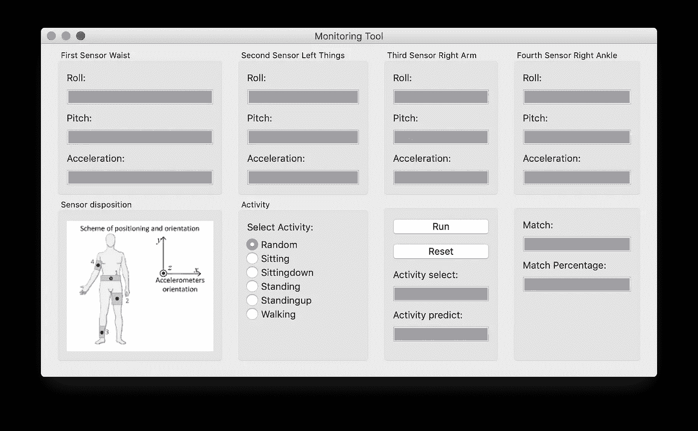

# 带有 PyQt5 的简单 Python GUI

> 原文：<https://levelup.gitconnected.com/a-simple-python-gui-with-pyqt5-7f0d2b005863>


凯利·西克玛在 [Unsplash](https://unsplash.com?utm_source=medium&utm_medium=referral) 上的照片

我使用 **PyQt5** 为一个项目创建了一个 **GUI** 。我会告诉你我是怎么做的。它是在不使用工具的情况下，通过直接编写代码创建的。

结果是这样的:



作者图片

你需要定义一个类 **App(QWidget)** ，在 **__init__** 函数中定义界面的大小( **self.width** 、 **self.height** )、在屏幕中的位置( **self.left** 、 **self.top** )以及界面的名称。

```
def __init__(self):
  self.title = 'Monitoring Tool'
  self.left = 10
  self.top = 100
  self.width = 540
  self.height = 500

  self.initUI()
```

同样在 init 函数中，我调用函数“ **initUI** ”，它定义了界面中显示的信息。

从上图可以看出，界面分为八个部分，这些部分在' **initUI** 函数中定义。

从上图可以看出，界面分为八个部分，这些部分在函数“ **initUI** 中定义，每个部分都用函数“ **addWidget** 定义，我们将**函数**传递给它，它将插入信息和界面中的**位置**(0，0 是左上位置)。
例如，这是上图中函数“ **initUI** ”的代码。

```
def initUI(self):
  grid = QGridLayout() grid.addWidget(self.createSensor_first(), 0, 0)
  grid.addWidget(self.createSensor_second(), 0, 1)
  grid.addWidget(self.createSensor_third(), 0, 2)
  grid.addWidget(self.createSensor_fourth(), 0, 3) grid.addWidget(self.create_image_sensor(), 1, 0)
  grid.addWidget(self.create_activity(), 1, 1)
  grid.addWidget(self.add_button(), 1, 2)
  grid.addWidget(self.result(), 1, 3) self.setLayout(grid) self.setWindowTitle(self.title)
  self.setGeometry(self.left, self.top, self.width, self.height) self.show()
```

在上图的界面中，我们有四个不同的部分(self.createSensor_first()、self.create_image_sensor()、self.create_activity()、self.add_button())。

第一个是“左上角的那个”，由文本和用于输入/显示文本的框组成，在我们的例子中，它只是可视化的。

```
def createSensor_first(self): groupBox = QGroupBox("First Sensor Waist")
  roll1_text = QLabel(self)
  roll1_text.setText('Roll:')
  self.roll1 = QLineEdit(self, placeholderText="")
  self.roll1.setReadOnly(True)
  pitch1_text = QLabel(self)
  pitch1_text.setText('Pitch:')
  self.pitch1 = QLineEdit(self, placeholderText="")
  self.pitch1.setReadOnly(True)
  accel1_text = QLabel(self)
  accel1_text.setText('Acceleration:')
  self.accel1 = QLineEdit(self, placeholderText="")
  self.accel1.setReadOnly(True) vbox = QVBoxLayout()
  vbox.addWidget(roll1_text)
  vbox.addWidget(self.roll1)
  vbox.addWidget(pitch1_text)
  vbox.addWidget(self.pitch1)
  vbox.addWidget(accel1_text)
  vbox.addWidget(self.accel1) vbox.addStretch(1)
  groupBox.setLayout(vbox) return groupBox
```

第二个“左下方的那个”只是一个图像。

```
def create_image_sensor(self):
  groupBox = QGroupBox("Sensor disposition") immage_original = QLabel(self)
  pixmap = QPixmap(self.immagine_accellerometri)
  pixmap_resized = pixmap.scaled(200, 500, Qt.KeepAspectRatio, Qt.SmoothTransformation) immage_original.setPixmap(pixmap_resized)
  immage_original.setAlignment(Qt.AlignCenter)
  vbox = QVBoxLayout()
  vbox.addWidget(immage_original) vbox.addStretch(1)
  groupBox.setLayout(vbox) return groupBox
```

第三个“活动”由可选按钮组成。

```
def create_activity(self):
  groupBox = QGroupBox("Activity") activity_text = QLabel(self)
  activity_text.setText('Select Activity:') self.random = QRadioButton("Random")
  self.random.setChecked(True)
  self.sitting = QRadioButton("Sitting")
  self.sittingdown = QRadioButton("Sittingdown")
  self.standing = QRadioButton("Standing")
  self.standingup = QRadioButton("Standingup")
  self.walking = QRadioButton("Walking") vbox = QVBoxLayout()
  vbox.addWidget(activity_text)
  vbox.addWidget(self.random)
  vbox.addWidget(self.sitting)
  vbox.addWidget(self.sittingdown)
  vbox.addWidget(self.standing)
  vbox.addWidget(self.standingup)
  vbox.addWidget(self.walking) vbox.addStretch(1)
  groupBox.setLayout(vbox) return groupBox
```

第四个按钮由两个按钮和第一个按钮中的一些文本组成。

```
def add_button(self):
  groupBox = QGroupBox("") self.button_run = QPushButton('Run', self)
  self.button_run.setToolTip('Run')
  self.button_run.clicked.connect(self.on_click_run) self.button_reset = QPushButton('Reset', self)
  self.button_reset.setToolTip('Reset')
  self.button_reset.clicked.connect(self.on_click_reset) activity_select_text = QLabel(self)
  activity_select_text.setText('Activity select:')
  self.activity_select = QLineEdit(self, placeholderText="")
  self.activity_select.setReadOnly(True) activity_predict_text = QLabel(self)
  activity_predict_text.setText('Activity predict:')
  self.activity_predict = QLineEdit(self, placeholderText="")
  self.activity_predict.setReadOnly(True) vbox = QVBoxLayout()
  vbox.addWidget(self.button_run)
  vbox.addWidget(self.button_reset)
  vbox.addWidget(activity_select_text)
  vbox.addWidget(self.activity_select)
  vbox.addWidget(activity_predict_text)
  vbox.addWidget(self.activity_predict) vbox.addStretch(1)
  groupBox.setLayout(vbox) return groupBox
```

例如，当按下**运行**按钮时，将会执行 **on_click_run** 函数，将装饰符“@pyqtSlot()”放入该函数是一个好主意。

```
@pyqtSlot()
def on_click_run(self):
```

本文中展示的界面代码(gui/gui.py)可以在以下存储库中找到:

[](https://github.com/pietrocolombo/project_AAL) [## GitHub-Pietro Colombo/project _ AAL:环境辅助生活-贝叶斯网络分类…

### 环境辅助生活-HAR 研究区活动辨识的贝氏网路分类模式…

github.com](https://github.com/pietrocolombo/project_AAL) 

如果你有任何问题或者你已经用其他方式解决了它们，不要犹豫，在评论中写下它们！

感谢阅读！

为了获得无限的故事，你也可以考虑只花 5 美元注册成为媒体会员。如果你用我的 [*链接*](https://pietrocolombo.medium.com/membership) *注册，我会收到一点佣金。*

# 分级编码

感谢您成为我们社区的一员！在你离开之前:

*   👏为故事鼓掌，跟着作者走👉
*   📰查看[升级编码出版物](https://levelup.gitconnected.com/?utm_source=pub&utm_medium=post)中的更多内容
*   🔔关注我们:[Twitter](https://twitter.com/gitconnected)|[LinkedIn](https://www.linkedin.com/company/gitconnected)|[时事通讯](https://newsletter.levelup.dev)

🚀👉 [**加入升级人才集体，找到一份神奇的工作**](https://jobs.levelup.dev/talent/welcome?referral=true)