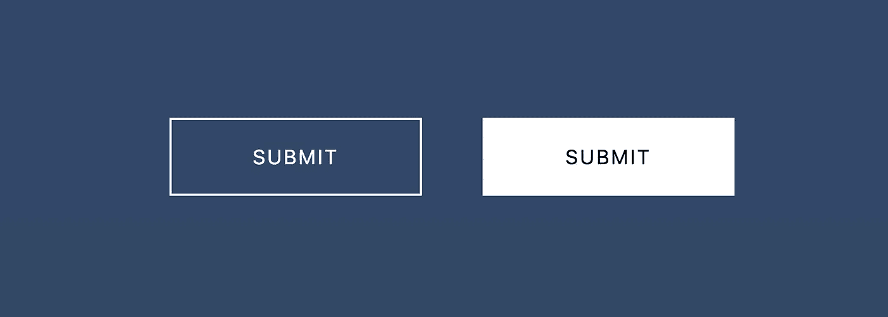

# 使用 CSS 创建按钮悬停动画的简单方法

> 原文：<https://levelup.gitconnected.com/a-simple-way-to-create-a-hover-animation-for-your-buttons-using-css-8dff77245690>

## 我们将创建两个具有简单而有趣的悬停动画效果的按钮。



今天，我们将创建两个带有动画悬停效果的按钮。一个按钮有更直观的悬停效果，而另一个按钮有动画滑动背景。

虽然有 JS 库可以用来创建非常奇特的动画效果，但也可以创建简单而吸引人的悬停动画。这是我们将要创建的预览。将鼠标悬停在每个按钮上。

让我们来看看如何在这两个按钮上创建悬停动画的每个步骤。

# 步骤 1:按钮标记

让我们从创建两个按钮的标记开始。

```
<body>
  <div class="container">
    <button class="btn btn-1">Submit</button>
    <button class="btn btn-2">Submit</button>
  </div>
</body>
```

`.container`类仅用于居中显示我们的两个按钮。主要是 div 容器中的按钮标签。

每个按钮有两个类。`.btn`类将为两个按钮提供通用样式，但是`.btn-1`和`.btn-2`类我们将用来提供单独的悬停效果。

接下来，我们继续学习 CSS，在这里我们可以设置按钮的样式。

# 步骤 2:常规按钮样式

接下来，我们为两个按钮创建样式。

```
button.btn{
  background: transparent;
  color: white;
  border: 2px solid white;
  font-size: 20px;
  letter-spacing: 2px;
  padding: 25px 80px;
  text-transform: uppercase;
  cursor: pointer;
  display: inline-block;
  margin: 15px 30px;/* animate and time the transitions*/ -webkit-transition: all 0.4s;
  -moz-transition: all 0.4s;
  transition: all 0.4s;
}
```

现在我们已经准备好了两个按钮，我们可以专注于每个按钮的动画。让我们从第一个按钮开始。

# 步骤 3:制作第一个按钮的动画

我们的第一个按钮很简单。我们所需要的是一个淡入悬停效果，将改变背景为白色，文字为黑色。

```
button.btn-1:hover{
  background-color: white;
  color: black;
  -webkit-transition: all 0.4s;
  -moz-transition: all 0.4s;
  transition: all 0.4s;
}
```

我们将创建的下一个按钮更复杂，但我们将仔细检查 CSS 代码的每个块。

# 步骤 4:制作第二个按钮的动画

如果你看我们上面的代码笔，第二个按钮有一个滑动背景。为了确保滑动动画保持在按钮的范围内，我们为我们的`.btn-2`类创建了下面的 CSS 块:

```
button.btn-2{
  overflow: hidden;
  position: relative;
}
```

当然，当我们悬停在这个按钮上时，我们希望文本是黑色的:

```
button.btn-2:hover{
  color: black;
}
```

为了创建白色动画背景，我们使用伪元素`:after`和`content`属性在按钮中插入一个框。

在那里，我们设计盒子的样式并制作这个盒子的动画。最初，它的高度为零，但当我们悬停时，该框将扩展以填充该框的高度。

```
button.btn-2:after {
 content: '';
 position: absolute;
 z-index: -1;
 -webkit-transition: all 0.4s;
 -moz-transition: all 0.4s;
 transition: all 0.4s;
 width: 100%;
 height: 0;
 top: 0;
 left: 0;
 background: #fff;
}button.btn-2:hover:after,
button.btn-2:active:after {
 height: 100%;
}
```

# 就是这样。

我们为两个按钮创建了两个简单的悬停动画。这两个按钮只是你能做的样式和动画按钮的例子，而不是坚持浏览器默认的样式。

感谢阅读。