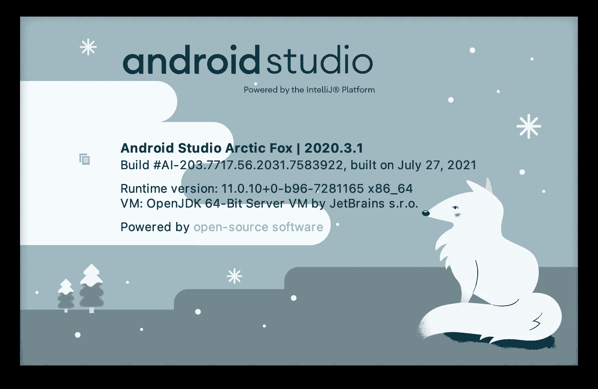
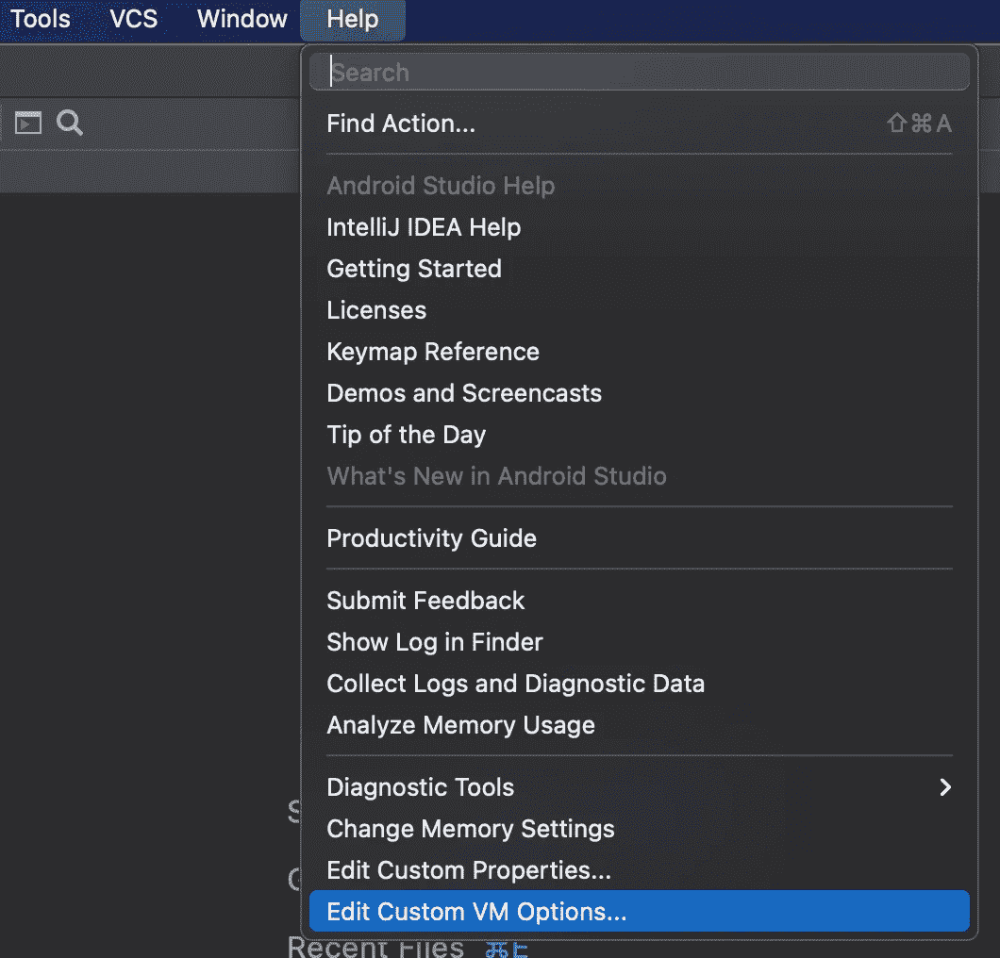
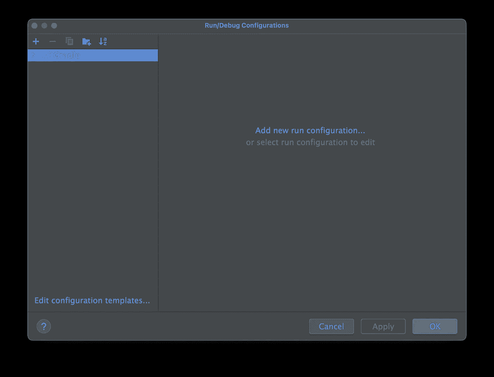
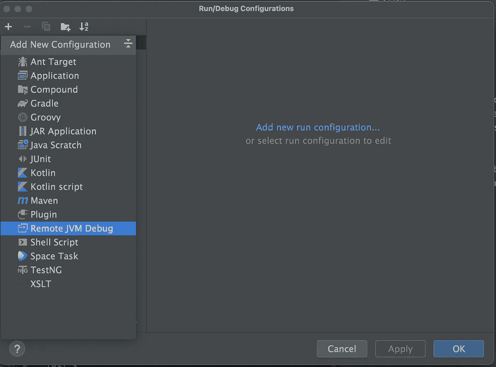
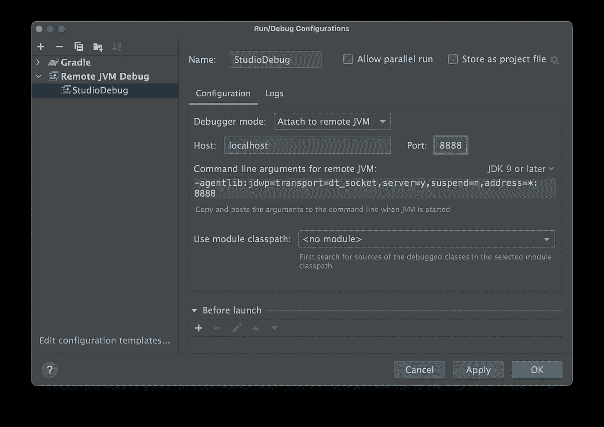
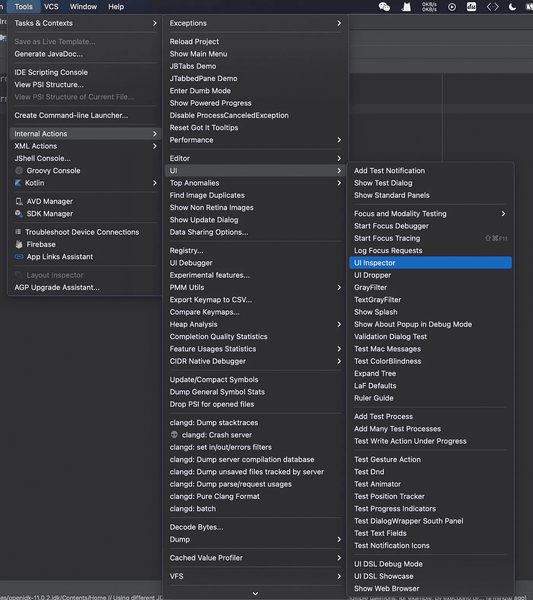
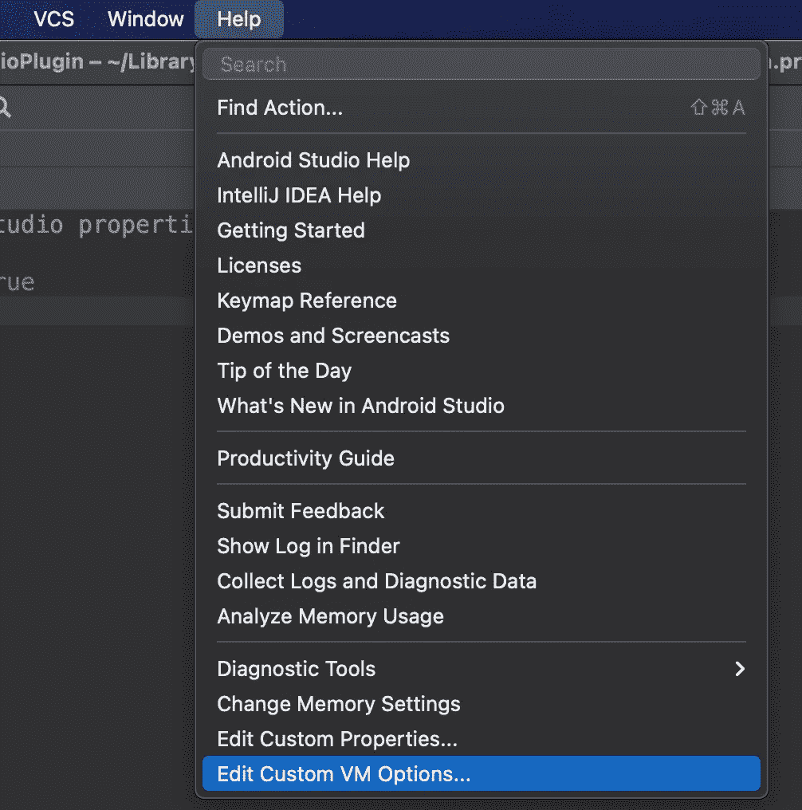
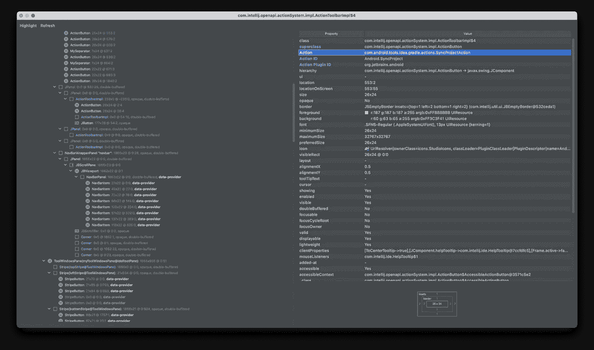

# 调试 Android Studio 的简单方法

> 原文：<https://levelup.gitconnected.com/a-simple-way-to-debug-android-studio-b1f5d0c80df4>


蒂莫西·戴克斯在 [Unsplash](https://unsplash.com?utm_source=medium&utm_medium=referral) 拍摄的照片

在使用 Android Studio 时，我经常会得到 IDE 抛出的奇怪异常。即使 Android Studio 和 Intellij IDEA 都是开源项目，我们也很难预测运行时会发生什么。

那么我们有可能调试 Android Studio 吗？答案是肯定的！运行时调试 Android Studio 相当简单。遵循下面的步骤，您将成为一名 IDE 专家。

# 准备

要调试 Android Studio，您需要以下工具:

1.  当然是安卓工作室
2.  Intellij IDEA(旗舰版和社区版都可以)。我们将 Android Studio 的源代码导入其中，并通过它添加断点。

# 获取 Android Studio 的版本

首先，我们需要确定我们使用的是哪个版本的 Android Studio。

我们可以通过选择 *Android Studio —关于 Android Studio* 找到版本:



在窗口中可以看到我们使用的是 *Android Studio 北极狐| 2020.3.1。*

# 获取 Android Studio 的源代码

我们可以按照 Google 的指南获取 Android Studio 的源代码: [Checkout，构建源代码](https://android.googlesource.com/platform/tools/base/+/studio-master-dev/source.md)。

**注意:我们需要将分支名称从 *studio-master-dev* 更改为与我们正在使用的版本相对应的标签。**

Android Studio 2.4 以后的版本都在 git 中标记。我们可以在这里找到所有的标签:[https://android.googlesource.com/platform/manifest/+refs](https://android.googlesource.com/platform/manifest/+refs)。Android Studio 的标签有 *studio* 前缀。

所以我们可以通过 *:* 查看*安卓工作室北极狐| 2020.3.1*

```
repo init -u https://android.googlesource.com/platform/manifest -b studio-2020.3.1
repo sync
```

# 将代码导入 Intellij IDEA

按照这个指南将代码导入 Intellij IDEA: [构建 Android Studio](http://tools.android.com/build/studio) 。

# 在 Android Studio 中编辑自定义虚拟机选项

打开 Android Studio，选择帮助—编辑自定义虚拟机选项:



在编辑器中，添加以下代码:

```
-Xdebug
-Xrunjdwp:transport=dt_socket,address=8888,server=y,suspend=y
```

我们在这里使用 JDWP。如果不熟悉 JDWP，可以看看 Oracle 的文档: [Java Debug Wire Protocol](https://docs.oracle.com/javase/7/docs/technotes/guides/jpda/jdwp-spec.html) 。简而言之，我们可以使用 JDWP 调试任何 Java 应用程序(不管它是运行在本地 PC 上还是远程服务器上)。

# 在 Intellij IDEA 中添加调试配置

启动 Intellij IDEA 并打开运行/调试配置窗口:



单击左上角的+按钮，并选择 Remote JVM Debug:



输入配置的名称。当我们在自定义虚拟机选项中将地址参数设置为 8888 时，在端口字段中输入 8888，然后单击 OK。



# 添加断点

如果你熟悉 Android Studio 的源代码，只需在你感兴趣的地方添加断点。如果没有，您可以使用 UI 检查器来查找添加断点的位置。

让我们以 Gradle Sync 动作为例。

选择工具—内部操作—用户界面—用户界面检查器:



如果找不到内部操作，请选择帮助—编辑自定义属性:



在 idea.properties 中添加以下代码，并重新启动 Android Studio:

```
idea.is.internal=true
```

点击 UI Inspector 后，可以找到任何 UI 元素的实现类。如果我们想知道 Gradle 同步过程，请按 Control + Alt 并左键单击 Gradle Sync 按钮:



可以看到，同步按钮的动作是由 Action*com . Android . tools . idea . gradle . actions . syncprojectaction*实现的。所以在这个类中添加断点。

# 开始调试

添加断点后，重启 Android Studio。Android Studio 将等待调试器。因此，选择我们之前在 Intellij IDEA 中添加的远程 JVM 调试配置，并单击 Debug 按钮。

现在，我们可以调试 Android Studio 了！看看任何你感兴趣的 Android Studio 源代码，你很快就会成为 IDE 专家！